# Tam Quốc Ngoại Truyện: Thanh Mã Kế

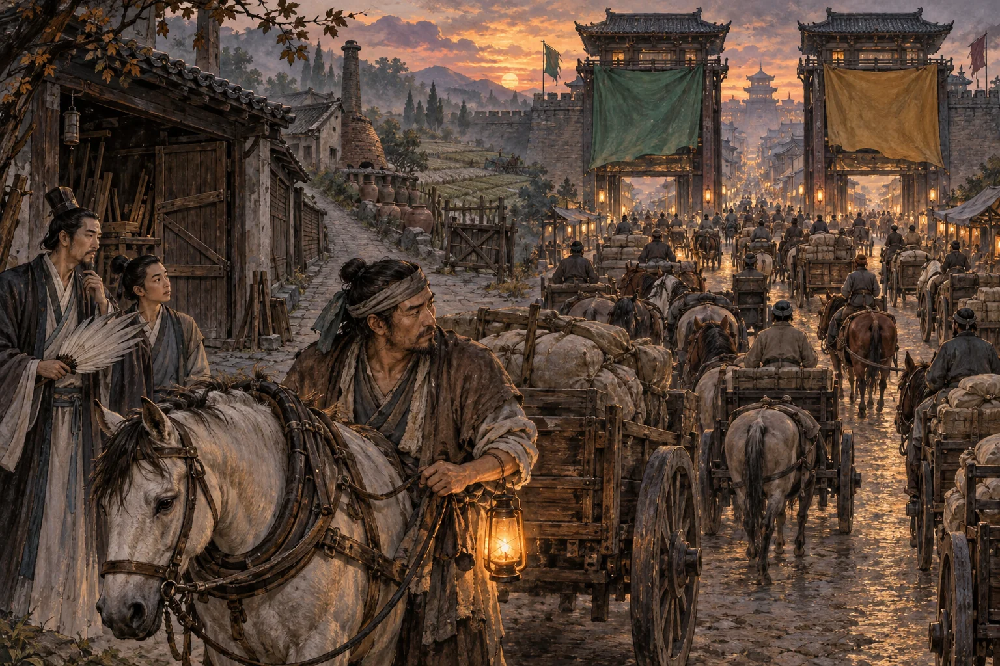

*Hai lá cờ mở ra hai cổng. Người đánh xe vẫn phải hỏi: ngoài con đường này, mình còn sống bằng gì?*

*Dã sử hư cấu, chép theo “Ngụy lược — bản bịa”, thiên thứ bốn mươi bảy. Người đời sau viết, người đời trước hoàn toàn không chịu trách nhiệm.*

**Hai năm không thu chiết khấu có thể giúp xa phu đầy túi hơn. Nhưng nếu đổi hãng vẫn phải đánh xe, bỏ xe lại vướng tiền nhà, tiền đất, tiền nợ, thì đường lui nằm ở đâu?**

## Xa Hành Dưới Chân Thiên Tử

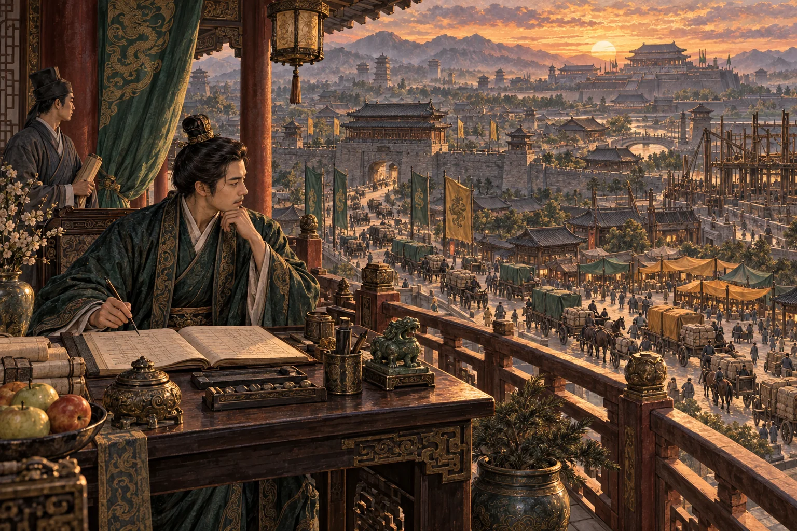

*Từ trên hiên phủ, dòng người dưới phố dễ trông giống những con số còn có thể lớn thêm.*

Năm Kiến An nọ, Tào thừa tướng giữ thiên tử trong cung, giữ bá quan ngoài điện. Quyền hành lớn đến mức mỗi khi hoàng đế muốn ban chiếu, người soạn cũng phải hỏi trước xem thừa tướng có thích đọc hay không.

Bấy giờ trong thành có Kỳ Lân Xa Hành, cờ hiệu phủ khắp phố phường. Khách cần đi xa thường tìm cờ Kỳ Lân. Xa phu muốn có khách cũng tìm đến Kỳ Lân mà đăng tên vào sổ. Khách đông thì kéo thêm người đánh xe; xe đông thì khách càng dễ gọi. Cứ thế, cái sổ ngày một dày, còn phần chia cho tổng đàn chẳng mấy khi mỏng đi.

Xa phu có người than rằng chạy một chuyến xe phải nuôi hai nhà: nhà mình và nhà giữ sổ. Tổng đàn đáp rằng không có sổ thì lấy đâu ra khách. Hai bên đều có lý, chỉ có người đánh xe là phải tiếp tục ra đường.

Đúng lúc ấy, nhị công tử nhà Tào được giao coi Thanh Mã Dịch, một xa hành đang mở rộng. Sau lưng nó là thương đoàn nhà Tào, có xưởng chế xe, những đại công trường và những khu thành mới còn đang dựng dở. Thanh Mã là một phần trong cơ nghiệp ấy, có người coi việc và sổ sách riêng, nhưng cũng hưởng sức của những cánh tay cùng nhà.

Ngựa tốt, chuồng rộng, kho bạc cũng sâu. Xe và khách đã có; chỉ có chữ đủ là chưa ai trong phủ định nghĩa xong.

Một đêm, Gia Cát Lượng được bí mật mời vào phủ.

Chuyện Khổng Minh đang ở đất Thục mà lại xuất hiện trong phủ Tào, xin chư vị đừng tra niên biểu. Đây là dã sử; đến logic cũng phải có giấy thông hành mới được vào.

## Không Thu Tiền, Vẫn Mua Được Thế Trận

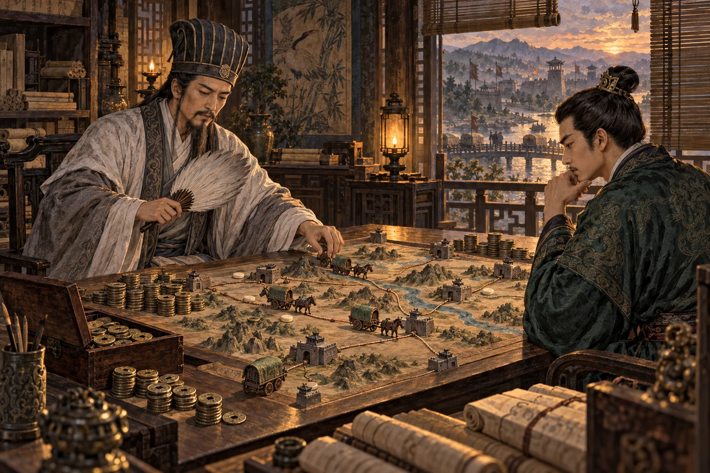

*Khoản thu được nhường hôm nay có thể là tiền mua một chỗ đứng trong ngày mai.*

Khổng Minh mở quạt, đặt lên án một cuộn giấy:

“Tại hạ đã cho người nghe chuyện ở quán rượu, bến xe và những nơi xa phu tụ họp. Kỳ Lân chưa thua ở khách. Nó đang để lộ một chỗ yếu: người đánh xe cho nó có không ít điều bất mãn.”

Nhị công tử hỏi:

“Làm sao đưa họ sang đây?”

“Mở một đợt cho người mua hoặc thuê xe của nhà ta, đăng tên dưới cờ Thanh Mã. Người đủ điều kiện được miễn phần chia chuyến trong hai năm đầu. Còn từ năm thứ ba thu thế nào, cũng phải ghi trước vào giao kèo.”

“Như vậy là được giữ trọn tiền công?”

“Công tử chớ nhầm. Nhận đủ tiền cước rồi vẫn phải tính cỏ ngựa, sửa bánh, tiền thuê xe nếu có, cùng những khoản phải nộp khác. Mười đồng thu vào chưa phải mười đồng đem về nuôi vợ con. Miễn phần của xa hành là một việc; xóa hết chi phí là việc khác.”

Công tử gật đầu, rồi lập tức nhớ đến kho bạc:

“Không lấy phần chia ấy thì lời ở đâu?”

Khổng Minh đặt quạt xuống:

“Công tử đang tính từng chuyến. Tại hạ đang tính đường đi của cả thành. Xa phu sang đây vì được giữ lại nhiều hơn. Nếu nhờ thế mà khách dễ gọi xe, đỡ phải chờ, họ có thêm lý do để dùng Thanh Mã. Khi khách đông hơn, xa phu lại có thêm lý do ở lại. Ta bỏ một phần thu hôm nay để thử dựng nên cái vòng ấy.”

“Thử?”

“Vâng, thử. Tiền có thể mua một lần đổi cờ, chưa chắc mua được lòng trung thành. Hôm nay họ theo Kỳ Lân, hôm khác có thể sang Thanh Mã, rồi lại muốn quay về. Khách cũng hôm nay gọi nhà này, ngày mai gọi nhà khác. Nếu hết ưu đãi là người đi hết, công tử mới thuê được tiếng vó ngựa, chưa lấy được thành.”

Nhị công tử nhìn cuộn giấy lâu hơn một chút.

“Vậy thứ ta mua là gì?”

“Cơ hội thành thói quen. Một mạng lưới người và xe. Sổ hành trình để biết nơi nào thiếu xe, giờ nào đông khách. Nếu vận hành tốt, những thứ ấy có thể giúp Thanh Mã đứng vững sau ngày hết ưu đãi. Nếu vận hành dở, chúng chỉ là một chồng sổ đắt tiền.”

“Kỳ Lân sẽ giảm chiết khấu để giữ người.”

“Có thể. Khi ấy nó phải bớt phần đang thu để bảo vệ mạng lưới đã có. Còn ta dùng số tiền đã chuẩn bị để giành chỗ đứng. Cuộc tranh này sẽ thử cả túi tiền lẫn tài coi việc của hai nhà. Kho bạc sâu chỉ giúp chịu lỗ lâu hơn; nó không làm một cỗ xe chạy tệ bỗng hóa thành xe tốt.”

Công tử bật cười:

“Tiên sinh nói chuyện mở xa hành mà cứ như đánh thành.”

“Thưa công tử, chỉ khác ở chỗ người trong thành được quyền đi sang cửa khác. Vì thế mới khó.”

## Khi Sổ Sách Mặc Áo Đạo Đức

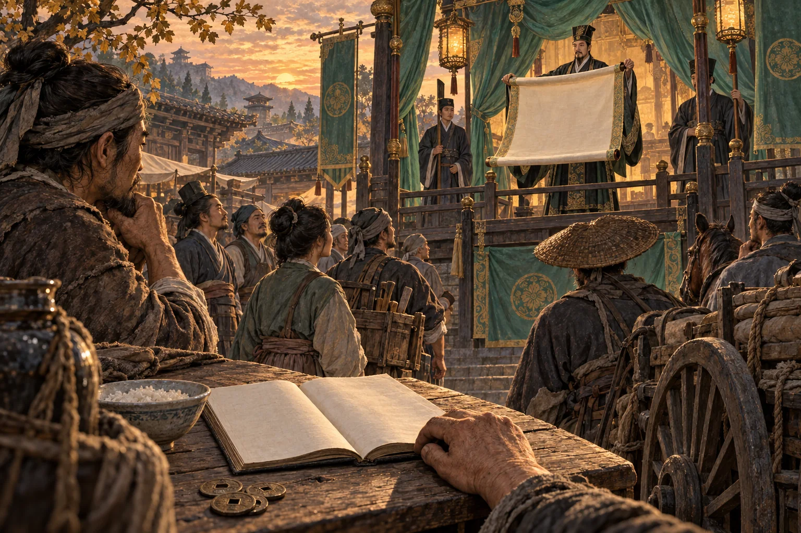

*Lời hịch nói về ân huệ. Cuốn sổ của dân vẫn phải tính đủ từng khoản.*

Nhị công tử đi vài bước rồi quay lại:

“Nhưng ngoài phố có kẻ tinh ý. Họ sẽ nói ta dùng kho bạc nhà mình để đoạt khách nhà người, còn mượn cả uy danh phụ thân.”

Một môn khách phụ trách văn thư vội bước ra:

“Việc ấy dễ. Xin cứ truyền rằng công tử tuổi trẻ mà thương xa phu vất vả, quyết nhường doanh thu vì sinh kế trăm họ. Không cần nói nhiều đến thị phần; hãy nói đến tương lai xanh. Chuyện tranh khách nên kể thành chuyện chăm dân.”

Khổng Minh phe phẩy quạt:

“Các hạ đổi tên khoản chi nhanh thật. Sáng còn nằm trong sổ kinh doanh, chiều đã đứng trong đền thờ công đức.”

Môn khách tưởng được khen, càng nói hăng:

“Người đời thích một câu chuyện có ân nhân hơn một bảng tính có điều kiện. Ai tán thưởng thì gọi là hiểu đại nghĩa. Ai chất vấn thì hỏi sao không biết cảm kích trước lòng tốt. Được giúp mà còn hỏi, chẳng phải vô ơn hay sao?”

“Nếu họ vẫn mang sổ sách ra đối chứng?” công tử hỏi.

“Xin viện luật lệnh, giao Đình úy xét tội tung yêu ngôn, nhiễu loạn xa thị. Một khi người hỏi phải tự chứng minh mình không có ác ý, còn ai nhớ câu hỏi ban đầu là gì?”

Trong phòng có mấy tiếng cười tán thưởng.

Khổng Minh khép quạt.

“Công tử muốn người ta tin một bản giao kèo, hay sợ một lá cờ?”

Môn khách im tiếng. Công tử nhìn ông:

“Tiên sinh cho rằng không nên nói đến lòng tốt?”

“Xa phu được lợi thì cứ để họ nói mình được lợi. Công tử muốn làm việc tốt thì cứ làm. Nhưng người nhận ưu đãi không vì thế mà mắc nợ một lời ca tụng. Nếu phải dùng Đình úy giữ cho một bảng giá khỏi bị hỏi, bảng giá ấy đã có thêm một khoản phí mà không ai dám ghi.”

“Khoản gì?”

“Quyền được mở miệng của người nhận.”

Ngoài hiên, gió lay ngọn đèn. Viên chép sổ cúi đầu chấm thêm mực, như thể từ nãy đến giờ chỉ bận chăm sóc nghiên mực.

## Ba Dòng Chữ Nhỏ

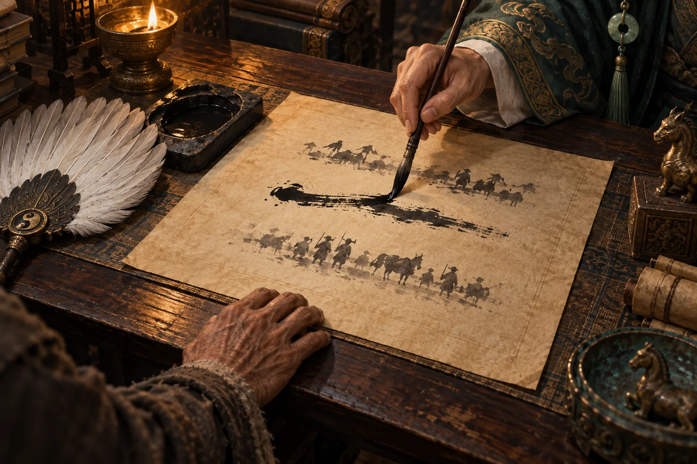

*Điều bị gạch khỏi giao kèo không biến mất khỏi đời sống người phải ký.*

Nhị công tử trở lại bên án:

“Vậy phải công bố thế nào?”

Khổng Minh kéo tờ giao kèo đến trước mặt:

“Trước hết, ghi rõ ai được hưởng, hưởng khoản nào, từ ngày nào đến ngày nào. Phần nào được miễn thì viết là miễn; phần nào vẫn phải trả thì ghi đủ. Đừng để chữ lớn nói thay, rồi chữ nhỏ đòi lại.”

Ông viết thêm ba dòng.

Dòng thứ nhất: mọi khoản thu và điều kiện hưởng ưu đãi phải công khai; thay đổi phải báo trước theo giao kèo.

Dòng thứ hai: xa phu được nhận khách của xa hành khác; điều kiện rời đi, tiền thuê và nghĩa vụ còn lại phải viết rõ, không được biến lời hứa miệng thành món nợ bất ngờ.

Dòng thứ ba: người hỏi về điều kiện, đối chiếu sổ sách hoặc phản ánh sai sót phải được trả lời bằng điều kiện và sổ sách.

Công tử nhíu mày:

“Ta bỏ tiền kéo người sang, tiên sinh lại cho họ treo cả cờ Kỳ Lân? Miễn phần chia chuyến là để họ chạy cho Thanh Mã. Kho bạc nhà ta không thể nuôi luôn việc nhà người.”

Khổng Minh nhìn dòng thứ hai, rồi gạch đi vế đầu. Điều kiện chỉ nhận việc dưới một lá cờ được giữ lại cho người hưởng ưu đãi.

“Vậy ít nhất phải để họ biết mình đang đổi điều gì lấy điều gì. Muốn rời chương trình thì mất quyền lợi nào, còn phải trả khoản nào, xe thuê xử lý ra sao — đều cần rõ từ đầu. Đừng treo một tấm bảng chỉ có chữ được.”

“Sau này muốn giữ người thì sao?”

“Cho họ đủ khách, thu phí hợp lý, giải quyết việc công bằng. Điều kiện độc quyền giúp giữ người trong chương trình; công tử vẫn phải làm cho họ muốn ở lại sau chương trình.”

Môn khách văn thư nhỏ giọng:

“Ba dòng ấy làm lời hịch kém hùng tráng.”

Khổng Minh đáp:

“Lời hịch để người ta nghe một buổi. Giao kèo để người ta sống hai năm. Cứ viết sao cho đến ngày cuối, người đọc vẫn nhận ra lời đã hứa ngày đầu.”

Công tử cân nhắc rồi thuận với bản đã sửa. Viên chép sổ chép lại thật sạch. Vết gạch biến mất; điều bị gạch thì không vì thế mà trở lại.

Ít lâu sau, bảng giá được treo. Có xa phu đổi cờ, có người còn ngồi tính tiền mua xe, tiền thuê xe và số khách phải chở mỗi ngày. Kỳ Lân bắt đầu tính lại phần thu. Ngoài phố, người khen công tử nhân đức; người khác không nói gì, chỉ ngồi cộng số tiền còn lại cuối ngày.

Sử quan trong phủ chép:

“Công tử thương dân, hai năm nhường phần thu cho xa phu.”

Viên tiểu lại coi sổ lén ghi bên lề:

> Ân huệ có kỳ hạn vẫn có thể giúp dân qua ngày. Chỉ xin đừng lấy phần thu lúc giành xa phu để đoán phần thu sau ngày xa phu chẳng còn nơi nào khác để đi.

## Ngoài Trướng, Ai Còn Đường Đi?

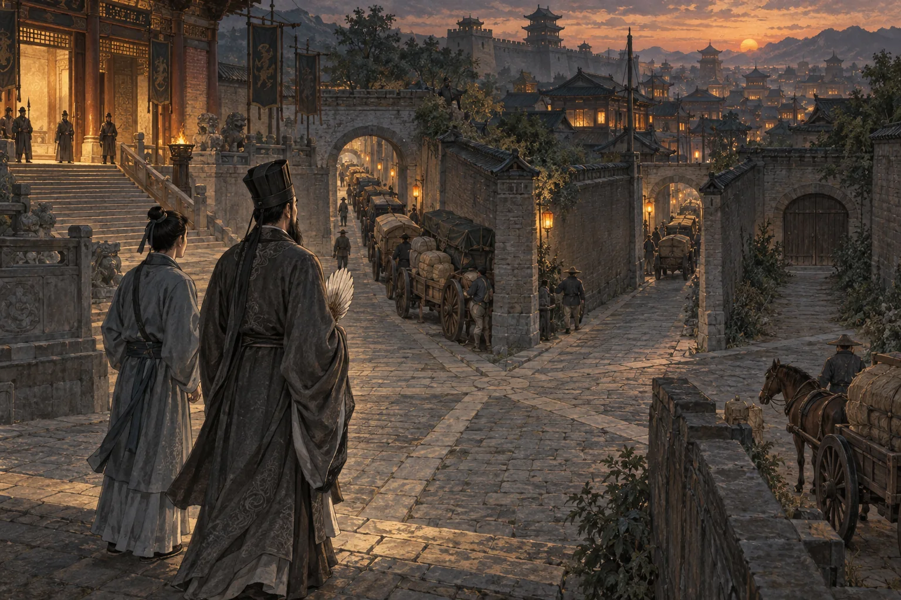

*Bước khỏi phủ mới thấy những con đường trên bản đồ không rộng bằng nhau.*

Hơn một tháng sau, Khổng Minh trở lại phủ xem sổ. Khi ra về, Mã Tắc theo ông một quãng rồi mới hỏi:

“Tiên sinh giúp Thanh Mã lấy người của Kỳ Lân. Ngài không sợ vừa phá một thế lực lớn lại nuôi ra một thế lực còn lớn hơn sao?”

“Có.”

Mã Tắc khựng lại. Cậu đã chuẩn bị nghe một lời đáp thần cơ, chưa chuẩn bị nghe một tiếng nhận thật.

“Vậy sao tiên sinh còn hiến kế?”

“Vì Kỳ Lân đang thu phần của nó trong một thế khá yên ổn. Có người bước vào tranh, xa phu mới có thêm nơi để cân nhắc. Thanh Mã muốn lấy người phải nhường lợi. Kỳ Lân muốn giữ người cũng phải tính lại. Phần lợi trước mắt ấy có thể là thật, dù chẳng nhà nào quên việc kiếm tiền.”

“Nhưng nếu Thanh Mã thắng hẳn?”

Khổng Minh dừng dưới mái quán đã đóng cửa:

“Thì ba dòng ta viết trong phủ còn phải có người giữ cho thành việc thật. Một xa phu được quyền đổi hãng trên giấy mà ngoài đường không còn hãng nào để đổi, quyền ấy cũng nhẹ như giấy. Muốn dân còn đường sống, phải để người mới còn mở được xa hành, người cũ còn tranh khách được bằng tài coi việc, và người đánh xe còn đủ sức đứng lên đòi điều đã giao kết.”

Mã Tắc hỏi:

“Chỉ cần giữ lại hai nhà là đủ?”

“Hai nhà cũng có thể nhìn nhau mà cùng tăng phần thu. Đếm cờ chưa đủ; phải xem người ta có thật sự đi khỏi một lá cờ mà vẫn kiếm được cơm hay không.”

“Vậy tiên sinh đâu nắm chắc được cục diện.”

“Ta có thể hiến một kế, không thể thay thiên hạ giữ mọi cửa thành. Nếu chỉ cần một người cầm quạt là bảo đảm được công bằng, dân chúng đã không phải khổ đến thế.”

Mã Tắc im lặng một lúc, rồi nói:

“Hôm tiên sinh viết ba dòng ấy, con tưởng ngài muốn giúp công tử lấy lòng xa phu. Nhưng một vế đã bị gạch đi rồi.”

“Đúng. Ta giữ được phần công bố nghĩa vụ, chưa giữ được quyền nhận việc của hai nhà trong lúc hưởng ưu đãi. Công tử chấp nhận điều gì có lợi cho việc tuyển người, và giữ lại điều gì có lợi cho việc giữ người. Bản giao kèo ấy là kết quả mặc cả, chưa phải phép màu an dân.”

“Thế còn những lời ca ngợi?”

“Ai được giúp thì có thể cảm ơn. Nhưng cảm ơn hôm nay không buộc người ta im lặng ngày mai. Người dân phải giữ được cả quyền nhận lợi lẫn quyền hỏi xem cái lợi ấy đi kèm điều gì.”

Mã Tắc nhìn về phía phủ Tào:

“Sau này sử quan vẫn có thể chép rằng chính tiên sinh bày kế cho nhị công tử đoạt xa thị.”

Khổng Minh cười nhạt:

“Họ chép vậy cũng không hoàn toàn sai. Ta đã giúp công tử bước vào cuộc tranh này. Bởi thế, càng không thể lấy lời ‘vì dân’ để miễn cho mình việc nhìn hậu quả.”

Ông chỉ một người đánh xe đang đếm tiền dưới ánh đèn cuối phố:

“Hai năm ấy, người kia có thể mang về thêm vài đồng. Vài đồng ấy đáng kể. Nhưng đến năm thứ ba, dù phần thu đã được báo trước và vẫn có thể thấp hơn nhà khác, nếu anh ta chỉ còn biết cúi đầu trước một lá cờ mới, ta chưa có gì để vỗ ngực.”

“Vậy thế nào mới gọi là kế thành?”

Khổng Minh mở quạt, nhìn dòng xe khuất dần ngoài cửa thành:

“Khi công tử muốn tăng phần thu, phải lo người ta bỏ đi. Khi Kỳ Lân muốn ép người, phải lo có kẻ khác đón họ. Khi người giữ sổ muốn sửa lời đã hứa, phải lo người đánh xe đem sổ ra hỏi. Lúc ấy, dân mới có thứ đáng giữ hơn một mùa ưu đãi.”

“Là gì?”

“Một đường lui.”

## Đổi Cờ Rồi, Vẫn Phải Cầm Cương

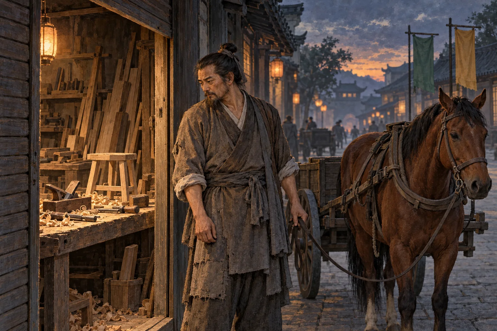

*Tay nghề còn đó. Một nơi trả công cho tay nghề ấy thì chưa chắc còn.*

Mã Tắc chưa chịu đi tiếp.

“Tiên sinh nói đường lui, nhưng từ nãy đến giờ chỉ có đường từ xa hành này sang xa hành khác. Nếu người kia không muốn đánh xe nữa thì đi đâu?”

Khổng Minh nhìn theo tay học trò. Người đánh xe đang đứng trước một cửa hiệu đóng ván. Qua khe cửa còn thấy chiếc bàn bào phủ bụi.

Hỏi ra mới biết anh vốn làm thợ mộc. Xưởng ít đơn, tiền thuê vẫn đến hẹn; anh chuyển sang đánh xe để giữ bữa cơm. Tay nghề còn đó, nhưng tay nghề không tự gọi được khách đến đặt bàn ghế.

Mã Tắc nói:

“Ngài có thể cho anh ta đổi lá cờ. Ngài có cho lại được một xưởng có việc không?”

Lần này Khổng Minh không đáp ngay.

“Ta đã nói chữ lui hơi nhẹ.”

“Nếu thợ mộc ra đánh xe, thợ dệt ra đánh xe, người buôn nhỏ đóng quán cũng ra đánh xe, thì thêm cờ chưa chắc thêm cơm. Có khi chỉ thêm người đứng đợi cùng một cuốc khách.”

“Phải. Miễn phần chia chuyến không làm khách tự nhiên nhiều lên ngang với số người nhập nghề. Nếu xe đông nhanh hơn việc cần chở, người ta vẫn có thể nhận trọn tiền mỗi chuyến mà cuối ngày mang về ít hơn, vì cả ngày chỉ được vài chuyến.”

Mã Tắc nhìn bàn tay chai của người thợ:

“Vậy quyền được rời đi nằm ở đâu?”

“Ở chỗ rời đi rồi vẫn còn sống được. Có nghề khác được trả công, có thời gian học nghề, có chút tích lũy chịu được tháng chưa có việc, có chỗ ở không mất ngay khi thu nhập hụt. Một câu ‘không thích thì nghỉ’ không dựng nổi những thứ ấy.”

Khổng Minh ngừng một lát:

“Đánh xe là một nghề nuôi thành. Người đưa khách đến chợ, chở hàng đến nhà cũng làm ra giá trị. Nhưng một thành có nhiều nghề để dân chọn sẽ khác một thành dồn người mất kế sinh nhai lên xe rồi gọi tất cả là cơ hội.”

“Thế thì hai xa hành tranh nhau chỉ chữa được một đoạn?”

“Một đoạn. Có thể là đoạn rất cần cho người đang thiếu bữa. Nhưng ta không được lấy một đoạn dễ thở mà kể rằng cả con đường đã thông.”

## Ra Khỏi Xa Hành, Vào Lại Địa Khế

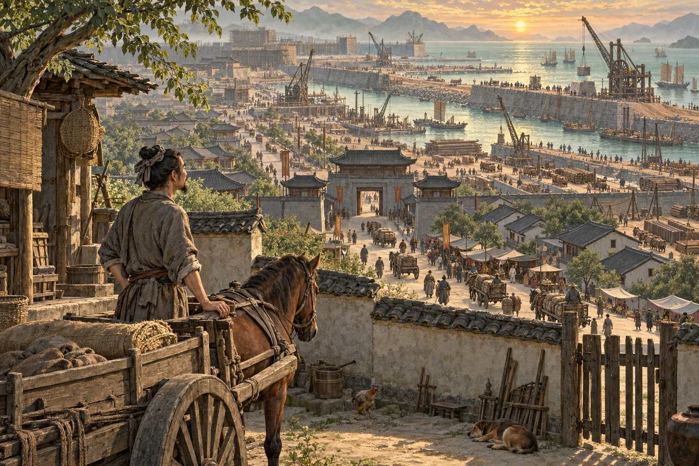

*Qua khỏi cửa xa hành, người dân vẫn phải tìm một chỗ ở và một nơi làm ăn.*

Mã Tắc chỉ về dãy đèn sáng phía xa:

“Còn một chuyện nữa. Nhị công tử không coi xa hành thì nhà Tào vẫn có thể mở đại công trường. San đồi, đắp bãi, lấn biển, dựng thành mới, bán nhà, cho thuê phố chợ. Người kia bỏ xe, thuê một gian hàng để trở lại làm mộc, biết đâu tiền thuê vẫn về một phủ. Mua căn nhà cho vợ con, lại cầm một tờ địa khế của cùng nhà ấy. Thế có gọi là ra được chưa?”

Khổng Minh nhìn dãy đèn. Trên bức tường công trường, một tấm họa đồ vẽ thành mới rất đẹp. Trong tranh, đường nào cũng sạch, nhà nào cũng sáng. Người trong tranh không thấy ai đang tính tiền trả nợ.

“Nếu các ngả ấy cùng đi qua một nhóm người giữ cửa, đổi nghề chỉ mới đổi nơi trả tiền.”

“Vậy Thanh Mã chỉ là một cửa?”

“Trong thế trận ngươi vừa tả, đúng. Xưởng xe có thể bán hoặc cho thuê phương tiện; xa hành tổ chức việc chuyên chở; phố mới cần người đến ở, đến làm, đến mua hàng. Tiền từ người mua nhà, khách thuê mặt bằng, người đi xe và người vay để có tài sản nuôi những phần khác nhau của cuộc kinh doanh. Lợi nhuận, tiền vay và tiền góp vốn có thể tiếp tục mở những công trường khác. Nhưng muốn biết khoản nào thực sự chảy sang khoản nào, vẫn phải mở từng cuốn sổ mà xem.”

“Còn dân?”

“Có người nhờ công trường mà có việc, nhờ đường mới mà bán được hàng, nhờ xe mà có thu nhập. Cũng có người làm thêm mãi mà phần dư cứ bị tiền nhà, tiền thuê, tiền nợ và chi phí sinh hoạt đuổi kịp. Hai cảnh ấy có thể cùng nằm trong một thành.”

Mã Tắc hỏi:

“Dân gọi thế là rút máu, có oan không?”

Khổng Minh không phe phẩy quạt nữa.

“Với người chạy cả ngày mà không giữ nổi phần để dành, chữ ấy có thể tả đúng cảm giác sống. Muốn luận thành một cơ chế thì phải chỉ cho rõ: ai có quyền định giá, ai gánh khoản nợ, ai giữ tài sản sau cùng, ai chịu thiệt khi cuộc làm ăn không như lời hứa. Chỉ nói người có tiền kiếm thêm tiền thì chưa đủ; dựng được nhà, đường và việc làm cũng có giá trị. Điều phải xét là phần giá trị ấy chia ra sao, và người ở cuối dòng tiền có thể từ chối một giao kèo bất lợi đến mức nào.”

“Nếu công tử nhường vài đồng ở tiền chuyến, rồi dân phải trả thêm ở tiền nhà thì sao?”

“Thì phải nhìn cả túi tiền của dân. Một bên sổ ghi ưu đãi không làm bên kia sổ hết nghĩa vụ. Không thể lấy tiếng khen ở cửa xa hành để trả lời thay cho mọi chuyện ở cửa địa ốc.”

Mã Tắc cúi nhìn tấm giao kèo mình mang theo:

“Ba dòng này không mở nổi cả thành.”

“Không. Phải còn chỗ cho người làm ăn ngoài những nhà lớn, còn khả năng học và đổi nghề, còn tiếng nói chung của người lao động, còn phép tắc đủ sức buộc người giữ cửa chịu trách nhiệm. Những việc ấy vượt quá một bảng giá. Ta không thể nhận công an dân chỉ vì đã nghĩ ra một cách thu hút xa phu.”

## Khi Cả Thành Chỉ Muốn Giữ Đất

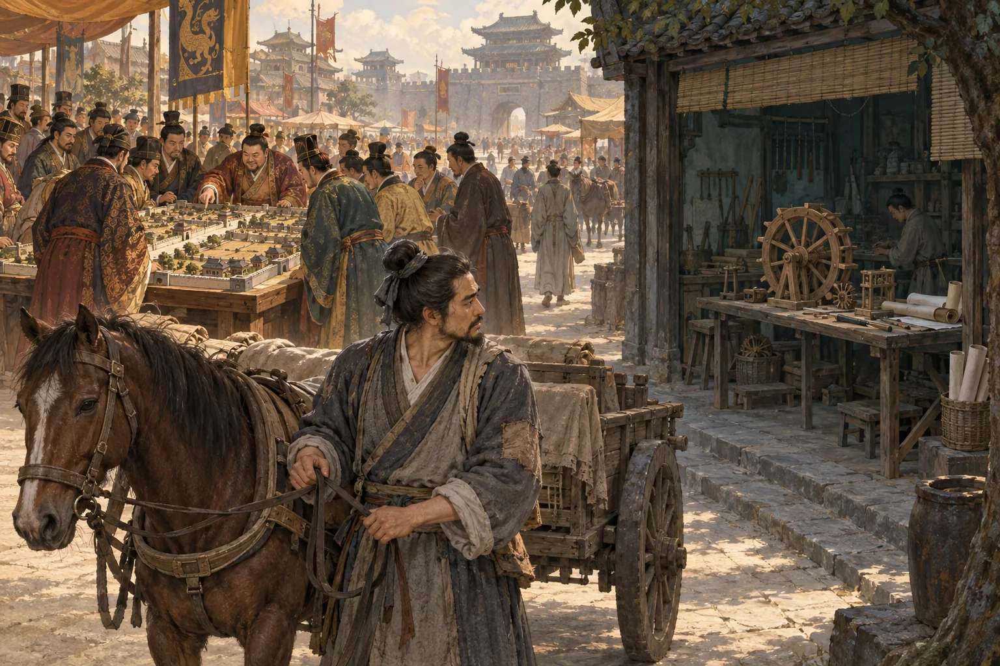

*Kỳ vọng đổ về địa khế; kiến thức đứng chờ một chỗ được dùng.*

Một cỗ xe khác vừa tới đỗ bên quán. Người đánh xe nhận ra Khổng Minh, xuống vái chào. Mã Tắc biết người này: từng học toán, đọc được bản vẽ, có thời theo một xưởng chế máy dẫn nước. Xưởng mất việc, anh đi đánh xe; tiền thu đều từng ngày còn hơn ôm kiến thức chờ một lời hẹn trả công.

Mã Tắc nhìn theo anh, giọng thấp xuống:

“Người ấy đã có nghề. Có người học cả chục năm rồi vẫn lên xe. Ta còn bảo họ học thêm đến bao giờ?”

Khổng Minh im lặng.

“Nếu nhà nhà chỉ mong mua được đất rồi bán lại đắt hơn, người có tiền chăm chăm giữ địa khế, người chưa có tiền chạy ngày chạy đêm để mong mua nổi một chỗ ở, thì người có học đứng ở đâu trong thế trận ấy?”

Ở đầu phố, một người môi giới đang chỉ vào tấm họa đồ thành mới. Chung quanh không ít người đứng nghe. Họ hỏi đường sẽ mở khi nào, giá khu bên cạnh đã lên bao nhiêu, mua hôm nay sang mùa có sang tay được không. Không ai hỏi xưởng dẫn nước còn tuyển người hay đã đóng.

Khổng Minh nói:

“Một thành vẫn cần nhà để ở, đường để đi và công trường để dựng. Nhưng nếu giữ một khoảnh đất được kỳ vọng lời hơn mở một xưởng, thì người có vốn có thể thôi muốn chịu khó với cái xưởng. Nếu người giỏi cũng thấy thu nhập từ nghề đuổi mãi không kịp giá một mái nhà, họ sẽ cân nhắc rời nghề. Người đang chạy xe có khi chỉ đang chọn cách ít thiệt nhất trong những cách còn lại.”

“Vậy tiền miễn chia chuyến giúp được gì?”

“Giúp họ giữ thêm phần thu hôm nay. Nó không tự tạo đơn hàng cho xưởng máy, không khiến chủ xưởng trả nổi người thợ, không mở thêm một nghề đáng để người có học ở lại. Nếu căn bệnh nằm ở nơi vốn tìm đến và việc làm bị bỏ lại, một ưu đãi của xa hành không chữa hết được.”

“Cứ để thế thì sao?”

“Có thể việc đánh xe thành chỗ hứng người rời những nghề khác. Xa hành đông lên, nhưng chưa chắc khả năng làm ra của cải của cả thành đã mạnh lên tương ứng. Dịch vụ chuyên chở cần khách có việc để đi, có hàng để chở, có thu nhập để trả. Một đoàn xe rất dài không tự trả lời được câu hỏi những người trên xe và dưới xe đang sống bằng nguồn nào.”

Mã Tắc hỏi:

“Thế nên đừng để người có học chạy xe?”

“Không ai phải ở lại một nghề chỉ để giữ thể diện cho tấm bằng. Nghề đánh xe cũng cần kỹ năng và xứng đáng nuôi được người làm. Điều đáng hỏi là vì sao lựa chọn dùng những gì họ đã học lại không còn đủ sống. Muốn họ có lựa chọn khác, phải có nơi cần đến năng lực ấy và trả công xứng với nó.”

Gió thổi tờ giao kèo trong tay Mã Tắc bật sang mặt trắng.

“Tiên sinh tính được hai năm tiền miễn chia, có tính được bao nhiêu năm học của người kia đang chờ một chỗ dùng không?”

Khổng Minh nhìn mặt giấy chưa viết:

“Chưa.”

“Nếu những nhà có thế lực vừa hưởng lợi từ đất tăng giá, vừa có xe để đón người không đủ sống bằng nghề khác, thì ai chịu mở một con đường khiến dân bớt lệ thuộc vào cả hai?”

“Đó mới là chỗ khó. Khuyên người đang được lợi tự đổi cách làm chưa đủ. Muốn vốn vào xưởng, vào kỹ nghệ, vào những công việc trả được lương tốt, phải làm cho những việc ấy có cơ hội tồn tại và lớn lên. Chỗ làm phải có khách, có vốn, có mặt bằng chịu nổi, có luật chơi không chỉ thuận cho những nhà đã mạnh. Người dân cũng phải có tiếng nói trong cách thành này được dựng lên.”

“Những điều ấy có trong kế Thanh Mã không?”

“Không.”

Mã Tắc gấp tờ giấy lại:

“Vậy tiên sinh mới giải được việc công tử giao.”

Khổng Minh gật đầu:

“Ta giúp một xa hành có thêm người. Còn vì sao người ấy chẳng tìm được đường nào khác, đó vẫn là việc ta chưa giải. Không thể thấy họ bước lên xe rồi coi như đã đặt họ vào chỗ trong thiên hạ.”

## Dân Tâm Không Nằm Trong Tiếng Tung Hô

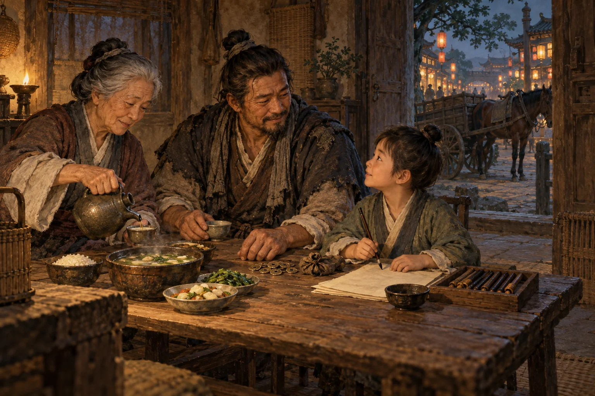

*Dân tâm còn nằm trong bữa cơm, tiền thuốc và ngày mai của đứa trẻ.*

Từ phía cổng phủ vọng ra tiếng người đọc hịch. Nhị công tử thương dân. Nhị công tử nhường lợi. Nhị công tử cùng trăm họ mở vận hội mới.

Mã Tắc hỏi:

“Ngoài kia nhiều người vẫn cảm kích thật. Có người nói nhờ miễn phần chia mà tháng này đã trả được tiền thuốc cho mẹ. Ta nghi ngờ câu chuyện lớn như vậy, có phải xem nhẹ cái ơn nhỏ họ nhận không?”

“Không được xem nhẹ. Tiền thuốc ấy là thật. Một người biết ơn vì qua được tháng khó không có gì đáng chê. Cũng không cần bảo họ ngây thơ chỉ vì họ chưa hỏi hết những điều ngươi đang hỏi.”

Khổng Minh nhìn người thợ mộc đang sửa lại dây cương:

“Nhưng lòng biết ơn vì được giúp một việc chưa trao cho ai quyền định đoạt cả đời mình. Người ấy có thể cảm ơn hôm nay, chất vấn ngày mai, và cả hai lần đều có lý.”

“Vậy nhìn đâu mới thấy dân tâm?”

“Nhìn sau tiếng hịch. Bữa cơm có khá lên không? Làm từng ấy canh giờ thì còn lại bao nhiêu? Ốm vài hôm có mất chỗ ở không? Con cái có được học một nghề khác không? Người nói điều trái tai có được trả lời tử tế không? Và nếu có một đường sống ngang bằng ở nơi khác, họ còn tự nguyện ở lại không?”

“Nếu họ vẫn ở lại?”

“Phải biết vì sao. Có người ở lại vì công bằng, có người vì quen việc, có người vì còn nợ, có người vì rời chỗ này thì tối nay không biết lấy gì mua gạo. Sổ danh bộ chỉ ghi ai còn tên; nó không tự ghi được lòng người.”

Khổng Minh nói chậm hơn:

“Một nhà có thể rất đông người theo mà chưa chắc đã được lòng tất cả. Không phải cứ chưa ai bỏ đi là dân còn tin. Có khi dân chỉ chưa đủ tiền để đi.”

Mã Tắc nhìn về dãy nhà mới:

“Vậy muốn được dân tâm thì phải làm cho dân bớt cần mình?”

“Ít nhất phải chịu được việc dân lớn lên đến mức có thể nói không. Nếu chỉ muốn họ mãi biết ơn vì mỗi ngày còn được phát việc, đó là nuôi sự lệ thuộc. Dân có của để dành, có nghề để đổi, có chỗ đứng để nói chuyện ngang lưng hơn, thì sự tin cậy còn lại mới có trọng lượng.”

## Kế Thành Hay Chưa, Hạ Hồi Phân Giải

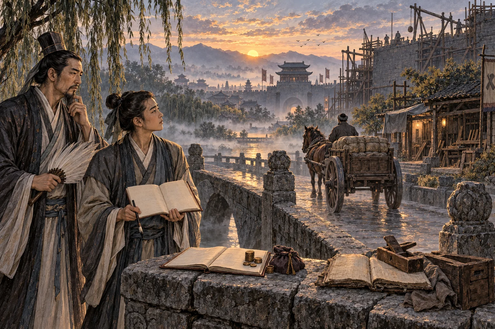

*Một cuốn sổ tính phần thu của chủ. Cuốn còn lại chưa ghi xong đời sống của dân.*

Mã Tắc mở sổ, định ghi mấy chữ “Thanh Mã kế thành”, rồi dừng bút.

“Rốt cuộc nên chép thế nào?”

Khổng Minh đáp:

“Phải hỏi thành với ai. Nếu công tử muốn thêm người, thêm khách, thêm xe bán hoặc cho thuê, thì cứ mở sổ của công tử mà tính. Còn muốn biết dân có khá lên không, phải mở sổ của dân: phần còn lại sau chi phí, giờ làm, tiền nợ, chỗ ở và những lựa chọn thực sự có được. Cũng phải xem trong thành còn mọc lên những nghề gì, vốn có tìm đến việc làm mới, người học xong có nơi dùng sở học hay không. Sổ của công tử và sổ của dân có thể cùng tốt lên. Cũng có thể cuốn này đầy lên mà cuốn kia vẫn thiếu.”

“Chờ hai năm nữa mới biết?”

“Có những việc phải chờ. Nhưng không cần chờ để hỏi, cũng không phải hết hai năm là phép thử đã xong. Từ hôm nay đã có thể xem lời hứa có được thực hiện, người mới vào có thật sự đủ việc, nghĩa vụ có rõ, người muốn ra phải chịu những gì. Đến khi hết ưu đãi, lại xem họ đã có thêm vốn sống hay chỉ có thêm một chiếc xe cùng một khoản phải trả. Còn một thế hệ có được sống bằng năng lực mình gây dựng hay không, phải nhìn lâu hơn một mùa khuyến khích đổi cờ.”

“Nếu lúc ấy vẫn không có đường lui?”

“Thì phải chép đúng rằng kế giành người có thể đã thành, còn lời hứa an dân chưa thành. Không thể bảo vì xa hành đông khách mà thiên hạ đã thái bình.”

Người thợ mộc vừa đón được một khách cuối ngày. Anh lên xe, mừng vì tối nay có thêm tiền chợ. Niềm vui ấy không cần đợi sử quan phê chuẩn. Còn căn xưởng sau lưng anh vẫn đóng cửa.

Mã Tắc khép sổ. Cậu không chép thắng, cũng chưa chép bại. Ở chỗ định ghi hai chữ “kế thành”, cậu viết:

> Tiền có thể quay thêm một vòng qua xe, đất và nhà. Dân có đi được xa hơn sau vòng ấy hay chỉ phải chạy thêm để đứng nguyên một chỗ, còn phải xem đời sống của dân.

Muốn biết người thợ ấy có mở lại được xưởng, người tiếp tục đánh xe có sống khá hơn, người trẻ còn những nghề nào để theo, và cả thành có thôi lấy giá đất làm thước đo duy nhất của ngày mai, xin chờ hạ hồi phân giải.

Hai năm chỉ là kỳ hạn của một ưu đãi. Bài toán sinh kế mà Khổng Minh còn nợ dân chưa có ngày hết hạn.

## Tầng Cơ Chế

Ở tầng cơ chế, bài đặt cạnh nhau ba câu hỏi: người lao động thực nhận bao nhiêu sau chi phí; doanh nghiệp dùng ưu đãi để xây điều gì; người tham gia có thể sống bằng cách nào nếu rời giao kèo. Ở tầng biểu tượng, lá cờ là thương hiệu, cuốn sổ là quyền phân phối việc và ghi nhận nghĩa vụ, còn những cửa thành nối sang nhà ở, đất đai và khả năng làm một nghề khác. Một nhóm người có nhiều tài sản chưa tự chứng minh mọi ngả sinh kế đều bị họ khống chế; tình thế không còn đường lui trong truyện là giả định để soi giới hạn của quyền lựa chọn. Kết cục phải được xét bằng đời sống, không thể suy ra chỉ từ một ưu đãi hay một lời phê phán.

## Related

- [[MOC - Epistemology & Propaganda]] — cách ngôn ngữ đạo đức có thể định hướng điều người đọc được quyền hỏi.
- [[Dân Tâm Là Thiên Tâm - Thiên Mệnh Và Giới Hạn Của Quyền Lực]] — đời sống của dân như phép thử đối với lời tự nhận của quyền lực.
- [[Ai Đứng Bên Kia Giao Dịch]] — nhìn động cơ, nguồn lực và sức chịu đựng của các bên trong một cuộc trao đổi.
- [[Source Discipline - Kỷ Luật Nguồn Và Bằng Chứng]] — giữ ranh giới giữa tư liệu, cách đọc cơ chế và ngụ ngôn.
