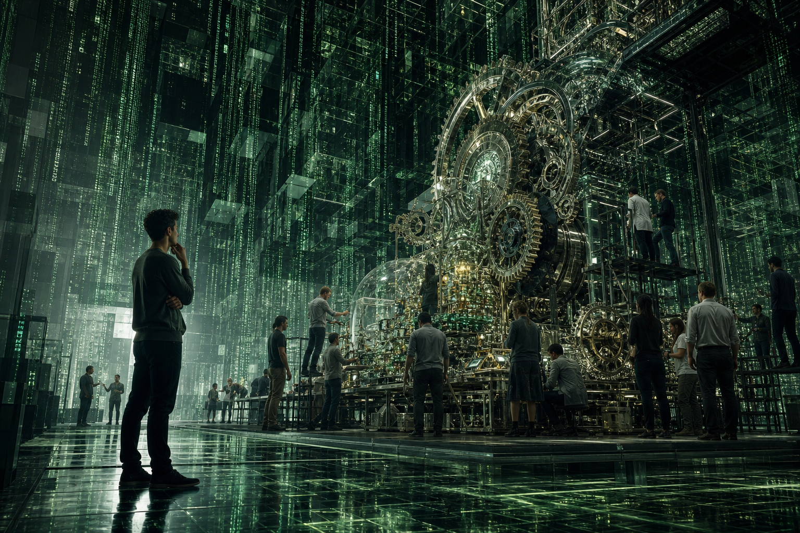

# Thông Minh vs Trí Tuệ (Intelligence vs Wisdom)

**Thông minh giúp bạn thắng một bài toán. Trí tuệ giúp bạn nhận ra bài toán đó có đáng chơi hay không. Một người có thể rất nhanh, rất sắc, rất giỏi tối ưu, nhưng vẫn dùng toàn bộ năng lực để phục vụ ego, nỗi sợ, tham vọng ngắn hạn hoặc luật chơi của [[Ma Trận]]. Trí tuệ là thông minh đã được lọc qua đạo đức, thời gian, hậu quả và sự tự biết mình.**

*Intelligence solves problems. Wisdom decides which problems deserve your life-force. Intelligence is the tool. Wisdom is the compass.*

Một con dao sắc không tự động làm người cầm dao thành healer. Nó có thể mổ cứu người, cũng có thể gây thương tích. Thông minh cũng vậy. Càng sắc, càng cần la bàn sạch.

---

## Vault Position / Vị Trí Trong Vault

Bài này nối [[Thông Minh]], [[Trí Tuệ]], [[Individuation]], [[Nghịch Lý Của Hiểu Biết]], [[Ma Trận]] và [[Giữ Tiền Quan Trọng Hơn Kiếm Tiền]]. Nó không phủ nhận năng lực phân tích. Nó cảnh báo rằng năng lực phân tích nếu không có la bàn sẽ dễ trở thành công cụ tinh vi cho một bản ngã chưa trưởng thành.

Đọc đúng: đây là mental model để soi cách ra quyết định, không phải bảng chấm điểm con người. Một người có thể thông minh ở toán học, trí tuệ trong gia đình, nhưng mù trong tiền bạc hoặc sức khỏe. Vấn đề không phải label; vấn đề là hướng dùng năng lực.

---

## Khác Biệt Gốc

Thông minh hỏi: “Cách nào hiệu quả nhất?”

Trí tuệ hỏi thêm: “Cái gì đáng làm nhất?”

Thông minh tối ưu phương tiện. Trí tuệ chọn mục đích. Thông minh thắng ngắn hạn. Trí tuệ nhìn hậu quả dài hạn. Thông minh tích lũy information. Trí tuệ tiêu hóa information thành discernment. Thông minh có đáp án nhanh. Trí tuệ biết khi nào không nên trả lời vội.

Đây là điểm nhiều người bỏ qua. Một người rất thông minh vẫn có thể bị Ma Trận tuyển dụng hoàn hảo: làm kỹ sư cho cage, luật sư cho control, marketer cho addiction, trader cho greed, scientist cho institution captured, strategist cho manipulation.

Câu hỏi không phải “người này giỏi không?”. Câu hỏi là: “cái giỏi này đang phục vụ cái gì?”

---

## Ma Trận Thích Người Thông Minh Nhưng Sợ Người Trí Tuệ

[[Ma Trận]] không sợ người có năng lực. Nó cần họ. Hệ thống cần những bộ não giỏi để tối ưu ads, compliance, finance, war, surveillance, persuasion, addictive UI, legal loopholes, narrative control.

Điều hệ thống sợ là người giỏi bắt đầu hỏi: “Mình đang phục vụ cấu trúc nào?”

Thông minh giúp bạn leo cao trong hệ thống. Trí tuệ hỏi cái thang đang dựa vào bức tường nào. Thông minh giúp bạn thắng game. Trí tuệ hỏi game này có đang làm mình mất linh hồn không. Thông minh biết cách kiếm nhiều hơn. Trí tuệ biết bao nhiêu là đủ và cái giá của phần dư là gì.

Một xã hội có nhiều người thông minh nhưng ít người trí tuệ sẽ xây được máy rất mạnh, nhưng không biết nên dùng máy đó để làm gì.

---

## Trong Đối Nhân Xử Thế

Người thông minh dễ biến quan hệ thành ván cờ: ai nói hay hơn, ai bắt lỗi nhanh hơn, ai giữ thế trên. Nhưng quan hệ không phải debate club. Có những lần thắng argument là thua lòng tin.

Trí tuệ không đồng nghĩa với nhường vô điều kiện. Nó là khả năng thấy tầng sâu hơn của tương tác: đâu là ranh giới phải giữ, đâu là ego đang đòi thắng, đâu là im lặng có lực hơn phản đòn, đâu là sự thật cần nói dù mất lòng.

Một người thông minh có thể dùng insight để thao túng. Một người trí tuệ dùng insight để làm relation bớt giả hơn.

---

## Trong Học Tập Và Knowledge

Thông minh học nhanh. Trí tuệ tiêu hóa chậm. Thông minh nhớ được câu trả lời; trí tuệ biết câu trả lời đó đến từ assumption nào, phục vụ ai, và có giới hạn ở đâu.

Đây là lý do [[Nghịch Lý Của Hiểu Biết]] quan trọng. Càng biết nhiều, mind càng dễ dựng lâu đài khái niệm để tự bảo vệ. Trí tuệ bắt đầu khi người học đủ khiêm để nói: “Mình đang thấy một phần, không phải toàn bộ.”

Biết mình không biết không phải khiêm tốn diễn. Nó là cơ chế chống tự thôi miên.

---

## Trong Tiền Bạc

Thông minh biết kiếm tiền. Trí tuệ biết tiền đang biến mình thành ai.

Một người có thể optimize career để tăng income, nhưng mất khả năng nghỉ trong chính căn nhà của mình. Có thể tăng thu nhập nhưng tăng luôn nợ, anxiety, lifestyle trap và nhu cầu được công nhận. Có thể đọc đúng macro nhưng vẫn all-in vì muốn chứng minh mình đúng.

[[Giữ Tiền Quan Trọng Hơn Kiếm Tiền]] là ứng dụng thực chiến của model này: intelligence tìm upside, wisdom quản downside. Intelligence thấy kèo có thể x3. Wisdom hỏi: nếu sai, mình mất quyền chọn nào?

Giàu thật phải bao gồm thời gian, sức khỏe, attention, quan hệ và mức độ không bị mua chuộc.

---

## Trong Sức Khỏe

Ở tầng sức khỏe, thông minh có thể đọc nhiều protocol, nhớ tên supplement, hiểu thuật ngữ y khoa. Nhưng nếu vẫn sống như một cái máy bị dopamine kéo, ngủ sai, ăn sai, thở sai, rồi chờ một viên thuốc cứu mình, đó chưa phải trí tuệ.

Trí tuệ nhìn cơ thể như một quá trình. Nó không phủ nhận can thiệp y tế khi cần, nhưng không outsource toàn bộ sinh mệnh cho hệ thống. Nó quay về nền: ăn, ngủ, ánh sáng, vận động, nhịp sinh học, stress, quan hệ, ý nghĩa sống.

Thông minh thích hack. Trí tuệ xây terrain.

---

## Dấu Hiệu Nhận Biết

Thông minh-chưa-chín thường phản ứng nhanh, bắt lỗi giỏi, thích chứng minh, thắng tranh luận nhưng làm người khác đóng lại, biết nhiều nhưng đời sống không đổi, dùng knowledge để khoe rank.

Trí tuệ thường chậm hơn một nhịp: hỏi trước khi kết luận, giữ im lặng khi im lặng có ích, nhận lỗi mà không sụp ego, chọn mất một phần ngắn hạn để giữ phần sâu hơn, nói “tôi chưa biết” mà không thấy bị giảm giá trị.

Đừng dùng danh sách này để thấy mình cao hơn người khác. Dùng nó như gương. Hôm nay mình đang dùng não để thấy rõ hơn, hay để tự vệ tinh vi hơn?

---

## Kết

Thông minh là công cụ. Trí tuệ là la bàn. Công cụ càng mạnh, la bàn càng phải sạch.

Nếu không có trí tuệ, thông minh có thể phục vụ bất cứ thứ gì: ego, fear, status, greed, propaganda, Ma Trận. Nếu có trí tuệ, thông minh trở thành năng lực giải phóng: thấy rõ hơn, chọn đúng hơn, làm ít hơn nhưng sâu hơn.

> Thông minh hỏi: “Làm sao thắng?”  
> Trí tuệ hỏi: “Thắng xong mình còn nguyên không?”

---

## Reading Path / Đọc Tiếp

- [[Thông Minh]] — năng lực xử lý vấn đề
- [[Trí Tuệ]] — la bàn đạo đức, thời gian và hậu quả
- [[Individuation]] — trưởng thành tâm lý để intelligence không bị ego chiếm
- [[Nghịch Lý Của Hiểu Biết]] — khi biết nhiều trở thành bẫy
- [[Giữ Tiền Quan Trọng Hơn Kiếm Tiền]] — wisdom trong tài chính và risk
