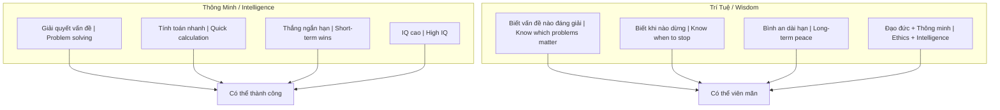
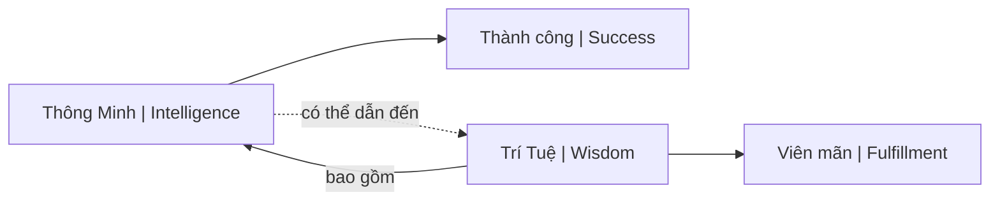

# Thông Minh vs Trí Tuệ (Intelligence vs Wisdom)

Bài viết phân tích sự khác biệt bản chất giữa "Thông minh" (Intelligence) và "Trí tuệ" (Wisdom) thông qua nhiều khía cạnh của đời sống — từ cách đối nhân xử thế, kinh doanh đến chăm sóc sức khỏe và quan niệm về sự giàu có.

*This article analyzes the fundamental difference between "Intelligence" and "Wisdom" through various aspects of life — from interpersonal dealings, business to healthcare and concepts of wealth.*

---

## Tổng Quan / Overview

> **Core insight:** Người thông minh chưa chắc có đạo đức, nhưng người trí tuệ bao gồm cả đạo đức và sự thông minh.
>
> *An intelligent person isn't necessarily ethical, but a wise person includes both ethics and intelligence.*

---

## So Sánh Bản Chất / Fundamental Comparison

### 1. Trong Đối Nhân Xử Thế / In Interpersonal Dealings

| Thông Minh / Intelligence | Trí Tuệ / Wisdom |
|---------------------------|------------------|
| Luôn tìm cách **thắng** | Biết khi nào **nhường** |
| Tính toán nước đi để giành phần thắng | Dừng đúng lúc để giữ quan hệ |
| Tập trung lợi ích **ngắn hạn** | Bình an **dài hạn** |

**Ví dụ kinh điển / Classic example:**

Câu chuyện cậu bé chọn tờ 2.000đ thay vì 5.000đ khi được hỏi — để người lớn tiếp tục "thử" → duy trì nguồn lợi lâu dài.

*Story of the boy who picks the 2,000đ bill instead of 5,000đ when asked — so adults keep "testing" him → maintaining long-term benefit.*

### 2. Trong Y Tế & Sức Khỏe / In Healthcare

| Thông Minh / Intelligence | Trí Tuệ / Wisdom |
|---------------------------|------------------|
| Theo dòng chảy xã hội | Hiểu cơ thể là **quá trình** |
| Dùng thuốc Tây dập tắt triệu chứng | Chăm sóc từng ngày: ăn uống, nghỉ ngơi |
| Reactive — có bệnh mới chữa | Proactive — phòng bệnh hơn chữa bệnh |

→ Xem thêm: [[Y Tế Tự Nhiên]], [[Cơ Chế Tự Bảo Vệ Của Cơ Thể]]

### 3. Trong Học Tập & Kiến Thức / In Learning

| Thông Minh / Intelligence | Trí Tuệ / Wisdom |
|---------------------------|------------------|
| Học **nhanh** những gì sách vở dạy | Không dừng ở câu trả lời có sẵn |
| Lấy chứng chỉ để chứng tỏ bản thân | Biết đặt **câu hỏi**, kiểm chứng bằng trải nghiệm |
| Biết **nhiều** | Hiểu **sâu** |

> **"Biết mình không biết là bước đầu của trí tuệ."**
> *"Knowing that you don't know is the beginning of wisdom."*

### 4. Trong Quan Niệm Giàu Có / Concepts of Wealth

| Thông Minh / Intelligence | Trí Tuệ / Wisdom |
|---------------------------|------------------|
| Tiền bạc = chìa khóa hạnh phúc | Đời là trường học để trưởng thành |
| Làm vất vả nhiều năm để đổi vài ngày du lịch | Biến nơi mình sống thành điểm du lịch tại chỗ |
| External validation | Internal fulfillment |

---

## Vì Sao Điều Này Quan Trọng? / Why This Matters

### Trong Context [[Ma Trận]]

Ma Trận **khuyến khích** thông minh và **đè nén** trí tuệ:

| Ma Trận muốn / Matrix wants | Trí tuệ dạy / Wisdom teaches |
|-----------------------------|------------------------------|
| Cạnh tranh liên tục | Biết khi nào hợp tác |
| Tiêu dùng để hạnh phúc | Hạnh phúc không cần tiêu dùng |
| Chạy theo xu hướng | Đứng ngoài quan sát |
| Phản ứng cảm xúc | Phản hồi có ý thức |

### Trong [[Individuation]]

Thông minh có thể giúp bạn **thành công** trong Ma Trận.

Trí tuệ giúp bạn **thoát** khỏi nó.

*Intelligence can help you succeed within the Matrix. Wisdom helps you escape it.*

---

## Practical: Nhận Diện / How to Recognize

### Dấu hiệu của Thông Minh (chưa có Trí Tuệ)

- Thắng argument nhưng mất bạn
- Đúng nhưng không hạnh phúc
- Giỏi lý thuyết nhưng cuộc sống rối
- Khoe thành tựu liên tục

### Dấu hiệu của Trí Tuệ

- Im lặng khi có thể thắng
- Hỏi câu hỏi thay vì đưa câu trả lời
- Thừa nhận "tôi không biết"
- Bình an ngay cả khi thua

---

## Kết Luận / Conclusion

Thông minh là **công cụ**.

Trí tuệ là **la bàn** quyết định dùng công cụ đó như thế nào.

*Intelligence is a tool. Wisdom is the compass that decides how to use that tool.*

---

## Related / Liên quan

- [[Thông Minh]] — Định nghĩa chi tiết
- [[Trí Tuệ]] — Định nghĩa chi tiết
- [[Tư Duy Lũy Thừa]] — Trí tuệ biết chờ đợi exponential results
- [[Individuation]] — Con đường đến trí tuệ
- [[Ma Trận]] — Hệ thống ưu tiên thông minh over trí tuệ

---

*Lần cuối cập nhật: 2026-04-30*
