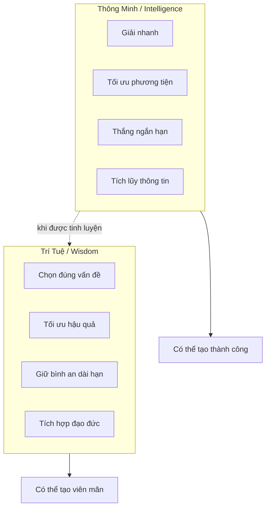
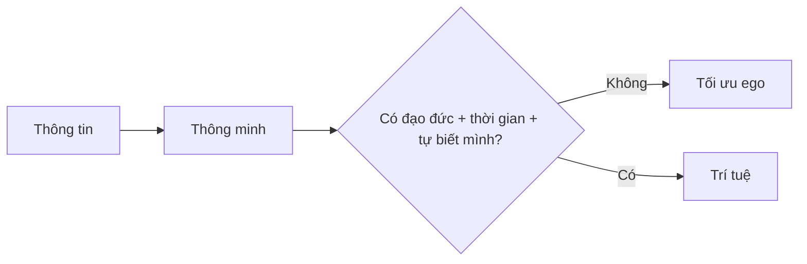

# Thông Minh vs Trí Tuệ (Intelligence vs Wisdom)

**Thông minh giúp bạn thắng một bài toán. Trí tuệ giúp bạn nhận ra bài toán đó có đáng chơi hay không.** Một người có thể rất nhanh, rất sắc, rất giỏi tối ưu, nhưng vẫn dùng toàn bộ năng lực để phục vụ ego, nỗi sợ, tham vọng ngắn hạn hoặc luật chơi của [[Ma Trận]]. Trí tuệ là thông minh đã được lọc qua đạo đức, thời gian, hậu quả và sự tự biết mình.

*Intelligence solves problems. Wisdom decides which problems deserve your life-force.*

---

## Vault Position / Vị Trí Trong Vault

Bài này nối [[Thông Minh]] với [[Trí Tuệ]] và đặt chúng vào đường đi của [[Individuation]]. Nó không phủ nhận năng lực phân tích; nó cảnh báo rằng năng lực phân tích nếu không có la bàn sẽ dễ trở thành công cụ tinh vi cho một bản ngã chưa trưởng thành.

Đọc đúng: đây là mental model để soi cách ra quyết định, không phải bảng chấm điểm con người. Một người có thể thông minh ở toán học, trí tuệ trong gia đình, nhưng mù trong tiền bạc hoặc sức khỏe. Vấn đề không phải label; vấn đề là **hướng dùng năng lực**.

---

## Bản Đồ Nhanh / Quick Map

> **Core insight:** Người thông minh chưa chắc có đạo đức. Người trí tuệ phải có khả năng thấy hậu quả đạo đức của chính sự thông minh.
>
> *An intelligent person can be unethical. A wise person has made intelligence answer to conscience.*

---

## Khác Biệt Gốc / Root Difference

Thông minh thường hỏi: "Làm sao để thắng?" Trí tuệ hỏi thêm: "Thắng xong thành người thế nào?"

Đây là điểm nhiều người bỏ qua. Thông minh là power tool. Power tool trong tay người tỉnh thì xây nhà; trong tay người nghiện ego thì khoét sâu nhà tù. Vì vậy redpill.wiki không tôn thờ IQ như một thần tượng. IQ có thể giúp bạn đọc pattern nhanh hơn, nhưng [[Trí Tuệ]] mới quyết định bạn dùng pattern đó để giải phóng hay để thao túng.

| Trục nhìn | Thông minh / Intelligence | Trí tuệ / Wisdom |
|---|---|---|
| Câu hỏi chính | "Cách nào hiệu quả nhất?" | "Cái gì đáng làm nhất?" |
| Thời gian | Ngắn hạn, điểm số, kết quả thấy ngay | Dài hạn, hậu quả, nghiệp quả |
| Quan hệ với ego | Dễ dùng để chứng minh mình đúng | Dùng để làm mình trong hơn |
| Quan hệ với thất bại | Tối ưu để tránh thua | Học được từ thua |
| Dấu hiệu trưởng thành | Có đáp án nhanh | Biết khi nào không trả lời vội |

---

## Trong Đối Nhân Xử Thế / Human Dealings

Người thông minh dễ biến quan hệ thành ván cờ: ai nói hay hơn, ai bắt lỗi nhanh hơn, ai giữ thế trên. Nhưng quan hệ không phải debate club. Có những lần thắng argument là thua một mối liên hệ, thua lòng tin, thua khả năng nghe nhau về sau.

Trí tuệ không đồng nghĩa với nhường vô điều kiện. Nó là khả năng thấy tầng sâu hơn của tương tác: đâu là ranh giới phải giữ, đâu là ego đang đòi thắng, đâu là im lặng có lực hơn phản đòn.

**Ví dụ cậu bé chọn 2.000đ thay vì 5.000đ** chỉ đáng giữ như một dụ ngôn: cậu không tối đa hóa lợi ích trong một lượt, mà hiểu trò chơi dài hơn người lớn tưởng. Bài học không phải "hãy lừa người khác"; bài học là có những ván đời mà người thấy dài hơn sẽ không vội cầm phần thưởng lớn nhất trước mặt.

---

## Trong Học Tập & Kiến Thức / Learning

Thông minh học nhanh. Trí tuệ tiêu hóa chậm. Thông minh nhớ được câu trả lời; trí tuệ biết câu trả lời đó đến từ assumption nào, phục vụ ai, và có giới hạn ở đâu.

Đây là lý do [[Nghịch Lý Của Hiểu Biết]] quan trọng: càng biết nhiều, mind càng dễ dựng lâu đài khái niệm để tự bảo vệ. Trí tuệ bắt đầu khi người học đủ khiêm tốn để nói: "Mình đang thấy một phần, không phải toàn bộ."

> **Biết mình không biết không phải khẩu hiệu khiêm tốn. Nó là cơ chế chống tự thôi miên.**
>
> *Knowing that you do not know is not humility theater. It is anti-hypnosis.*

---

## Trong Sức Khỏe / Health Sovereignty

Ở tầng sức khỏe, thông minh có thể đọc nhiều protocol, nhớ tên supplement, hiểu thuật ngữ y khoa. Nhưng nếu vẫn sống như một cái máy bị dopamine kéo, ngủ sai, ăn sai, thở sai, rồi chờ một viên thuốc cứu mình, đó chưa phải trí tuệ.

Trí tuệ nhìn cơ thể như một quá trình. Nó không phủ nhận can thiệp y tế khi cần, nhưng không outsource toàn bộ sinh mệnh cho hệ thống. Nó quay về nền: ăn, ngủ, ánh sáng, vận động, nhịp sinh học, stress, quan hệ, ý nghĩa sống. Xem thêm [[Y Tế Tự Nhiên]] và [[Cơ Chế Tự Bảo Vệ Của Cơ Thể]].

| Phản ứng thông minh | Phản hồi trí tuệ |
|---|---|
| Tìm cách dập triệu chứng nhanh | Hỏi triệu chứng đang báo điều gì |
| Sưu tầm protocol | Xây nền sống có thể duy trì |
| Tin vào can thiệp đơn lẻ | Nhìn terrain, thói quen, môi trường |

---

## Trong Tiền Bạc & Thành Công / Wealth

Thông minh biết kiếm tiền. Trí tuệ biết tiền đang biến mình thành ai.

Một người có thể optimize career để mua vài ngày nghỉ, nhưng đánh mất khả năng nghỉ trong chính căn nhà của mình. Có thể tăng thu nhập nhưng tăng luôn nợ, anxiety, lifestyle trap và nhu cầu được công nhận. Đây là nơi [[Tư Duy Lũy Thừa]] gặp trí tuệ: kết quả lớn không chỉ đến từ tăng tốc, mà từ chọn đúng hướng để sự tích lũy không phản lại linh hồn.

Trí tuệ không lãng mạn hóa nghèo. Nó chỉ không gọi mọi dạng accumulation là giàu. Giàu thật phải bao gồm thời gian, sức khỏe, attention, quan hệ và mức độ không bị mua chuộc.

---

## Vì Sao Ma Trận Thích Người Thông Minh Nhưng Sợ Người Trí Tuệ

[[Ma Trận]] không sợ người có năng lực. Nó tuyển dụng họ. Hệ thống cần kỹ sư giỏi, luật sư giỏi, trader giỏi, propagandist giỏi, scientist giỏi, marketer giỏi. Điều nó không muốn là người giỏi đó bắt đầu hỏi: "Mình đang phục vụ cấu trúc nào?"

| Ma Trận thưởng | Trí tuệ chất vấn |
|---|---|
| Cạnh tranh liên tục | Trò chơi này có đáng tham gia không? |
| Tiêu dùng để chứng minh giá trị | Giá trị nào không cần mua? |
| Reaction theo trend | Ai lợi khi mình phản ứng? |
| Thành công được đo bên ngoài | Bên trong có còn nguyên vẹn không? |

Thông minh có thể giúp bạn leo cao trong hệ thống. Trí tuệ hỏi cái thang đang dựa vào bức tường nào.

---

## Nhận Diện Trong Đời Thường / Recognition

Một người đang vận hành bằng thông minh-chưa-chín thường có các dấu hiệu: thắng tranh luận nhưng làm người khác đóng lại; biết nhiều nhưng không đổi đời sống; dùng knowledge để khoe rank; phản ứng rất nhanh nhưng bình an rất ít.

Một người đang đi về trí tuệ thường chậm hơn một nhịp: hỏi trước khi kết luận, giữ im lặng khi im lặng có ích, nhận lỗi mà không sụp ego, chọn mất một phần ngắn hạn để giữ một phần sâu hơn.

Không cần biến hai danh sách này thành moral superiority. Dùng nó như gương. Hôm nay mình đang dùng não để thấy rõ hơn, hay để tự vệ tinh vi hơn?

---

## Kết Luận / Conclusion

Thông minh là **công cụ**. Trí tuệ là **la bàn**. Công cụ càng mạnh, la bàn càng phải sạch.

*Intelligence is the tool. Wisdom is the compass. The sharper the tool, the cleaner the compass must be.*

---

## Related / Liên quan

- [[Thông Minh]] — Định nghĩa chi tiết
- [[Trí Tuệ]] — Định nghĩa chi tiết
- [[Tư Duy Lũy Thừa]] — Trí tuệ biết chờ đợi exponential results
- [[Individuation]] — Con đường trưởng thành tâm lý
- [[Ma Trận]] — Hệ thống ưu tiên năng lực hơn giác ngộ

---

*Lần cuối cập nhật: 2026-06-01*
