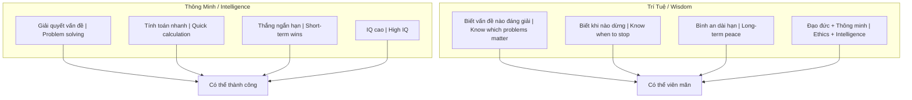
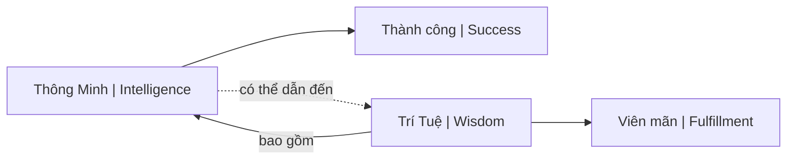
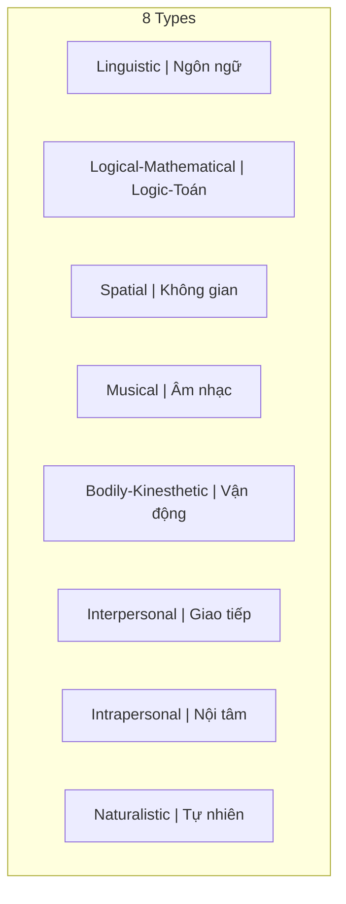
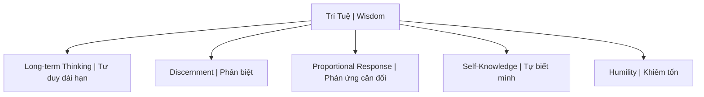
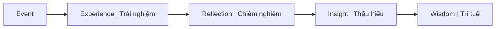

---
title: "Thông Minh vs Trí Tuệ"
aliases: ["Intelligence vs Wisdom", "Smart vs Wise"]
date: 2026-04-08
tags: [mental-model, philosophy]
status: refined
---

# Thông Minh vs Trí Tuệ (Intelligence vs Wisdom)

Bài viết phân tích sự khác biệt bản chất giữa "Thông minh" (Intelligence) và "Trí tuệ" (Wisdom) thông qua nhiều khía cạnh của đời sống — từ cách đối nhân xử thế, kinh doanh đến chăm sóc sức khỏe và quan niệm về sự giàu có.

*This article analyzes the fundamental difference between "Intelligence" and "Wisdom" through various aspects of life — from interpersonal dealings, business to healthcare and concepts of wealth.*

---

## Tổng Quan / Overview

> **Core insight:** Người thông minh chưa chắc có đạo đức, nhưng người trí tuệ bao gồm cả đạo đức và sự thông minh.
>
> *An intelligent person isn't necessarily ethical, but a wise person includes both ethics and intelligence.*

---

## So Sánh Bản Chất / Fundamental Comparison

### 1. Trong Đối Nhân Xử Thế / In Interpersonal Dealings

| Thông Minh / Intelligence | Trí Tuệ / Wisdom |
|---------------------------|------------------|
| Luôn tìm cách **thắng** | Biết khi nào **nhường** |
| Tính toán nước đi để giành phần thắng | Dừng đúng lúc để giữ quan hệ |
| Tập trung lợi ích **ngắn hạn** | Bình an **dài hạn** |

**Ví dụ kinh điển / Classic example:**

Câu chuyện cậu bé chọn tờ 2.000đ thay vì 5.000đ khi được hỏi — để người lớn tiếp tục "thử" → duy trì nguồn lợi lâu dài.

*Story of the boy who picks the 2,000đ bill instead of 5,000đ when asked — so adults keep "testing" him → maintaining long-term benefit.*

### 2. Trong Y Tế & Sức Khỏe / In Healthcare

| Thông Minh / Intelligence | Trí Tuệ / Wisdom |
|---------------------------|------------------|
| Theo dòng chảy xã hội | Hiểu cơ thể là **quá trình** |
| Dùng thuốc Tây dập tắt triệu chứng | Chăm sóc từng ngày: ăn uống, nghỉ ngơi |
| Reactive — có bệnh mới chữa | Proactive — phòng bệnh hơn chữa bệnh |

→ Xem thêm: [[Y Tế Tự Nhiên]], [[Cơ Chế Tự Bảo Vệ Của Cơ Thể]]

*See also: [[Y Tế Tự Nhiên]], [[Cơ Chế Tự Bảo Vệ Của Cơ Thể]]*

### 3. Trong Học Tập & Kiến Thức / In Learning

| Thông Minh / Intelligence | Trí Tuệ / Wisdom |
|---------------------------|------------------|
| Học **nhanh** những gì sách vở dạy | Không dừng ở câu trả lời có sẵn |
| Lấy chứng chỉ để chứng tỏ bản thân | Biết đặt **câu hỏi**, kiểm chứng bằng trải nghiệm |
| Biết **nhiều** | Hiểu **sâu** |

> **"Biết mình không biết là bước đầu của trí tuệ."**
> *"Knowing that you don't know is the beginning of wisdom."*

### 4. Trong Quan Niệm Giàu Có / Concepts of Wealth

| Thông Minh / Intelligence | Trí Tuệ / Wisdom |
|---------------------------|------------------|
| Tiền bạc = chìa khóa hạnh phúc | Đời là trường học để trưởng thành |
| Làm vất vả nhiều năm để đổi vài ngày du lịch | Biến nơi mình sống thành điểm du lịch tại chỗ |
| External validation | Internal fulfillment |

---

## Vì Sao Điều Này Quan Trọng? / Why This Matters

### Trong Context [[Ma Trận]]

Ma Trận **khuyến khích** thông minh và **đè nén** trí tuệ:

*The Matrix encourages intelligence and suppresses wisdom:*

| Ma Trận muốn / Matrix wants | Trí tuệ dạy / Wisdom teaches |
|-----------------------------|------------------------------|
| Cạnh tranh liên tục | Biết khi nào hợp tác |
| Tiêu dùng để hạnh phúc | Hạnh phúc không cần tiêu dùng |
| Chạy theo xu hướng | Đứng ngoài quan sát |
| Phản ứng cảm xúc | Phản hồi có ý thức |

### Trong [[Individuation]]

Thông minh có thể giúp bạn **thành công** trong Ma Trận.

Trí tuệ giúp bạn **thoát** khỏi nó.

*Intelligence can help you succeed within the Matrix. Wisdom helps you escape it.*

---

## Practical: Nhận Diện / How to Recognize

### Dấu hiệu của Thông Minh (chưa có Trí Tuệ)

- Thắng argument nhưng mất bạn
- Đúng nhưng không hạnh phúc
- Giỏi lý thuyết nhưng cuộc sống rối
- Khoe thành tựu liên tục

*Wins arguments but loses friends. Right but unhappy. Good at theory but life is messy. Constantly showing off achievements.*

### Dấu hiệu của Trí Tuệ

- Im lặng khi có thể thắng
- Hỏi câu hỏi thay vì đưa câu trả lời
- Thừa nhận "tôi không biết"
- Bình an ngay cả khi thua

*Silent when could win. Asks questions instead of giving answers. Admits "I don't know." Peaceful even when losing.*

---

## Kết Luận / Conclusion

Thông minh là **công cụ**.

Trí tuệ là **la bàn** quyết định dùng công cụ đó như thế nào.

*Intelligence is a tool. Wisdom is the compass that decides how to use that tool.*

---

## Related / Liên quan

- [[Tư Duy Lũy Thừa]] — Trí tuệ biết chờ đợi exponential results
- [[Individuation]] — Con đường đến trí tuệ
- [[Ma Trận]] — Hệ thống ưu tiên thông minh over trí tuệ
- [[Y Tế Tự Nhiên]] — Trí tuệ trong sức khỏe
- [[Ma Trận - Giải Phẫu Hoàn Chỉnh]] — Trí tuệ như chìa khóa

---
title: "Thông Minh"
aliases: ["Thông Minh", "Intelligence"]
date: 2026-04-08
tags: [mental-model]
status: refined
---

# Thông Minh (Intelligence)

**Thông minh** là khả năng thu thập, xử lý thông tin, tính toán nhanh và phân tích sắc bén để giải quyết vấn đề. Khác với [[Trí Tuệ]], thông minh thiên về logic và có thể được đo lường (IQ).

*Intelligence is the ability to gather and process information, calculate quickly, and analyze sharply to solve problems. Unlike [[Trí Tuệ|Wisdom]], intelligence leans toward logic and can be measured (IQ).*

> "Intelligence is the ability to adapt to change." — Stephen Hawking

---

## Đặc Điểm / Characteristics

| Aspect | Thông Minh / Intelligence |
|--------|--------------------------|
| **Loại / Type** | Cognitive, analytical |
| **Đo lường / Measurement** | IQ tests, academic scores |
| **Focus** | Problem-solving, speed |
| **Học được / Trainable** | Yes |
| **Gắn với / Associated with** | Mind, logic |

---

## Các Loại Thông Minh / Types of Intelligence (Howard Gardner)

| Loại / Type | Mô tả / Description |
|-------------|---------------------|
| **Linguistic** | Ngôn ngữ, viết, nói / Language, writing, speaking |
| **Logical-Mathematical** | Số học, reasoning, patterns |
| **Spatial** | Visualization, navigation |
| **Musical** | Rhythm, pitch, composition |
| **Bodily-Kinesthetic** | Phối hợp cơ thể / Physical coordination |
| **Interpersonal** | Hiểu người khác / Understanding others |
| **Intrapersonal** | Hiểu bản thân / Understanding self |
| **Naturalistic** | Thiên nhiên, phân loại / Nature, classification |

---

## Thông Minh vs Trí Tuệ / Intelligence vs Wisdom

| Thông Minh / Intelligence | [[Trí Tuệ]] / Wisdom |
|---------------------------|---------------------|
| Biết nhiều / Knows much | Biết sâu / Knows deeply |
| Giải quyết vấn đề / Solves problems | Tránh vấn đề / Avoids problems |
| Thắng arguments / Wins arguments | Thắng relationships / Wins relationships |
| Ngắn hạn / Short-term | Dài hạn / Long-term |
| What to think | How to think |
| Ego-driven | Soul-driven |

→ Xem chi tiết: [[Thông Minh vs Trí Tuệ]]

*See details: [[Thông Minh vs Trí Tuệ]]*

---

## Hạn Chế Của Thông Minh Đơn Thuần / Limitations of Pure Intelligence

### 1. Công cụ của Ego / Tool of Ego

Dùng để "thắng" thay vì "hiểu". Feed [[Nguyên Mẫu|Persona]]. Tách biệt khỏi người khác.

*Used to "win" instead of "understand." Feeds Persona. Separates from others.*

### 2. Dễ bị manipulate / Easily Manipulated

[[Elite]] targets intelligent people. Hệ thống giáo dục tạo conformity. "Smart" = follows the rules.

*Elite targets intelligent people. Education system creates conformity. "Smart" = follows the rules.*

### 3. Bỏ lỡ bức tranh lớn / Miss the Bigger Picture

Thấy cây, không thấy rừng. Thấy chi tiết, không thấy ý nghĩa. Biết "how", không biết "why".

*Sees trees, not forest. Sees details, not meaning. Knows "how", not "why".*

---

## Thông Minh Trong [[Ma Trận]] / Intelligence in the Matrix

### "Smart" = Good Slave

- Follow instructions well / Làm theo hướng dẫn tốt
- Solve assigned problems / Giải quyết vấn đề được giao
- Don't question the game / Không đặt câu hỏi về trò chơi

*The Matrix rewards intelligence that stays within its rules.*

| Ví dụ / Example | Smart | Wise |
|-----------------|-------|------|
| **Finance** | Maximize returns trong hệ thống | Question if system is rigged |
| **Career** | Leo thang công ty | Hỏi xem thang có dựa đúng tường không |

---

## Phát Triển Cân Bằng / Balanced Development

**Thông minh + Trí tuệ = Powerful**

1. Phát triển cognitive skills (reading, math, analysis)
2. Nhưng cũng cần contemplation, wisdom practices
3. Question your own intelligence
4. Khiêm tốn: "Tôi biết rằng tôi không biết gì"

*Develop cognitive skills, but also contemplation. Question your own intelligence. Humble: "I know that I know nothing."*

---

## Related / Liên quan

- [[Trí Tuệ]] — The complement
- [[Thông Minh vs Trí Tuệ]] — Full comparison
- [[Mental Model]] — Thinking frameworks
- [[Tâm Lý Học Jung]] — Shadow, Persona
- [[Individuation]] — Path to wholeness
- [[Elite]] — Who exploits intelligent people
- [[Ma Trận]] — System that rewards conformist intelligence

---
title: "Trí Tuệ"
aliases: ["Wisdom", "Prajñā", "Sophia"]
date: 2026-04-08
tags: [mental-model, philosophy]
status: refined
---

# Trí Tuệ (Wisdom / Prajñā)

**Trí tuệ** là khả năng nhìn thấu bản chất, hiểu quy luật vận hành dài hạn, và có sự hài hòa giữa kiến thức với đạo đức. Khác biệt căn bản với [[Thông Minh|thông minh]].

*Wisdom is the ability to see through to essence, understand long-term operating principles, and harmonize knowledge with ethics. Fundamentally different from [[Thông Minh|intelligence]].*

---

## Trí Tuệ vs Thông Minh / Wisdom vs Intelligence

| Thông Minh / Intelligence | Trí Tuệ / Wisdom |
|---------------------------|------------------|
| Xử lý thông tin nhanh / Quick processing | Hiểu bản chất sâu / Deep understanding |
| IQ cao / High IQ | IQ + EQ + SQ |
| Giải quyết problems / Solves problems | Biết problems nào đáng giải / Knows which problems matter |
| Tích lũy knowledge / Accumulates | Áp dụng wisely / Applies wisely |
| Win the game | Know which games worth playing |
| Có thể taught / Can be taught | Phải earned qua experience / Must be earned |
| AI có thể có / AI can have | AI không có (yet?) / AI doesn't have |

> "Knowledge is knowing tomato is a fruit. Wisdom is not putting it in fruit salad."
>
> *"Kiến thức là biết cà chua là trái cây. Trí tuệ là không bỏ nó vào salad trái cây."*

---

## Biểu Hiện Của Trí Tuệ / Manifestations of Wisdom

### 1. Long-term Thinking / Tư duy dài hạn

Hy sinh short-term gain cho long-term benefit. Thấy second, third-order consequences.

*Sacrifice short-term for long-term. See second, third-order consequences.*

### 2. Discernment / Phân biệt

- True vs false / Thật vs giả
- Important vs urgent / Quan trọng vs cấp bách
- Signal vs noise / Tín hiệu vs nhiễu
- Thấy qua [[Ma Trận]] illusions / See through Matrix illusions

### 3. Proportional Response / Phản ứng cân đối

Hành động đúng, thời điểm đúng. Không over-react. [[Tâm bất Biến]].

*Right action, right time. Don't over-react.*

### 4. Self-Knowledge / Tự biết mình

Biết biases của mình. [[Individuation]]. Shadow awareness. Thừa nhận giới hạn.

*Know your biases. Shadow awareness. Acknowledge limits.*

### 5. Humility / Khiêm tốn

Biết những gì mình không biết. Sẵn sàng sai. Học từ bất kỳ ai.

*Know what you don't know. Open to being wrong. Learn from anyone.*

---

## Con Đường Đạt Trí Tuệ / The Path to Wisdom

### Experience + Reflection / Trải nghiệm + Chiêm nghiệm

### Suffering Teaches / Đau khổ dạy

- Pain as teacher / Đau đớn là thầy
- [[Nhân Quả]] lessons / Bài học nhân quả
- Darkness before light / Bóng tối trước ánh sáng

*Pain teaches what pleasure cannot. Darkness reveals light.*

### Study + Practice / Học + Thực hành

- [[Khoa Học Xét Lại]] — Question assumptions
- Verify, don't trust / Kiểm chứng, đừng tin

### Health Foundation / Nền tảng sức khỏe

Clear body = clear mind / Thân sạch = tâm sáng.

- [[Thuyết Vi Sinh Nội Sinh]]
- [[Hệ Tiêu Hóa - Bộ Não Thứ Hai]]
- [[Tuyến Tùng]] activation

---

## Trí Tuệ Trong Các Truyền Thống / Wisdom in Traditions

| Tradition | Term | Description |
|-----------|------|-------------|
| **Buddhist** | Prajñā (Bát Nhã) | Transcendent wisdom / Trí tuệ siêu việt |
| **Greek** | Sophia | Philosophical wisdom / Triết học |
| **Hebrew** | Chokmah | Wisdom personified / Trí tuệ nhân cách hóa |
| **Chinese** | Zhì (智) | Practical wisdom / Trí tuệ thực tiễn |

### Buddhist Prajñā / Bát Nhã Phật giáo

- Insight into Śūnyatā (emptiness) / Thấy tánh không
- Sees through illusions / Thấy qua ảo tưởng
- Heart Sutra teachings / Kinh Bát Nhã

---

## Kẻ Thù Của Trí Tuệ / Enemies of Wisdom

### Modern Traps / Bẫy hiện đại

| Trap | Tác hại / Effect |
|------|------------------|
| Information overload | Không thể phân biệt quan trọng |
| Distraction addiction | Mất khả năng chiêm nghiệm sâu |
| Short attention span | Không thấy long-term patterns |
| "Expert" worship | Outsource suy nghĩ cho người khác |
| [[Kiểm Soát Tâm Trí]] | Narrative control |

### Psychological / Tâm lý

| Enemy | Cách hoạt động / How it works |
|-------|------------------------------|
| **Ego** | Nghĩ mình đã biết / Thinks it already knows |
| **Fear** | Tránh hard truths / Avoids hard truths |
| **Comfort** | Chống lại growth / Resists growth |
| **Certainty** | Closed mind / Tâm trí đóng |

---

## Thực Hành / Practical Cultivation

### Daily / Hàng ngày

- Journaling / Viết nhật ký chiêm nghiệm
- Quality over quantity reading
- Meditation / Thiền định
- Nature time / Thời gian với thiên nhiên

### Ongoing / Liên tục

- Seek diverse perspectives / Tìm góc nhìn đa dạng
- Find wise mentors / Tìm người hướng dẫn có trí tuệ
- Embrace failure as teacher / Đón nhận thất bại như thầy
- Practice delayed gratification / Thực hành trì hoãn hưởng thụ

### Long-term / Dài hạn

- Build [[Tâm bất Biến]]
- [[Individuation]] journey
- Serve others / Phụng sự người khác (wisdom flows through giving)

---

## Related / Liên quan

- [[Thông Minh]] — Contrasting concept
- [[Thông Minh vs Trí Tuệ]] — Full comparison
- [[Individuation]] — Journey to wisdom
- [[Ma Trận]] — What wisdom sees through
- [[Ma Trận - Giải Phẫu Hoàn Chỉnh]] — Escape map
- [[Tâm bất Biến]] — Expression of wisdom
- [[Nghịch Lý Của Hiểu Biết]] — Ultimate wisdom

