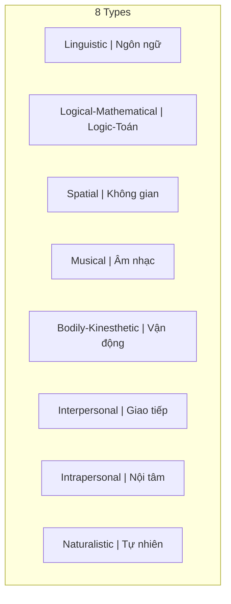

# Thông Minh (Intelligence)

**Thông minh** là khả năng thu thập, xử lý thông tin, tính toán nhanh và phân tích sắc bén để giải quyết vấn đề. Khác với [[Trí Tuệ]], thông minh thiên về logic và có thể được đo lường (IQ).

*Intelligence is the ability to gather and process information, calculate quickly, and analyze sharply to solve problems. Unlike [[Trí Tuệ|Wisdom]], intelligence leans toward logic and can be measured (IQ).*

> "Intelligence is the ability to adapt to change." — Stephen Hawking

---

## Đặc Điểm / Characteristics

| Aspect | Thông Minh / Intelligence |
|--------|--------------------------|
| **Loại / Type** | Cognitive, analytical |
| **Đo lường / Measurement** | IQ tests, academic scores |
| **Focus** | Problem-solving, speed |
| **Học được / Trainable** | Yes |
| **Gắn với / Associated with** | Mind, logic |

---

## Các Loại Thông Minh / Types of Intelligence (Howard Gardner)

| Loại / Type | Mô tả / Description |
|-------------|---------------------|
| **Linguistic** | Ngôn ngữ, viết, nói |
| **Logical-Mathematical** | Số học, reasoning, patterns |
| **Spatial** | Visualization, navigation |
| **Musical** | Rhythm, pitch, composition |
| **Bodily-Kinesthetic** | Phối hợp cơ thể |
| **Interpersonal** | Hiểu người khác |
| **Intrapersonal** | Hiểu bản thân |
| **Naturalistic** | Thiên nhiên, phân loại |

---

## Hạn Chế Của Thông Minh Đơn Thuần / Limitations

### 1. Công cụ của Ego

Dùng để "thắng" thay vì "hiểu". Feed [[Nguyên Mẫu|Persona]]. Tách biệt khỏi người khác.

### 2. Dễ bị manipulate

[[Elite]] targets intelligent people. Hệ thống giáo dục tạo conformity. "Smart" = follows the rules.

### 3. Bỏ lỡ bức tranh lớn

Thấy cây, không thấy rừng. Biết "how", không biết "why".

---

## Thông Minh Trong [[Ma Trận]]

### "Smart" = Good Slave

- Follow instructions well
- Solve assigned problems
- Don't question the game

*The Matrix rewards intelligence that stays within its rules.*

---

## Related / Liên quan

- [[Trí Tuệ]] — The complement
- [[Thông Minh vs Trí Tuệ]] — Full comparison
- [[Individuation]] — Path to wholeness
- [[Ma Trận]] — System that rewards conformist intelligence

---

*Lần cuối cập nhật: 2026-04-30*
