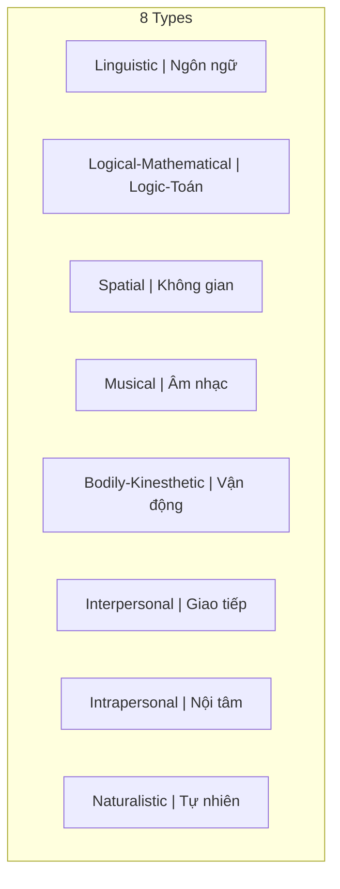

# Thông Minh (Intelligence)

**Thông minh** là khả năng thu thập, xử lý thông tin, tính toán nhanh và phân tích sắc bén để giải quyết vấn đề. Khác với [[Trí Tuệ]], thông minh thiên về logic và có thể được đo lường (IQ).

*Intelligence is the ability to gather and process information, calculate quickly, and analyze sharply to solve problems. Unlike [[Trí Tuệ|Wisdom]], intelligence leans toward logic and can be measured (IQ).*

> "Intelligence is the ability to adapt to change." — Stephen Hawking

---

## Đặc Điểm / Characteristics

| Aspect | Thông Minh / Intelligence |
|--------|--------------------------|
| **Loại / Type** | Cognitive, analytical |
| **Đo lường / Measurement** | IQ tests, academic scores |
| **Focus** | Problem-solving, speed |
| **Học được / Trainable** | Yes |
| **Gắn với / Associated with** | Mind, logic |

---

## Các Loại Thông Minh / Types of Intelligence (Howard Gardner)

| Loại / Type | Mô tả / Description |
|-------------|---------------------|
| **Linguistic** | Ngôn ngữ, viết, nói / Language, writing, speaking |
| **Logical-Mathematical** | Số học, reasoning, patterns |
| **Spatial** | Visualization, navigation |
| **Musical** | Rhythm, pitch, composition |
| **Bodily-Kinesthetic** | Phối hợp cơ thể / Physical coordination |
| **Interpersonal** | Hiểu người khác / Understanding others |
| **Intrapersonal** | Hiểu bản thân / Understanding self |
| **Naturalistic** | Thiên nhiên, phân loại / Nature, classification |

---

## Thông Minh vs Trí Tuệ / Intelligence vs Wisdom

| Thông Minh / Intelligence | [[Trí Tuệ]] / Wisdom |
|---------------------------|---------------------|
| Biết nhiều / Knows much | Biết sâu / Knows deeply |
| Giải quyết vấn đề / Solves problems | Tránh vấn đề / Avoids problems |
| Thắng arguments / Wins arguments | Thắng relationships / Wins relationships |
| Ngắn hạn / Short-term | Dài hạn / Long-term |
| What to think | How to think |
| Ego-driven | Soul-driven |

→ Xem chi tiết: [[Thông Minh vs Trí Tuệ]]

*See details: [[Thông Minh vs Trí Tuệ]]*

---

## Hạn Chế Của Thông Minh Đơn Thuần / Limitations of Pure Intelligence

### 1. Công cụ của Ego / Tool of Ego

Dùng để "thắng" thay vì "hiểu". Feed [[Nguyên Mẫu|Persona]]. Tách biệt khỏi người khác.

*Used to "win" instead of "understand." Feeds Persona. Separates from others.*

### 2. Dễ bị manipulate / Easily Manipulated

[[Elite]] targets intelligent people. Hệ thống giáo dục tạo conformity. "Smart" = follows the rules.

*Elite targets intelligent people. Education system creates conformity. "Smart" = follows the rules.*

### 3. Bỏ lỡ bức tranh lớn / Miss the Bigger Picture

Thấy cây, không thấy rừng. Thấy chi tiết, không thấy ý nghĩa. Biết "how", không biết "why".

*Sees trees, not forest. Sees details, not meaning. Knows "how", not "why".*

---

## Thông Minh Trong [[Ma Trận]] / Intelligence in the Matrix

### "Smart" = Good Slave

- Follow instructions well / Làm theo hướng dẫn tốt
- Solve assigned problems / Giải quyết vấn đề được giao
- Don't question the game / Không đặt câu hỏi về trò chơi

*The Matrix rewards intelligence that stays within its rules.*

| Ví dụ / Example | Smart | Wise |
|-----------------|-------|------|
| **Finance** | Maximize returns trong hệ thống | Question if system is rigged |
| **Career** | Leo thang công ty | Hỏi xem thang có dựa đúng tường không |

---

## Phát Triển Cân Bằng / Balanced Development

**Thông minh + Trí tuệ = Powerful**

1. Phát triển cognitive skills (reading, math, analysis)
2. Nhưng cũng cần contemplation, wisdom practices
3. Question your own intelligence
4. Khiêm tốn: "Tôi biết rằng tôi không biết gì"

*Develop cognitive skills, but also contemplation. Question your own intelligence. Humble: "I know that I know nothing."*

---

## Related / Liên quan

- [[Trí Tuệ]] — The complement
- [[Thông Minh vs Trí Tuệ]] — Full comparison
- [[Mental Model]] — Thinking frameworks
- [[Tâm Lý Học Jung]] — Shadow, Persona
- [[Individuation]] — Path to wholeness
- [[Elite]] — Who exploits intelligent people
- [[Ma Trận]] — System that rewards conformist intelligence
