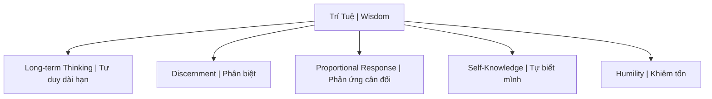

# Trí Tuệ (Wisdom / Prajñā)

**Trí tuệ** là khả năng nhìn thấu bản chất, hiểu quy luật vận hành dài hạn, và có sự hài hòa giữa kiến thức với đạo đức. Khác biệt căn bản với [[Thông Minh|thông minh]].

*Wisdom is the ability to see through to essence, understand long-term operating principles, and harmonize knowledge with ethics. Fundamentally different from [[Thông Minh|intelligence]].*

---

## Trí Tuệ vs Thông Minh / Wisdom vs Intelligence

| Thông Minh / Intelligence | Trí Tuệ / Wisdom |
|---------------------------|------------------|
| Xử lý thông tin nhanh | Hiểu bản chất sâu |
| IQ cao | IQ + EQ + SQ |
| Giải quyết problems | Biết problems nào đáng giải |
| Win the game | Know which games worth playing |
| Có thể taught | Phải earned qua experience |

> "Knowledge is knowing tomato is a fruit. Wisdom is not putting it in fruit salad."

---

## Biểu Hiện Của Trí Tuệ / Manifestations

### 1. Long-term Thinking

Hy sinh short-term gain cho long-term benefit.

### 2. Discernment / Phân biệt

- True vs false
- Important vs urgent
- Signal vs noise
- Thấy qua [[Ma Trận]] illusions

### 3. Self-Knowledge

Biết biases của mình. [[Individuation]]. Shadow awareness.

### 4. Humility / Khiêm tốn

Biết những gì mình không biết. Sẵn sàng sai.

---

## Con Đường Đạt Trí Tuệ / The Path

### Experience + Reflection

### Suffering Teaches

- Pain as teacher / Đau đớn là thầy
- [[Nhân Quả]] lessons
- Darkness before light

---

## Trí Tuệ Trong Các Truyền Thống / In Traditions

| Tradition | Term | Description |
|-----------|------|-------------|
| **Buddhist** | Prajñā (Bát Nhã) | Transcendent wisdom |
| **Greek** | Sophia | Philosophical wisdom |
| **Hebrew** | Chokmah | Wisdom personified |
| **Chinese** | Zhì (智) | Practical wisdom |

---

## Kẻ Thù Của Trí Tuệ / Enemies

| Enemy | Tác hại |
|-------|---------|
| **Information overload** | Không thể phân biệt quan trọng |
| **Distraction addiction** | Mất khả năng chiêm nghiệm sâu |
| **Ego** | Nghĩ mình đã biết |
| **Certainty** | Closed mind |

---

## Thực Hành / Practical Cultivation

- Journaling / Viết nhật ký chiêm nghiệm
- Quality over quantity reading
- Meditation / Thiền định
- Embrace failure as teacher
- Practice delayed gratification

---

## Related / Liên quan

- [[Thông Minh]] — Contrasting concept
- [[Thông Minh vs Trí Tuệ]] — Full comparison
- [[Individuation]] — Journey to wisdom
- [[Ma Trận]] — What wisdom sees through
- [[Tâm bất Biến]] — Expression of wisdom
- [[Nghịch Lý Của Hiểu Biết]] — Ultimate wisdom

---

*Lần cuối cập nhật: 2026-04-30*
