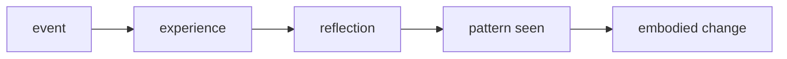

# Trí Tuệ (Wisdom / Prajñā)

**Trí tuệ là khả năng nhìn đúng bản chất, chọn đúng game, hành động đúng tỷ lệ và không để kiến thức phục vụ ego.** Nó không chỉ là biết nhiều hơn. Nó là biết cái gì đáng biết, cái gì nên bỏ, khi nào im, khi nào cắt, khi nào chịu mất ngắn hạn để giữ phần sâu hơn của mình.

*Wisdom is not more information. It is right discernment, right proportion, and the refusal to let knowledge serve ego.*

---

## Vault Position / Vị Trí Trong Vault

Node này là đối cực cần thiết của [[Thông Minh]] và trung tâm của [[Thông Minh vs Trí Tuệ]]. Nó nối mental model với [[Gnosis]] qua câu hỏi: biết bằng đầu khác gì biết bằng toàn bộ hiện hữu? Nó cũng nối với [[Nghịch Lý Của Hiểu Biết]] vì người càng thật sự hiểu càng ít cần giả vờ chắc.

---

## Evidence Discipline / Cách Đọc

| Tầng claim | Cách đọc |
|---|---|
| Psychological | wisdom liên quan self-knowledge, emotional regulation, long-term judgment |
| Philosophical | Sophia, Prajñā, Chokmah là các truyền thống khác nhau về discernment |
| Pattern / systems | xã hội hiện đại thưởng information và speed nhiều hơn depth |
| Vault synthesis | wisdom là intelligence đã qua đau, reflection và ego-death |

---

## Trí Tuệ Khác Gì Thông Minh?

[[Thông Minh]] hỏi: "Làm sao giải nhanh?" Trí tuệ hỏi: "Có nên giải không?" Thông minh thắng tranh luận. Trí tuệ thấy khi tranh luận chỉ là ego đòi ăn. Thông minh tối ưu hóa. Trí tuệ hỏi tối ưu cho cái gì.

| Thông minh | Trí tuệ |
|---|---|
| xử lý dữ liệu | thấy bản chất |
| thắng game | chọn game |
| nhanh | đúng nhịp |
| biết cách | biết lý do |
| chứng minh mình đúng | sẵn sàng bị sửa bởi truth |

---

## Wisdom Cần Thời Gian

Không ai tải trí tuệ như tải file. Wisdom cần va chạm với thực tại, sai lầm, mất mát, phản tỉnh và chịu trách nhiệm. Đau không tự động tạo trí tuệ; đau cộng với honesty mới tạo trí tuệ.

Nếu trải nghiệm không được tiêu hóa, nó chỉ thành trauma hoặc bitterness. Nếu được tiêu hóa, nó thành discernment.

---

## Kẻ Thù Của Trí Tuệ

Trí tuệ chết dưới bốn thứ hiện đại:

- information overload: quá nhiều input, quá ít digestion;
- distraction addiction: không còn khoảng lặng để insight kết tinh;
- certainty performance: phải tỏ ra chắc để giữ persona;
- moral outsourcing: để tribe, thuật toán hoặc institution nghĩ thay mình.

Đây là lý do [[Tâm bất Biến]] không phải trạng thái thơ mộng. Nó là điều kiện để thấy rõ khi cả thế giới đang kéo attention của mình.

---

## Wisdom Trong Ma Trận

[[Ma Trận]] sợ trí tuệ hơn thông minh. Người thông minh có thể được mua bằng status, problem khó, salary, audience. Người trí tuệ khó mua hơn vì họ nhìn được cái giá vô hình của hợp đồng.

Trí tuệ không nhất thiết rời khỏi hệ thống. Nó có thể làm việc, kiếm tiền, dùng công nghệ. Nhưng nó không nhầm công cụ với chủ, không nhầm thành công với freedom, không nhầm applause với truth.

---

## Thực Hành Trí Tuệ

Không có shortcut, nhưng có kỷ luật:

1. viết lại các quyết định lớn và hậu quả thật;
2. giữ khoảng lặng trước phản ứng;
3. đọc ít hơn nhưng tiêu hóa sâu hơn;
4. tìm người có thể nói thật với mình;
5. phân biệt signal, noise và bait;
6. luyện nói "không" với game không đáng.

Trí tuệ là knowledge đã đi qua thân thể. Nếu một insight không đổi cách sống, nó mới là thông tin.

---

## Core Insight / Chốt Lại

**Trí tuệ là khi cái biết không còn phục vụ nhu cầu được xem là thông minh, mà phục vụ sự thật, tự do và toàn vẹn.**

*Wisdom begins when knowing stops serving the image of being smart and starts serving truth.*
