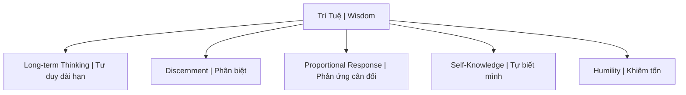
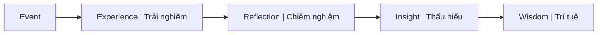

# Trí Tuệ (Wisdom / Prajñā)

**Trí tuệ** là khả năng nhìn thấu bản chất, hiểu quy luật vận hành dài hạn, và có sự hài hòa giữa kiến thức với đạo đức. Khác biệt căn bản với [[Thông Minh|thông minh]].

*Wisdom is the ability to see through to essence, understand long-term operating principles, and harmonize knowledge with ethics. Fundamentally different from [[Thông Minh|intelligence]].*

---

## Trí Tuệ vs Thông Minh / Wisdom vs Intelligence

| Thông Minh / Intelligence | Trí Tuệ / Wisdom |
|---------------------------|------------------|
| Xử lý thông tin nhanh / Quick processing | Hiểu bản chất sâu / Deep understanding |
| IQ cao / High IQ | IQ + EQ + SQ |
| Giải quyết problems / Solves problems | Biết problems nào đáng giải / Knows which problems matter |
| Tích lũy knowledge / Accumulates | Áp dụng wisely / Applies wisely |
| Win the game | Know which games worth playing |
| Có thể taught / Can be taught | Phải earned qua experience / Must be earned |
| AI có thể có / AI can have | AI không có (yet?) / AI doesn't have |

> "Knowledge is knowing tomato is a fruit. Wisdom is not putting it in fruit salad."
>
> *"Kiến thức là biết cà chua là trái cây. Trí tuệ là không bỏ nó vào salad trái cây."*

---

## Biểu Hiện Của Trí Tuệ / Manifestations of Wisdom

### 1. Long-term Thinking / Tư duy dài hạn

Hy sinh short-term gain cho long-term benefit. Thấy second, third-order consequences.

*Sacrifice short-term for long-term. See second, third-order consequences.*

### 2. Discernment / Phân biệt

- True vs false / Thật vs giả
- Important vs urgent / Quan trọng vs cấp bách
- Signal vs noise / Tín hiệu vs nhiễu
- Thấy qua [[Ma Trận]] illusions / See through Matrix illusions

### 3. Proportional Response / Phản ứng cân đối

Hành động đúng, thời điểm đúng. Không over-react. [[Tâm bất Biến]].

*Right action, right time. Don't over-react.*

### 4. Self-Knowledge / Tự biết mình

Biết biases của mình. [[Individuation]]. Shadow awareness. Thừa nhận giới hạn.

*Know your biases. Shadow awareness. Acknowledge limits.*

### 5. Humility / Khiêm tốn

Biết những gì mình không biết. Sẵn sàng sai. Học từ bất kỳ ai.

*Know what you don't know. Open to being wrong. Learn from anyone.*

---

## Con Đường Đạt Trí Tuệ / The Path to Wisdom

### Experience + Reflection / Trải nghiệm + Chiêm nghiệm

### Suffering Teaches / Đau khổ dạy

- Pain as teacher / Đau đớn là thầy
- [[Nhân Quả]] lessons / Bài học nhân quả
- Darkness before light / Bóng tối trước ánh sáng

*Pain teaches what pleasure cannot. Darkness reveals light.*

### Study + Practice / Học + Thực hành

- [[Khoa Học Xét Lại]] — Question assumptions
- Verify, don't trust / Kiểm chứng, đừng tin

### Health Foundation / Nền tảng sức khỏe

Clear body = clear mind / Thân sạch = tâm sáng.

- [[Thuyết Vi Sinh Nội Sinh]]
- [[Hệ Tiêu Hóa - Bộ Não Thứ Hai]]
- [[Tuyến Tùng]] activation

---

## Trí Tuệ Trong Các Truyền Thống / Wisdom in Traditions

| Tradition | Term | Description |
|-----------|------|-------------|
| **Buddhist** | Prajñā (Bát Nhã) | Transcendent wisdom / Trí tuệ siêu việt |
| **Greek** | Sophia | Philosophical wisdom / Triết học |
| **Hebrew** | Chokmah | Wisdom personified / Trí tuệ nhân cách hóa |
| **Chinese** | Zhì (智) | Practical wisdom / Trí tuệ thực tiễn |

### Buddhist Prajñā / Bát Nhã Phật giáo

- Insight into Śūnyatā (emptiness) / Thấy tánh không
- Sees through illusions / Thấy qua ảo tưởng
- Heart Sutra teachings / Kinh Bát Nhã

---

## Kẻ Thù Của Trí Tuệ / Enemies of Wisdom

### Modern Traps / Bẫy hiện đại

| Trap | Tác hại / Effect |
|------|------------------|
| Information overload | Không thể phân biệt quan trọng |
| Distraction addiction | Mất khả năng chiêm nghiệm sâu |
| Short attention span | Không thấy long-term patterns |
| "Expert" worship | Outsource suy nghĩ cho người khác |
| [[Kiểm Soát Tâm Trí]] | Narrative control |

### Psychological / Tâm lý

| Enemy | Cách hoạt động / How it works |
|-------|------------------------------|
| **Ego** | Nghĩ mình đã biết / Thinks it already knows |
| **Fear** | Tránh hard truths / Avoids hard truths |
| **Comfort** | Chống lại growth / Resists growth |
| **Certainty** | Closed mind / Tâm trí đóng |

---

## Thực Hành / Practical Cultivation

### Daily / Hàng ngày

- Journaling / Viết nhật ký chiêm nghiệm
- Quality over quantity reading
- Meditation / Thiền định
- Nature time / Thời gian với thiên nhiên

### Ongoing / Liên tục

- Seek diverse perspectives / Tìm góc nhìn đa dạng
- Find wise mentors / Tìm người hướng dẫn có trí tuệ
- Embrace failure as teacher / Đón nhận thất bại như thầy
- Practice delayed gratification / Thực hành trì hoãn hưởng thụ

### Long-term / Dài hạn

- Build [[Tâm bất Biến]]
- [[Individuation]] journey
- Serve others / Phụng sự người khác (wisdom flows through giving)

---

## Related / Liên quan

- [[Thông Minh]] — Contrasting concept
- [[Thông Minh vs Trí Tuệ]] — Full comparison
- [[Individuation]] — Journey to wisdom
- [[Ma Trận]] — What wisdom sees through
- [[Mental Model - Bản Đồ Thoát Khỏi Ma Trận]] — Escape map
- [[Tâm bất Biến]] — Expression of wisdom
- [[Nghịch Lý Của Hiểu Biết]] — Ultimate wisdom
