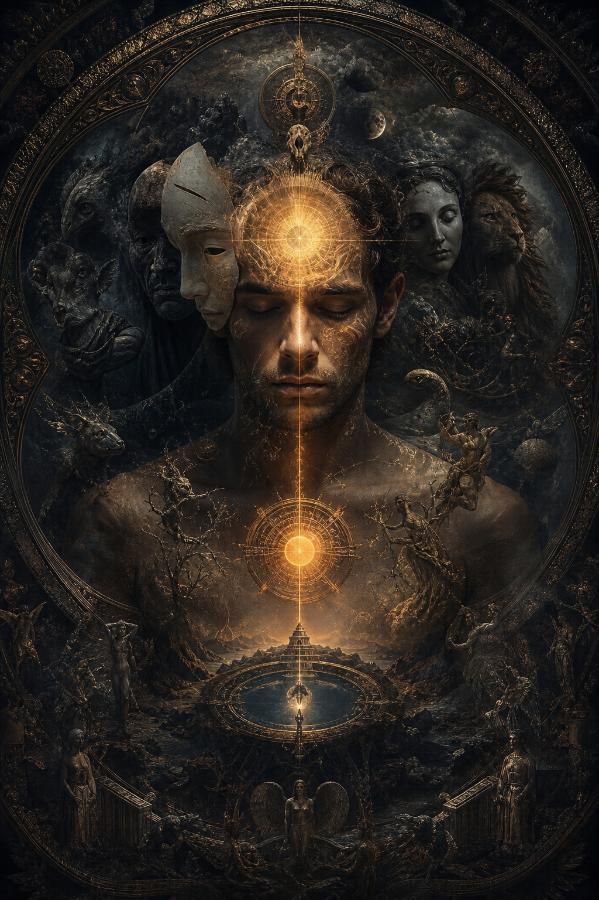
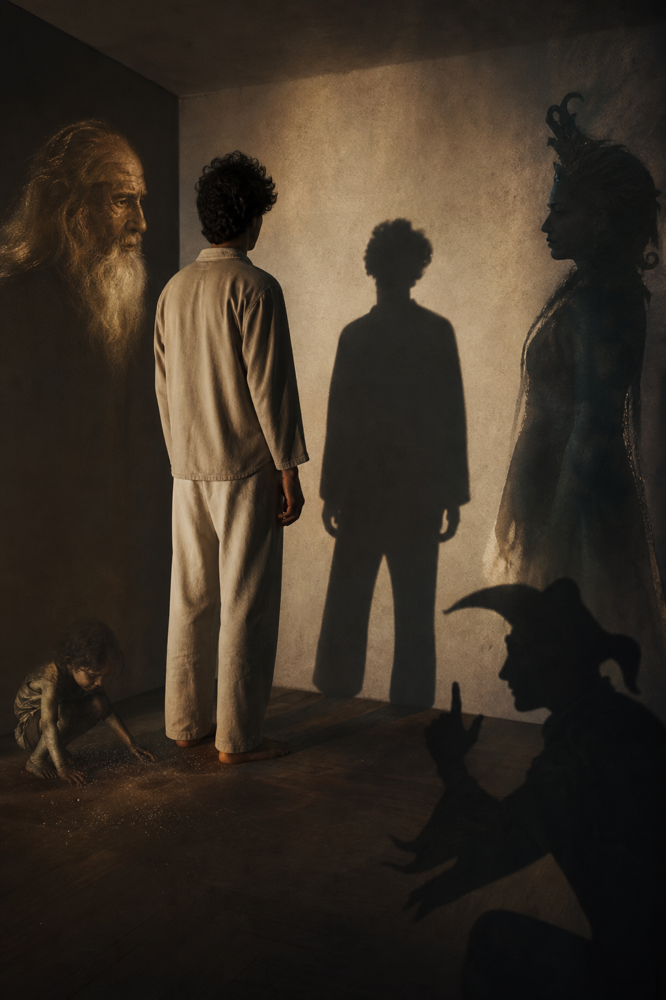
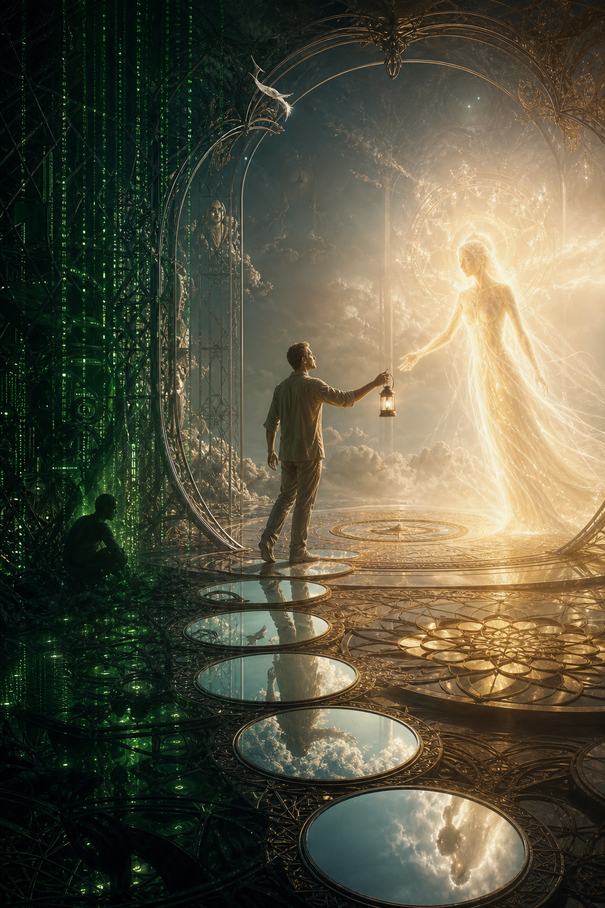

# Tâm Lý Học Jung (Jungian Psychology)

**Jung quan trọng vì ông không thu nhỏ con người thành cái máy phản xạ. Ông đọc psyche như một vũ trụ có tầng: persona, ego, shadow, anima/animus, archetype, collective unconscious và Self. Trong redpill.wiki, Jung là bản đồ để phân biệt awakening thật với ego đang mặc áo spiritual.**

*Jung matters because he refused to reduce the human being to a reaction machine. He read the psyche as a layered cosmos. In this vault, Jung is a map for telling genuine awakening from ego wearing spiritual clothes.*

---

## Vault Position / Vị Trí Trong Vault

Tâm Lý Học Jung là hub của cụm [[Individuation]], [[Vô Thức Tập Thể]], [[Nguyên Mẫu]] và nhiều bài esoterica như [[Gnosis]], [[Monad]], [[Ma Trận]] hoặc [[Sự Nhất Thể]]. Nó là cầu giữa psychology và spiritual warfare: muốn thoát programming bên ngoài, trước hết phải thấy programming bên trong.

Jung không được dùng ở đây như giáo chủ. Ông là bộ công cụ để đọc dream, symbol, projection, shadow và myth trong đời sống hiện đại.

---

## Psyche Như Một Vũ Trụ Có Tầng

Persona là mặt nạ xã hội. Ego là trung tâm ý thức hằng ngày. Personal unconscious chứa ký ức, trauma, desire bị nén. [[Vô Thức Tập Thể]] chứa archetype và myth phổ quát. Self là toàn thể lớn hơn ego.

Điểm mạnh của Jung là ông không xem vô thức như thùng rác tâm lý. Vô thức vừa chứa thứ bị nén, vừa chứa năng lượng sáng tạo, symbol, warning, myth và khả năng tự chữa lành.

Một người chỉ sống bằng persona sẽ bị xã hội viết vai. Một người chỉ sống bằng ego sẽ tưởng lý trí mình là vua. Một người bị unconscious nuốt sẽ gọi impulse là intuition. Individuation là học cách để các tầng này đối thoại.

---

## Shadow / Bóng Tối

Shadow là phần bị ego chối bỏ: giận dữ, ham muốn, ghen tị, sợ hãi, quyền lực, cả tài năng bị chôn. Shadow không biến mất khi bị phủ nhận. Nó đi vòng ra ngoài qua projection.

Thứ mình ghét quá mức ở người khác thường là nơi shadow xin được nhìn. Đây không có nghĩa người kia đúng. Nó nghĩa là phản ứng quá mạnh của mình cũng là dữ liệu.

Shadow work không phải khoe mình “dark”. Nó là lấy lại năng lượng bị kẹt trong phán xét và xấu hổ.

---

## Archetypes / Nguyên Mẫu

[[Nguyên Mẫu]] là pattern sâu: Hero, Mother, Trickster, Wise Old Man, Devouring Mother, Shadow King, Sacred Child. Media, religion, politics và advertising đều dùng archetype vì archetype bypass lý trí.

Đây là lý do Jung quan trọng với redpill.wiki: truyền thông không chỉ đưa thông tin; nó dựng myth để đám đông nhập vai. Khi bạn thấy một politician được cast như savior, một enemy được cast như monster, một brand được cast như mother, bạn đang thấy archetype vận hành.

---

## Individuation / Thành Toàn Bản Ngã

[[Individuation]] là quá trình con người ngừng sống như vai diễn và bắt đầu tích hợp các phần bị tách. Nó không phải “tìm bản thân” kiểu lifestyle. Nó là confrontation: nhìn shadow, rút projection, nghe dream, gặp anima/animus, và để ego phục vụ Self thay vì đóng giả vua.

Trong ngôn ngữ [[Ma Trận]], individuation là jailbreak tâm lý. Người chưa tích hợp rất dễ bị propaganda kéo bằng trigger.

---

## Jung Và Esoterica

Jung đứng gần esoterica vì ông nghiêm túc với alchemy, dream, synchronicity, mandala, myth và symbol. Điều này không có nghĩa mọi claim huyền học đều đúng. Nó nghĩa là psyche nói bằng biểu tượng trước khi nói bằng logic.

[[Gnosis]] và Jung gặp nhau ở điểm này: biết thật không chỉ là đọc thông tin, mà là thấy cấu trúc bên trong mình.

---

## Practice / Thực Hành

Jung chỉ hữu ích khi được đem xuống đời sống hằng ngày. Một giấc mơ lặp lại, một người mình ghét vô lý, một cơn ghen, một lần mất kiểm soát, một hình tượng cứ xuất hiện trong phim hoặc tôn giáo đều có thể là dữ liệu psyche.

Thực hành căn bản: ghi lại dream, quan sát projection, hỏi shadow đang muốn gì, làm creative work, và giữ humility. Một symbol có thể mở đường; không phải lúc nào cũng là mệnh lệnh.

---

## Kết

Tâm Lý Học Jung là bản đồ để ngừng bị vô thức lái mà gọi đó là số phận. Nó không thay thế spiritual path, nhưng nó làm spiritual path bớt ảo tưởng: trước khi nói mình đã thấy ánh sáng, hãy xem bóng tối của mình đang điều khiển ai.
