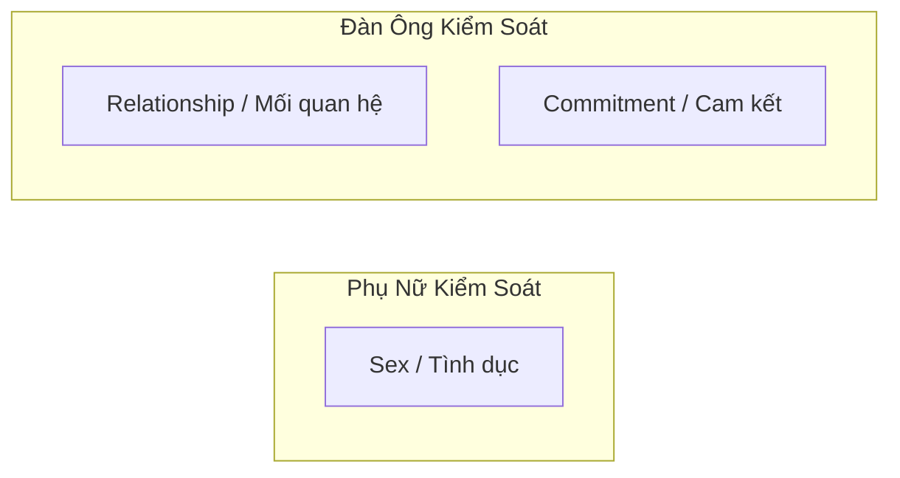
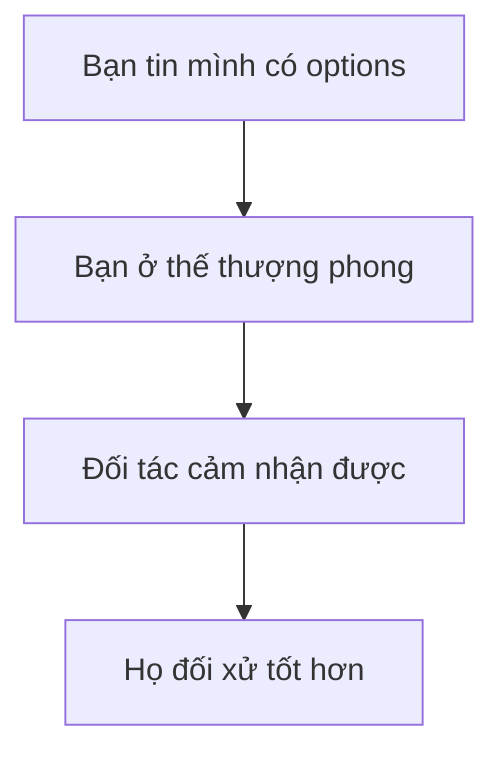
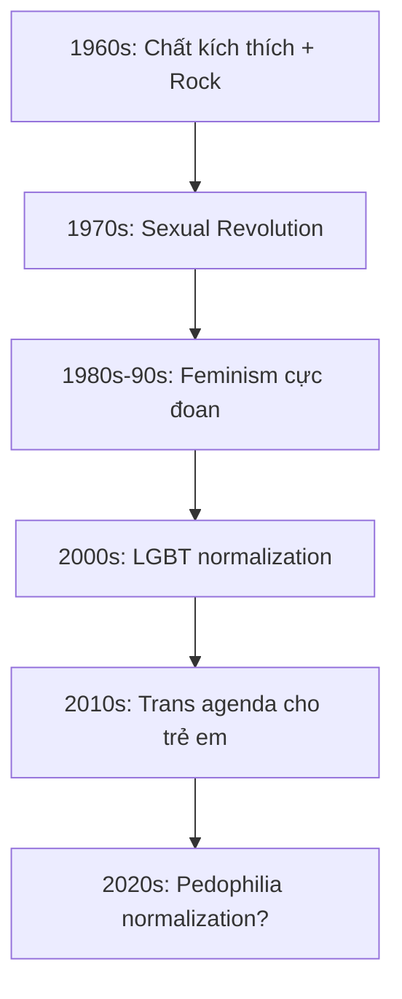
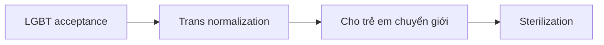
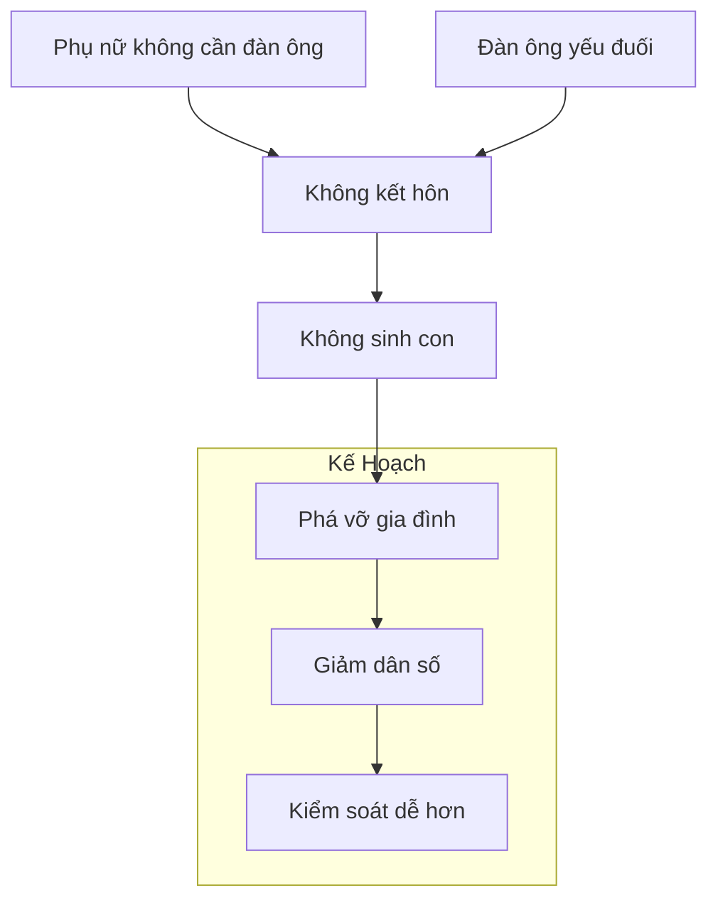

# Tâm Lý Học Tiến Hóa Về Giới Tính

Có những sự thật về tâm lý nam-nữ mà xã hội hiện đại cố tình che đậy vì "political correctness". Nhưng những pattern này được lập trình trong DNA qua hàng triệu năm tiến hóa — không biến mất chỉ vì xã hội muốn chúng biến mất.

*There are truths about male-female psychology that modern society deliberately hides for "political correctness." But these patterns are programmed into DNA through millions of years of evolution — they don't disappear just because society wants them to.*

---

## Sexual Economics — Kinh Tế Học Tình Dục

### Ai Giữ Cửa Nào? / Who Guards Which Gate?

**Phụ nữ giữ cửa tình dục** — Đàn ông có ham muốn cao hơn, nên phụ nữ quyết định ai được "vào".

*Women guard the gate of sex — Men have higher desire, so women decide who gets "in".*

**Đàn ông giữ cửa mối quan hệ** — Phụ nữ cần mối quan hệ ổn định hơn (vì lý do tiến hóa), nên đàn ông quyết định ai được commitment.

*Men guard the gate of relationships — Women need stable relationships more (for evolutionary reasons), so men decide who gets commitment.*

> Đa số đàn ông không nhận ra quyền lực này và khờ khạo đem nộp "vũ khí hạt nhân" cho đối phương.
>
> *Most men don't realize this power and naively surrender their "nuclear weapon" to the other side.*

---

## Tại Sao Phụ Nữ Cần Mối Quan Hệ Hơn? / Why Women Need Relationships More?

### Góc Nhìn Tiến Hóa / Evolutionary Perspective

Một người phụ nữ khi mang thai và nuôi con nhỏ **cực kỳ dễ bị tổn thương**:

*A woman during pregnancy and nursing is extremely vulnerable:*

- Đứa trẻ sinh ra chưa hoàn thiện (não quá lớn)
- Cần ít nhất 1 năm mới biết đi (không như ngựa/hươu chạy ngay sau sinh)
- Không thể vừa chăm con vừa tự kiếm nguồn lực sinh tồn

→ **Phụ nữ cần người bạn đời** để đảm bảo sự sống còn của mình và con cái.

*→ Women need a partner to ensure survival for themselves and their children.*

### Biểu Hiện Trong Đời Thực

| Đàn ông tụ tập nói về | Phụ nữ tụ tập nói về |
|----------------------|---------------------|
| Công việc, xe cộ | Mối quan hệ |
| Thể thao, game | Chồng, bạn trai |
| Gái đẹp | Drama xã hội |
| Tiền, đầu tư | Ai đang hẹn hò ai |

**Mối quan hệ là thứ phụ nữ bị ám ảnh** — vì đó là nhu cầu sinh tồn được lập trình.

*Relationships are what women obsess over — because it's a programmed survival need.*

---

## Quyền Lực Trong Mối Quan Hệ / Power in Relationships

### Walk Away Power — Quyền Rời Đi

> Quyền lực lớn nhất trong một mối quan hệ là **sự sẵn lòng rời bỏ nó**.
>
> *The greatest power in a relationship is the **willingness to walk away**.*

**Nghịch lý:** Phụ nữ thực sự cảm thấy hạnh phúc và bị thu hút hơn khi họ cảm thấy **có nguy cơ mất đi** người đàn ông của mình.

*Paradox: Women actually feel happier and more attracted when they feel they might lose their man.*

### Bẫy "Scarcity Mindset"

Xã hội nhồi sọ đàn ông:
- "Cô ta là tốt nhất rồi"
- "Không thể tìm ai hơn đâu"
- "Phải biết trân trọng"

→ Khiến đàn ông **sợ mất** và mất quyền lực đàm phán.

*Society brainwashes men into scarcity mindset → Makes men fear loss and lose negotiating power.*

**Sự thật:** Luôn có người khác. Thế giới có 4 tỷ phụ nữ.

*Truth: There's always someone else. The world has 4 billion women.*

---

## Giá Trị Sinh Tồn vs Giá Trị Sinh Sản

### Phân Chia Tự Nhiên / Natural Division

| | Đàn ông | Phụ nữ |
|-|---------|--------|
| **Giá trị chính** | Sinh tồn (Survival) | Sinh sản (Reproduction) |
| **Biểu hiện** | Kiếm tiền, bảo vệ, xây dựng | Ngoại hình, sức khỏe sinh sản |
| **Bất an khi** | Không có kỹ năng sinh tồn | "Giá trị sinh sản" có vấn đề |
| **Không quan tâm khi bị chê** | Già, da nhăn, eo không thon | Không biết sửa nhà, kiếm ít tiền |

### Đàn Ông và Sự Bất An Âm Ỉ

Nếu đã dọn xong "rác tâm lý" nhưng vẫn bất an → **Thiếu kỹ năng sinh tồn.**

*If you've cleared psychological baggage but still feel anxious → You lack survival skills.*

**Kỹ năng sinh tồn đàn ông cần:**
- Bảo trì nhà cửa
- Sửa chữa cơ bản (điện, nước, xe)
- Tự vệ
- Kiếm tiền độc lập
- Giải quyết vấn đề

> Phụ nữ thích nhìn đàn ông làm việc tay chân (sửa xe, làm mộc, đi dây điện). Trong mắt họ, đó là người có thể **bảo vệ và chu cấp** cho tổ ấm.
>
> *Women love watching men do manual work. In their eyes, that's someone who can protect and provide.*

---

## Nice Guy Syndrome — Hội Chứng "Trai Ngoan"

### Cách Đàn Ông Bị "Tẩy Não"

Từ nhỏ, đàn ông bị xã hội (mẹ, cô giáo, media) dạy:
- Phải hi sinh vì phụ nữ
- Không được từ chối phụ nữ
- Phải "gentleman" một chiều
- Phải cầu hôn, phải chủ động 100%

→ Sau hàng chục năm, trở thành **nice guy** — đội phụ nữ lên đầu, không dám đòi hỏi.

*After decades, becomes a nice guy — puts women on pedestal, afraid to ask for anything.*

### Bài Tập: Fair & Healthy Entitlement

**Fair:** Khi phụ nữ yêu cầu gì đó, hỏi lại: *"Rồi tôi được gì?"*

**Entitlement:** Chủ động đòi hỏi (lành mạnh).

| Tình huống | Đòi hỏi nhỏ |
|------------|-------------|
| Mua đồ ăn | "Lấy thêm tương cà cho anh" |
| Hẹn hò | "Hôm nay em làm kiểu tóc này nhé" |
| Quan hệ | Đặt tiêu chuẩn rõ ràng |

**Mục đích:** Quen với việc đòi hỏi lành mạnh. Nếu bạn không tin mình xứng đáng, bạn sẽ không bao giờ "vào frame" được.

*Purpose: Get used to healthy asking. If you don't believe you deserve it, you'll never "get in frame."*

> **Toxic Entitlement** khác: Giá trị như cc nhưng đòi hỏi trên mây. Xấu nghèo ngu nhưng đòi thiên nga.

---

## Chọn Lọc Tự Nhiên — Metaphor Về "Giống"

### Bài Học Từ Người Nuôi Chó

Người nuôi giống (breeder) chuyên nghiệp:
- Chọn lọc bố mẹ tiêu chuẩn cao
- Kiểm tra di truyền, loại bỏ bệnh
- Mỗi lứa chỉ vài con đạt chuẩn

→ **Thuần chủng = giá trị cao, khỏe mạnh, sống lâu.**

*Purebred = high value, healthy, long-lived.*

### Khi Không Chọn Lọc

Nếu để tất cả sinh sản không chọn lọc:
- F1 yếu ớt → Dùng y học giữ sống
- F2, F3 → Tiếp tục yếu đi
- F4, F5 → Tích tụ đột biến, dị tật

> Đây là metaphor về việc xã hội hiện đại **loại bỏ chọn lọc tự nhiên** bằng cách cứu sống và cho sinh sản tất cả — kết quả dài hạn là gì?
>
> *This is a metaphor about modern society removing natural selection by saving and allowing all to reproduce — what's the long-term result?*

---

## Tóm Tắt / Summary

### Những Gì Xã Hội Che Giấu

1. **Đàn ông giữ cửa commitment** — Đây là quyền lực lớn nhất
2. **Walk away power** — Sẵn sàng rời đi = thượng phong
3. **Giá trị khác nhau** — Đàn ông = sinh tồn, Phụ nữ = sinh sản
4. **Nice guy = trap** — Được thiết kế để kiểm soát đàn ông
5. **Scarcity mindset = trap** — "Cô ấy là duy nhất" là lời nói dối

### Điều Cần Làm

1. **Xây dựng kỹ năng sinh tồn** — Kiếm tiền, sửa chữa, tự vệ
2. **Có options** — Không phụ thuộc một người
3. **Đặt tiêu chuẩn** — Biết mình muốn gì và đòi hỏi lành mạnh
4. **Sẵn sàng walk away** — Quyền lực nằm ở người sẵn sàng rời đi

---

## Ma Trận và Agenda Giới Tính / The Matrix Gender Agenda

Nếu bạn hiểu tâm lý học tiến hóa, bạn sẽ thấy **xã hội hiện đại đang đi ngược lại hoàn toàn** với những gì tự nhiên lập trình. Đây có phải ngẫu nhiên?

*If you understand evolutionary psychology, you'll see modern society is going completely against what nature programmed. Is this accidental?*

### Dòng Thời Gian / Timeline

### 1. Chất Kích Thích & Văn Hóa Đại Chúng

**1960s-70s:** CIA's MK-Ultra → LSD tràn vào giới trẻ → Phong trào hippie → "Make love not war" → Phá vỡ cấu trúc gia đình truyền thống.

*CIA's MK-Ultra → LSD floods youth → Hippie movement → Breaks traditional family structure.*

**Nhạc Rock/Pop:** Được thiết kế để:
- Kích thích bản năng thấp (sex, drugs)
- Phá vỡ giá trị truyền thống
- "Sex, drugs & rock'n'roll" không phải slogan tình cờ

> Xem: [[Kiểm Soát Tâm Trí]] — Âm nhạc như công cụ lập trình

### 2. Chimera & DNA Mixing

[[Chimera]] — Khi quan hệ tình dục, **DNA được trao đổi** và lưu lại trong cơ thể.

*When having sex, DNA is exchanged and stored in the body.*

- Phụ nữ có nhiều bạn tình → Mang DNA của nhiều người đàn ông
- "Hook-up culture" được normalize → Pha loãng DNA, phá vỡ bonding
- [[S.E.X Và Tâm Lý Học Jung]] — S.E.X = Sacred Energy eXchange

**Mục đích:** Phá vỡ pair bonding tự nhiên, khiến con người khó kết nối sâu.

*Purpose: Break natural pair bonding, make deep connection difficult.*

### 3. Feminism → "Phụ Nữ Không Cần Đàn Ông"

**Wave 1-2:** Quyền bầu cử, quyền làm việc — Hợp lý.

**Wave 3-4 (hiện tại):**
- "Đàn ông là kẻ thù"
- "Phụ nữ không cần đàn ông để hạnh phúc"
- "Hôn nhân là áp bức"
- "Con cái là gánh nặng"

→ **Kết quả:** Tỷ lệ sinh giảm, gia đình tan vỡ, phụ nữ cô đơn ở tuổi 40.

*Result: Declining birth rates, broken families, lonely women at 40.*

### 4. Đàn Ông Bị Nữ Tính Hóa

Đồng thời, đàn ông bị dạy:
- "Toxic masculinity" là xấu
- Phải "nhạy cảm", "mềm mỏng"
- Không được cạnh tranh, không được aggressive
- Phải nghe lời phụ nữ trong mọi việc

→ **Kết quả:** Đàn ông yếu đuối, không có kỹ năng sinh tồn, không hấp dẫn phụ nữ (vì đi ngược bản năng tiến hóa).

*Result: Weak men, no survival skills, unattractive to women (because it goes against evolutionary instincts).*

### 5. LGBT Normalization → Trans Agenda

- **Bước 1:** LGBT là bình thường (tolerance)
- **Bước 2:** LGBT phải được celebrate
- **Bước 3:** Trẻ em có thể "chọn" giới tính
- **Bước 4:** Hormone blockers cho trẻ → **Vô sinh vĩnh viễn**

> "Nếu bạn không thể thuyết phục người lớn không sinh con, hãy nhắm vào trẻ em."

### 6. Bước Cuối: Pedophilia Normalization?

Đã có dấu hiệu:
- "MAPs" (Minor-Attracted Persons) — Rebranding pedophile
- Học giả kêu gọi "destigmatize"
- Netflix "Cuties" controversy
- Drag queen story hour cho trẻ em

**Pattern:** Mỗi thứ ban đầu bị coi là "điên rồ" → Dần được normalize → Trở thành mainstream → Ai phản đối bị gọi là "bigot".

*Pattern: Each thing starts as "crazy" → Gets normalized → Becomes mainstream → Opponents are called "bigots".*

### Mục Đích Cuối Cùng? / End Goal?

**[[Báo Cáo 2030]]** nói rõ: "You will own nothing and be happy."

Không gia đình = Không di sản = Không có gì để bảo vệ = **Dễ kiểm soát hơn.**

*No family = No legacy = Nothing to protect = Easier to control.*

> Xem thêm:
> - [[Báo Cáo 2030]] — Agenda của Elite
> - [[Elite]] — Ai đứng sau?
> - [[Kiểm Soát Tâm Trí]] — Cách thực hiện
> - [[Gen Z - Phân Tích Phản Biện]] — Thế hệ mục tiêu

---

## Lưu Ý Quan Trọng / Important Note

Bài này trình bày góc nhìn từ **tâm lý học tiến hóa** (evolutionary psychology) — không phải để ghét bỏ giới nào, mà để **hiểu cách tự nhiên hoạt động**.

*This presents an evolutionary psychology perspective — not to hate any gender, but to understand how nature works.*

Hiểu game không có nghĩa phải chơi bẩn. Mục đích là:
- Hiểu dynamics thực sự
- Không bị manipulate
- Xây dựng mối quan hệ cân bằng, tôn trọng lẫn nhau

*Understanding the game doesn't mean playing dirty. The goal is: understand real dynamics, avoid manipulation, build balanced respectful relationships.*

---

## Related

### Tâm lý học / Psychology
- [[Tâm Lý Học Jung]] — Anima/Animus
- [[Nguyên Mẫu]] — Archetypes
- [[Nhị Nguyên]] — Masculine/Feminine

### Ma Trận / Matrix
- [[Ma Trận]] — Hệ thống kiểm soát
- [[Kiểm Soát Tâm Trí]] — Mind control
- [[Điều Mà Trường Học Không Dạy Về Tiền]] — What they don't teach

### Self-improvement
- [[Individuation]] — Trở nên toàn vẹn
- [[Trí Tuệ]] — Wisdom
