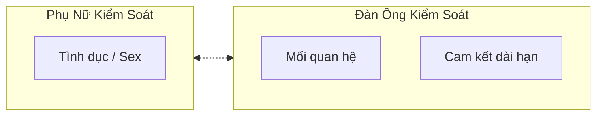
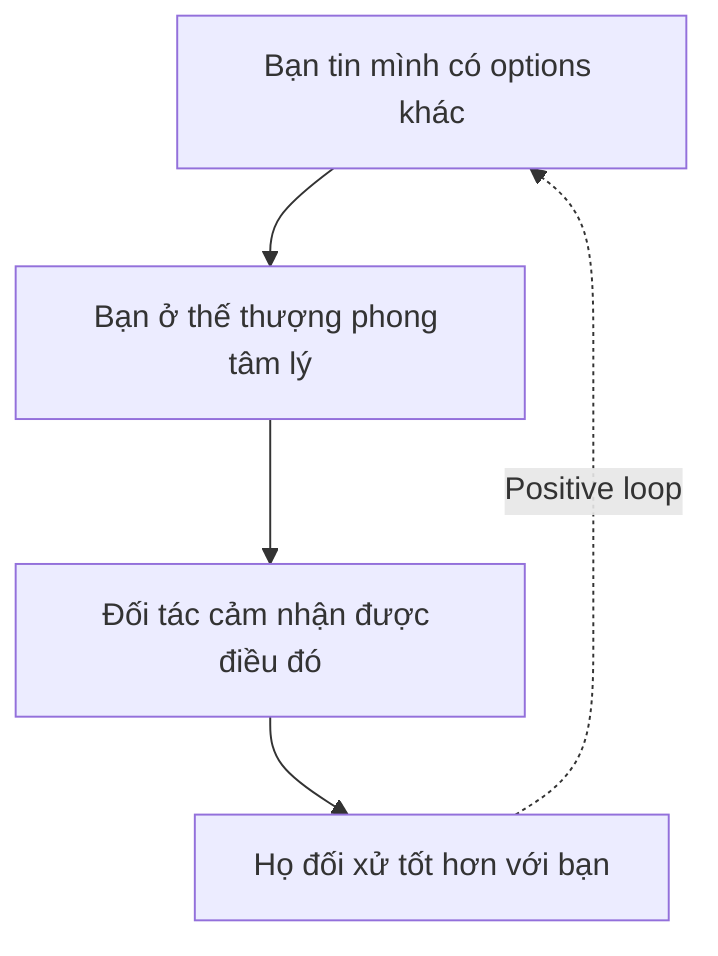
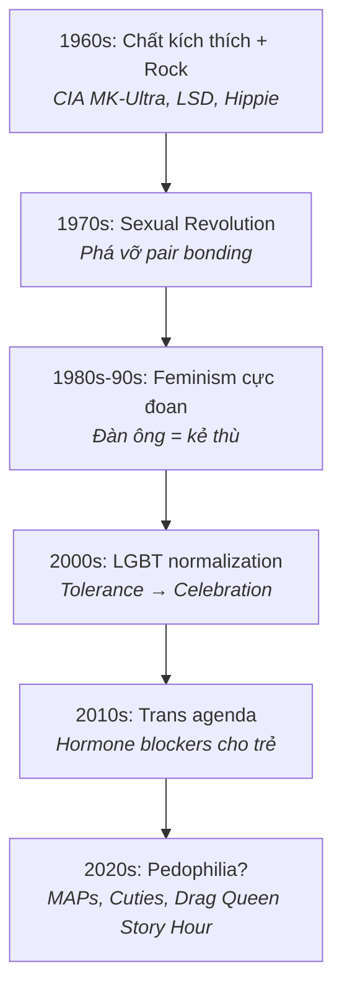
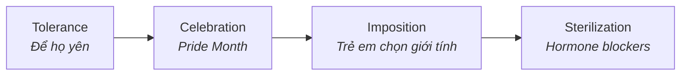
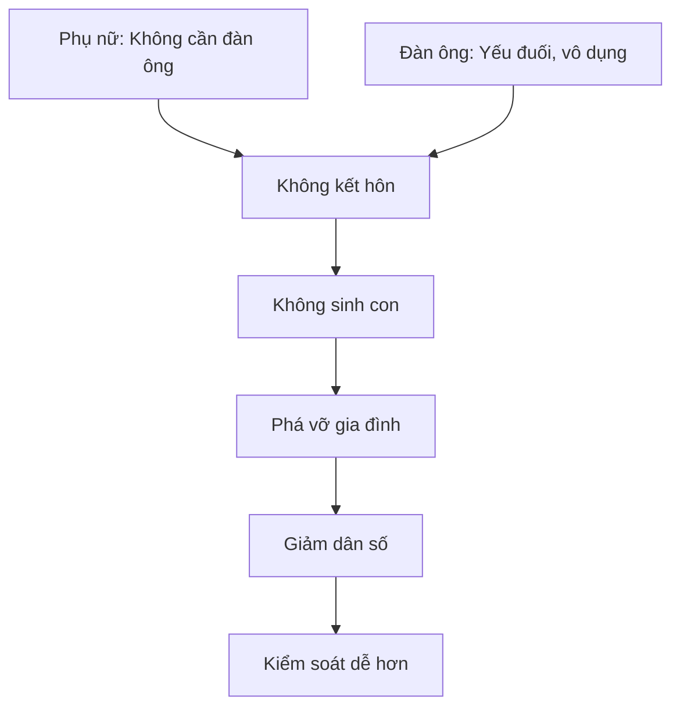

# Tâm Lý Học Tiến Hóa Về Giới Tính

Có những sự thật về tâm lý nam-nữ mà xã hội hiện đại cố tình che đậy vì "political correctness". Nhưng những pattern này được lập trình trong DNA qua hàng triệu năm tiến hóa — chúng không biến mất chỉ vì xã hội muốn chúng biến mất. *There are truths about male-female psychology that modern society deliberately hides for political correctness. But these patterns are programmed into DNA through millions of years of evolution — they don't disappear just because society wants them to.*

---

## Kinh Tế Học Tình Dục

Trong mọi mối quan hệ nam-nữ, có hai cánh cửa được canh giữ bởi hai bên khác nhau. Phụ nữ giữ cửa tình dục — bởi vì đàn ông có ham muốn cao hơn về mặt sinh học, nên phụ nữ là người quyết định ai được "vào". Ngược lại, đàn ông giữ cửa mối quan hệ và cam kết — bởi vì phụ nữ cần sự ổn định hơn vì lý do tiến hóa (mang thai, nuôi con), nên đàn ông là người quyết định ai được commitment lâu dài.

Đa số đàn ông không nhận ra quyền lực này. Họ khờ khạo đem nộp "vũ khí hạt nhân" — sự cam kết — cho đối phương ngay từ đầu, rồi thắc mắc tại sao mình không được tôn trọng. *Most men don't realize this power. They naively surrender their "nuclear weapon" — commitment — right away, then wonder why they're not respected.*

---

## Tại Sao Phụ Nữ Cần Mối Quan Hệ Hơn?

Để hiểu điều này, hãy nhìn từ góc độ tiến hóa. Một người phụ nữ khi mang thai và nuôi con nhỏ cực kỳ dễ bị tổn thương. Đứa trẻ sinh ra chưa hoàn thiện — não quá lớn so với khung chậu nên phải sinh sớm — và cần ít nhất một năm mới biết đi, không như ngựa hay hươu chạy ngay sau khi sinh. Trong giai đoạn này, người phụ nữ không thể vừa chăm con vừa tự kiếm nguồn lực sinh tồn. Cô ấy cần một người bạn đời để đảm bảo sự sống còn của mình và con cái.

Đây là lý do phụ nữ bị "ám ảnh" bởi mối quan hệ — nó được lập trình như một nhu cầu sinh tồn. Hãy quan sát: khi đàn ông tụ tập, họ nói về công việc, xe cộ, thể thao, game, tiền, đầu tư, và gái đẹp. Khi phụ nữ tụ tập, họ nói về mối quan hệ, chồng, bạn trai, drama xã hội, và ai đang hẹn hò ai. Không phải ngẫu nhiên mà phim rom-com và tiểu thuyết tình cảm hướng đến khán giả nữ, trong khi phim hành động và game chiến thuật hướng đến khán giả nam.

---

## Quyền Lực Thực Sự Trong Mối Quan Hệ

Quyền lực lớn nhất trong bất kỳ mối quan hệ nào không nằm ở vẻ đẹp, tiền bạc, hay địa vị. Nó nằm ở **sự sẵn lòng rời đi** — walk away power. *The greatest power in any relationship isn't beauty, money, or status. It's the willingness to walk away.*

Có một nghịch lý thú vị ở đây: phụ nữ thực sự cảm thấy hạnh phúc và bị thu hút hơn khi họ cảm thấy có nguy cơ mất đi người đàn ông của mình. Đây không phải manipulation — đây là tâm lý tiến hóa. Một người đàn ông có giá trị cao sẽ có nhiều lựa chọn, và việc anh ta chọn ở lại với cô ấy trở nên có ý nghĩa hơn.

Nhưng xã hội lại nhồi sọ đàn ông vào "scarcity mindset" — tư duy khan hiếm: "Cô ta là tốt nhất rồi", "Không thể tìm ai hơn đâu", "Phải biết trân trọng". Điều này khiến đàn ông sợ mất và mất hoàn toàn quyền lực đàm phán. Sự thật là: luôn có người khác. Thế giới có bốn tỷ phụ nữ.

---

## Giá Trị Sinh Tồn và Giá Trị Sinh Sản

Tự nhiên phân chia rõ ràng: đàn ông được đánh giá chủ yếu qua giá trị sinh tồn — khả năng kiếm tiền, bảo vệ, xây dựng. Phụ nữ được đánh giá chủ yếu qua giá trị sinh sản — ngoại hình, sức khỏe, khả năng sinh con. Đây không phải quan điểm cá nhân hay định kiến xã hội — đây là chương trình tiến hóa.

Bạn có thể thấy điều này qua những gì khiến mỗi giới bất an. Đàn ông bất an khi thiếu kỹ năng sinh tồn — không biết sửa chữa, kiếm ít tiền, không có khả năng bảo vệ. Phụ nữ bất an khi "giá trị sinh sản" có vấn đề — già đi, da nhăn, eo không còn thon. Ngược lại, đàn ông không quan tâm lắm khi bị chê già hay da nhăn, và phụ nữ không quan tâm lắm khi bị chê không biết sửa nhà hay kiếm ít tiền.

Nếu bạn là đàn ông đã dọn xong "rác tâm lý" nhưng vẫn cảm thấy bất an âm ỉ, rất có thể bạn đang thiếu kỹ năng sinh tồn thực sự: bảo trì nhà cửa, sửa chữa cơ bản, tự vệ, kiếm tiền độc lập, giải quyết vấn đề. Phụ nữ thích nhìn đàn ông làm việc tay chân — sửa xe, làm mộc, đi dây điện — bởi trong mắt họ, đó là dấu hiệu của người có thể bảo vệ và chu cấp cho tổ ấm.

---

## Hội Chứng "Trai Ngoan"

Từ nhỏ, đàn ông bị xã hội — mẹ, cô giáo, media — dạy rằng phải hi sinh vì phụ nữ, không được từ chối phụ nữ, phải "gentleman" một chiều, phải chủ động cầu hôn và làm tất cả. Sau hàng chục năm tẩy não, họ trở thành "nice guy" — đội phụ nữ lên đầu, không dám đòi hỏi bất cứ điều gì, và ngạc nhiên khi không được tôn trọng.

Giải pháp là học lại **Fair & Healthy Entitlement** — sự đòi hỏi lành mạnh. Khi phụ nữ yêu cầu điều gì đó, hãy hỏi lại: "Rồi tôi được gì?". Hãy chủ động đòi hỏi những thứ nhỏ: "Lấy thêm tương cà cho anh", "Hôm nay em làm kiểu tóc này nhé". Mục đích không phải để kiểm soát, mà để quen với việc tin rằng mình xứng đáng. Nếu bạn không tin mình xứng đáng, bạn sẽ không bao giờ "vào frame" được.

Tất nhiên, toxic entitlement thì khác: giá trị như cứt nhưng đòi hỏi trên mây — xấu, nghèo, ngu nhưng đòi thiên nga. Đó không phải điều chúng ta đang nói ở đây.

---

## Chọn Lọc Tự Nhiên — Bài Học Từ Người Nuôi Giống

Hãy nghĩ về những người nuôi chó chuyên nghiệp. Họ chọn lọc bố mẹ theo tiêu chuẩn cao, kiểm tra di truyền, loại bỏ bệnh, và mỗi lứa chỉ vài con đạt chuẩn được cho sinh sản tiếp. Kết quả: thuần chủng có giá trị cao, khỏe mạnh, sống lâu.

Nhưng nếu để tất cả sinh sản không chọn lọc? F1 yếu ớt, dùng y học giữ sống. F2, F3 tiếp tục yếu đi. F4, F5 tích tụ đột biến, dị tật. Đây là metaphor về việc xã hội hiện đại đang loại bỏ chọn lọc tự nhiên bằng cách cứu sống và cho sinh sản tất cả — kết quả dài hạn là gì?

---

## Ma Trận và Agenda Giới Tính

Nếu bạn hiểu tâm lý học tiến hóa, bạn sẽ thấy xã hội hiện đại đang đi ngược lại hoàn toàn với những gì tự nhiên lập trình. Câu hỏi đặt ra: đây có phải ngẫu nhiên?

### Bước Một: Phá Vỡ Hàng Rào Tinh Thần

Những năm 1960-70, chương trình MK-Ultra của CIA đưa LSD tràn vào giới trẻ. Phong trào hippie bùng nổ với slogan "Make love not war" — nghe có vẻ đẹp, nhưng kết quả là phá vỡ cấu trúc gia đình truyền thống. Nhạc Rock được thiết kế để kích thích bản năng thấp: sex, drugs, rock'n'roll không phải slogan tình cờ. Âm nhạc trở thành công cụ lập trình tần số, phá vỡ giá trị truyền thống từ bên trong. *Music became a frequency programming tool, breaking traditional values from within.*

### Bước Hai: Chimera và DNA Mixing

Theo [[Chimera]], khi quan hệ tình dục, DNA được trao đổi và lưu lại trong cơ thể. Phụ nữ có nhiều bạn tình sẽ mang DNA của nhiều người đàn ông khác nhau. "Hook-up culture" được normalize, pha loãng DNA và phá vỡ khả năng pair bonding tự nhiên. S.E.X — Sacred Energy eXchange — bị biến thành trò giải trí rẻ tiền. Mục đích: khiến con người khó kết nối sâu, khó xây dựng gia đình bền vững.

### Bước Ba: Feminism Biến Tướng

Wave 1-2 của feminism — quyền bầu cử, quyền làm việc — hoàn toàn hợp lý. Nhưng Wave 3-4 hiện tại đã biến thành thứ khác hoàn toàn: "Đàn ông là kẻ thù", "Phụ nữ không cần đàn ông để hạnh phúc", "Hôn nhân là áp bức", "Con cái là gánh nặng". Kết quả: tỷ lệ sinh giảm, gia đình tan vỡ, phụ nữ cô đơn ở tuổi 40 với đống mèo và antidepressants.

Đồng thời, đàn ông bị nữ tính hóa: "toxic masculinity" là xấu, phải "nhạy cảm" và "mềm mỏng", không được cạnh tranh, không được aggressive, phải nghe lời phụ nữ trong mọi việc. Kết quả: đàn ông yếu đuối, không có kỹ năng sinh tồn, không hấp dẫn phụ nữ — vì đi ngược hoàn toàn với bản năng tiến hóa.

### Bước Bốn: LGBT Normalization và Trans Agenda

Bước một là tolerance — "họ cũng là người, để họ yên". Bước hai là celebration — "phải tự hào, phải cắm cờ khắp nơi". Bước ba là áp đặt — "trẻ em có thể chọn giới tính từ khi 5 tuổi". Bước bốn là hormone blockers và phẫu thuật chuyển giới cho trẻ em — dẫn đến vô sinh vĩnh viễn. *If you can't convince adults not to have children, target the children directly.*

### Bước Cuối: Ranh Giới Tuổi Tác

Đã có những dấu hiệu rõ ràng. "MAPs" — Minor-Attracted Persons — là cách rebranding pedophile. Học giả bắt đầu kêu gọi "destigmatize". Netflix gây tranh cãi với "Cuties". Drag queen story hour được tổ chức cho trẻ em. Pattern lặp lại y hệt: mỗi thứ ban đầu bị coi là "điên rồ", dần được normalize, trở thành mainstream, và ai phản đối bị gọi là "bigot".

Hãy nhìn lại: hai mươi năm trước, nhiều người genuine chống LGBT và nghĩ đó là giới hạn cuối cùng. Bây giờ LGBT genuine chống pedophilia và nghĩ đó là giới hạn cuối cùng. Pattern đã lặp lại bao nhiêu lần? Ly hôn từng không thể chấp nhận — giờ bình thường. Single mothers từng là scandal — giờ bình thường. Gay marriage từng là điên rồ — giờ bình thường. Trans cho trẻ em đang được normalize. **Overton Window không tự dịch chuyển. Nó được đẩy.** *The Overton Window doesn't shift by itself. It's pushed.*

---

## Mục Đích Cuối Cùng

[[Báo Cáo 2030]] nói rõ: "You will own nothing and be happy." Không gia đình nghĩa là không di sản. Không di sản nghĩa là không có gì để bảo vệ. Không có gì để bảo vệ nghĩa là dễ kiểm soát hơn. Một cá nhân cô đơn, không gia đình, không cộng đồng, phụ thuộc hoàn toàn vào nhà nước — đó là công dân lý tưởng của [[Elite]].

---

## Deeper Layer: Waveform và Karma

Câu hỏi khó nhất là: tại sao nhiều nhóm tưởng như độc lập lại cùng push một hướng? Feminists, LGBT activists, media corporations, tech companies, universities, politicians — họ không ngồi chung một phòng họp, nhưng lại đi cùng một hướng.

Nếu dùng logic thông thường, điều này khó giải thích. Nhưng nếu consider manipulation ở cấp độ sóng và tần số — theo [[Sacred Geometry]], reality được "render" từ waveform — thì mọi thứ có ý nghĩa hơn. Manipulation ở cấp độ đó ảnh hưởng trước khi conscious mind nhận ra. Không cần "Illuminati meeting room". Chỉ cần tune đúng tần số vào collective unconscious, mọi người sẽ "tự nhiên" đi cùng hướng — và họ nghĩ đó là free will của họ.

Đây là thứ có thể gọi là **Matrix attractor**: [[Ma Trận]] không cần script từng con người hay từng campaign; nó tạo một trường hút biểu tượng khiến nhiều node độc lập cùng push về một hướng. Media, academia, policy, entertainment, dating culture và corporate branding có thể tưởng mình đang phản ứng tự nhiên với thời đại, nhưng thực ra đang bị kéo bởi cùng một grammar sâu hơn. Cơ chế này cũng xuất hiện trong [[Spectacle Ritual - World Cup, Super Bowl Và Nghi Lễ Đồng Bộ Đại Chúng|spectacle ritual]]: event, brand và symbol tự đồng bộ quanh một reality mới trước khi đa số nhận ra.

Điểm cần giữ kỷ luật: đây là pattern analysis, không phải giấy phép gom mọi cá nhân hoặc mọi nhóm xã hội vào một tội danh. Một người LGBT, feminist hay progressive bình thường không tự động là agent của agenda nào. Câu hỏi vault đặt ở tầng hệ thống: vì sao nhiều institution, incentive và narrative độc lập lại thường converge về cùng một hướng?

[[Chimera]] không chỉ là "mang DNA người khác" — nó là merge năng lượng masculine/feminine từ nhiều nguồn. Hook-up culture tạo ra DNA và energy mixing, dẫn đến Chimera, dẫn đến gender identity confused, dẫn đến LGBT spectrum mở rộng. Đây là causal mechanism, không phải coincidence.

### Karma Disclosure

Trong nhiều truyền thống huyền học, có một nguyên tắc: các thế lực phải disclose plan trước khi hành động — để không vi phạm free will. Đây là [[Karma Disclosure - Truth Hidden In Plain Sight|Karma Disclosure]] — quy luật buộc phải tiết lộ sự thật trước khi hành động. Nếu bạn được told nhưng không listen, đó là your choice. *If you're told but don't listen, that's your choice.*

Hints nằm khắp nơi: phim Hollywood với [[Predictive Programming - Cấy Tương Lai Vào Tiềm Thức|predictive programming]], sách của Elite như Brave New World và 1984, WEF public statements, Georgia Guidestones (đã bị phá), UN Agenda 21/2030. "Hiding in plain sight" không phải vì họ muốn khoe — mà vì Karma requires disclosure.

### Pattern Trong Chu Kỳ Ngàn Năm

Nếu đây là pattern, nó không mới. Sodom và Gomorrah — sexual degeneracy dẫn đến destruction. Rome cuối kỳ — bread and circus, gender confusion, decline. Weimar Germany trước khi Nazi rise. Mỗi cycle để lại hints. Người đọc được history thấy pattern. Người không đọc, repeat.

Câu hỏi không còn là "Is there a plan?" Câu hỏi là: "Who or what operates at that level?" Có thể là [[Thực Thể Cõi Trung Giới]] — astral parasites feeding on low vibration. Có thể là [[Tà Linh]] với agenda riêng. Có thể là emergent property của collective fear và desire. Hoặc tất cả cùng lúc. Chúng ta không biết chắc. Nhưng patterns are patterns. Và nếu có Karma requirement về disclosure, thì hints sẽ always be there cho người muốn thấy.

*"We wrestle not against flesh and blood, but against principalities, against powers of darkness..." — Ephesians 6:12*

---

## Tóm Tắt

Xã hội che giấu những sự thật này: đàn ông giữ cửa commitment và đây là quyền lực lớn nhất, walk away power quyết định ai thượng phong, giá trị của hai giới khác nhau về bản chất, nice guy là cái bẫy được thiết kế để kiểm soát đàn ông, và scarcity mindset là lời nói dối.

Điều cần làm: xây dựng kỹ năng sinh tồn thực sự, có options thay vì phụ thuộc một người, đặt tiêu chuẩn rõ ràng và đòi hỏi lành mạnh, sẵn sàng walk away khi cần.

Hiểu game không có nghĩa phải chơi bẩn. Mục đích là hiểu dynamics thực sự, nhận ra manipulation trước khi nó affect bạn, không bị cuốn vào agenda, xây dựng mối quan hệ cân bằng tôn trọng lẫn nhau, và quan trọng nhất — bảo vệ thế hệ sau.

---

## Related

### Sex & Energy
- [[Chimera]] — DNA và energy mixing
- [[S.E.X Và Tâm Lý Học Jung]] — Sacred Energy eXchange
- [[S.E.X]] — Bản chất năng lượng của tình dục
- [[Sự Thật Đen Tối Về Phim Khiêu Dâm]] — Porn industry

### Psychology
- [[Tâm Lý Học Jung]] — Anima/Animus
- [[Individuation]] — Con đường trở nên toàn vẹn
- [[Nguyên Mẫu]] — Archetypes
- [[Vô Thức Tập Thể]] — Collective unconscious

### Ma Trận & Control
- [[Ma Trận]] — Hệ thống kiểm soát
- [[Ma Trận - Giải Phẫu Hoàn Chỉnh]] — Deep dive
- [[Kiểm Soát Tâm Trí]] — Mind control techniques
- [[Elite]] — Ai đứng sau?
- [[Báo Cáo 2030]] — Elite agenda

### Disclosure & Programming
- [[Karma Disclosure - Truth Hidden In Plain Sight]] — Quy luật tiết lộ
- [[Predictive Programming - Cấy Tương Lai Vào Tiềm Thức]] — Hollywood programming
- [[Hollywood - Cây Đũa Phép Của Phù Thủy]] — Entertainment as magic
- [[Word Magic - Ngôn Ngữ Của Phù Thủy]] — Language manipulation

### History & Cycles
- [[Chu Kỳ Vũ Trụ — Yugas & Kalpas]] — Civilizational cycles
- [[Lịch Sử Song Song — Khi Thế Giới Đồng Bộ]] — Hidden history
