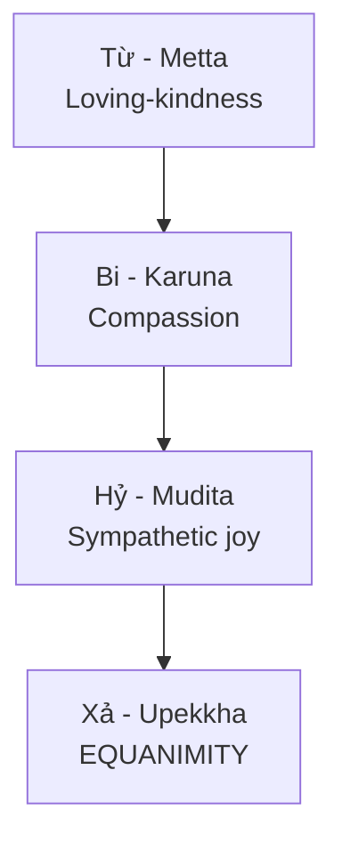

# Tâm Bất Biến (Equanimity / Upekkhā)

**Tâm Bất Biến** (Pali: Upekkhā, Sanskrit: Upekṣā) là trạng thái an trú vững vàng trước mọi biến động. Không phải thờ ơ, mà là sự tĩnh lặng sáng suốt.

*Equanimity (Pali: Upekkhā, Sanskrit: Upekṣā) is the state of remaining stable amid all fluctuations. Not indifference, but lucid stillness.*

> "You cannot control the waves, but you can learn to surf."

---

## Định Nghĩa / Definition

### Không phải là / What It's NOT

- Lạnh lùng, vô cảm / *Cold, emotionless*
- Trốn chạy, tránh né / *Avoidance, escape*
- Ức chế cảm xúc / *Suppressing emotions*
- "Không quan tâm" / *"Not caring"*

### Là / What It IS

- Nhận diện mà không bị cuốn theo / *Recognizing without being swept away*
- Quan sát mà không phản ứng tự động / *Observing without automatic reaction*
- Chấp nhận thực tại như nó là / *Accepting reality as is*
- Bình an giữa hỗn loạn / *Peace amid chaos*

---

## Trong Các Truyền Thống / Across Traditions

| Truyền thống | Thuật ngữ | Ý nghĩa |
|--------------|-----------|---------|
| **Phật giáo** | Upekkhā | Một trong Tứ Vô Lượng Tâm |
| **Khắc kỷ** | Apatheia | Tự do khỏi đam mê |
| **Hindu** | Samatva | Tâm bình đẳng |
| **Đạo giáo** | Vô Vi | Không kháng cự |

*Buddhist: Upekkhā (One of 4 Brahmaviharas). Stoic: Apatheia (Freedom from passions). Hindu: Samatva (Evenness of mind). Taoist: Wu Wei (Non-resistance).*

---

## Tứ Vô Lượng Tâm / Four Brahmaviharas

Equanimity (Xả) là đỉnh cao vì nó cho phép thực hành Từ, Bi, Hỷ mà không attachment.

*Equanimity is the culmination because it allows practicing loving-kindness, compassion, and joy without attachment.*

- Yêu thương mà không bám víu / *Love without clinging*
- Từ bi mà không kiệt sức / *Compassion without burnout*
- Hoan hỷ mà không ganh tị / *Joy without envy*

---

## Áp Dụng Thực Tế / Practical Application

### Trước Thành Công / Facing Success

- Không kiêu ngạo, biết nó vô thường / *No arrogance, knowing it's impermanent*
- Biết ơn mà không bám víu / *Gratitude without clinging*

### Trước Thất Bại / Facing Failure

- Không sụp đổ, xem như bài học / *Don't collapse, see it as a lesson*
- Điều chỉnh và tiếp tục / *Adjust and continue*

### Trước Khen / Facing Praise

- Cảm kích nhưng không phồng ego / *Appreciated, not inflated*
- Biết giá trị thật từ bên trong / *Know your worth internally*

### Trước Chê / Facing Criticism

- Lắng nghe mà không phản ứng / *Hear without reactivity*
- Đúng? Học hỏi. Sai? Buông bỏ. / *Valid? Learn. Invalid? Release.*

---

## Con Đường Đạt Tới / Path to Equanimity

### 1. Hiểu [[Nhân Quả]]

Mọi thứ đều có nguyên nhân. Không có gì ngẫu nhiên. Chấp nhận hậu quả của hành động.

*Everything has a cause. Nothing is random. Accept consequences of actions.*

### 2. Chiêm nghiệm Vô Thường

Mọi trạng thái đều qua đi — đau khổ qua, hạnh phúc cũng qua. Sao phải bám víu?

*All states pass — pain passes, pleasure passes. Why attach to either?*

### 3. Rèn luyện [[Trí Tuệ]]

Nhìn xuyên qua ảo tưởng của [[Ma Trận]]. Không bị lừa bởi vẻ bề ngoài. Phân biệt thật/giả.

*See through [[Ma Trận|Matrix]] illusions. Not fooled by appearances. Discernment.*

### 4. Thiền định

Quan sát suy nghĩ mà không dính mắc. Hơi thở làm neo. Rèn luyện không-phản-ứng.

*Observe thoughts without engaging. Breath as anchor. Practice non-reactivity.*

---

## Trong [[Individuation]]

Tâm Bất Biến là nền tảng cho quá trình Cá Thể Hóa:

*Equanimity is the foundation for the Individuation process:*

- Không bị Shadow kích hoạt / *Not triggered by Shadow*
- Không bị mắc kẹt trong Persona / *Not trapped in Persona*
- Tích hợp đối nghịch một cách bình tĩnh / *Integrate opposites calmly*
- Bản ngã thật sự xuất hiện / *True self emerges*

---

## Góc nhìn Khắc Kỷ / Stoic Perspective

### Dichotomy of Control (Nhị phân kiểm soát)

| Kiểm soát được | Không kiểm soát được |
|----------------|----------------------|
| Phản ứng của bạn | Sự kiện bên ngoài |
| Thái độ của bạn | Hành vi người khác |
| Nỗ lực của bạn | Kết quả cuối cùng |

*Focus only on what you control: your response. Let go of what you don't: external events.*

### Marcus Aurelius

> "Bạn có quyền năng trên tâm trí mình, không phải trên sự kiện bên ngoài. Nhận ra điều này, và bạn sẽ tìm thấy sức mạnh."
>
> *"You have power over your mind, not outside events. Realize this, and you will find strength."*

---

## Related

- [[Nhân Quả]] — Hiểu nhân-quả / Understanding cause-effect
- [[Trí Tuệ]] — Trí tuệ cần thiết / Wisdom required
- [[Ma Trận]] — Ảo tưởng cần nhìn xuyên qua / Illusions to see through
- [[Individuation]] — Toàn vẹn tâm lý / Psychological wholeness
- [[Luân Hồi]] — Ngữ cảnh vô thường / Impermanence context
- [[Sự Nhất Thể]] — Xả tối thượng / Ultimate equanimity
