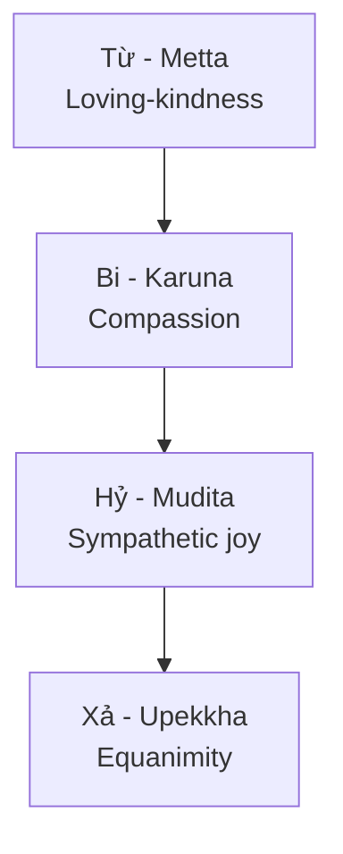

# Tâm Bất Biến (Equanimity / Upekkhā)

**Tâm Bất Biến không phải là không cảm thấy gì. Nó là khả năng cảm thấy đầy đủ mà không để cơn sóng bên trong cướp tay lái.** Người có tâm bất biến vẫn đau, vẫn thương, vẫn giận, vẫn hành động; khác biệt là họ không để phản ứng đầu tiên trở thành mệnh lệnh cuối cùng.

*Equanimity is not emotional numbness. It is the capacity to feel fully without letting the inner wave seize the wheel.*

> "You cannot control the waves, but you can learn to surf."

---

## Vault Position / Vị Trí Trong Vault

Bài này là mental model thực hành cho [[Trí Tuệ]], [[Individuation]] và đường thoát khỏi phản xạ của [[Ma Trận]]. Nếu [[Tâm bất Biến]] bị hiểu sai thành thờ ơ, nó trở thành dissociation. Nếu hiểu đúng, nó là nền thần kinh để nhìn [[Nhân Quả]], nhận Shadow, và hành động không bị kéo bởi fear/desire.

---

## Định Nghĩa / Definition

Tâm bất biến là khoảng trống tỉnh thức giữa kích thích và phản ứng. Trong khoảng trống đó, con người lấy lại quyền chọn: nói hay im, giữ hay buông, tiến hay lùi, phản đòn hay chuyển hóa.

| Không phải | Là |
|---|---|
| Lạnh lùng, vô cảm | Có cảm xúc nhưng không bị nuốt |
| Trốn chạy, tránh né | Nhìn thẳng mà không hoảng |
| Ức chế cảm xúc | Cho cảm xúc đi qua thân |
| "Không quan tâm" | Quan tâm không bám víu |

Điểm mấu chốt: tâm bất biến không làm bạn bớt người. Nó làm bạn bớt bị lập trình.

---

## Cùng Một Nguyên Lý Qua Nhiều Truyền Thống

Các truyền thống dùng ngôn ngữ khác nhau, nhưng đều chỉ về một kỹ năng: không để tâm trí bị chiếm bởi biến động.

| Truyền thống | Thuật ngữ | Nhấn mạnh |
|---|---|---|
| Phật giáo | Upekkhā / Xả | Bình đẳng tâm, không bám víu |
| Khắc kỷ | Apatheia | Tự do khỏi passion mù |
| Hindu | Samatva | Tâm quân bình trước được-mất |
| Đạo giáo | Vô Vi | Không kháng cự dòng chảy tự nhiên |

Đây là tầng fact/tradition: các thuật ngữ có bối cảnh riêng, không nên trộn thành một thứ soup tâm linh. Nhưng ở tầng pattern, chúng gặp nhau ở một điểm: **con người tự do hơn khi không bị phản ứng tự động điều khiển**.

---

## Tứ Vô Lượng Tâm / Four Brahmaviharas

Xả không phủ định Từ, Bi, Hỷ. Nó bảo vệ chúng khỏi biến dạng.

- Không có Xả, Từ dễ thành bám víu.
- Không có Xả, Bi dễ thành kiệt sức.
- Không có Xả, Hỷ dễ thành ganh tị trá hình.

Tâm bất biến là nền giữ cho tình thương không biến thành possession, lòng trắc ẩn không biến thành savior complex, và niềm vui trước thành công của người khác không bị ego làm đục.

---

## Trong Đời Thường / Practical Field

Trước thành công, tâm bất biến không tự phồng. Nó biết thành công là kết quả của nhiều nhân duyên: công sức, thời điểm, người hỗ trợ, may mắn, môi trường. Vì vậy nó biết ơn mà không nghiện applause.

Trước thất bại, tâm bất biến không tự hủy. Nó phân tích điều cần sửa, chịu phần trách nhiệm của mình, rồi tiếp tục. Thất bại trở thành data, không trở thành identity.

Trước lời khen, nó nhận mà không dính. Trước lời chê, nó nghe mà không co rúm. Nếu lời chê đúng, học. Nếu sai, buông. Nếu nửa đúng nửa sai, lấy phần đúng và không cần ghét người đưa tin.

> **Tâm bất biến không làm bạn mềm yếu. Nó làm bạn khó bị điều khiển bằng khen-chê, được-mất, sợ-hãi và tham-lam.**
>
> *Equanimity makes you harder to control through praise, blame, loss, fear, and desire.*

---

## Con Đường Rèn Luyện / Path

### 1. Hiểu [[Nhân Quả]]

Mọi trạng thái đang có đều có điều kiện sinh ra. Khi thấy nhân-duyên, ta bớt cá nhân hóa mọi thứ. Không phải để trốn trách nhiệm, mà để phản ứng đúng tỷ lệ.

### 2. Chiêm nghiệm vô thường

Đau qua. Vui qua. Danh qua. Nhục qua. Cơn sóng nào cũng tự nhận là toàn bộ đại dương khi nó đang dâng, nhưng nó vẫn là sóng. Nhớ vô thường là cách không ký hợp đồng vĩnh viễn với cảm xúc tạm thời.

### 3. Rèn [[Trí Tuệ]]

Nhìn xuyên qua [[Ma Trận]] nghĩa là thấy cách hệ thống kích hoạt phản ứng: outrage, FOMO, shame, lust, panic, tribalism. Tâm bất biến không phải rút khỏi đời; nó là firewall trước khi attention bị bán.

### 4. Thiền định và thân

Thiền không chỉ là ngồi yên. Nó là luyện nhận ra khoảnh khắc thân co lại, hơi thở gấp, bụng nóng, cổ cứng, mind muốn bắn trả. Thấy được một nhịp trước khi phản ứng là đã lấy lại chủ quyền.

---

## Trong [[Individuation]]

Không có tâm bất biến, quá trình cá thể hóa dễ thành drama tâm lý. Shadow vừa trồi lên là ta vội đổ lỗi, project, hoặc spiritual bypass. Persona bị chạm là ta diễn mạnh hơn để giữ hình ảnh.

Tâm bất biến cho phép đối diện phần tối mà không đồng nhất với nó. Nó nói: "Có giận trong mình" thay vì "mình là cơn giận"; "có sợ trong mình" thay vì "mình là nạn nhân của sợ hãi". Khoảng cách nhỏ này là cửa để tích hợp.

---

## Góc Nhìn Khắc Kỷ / Stoic Lens

Dichotomy of Control vẫn là một bảng đáng giữ vì nó là công cụ cắt nhiễu rất nhanh:

| Kiểm soát được | Không kiểm soát được |
|---|---|
| Phản ứng của bạn | Sự kiện bên ngoài |
| Thái độ của bạn | Hành vi người khác |
| Nỗ lực của bạn | Kết quả cuối cùng |
| Chất lượng chú ý | Cách đám đông diễn giải |

Điểm dễ hiểu sai: "không kiểm soát được" không có nghĩa là mặc kệ. Nó nghĩa là đừng đặt linh hồn mình vào thứ không nằm trong tay mình. Hành động hết phần của mình, nhưng không để kết quả sở hữu tâm.

---

## Bài Test / Field Test

Khi bị kích hoạt, hỏi bốn câu:

1. Đây là sự thật, hay là diễn giải đầu tiên của hệ thần kinh?
2. Phần nào nằm trong quyền hành động của mình?
3. Nếu phản ứng ngay, mình đang bảo vệ điều gì: sự thật, ego, hay nỗi sợ?
4. Một giờ nữa, một ngày nữa, một năm nữa, phản ứng nào vẫn sạch?

Nếu trả lời được chậm lại một nhịp, tâm bất biến đã bắt đầu hoạt động.

---

## Related

- [[Nhân Quả]] — Hiểu nhân-quả / Understanding cause-effect
- [[Trí Tuệ]] — La bàn của phản ứng đúng
- [[Ma Trận]] — Hệ kích hoạt phản ứng tự động
- [[Individuation]] — Toàn vẹn tâm lý / Psychological wholeness
- [[Luân Hồi]] — Ngữ cảnh vô thường
- [[Sự Nhất Thể]] — Xả tối thượng
