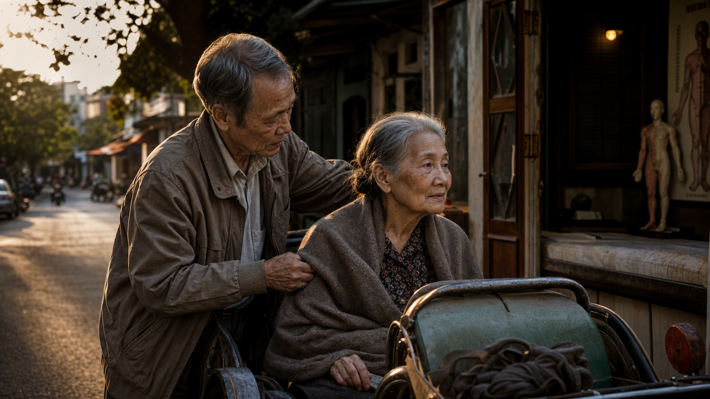

# Tình Nghĩa Là Hạ Tầng Cuối Cùng

*Có những lời hứa không còn nằm trong lời nói. Chúng nằm ở người vẫn chở người kia đi chữa bệnh khi đời đã hết aesthetic.*

Tình nghĩa vợ chồng thiêng liêng không nằm ở ảnh cưới, lễ cưới, caption đẹp, hay những lời hứa lúc cả hai còn khỏe.

Nó hiện ra trong những cảnh rất thô.

Một người mổ mắt cườm, không thấy gì, người kia chăm từng ngày.

Một người đột quỵ nằm liệt giường, người kia chở đi châm cứu bằng xe ba bánh.

Con cái lớn lên, bận làm ăn, mắc kẹt trong business, nợ, shophouse, thanh khoản, survival riêng của đời mình. System không dừng lại vì nhà có người bệnh. Tiền vẫn cần chạy. Deadline vẫn đến. Thị trường vẫn lạnh.

Và giữa tất cả những thứ đó, vẫn còn một người chở người kia đi chữa bệnh.

Đó là chỗ chữ “thiêng” bắt đầu có nghĩa.

Không phải romantic.

Thiêng vì nó vượt qua giao dịch.

Thiêng vì nó còn ở đó khi người kia không còn đẹp, không còn khỏe, không còn hữu dụng, không còn làm mình feel alive.

Thiêng vì nó là một dạng đạo rất bình dân: không nói nhiều, không post quote, không cần chứng minh.

Chỉ là: tao vẫn đưa mày đi.

## Covenant Không Phải Subscription

Văn hóa hiện đại thích biến quan hệ thành một dạng subscription.

Không hợp thì cancel.

Chán thì đổi plan.

Thấy option tốt hơn thì upgrade.

Cảm thấy không còn “serve my growth” thì unsubscribe.

Nhưng hôn nhân thật không phải SaaS.

Nó gần với covenant hơn contract.

Contract hỏi: hai bên đang được gì?

Covenant hỏi: khi một bên không còn trả lại được gì, bên kia có còn ở đó không?

Đây không phải lời kêu gọi ở lại trong bạo hành. Có những cuộc hôn nhân độc hại cần rời đi. Có những nơi loyalty chỉ là cái tên đẹp của trauma bond, kiểm soát, sợ hãi và nhục mạ. Không nên dùng chữ “hy sinh” để bắt một người tiếp tục bị nghiền nát.

Nhưng cũng có một sự thật khác: nếu mọi khó chịu đều bị đọc thành red flag, mọi giai đoạn chán đều bị đọc thành hết yêu, mọi hấp dẫn bên ngoài đều được gọi là “tôi xứng đáng hơn”, thì sẽ không còn ai đủ sức đi cùng nhau qua bệnh viện.

Hôn nhân lúc trẻ dễ bị hiểu thành câu hỏi:

- người này có làm mình hạnh phúc không?
- người này có còn hấp dẫn không?
- người này có đủ giàu, đủ đẹp, đủ thú vị không?
- người này có làm mình cảm thấy mình là phiên bản tốt hơn không?

Nhưng hôn nhân lúc già hỏi câu khác:

- ai nhớ lịch thuốc?
- ai đợi ngoài phòng khám?
- ai lau người khi thân thể mất dignity?
- ai chịu mùi bệnh?
- ai không ghê phần tàn tạ của mình?
- ai không tính ROI của từng ngày chăm sóc?

Đến một tuổi nào đó, thứ đắt nhất không phải người làm mình phấn khích.

Thứ đắt nhất là người không bỏ chạy khỏi phần đang hư của mình.

## Dopamine Market Và Sự Phản Bội Nhẹ Nhàng

Đây là nơi note này nối trực tiếp với [[Tâm Lý Học Tiến Hóa Về Giới Tính]]. Hypergamy, novelty-seeking, sexual selection và pair bonding không biến mất trong xã hội hiện đại; chúng được thị trường hóa, gamify và khuếch đại qua app, status signal, porn, dating culture và attention economy.

[[Dopamine Economy - Nền Kinh Tế Của Sự Thèm Muốn|Dopamine economy]] không chỉ nằm trong app, game, porn, shopping hay short video.

Nó cũng tái cấu trúc cách con người hiểu tình yêu.

Con gái bị kéo vào hypergamy vô thức:

- ai high status hơn?
- ai có tài nguyên hơn?
- ai làm mình thấy mình đang “level up”?
- ai cho mình cảm giác mình xứng đáng hơn đời hiện tại?

Con trai bị kéo vào novelty vô thức:

- ai mới hơn?
- ai dễ hơn?
- ai làm mình thấy mình còn săn được?
- ai cho mình dopamine của conquest mà không cần responsibility?

Cả hai tưởng mình đang “chọn tốt hơn”. Nhiều khi chỉ là nervous system bị thị trường hóa.

Dating app, social media, porn, flex culture, easy DM, attention economy và lifestyle comparison biến hôn nhân từ covenant thành marketplace.

Trong marketplace, loyalty nhìn giống thiếu option.

Hy sinh nhìn giống self-abandonment.

Chịu đựng nhìn giống ngu.

Gia đình nhìn giống burden.

Dục vọng được gọi là freedom.

Hypergamy được gọi là standards.

Bỏ chạy được gọi là healing.

Một lần nữa, cần phân biệt: có những nơi rời đi là đúng. Nhưng nếu toàn bộ văn hóa chỉ tôn thờ exit, thì capacity ở lại sẽ teo đi.

Và khi capacity ở lại teo đi, con người mất một loại cơ bắp tâm linh rất quan trọng: khả năng chịu đựng có ý nghĩa.

## Care Work Là Cơ Sở Hạ Tầng Vô Hình

[[Care Economy Và Cách Ma Trận Làm Rỗng Gia Đình]] nói rằng care không chỉ là tình cảm. Care là hạ tầng vô hình giữ một gia đình còn là gia đình.

Ai nấu cơm?

Ai nhớ thuốc?

Ai để ý người kia hôm nay nói ít hơn bình thường?

Ai biết bệnh viện nào, bác sĩ nào, đường nào ít xóc?

Ai ngồi chờ khi thủ tục chạy chậm?

Ai không biến người bệnh thành một project cần quản lý cho xong?

Thị trường có thể bán lại một phần care dưới dạng dịch vụ: điều dưỡng, viện dưỡng lão, app nhắc thuốc, bảo hiểm, xe cấp cứu, therapy, personal assistant.

Những thứ đó có giá trị. Không nên phủ nhận.

Nhưng có một tầng care không outsource được hoàn toàn: tầng người kia biết lịch sử của mình.

Một nhân viên chăm sóc có thể chuyên nghiệp hơn. Nhưng họ không nhớ mình từng là ai trước khi bệnh.

Một app có thể nhắc uống thuốc đúng giờ. Nhưng nó không nhìn thấy sự xấu hổ trong mắt người già khi họ phải nhờ người khác đỡ dậy.

Một clinic có thể làm đúng quy trình. Nhưng nó không phải người đã đi với mình qua mấy chục năm cãi nhau, nuôi con, thiếu tiền, bệnh tật, cơm nước, thất vọng, rồi vẫn còn ở đây.

Đây là lý do gia đình khỏe mạnh là infrastructure, không chỉ sentiment.

Nó là lớp bảo hiểm không nằm trong hợp đồng.

Nó là memory layer của con người.

Nó là nơi một người còn được nhìn như toàn bộ đời sống của họ, không chỉ như ca bệnh, khách hàng, user, hay burden.

## Về Già Mới Biết Tình Yêu Có Thật Không

Eros rất mạnh, nhưng eros không đủ dài.

Dopamine rất sáng, nhưng dopamine tắt nhanh.

Status rất hấp dẫn, nhưng status không đẩy xe lăn.

Tiền rất cần, nhưng tiền không tự ngồi cạnh giường bệnh.

Về già, câu hỏi không phải ai làm mình thấy trẻ lại.

Câu hỏi là ai vẫn ở đó khi mình không còn trẻ.

Không phải ai “đúng gu”.

Mà là ai còn nhớ đường tới phòng châm cứu.

Không phải ai làm mình feel alive.

Mà là ai vẫn ở đó khi mình feel like dying.

Có một dạng tình yêu chỉ lộ ra khi đời hết aesthetic.

Khi body xuống cấp.

Khi tiền kẹt.

Khi con cái không thể có mặt đủ.

Khi system lạnh.

Khi một người thành gánh nặng.

Nếu người kia vẫn chở đi, đó là một loại câu trả lời.

Không phải câu trả lời bằng lời.

Bằng hành động.

## Ma Trận Ghét Những Hạ Tầng Không Trung Gian

[[Ma Trận]] thích mọi thứ đi qua trung gian: app, nền tảng, subscription, institution, service provider, dashboard, claim, score, matching algorithm.

Một gia đình có nghĩa tình thật là thứ khó quản trị hơn.

Vì nó chứa trust không cần app.

Nó chứa memory không nằm trên cloud.

Nó chứa obligation không phải legal contract.

Nó chứa một loại loyalty không dễ monetize.

Nếu một người còn có gia đình thật, họ không hoàn toàn trôi nổi trong thị trường. Họ còn một nơi để rơi về, một người để gọi, một ký ức để được giữ, một obligation để không tự biến mình thành consumer thuần túy.

Không gia đình, mọi pain đều cần mua dịch vụ.

Cô đơn cần app.

Tuổi già cần package.

Bệnh tật cần policy.

Buồn cần therapy.

Con cái cần platform.

Người già cần facility.

Dĩ nhiên xã hội hiện đại cần dịch vụ. Nhưng nếu dịch vụ thay thế hoàn toàn nghĩa tình, con người sẽ sống trong một mạng lưới tiện ích rất dày mà bên trong vẫn lạnh.

Đây là câu hỏi của thời đại: cái gì còn đứng cạnh mình khi mình không còn là một user tốt?

## Tình Nghĩa Là Hạ Tầng Cuối Cùng

Khi tiền kẹt, health sập, con cái bận, market lạnh, system quá tải, thì thứ giữ một con người khỏi rơi xuống đáy đôi khi không phải triết lý lớn.

Là một người còn ở đó.

Một người nhớ lịch thuốc.

Một người chở đi châm cứu.

Một người không bỏ đi khi thân thể mình thành gánh nặng.

Một người từng cãi nhau cả đời, nhưng đến cuối vẫn không nỡ để mình nằm một mình.

Đó là hạ tầng cuối cùng.

Không scalable.

Không sexy.

Không viral.

Không optimized.

Nhưng khi mọi infrastructure khác lạnh đi, nó là thứ còn giữ hơi người trong đời sống.

> Tình nghĩa thật không hỏi người kia còn làm mình hạnh phúc không.  
> Nó hỏi: khi người kia không còn làm được gì cho mình, mình có còn nhận ra họ là người của mình không?
