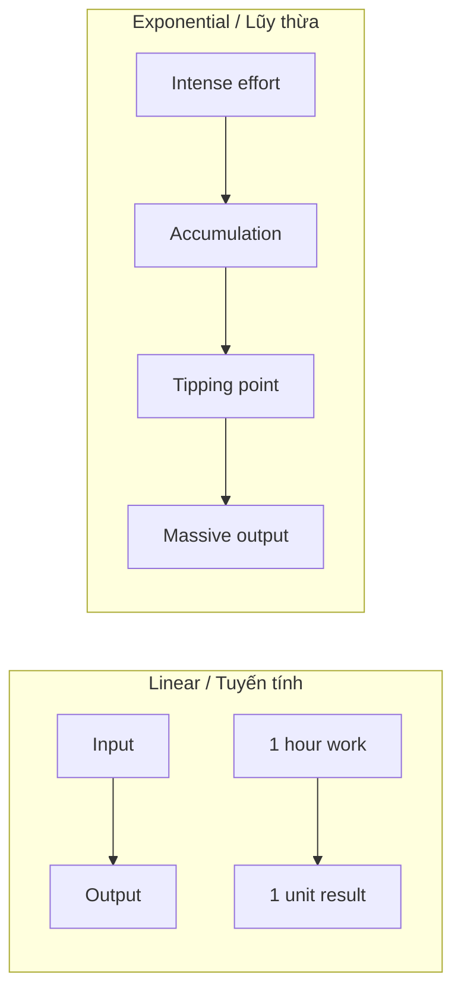
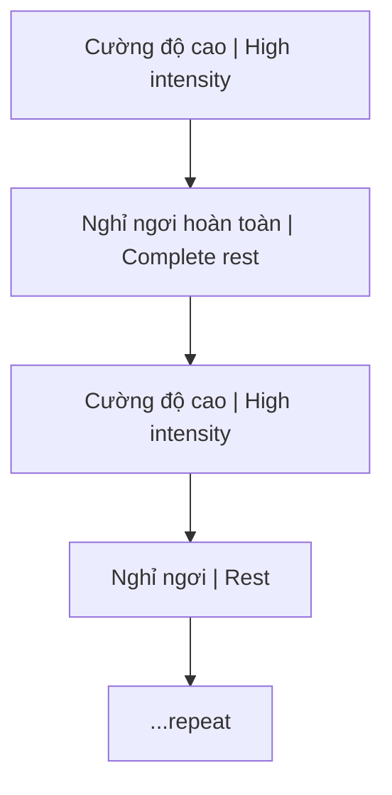
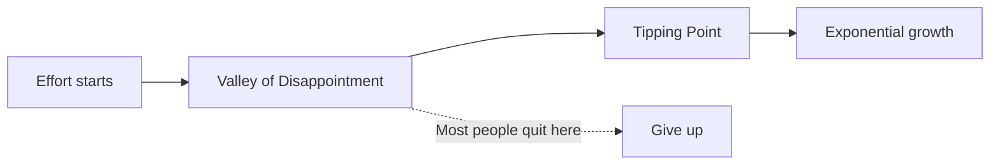

# Tư Duy Lũy Thừa (Exponential Thinking)

**Tư duy lũy thừa là khả năng nhìn thấy giai đoạn tích lũy vô hình trước khi kết quả bùng nổ.** Nó chống lại ảo giác tuyến tính của trường học, công sở và dopamine economy: làm một chút, nhận một chút, thấy thưởng ngay. Những kết quả đột phá thường đến từ cường độ đúng, hệ thống đúng, thời gian đủ dài, rồi một điểm bẻ cong.

*Exponential thinking is the ability to see invisible accumulation before visible breakthrough. It rejects the linear illusion of immediate input-output rewards.*

---

## Vault Position / Vị Trí Trong Map

Trong vault, đây là một [[Mental Model]] nền cho học tập, wealth, sức khỏe và [[Individuation]]. Nó nối với [[Thông Minh vs Trí Tuệ]] vì thông minh thường muốn kết quả ngay, còn trí tuệ biết đợi compounding. Nó cũng đối lập với [[Dopamine Economy - Nền Kinh Tế Của Sự Thèm Muốn]]: hệ thống nghiện thưởng nhanh làm con người bỏ cuộc ngay trước điểm bùng phát.

*This model links learning, wealth, health, and individuation. It is a discipline against short-cycle dopamine rewards.*

---

## Tổng Quan / Overview

---

## Các Khái Niệm Cốt Lõi / Core Concepts

### 1. Tính Phi Tuyến Tính / Non-linearity

Đây là nguyên tắc nền tảng: mối quan hệ giữa **đầu vào** (Input - công sức, thời gian) và **kết quả** (Outcome - thành tựu, kiến thức) không phải là một đường thẳng.

*This is the foundational principle: the relationship between input (effort, time) and outcome (achievements, knowledge) is not a straight line.*

Cùng một lượng thời gian có thể tạo ra kết quả khác nhau hoàn toàn nếu cấu trúc khác nhau. Một tảng đá 1kg không giống năm hòn 0.2kg vì lực tập trung khác. Mười năm làm công lặp lại không giống mười năm build business vì leverage khác. Một giờ học sâu không giống một giờ scroll tutorial vì feedback loop khác.

Tư duy tuyến tính hỏi: "Tôi bỏ vào bao nhiêu giờ?" Tư duy lũy thừa hỏi: "Tôi đang xây hệ thống nào, feedback nào, leverage nào, và điểm bùng phát nằm ở đâu?"

### 2. Phương Pháp Rèn Luyện / Training Method

Thay vì đều đều một cách buồn ngủ, hãy dùng nhịp **sprint - recovery - integration**. Sprint tạo áp lực vượt ngưỡng. Recovery cho hệ thần kinh và tiềm thức sắp xếp lại. Integration biến effort thành pattern, không chỉ thành mệt mỏi.

*Use sprint - recovery - integration. Sprint creates threshold pressure; recovery lets the system reorganize; integration turns effort into pattern.*

**Ví dụ thực tế / Practical examples:**
- Dịch 5 trang sách tiếng Anh chuyên ngành khó mỗi sáng sớm
- Xem 3-4 video học thuật dài mỗi ngày trong một tháng

*Translate 5 pages of difficult English technical books each early morning; watch 3-4 long academic videos daily for a month.*

Đây là những "quả tạ nặng" giúp não bộ bứt phá giới hạn. Nhưng cường độ cao không có nghĩa là tự hủy. Nếu không có recovery, bạn chỉ đang đổi compounding lấy burnout.

*These are "heavy weights" that help the brain break through limits.*

### 3. Thung Lũng Tích Lũy / Valley of Accumulation

Giai đoạn khó khăn nhất — từ khái niệm "Valley of Disappointment" của James Clear (*Atomic Habits*).

*The hardest phase — from James Clear's "Valley of Disappointment" concept (Atomic Habits).*

Trong thung lũng này, nỗ lực cao nhưng kết quả chưa hiện rõ. Người ngoài nghi ngờ vì họ chỉ thấy surface. Bản thân bạn cũng nghi ngờ vì não quen đo tiến bộ bằng tín hiệu ngắn hạn. Đây là lúc cần evidence nội bộ: số giờ deep work, số bài đã đọc, số lần feedback, số lỗi đã sửa, số pattern bắt đầu lặp lại.

*In the valley, effort is high but visible results are weak. You need internal evidence: deep work hours, feedback loops, corrected errors, repeated patterns.*

### 4. Bước Ngoặt / Tipping Point

Thời điểm bạn thoát khỏi thung lũng — các mảnh kiến thức rời rạc **bỗng nhiên kết nối** với nhau.

*The moment you escape the valley — scattered knowledge fragments suddenly connect.*

Trước tipping point, bạn có mảnh rời: khái niệm, ví dụ, lỗi, trải nghiệm. Sau tipping point, chúng thành mạng lưới. Confusion chuyển thành clarity. Bước chậm chuyển thành bước nhảy. Không phải vì vũ trụ đột nhiên thưởng bạn; vì hệ thống bên trong đã đủ node để tự nối.

Đối với người ngoài, đây trông giống như "thành công sau một đêm" — nhưng thực chất là kết quả của quá trình tích lũy dài.

*To outsiders, this looks like "overnight success" — but it's actually the result of long accumulation.*

### 5. Sự Kiên Nhẫn / Patience

Thời gian là thành phần không thể thiếu. Mọi nỗ lực cần thời gian để "ngấm".

*Time is an essential component. All effort needs time to "marinate."*

**Minh họa / Illustrations:**

| Metaphor | Ý nghĩa / Meaning |
|----------|-------------------|
| **Cây tre Trung Quốc** | 5 năm phát triển rễ dưới đất, rồi vươn 90 feet trong vài tuần / 5 years root growth underground, then 90 feet in weeks |
| **Thợ đập đá** | 100 nhát không có gì, nhát 101 vỡ đá — nhờ công 100 nhát trước / 100 strikes nothing, 101st breaks rock — thanks to previous 100 |

**Bài học:** Từ bỏ tư duy "ăn sẵn". Sau khi nỗ lực hết mình, việc khó nhất là **kiên nhẫn chờ đợi**.

*Lesson: Abandon "instant gratification" mindset. After giving your all, the hardest part is patiently waiting.*

---

## Ứng Dụng Thực Tế / Practical Application

| Lĩnh vực / Area | Linear Trap | Exponential Approach |
|-----------------|-------------|----------------------|
| **Học tập** | Học đều đều 1h/ngày | Sprint sessions, deep work blocks |
| **Đầu tư** | Gửi tiết kiệm lãi suất thấp | Compound interest, asymmetric bets |
| **Kinh doanh** | Đổi thời gian lấy tiền | Build systems, leverage |
| **Sức khỏe** | Cardio nhẹ mỗi ngày | HIIT, progressive overload |

Bảng này chỉ là bản đồ nhanh. Nguyên tắc sâu hơn là: tìm nơi effort có thể tích lũy thay vì reset mỗi ngày. Học tập tích lũy khi nó tạo framework. Đầu tư tích lũy khi vốn, kiến thức và risk discipline cùng tăng. Kinh doanh tích lũy khi hệ thống bán, vận hành và phân phối không phụ thuộc hoàn toàn vào một người. Sức khỏe tích lũy khi cơ thể nhận đủ stress để thích nghi, nhưng đủ recovery để không vỡ.

---

## Evidence Discipline / Kỷ Luật Chứng Cứ

Đừng dùng "lũy thừa" như thần chú self-help. Không phải mọi thứ đều compound. Thói quen xấu cũng compound. Nợ cũng compound. Sai lầm không được sửa cũng compound. Muốn biết một hệ có lũy thừa thật hay không, hỏi bốn câu:

1. Kết quả hôm nay có làm ngày mai dễ hơn không?
2. Skill có tái sử dụng được trong nhiều bối cảnh không?
3. Feedback có đủ nhanh để sửa lỗi trước khi lỗi phình to không?
4. Hệ thống có recovery để tránh burnout không?

Nếu câu trả lời là không, bạn không đang compound. Bạn chỉ đang lặp lại.

---

## Related / Liên quan

- [[Thông Minh vs Trí Tuệ]] — Trí tuệ biết chờ đợi, thông minh muốn kết quả ngay
- [[Individuation]] — Quá trình phát triển cũng phi tuyến tính
- [[Ma Trận]] — Hệ thống thiết kế để giữ bạn trong linear trap
---

## Compounding Cần Sống Sót

[[Giữ Tiền Quan Trọng Hơn Kiếm Tiền]] là ứng dụng thực chiến của mental model này trong tài chính: giữ vốn, chống dopamine, tránh leverage và sống sót trước khi tìm upside.

