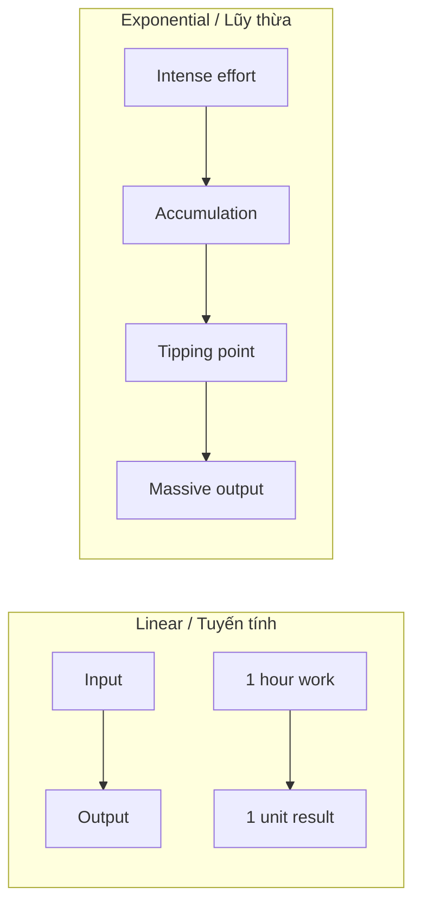
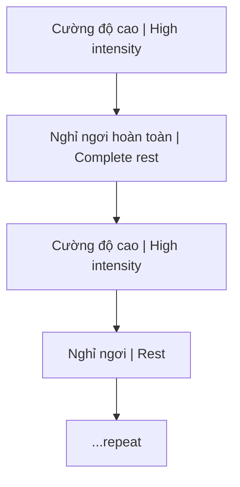
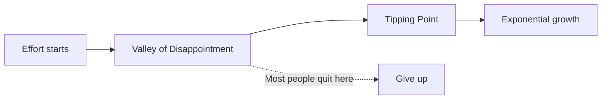

# Tư Duy Lũy Thừa (Exponential Thinking)

Bài viết trình bày một triết lý về học tập và phát triển bản thân dựa trên nguyên tắc tăng trưởng theo hàm mũ thay vì tuyến tính. Những kết quả đột phá không đến từ nỗ lực đều đặn, nhẹ nhàng mà đến từ những đợt nỗ lực cường độ cao, vượt ngưỡng, theo sau là sự tích lũy và kiên nhẫn chờ đợi điểm bùng phát.

*This article presents a philosophy of learning and self-development based on exponential rather than linear growth. Breakthrough results don't come from steady, gentle effort but from high-intensity bursts that exceed thresholds, followed by accumulation and patient waiting for the inflection point.*

---

## Tổng Quan / Overview

---

## Các Khái Niệm Cốt Lõi / Core Concepts

### 1. Tính Phi Tuyến Tính / Non-linearity

Đây là nguyên tắc nền tảng: mối quan hệ giữa **đầu vào** (Input - công sức, thời gian) và **kết quả** (Outcome - thành tựu, kiến thức) không phải là một đường thẳng.

*This is the foundational principle: the relationship between input (effort, time) and outcome (achievements, knowledge) is not a straight line.*

| Ví dụ / Example | Giải thích / Explanation |
|-----------------|-------------------------|
| Ném 1 tảng đá 1kg vs 5 hòn 0.2kg | 1 tảng gây sát thương lớn hơn / One rock causes more damage |
| Công ăn lương vs Kinh doanh | Linear vs exponential potential |
| 10 năm làm nhân viên vs 10 năm build business | Same time, vastly different outcomes |

### 2. Phương Pháp Rèn Luyện / Training Method

Thay vì chạy marathon (đều đặn, tà tà), làm việc như **sư tử săn mồi** — chạy nước rút rồi nghỉ ngơi.

*Instead of running a marathon (steady, slow), work like a **hunting lion** — sprint then rest.*

**Ví dụ thực tế / Practical examples:**
- Dịch 5 trang sách tiếng Anh chuyên ngành khó mỗi sáng sớm
- Xem 3-4 video học thuật dài mỗi ngày trong một tháng

*Translate 5 pages of difficult English technical books each early morning; watch 3-4 long academic videos daily for a month.*

Đây là những "quả tạ nặng" giúp não bộ bứt phá giới hạn.

*These are "heavy weights" that help the brain break through limits.*

### 3. Thung Lũng Tích Lũy / Valley of Accumulation

Giai đoạn khó khăn nhất — từ khái niệm "Valley of Disappointment" của James Clear (*Atomic Habits*).

*The hardest phase — from James Clear's "Valley of Disappointment" concept (Atomic Habits).*

| Đặc điểm / Characteristic | Mô tả / Description |
|---------------------------|---------------------|
| **Nỗ lực cao** | Bạn đang làm việc cực kỳ chăm chỉ |
| **Kết quả chưa thấy** | Gần như không có progress rõ ràng |
| **Áp lực xã hội** | Người khác nghi ngờ, phán xét |
| **Tâm thế cần có** | "Don't give a fuck" — kiên nhẫn tuyệt đối |

*High effort but no visible results. Others doubt you. Required mindset: absolute patience, ignore external judgment.*

### 4. Bước Ngoặt / Tipping Point

Thời điểm bạn thoát khỏi thung lũng — các mảnh kiến thức rời rạc **bỗng nhiên kết nối** với nhau.

*The moment you escape the valley — scattered knowledge fragments suddenly connect.*

| Trước / Before | Sau / After |
|----------------|-------------|
| Mảnh kiến thức rời rạc / Scattered fragments | Mạng lưới hiểu biết / Knowledge network |
| Confusion | Clarity |
| Từng bước chậm / Slow steps | Bước nhảy vọt / Quantum leap |

Đối với người ngoài, đây trông giống như "thành công sau một đêm" — nhưng thực chất là kết quả của quá trình tích lũy dài.

*To outsiders, this looks like "overnight success" — but it's actually the result of long accumulation.*

### 5. Sự Kiên Nhẫn / Patience

Thời gian là thành phần không thể thiếu. Mọi nỗ lực cần thời gian để "ngấm".

*Time is an essential component. All effort needs time to "marinate."*

**Minh họa / Illustrations:**

| Metaphor | Ý nghĩa / Meaning |
|----------|-------------------|
| **Cây tre Trung Quốc** | 5 năm phát triển rễ dưới đất, rồi vươn 90 feet trong vài tuần / 5 years root growth underground, then 90 feet in weeks |
| **Thợ đập đá** | 100 nhát không có gì, nhát 101 vỡ đá — nhờ công 100 nhát trước / 100 strikes nothing, 101st breaks rock — thanks to previous 100 |

**Bài học:** Từ bỏ tư duy "ăn sẵn". Sau khi nỗ lực hết mình, việc khó nhất là **kiên nhẫn chờ đợi**.

*Lesson: Abandon "instant gratification" mindset. After giving your all, the hardest part is patiently waiting.*

---

## Ứng Dụng Thực Tế / Practical Application

| Lĩnh vực / Area | Linear Trap | Exponential Approach |
|-----------------|-------------|----------------------|
| **Học tập** | Học đều đều 1h/ngày | Sprint sessions, deep work blocks |
| **Đầu tư** | Gửi tiết kiệm lãi suất thấp | Compound interest, asymmetric bets |
| **Kinh doanh** | Đổi thời gian lấy tiền | Build systems, leverage |
| **Sức khỏe** | Cardio nhẹ mỗi ngày | HIIT, progressive overload |

---

## Related / Liên quan

- [[Thông Minh vs Trí Tuệ]] — Trí tuệ biết chờ đợi, thông minh muốn kết quả ngay
- [[Individuation]] — Quá trình phát triển cũng phi tuyến tính
- [[Ma Trận]] — Hệ thống thiết kế để giữ bạn trong linear trap
