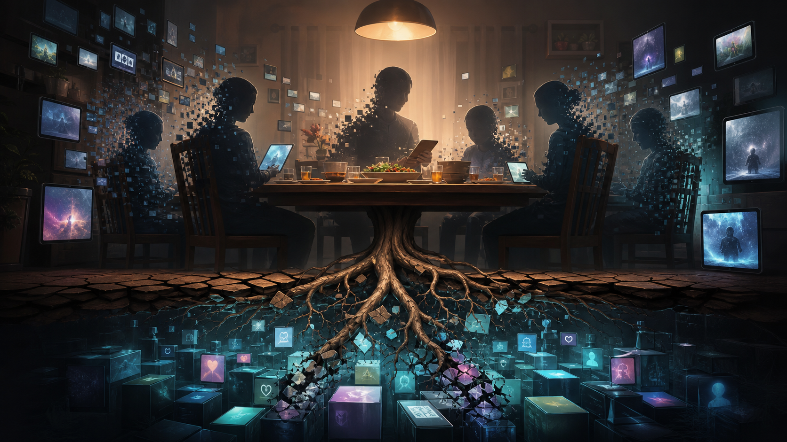
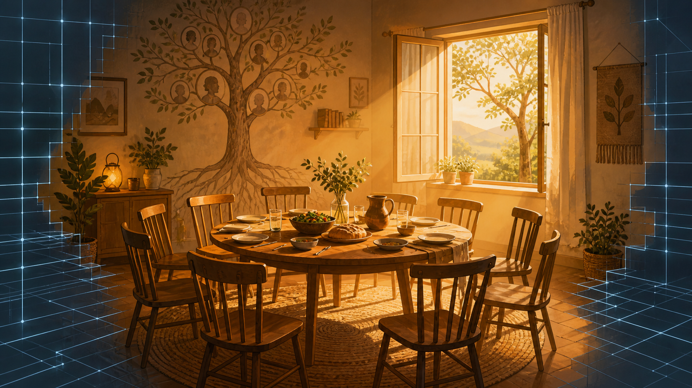

# Từ Lớp Học Đến Bảng Lương - Ma Trận Thu Hoạch Loosh Như Thế Nào

> Con người không tự nhiên lớn lên rồi đi làm. Họ được nuôi, dạy, xếp hàng, chấm điểm, tách khỏi connection thật, huấn luyện ham muốn, rồi đưa vào một hệ thống nơi mỗi mức thu nhập là một kiểu đau khác nhau. Tiền không chỉ là con số. Tiền là tầng áp suất của Ma Trận.

Video của Bin Tài Chính về cuộc sống ở các mức thu nhập là một cửa vào tốt: 5 triệu, 15 triệu, 50 triệu, 100 triệu, 500 triệu. Nhưng nếu chỉ đọc nó như tài chính cá nhân, bài học sẽ dừng ở mức “kiếm nhiều hơn, quản lý tốt hơn, đừng lifestyle inflation”. Đúng, nhưng chưa đủ đau.

Câu hỏi sâu hơn là: vì sao con người lại bị đưa vào một ladder nơi tầng nào cũng có một loại lo âu riêng? Vì sao khi hết đau vì thiếu tiền, ta lại đau vì status, debt, kỳ vọng, cô đơn, mất thời gian, mất cảm giác thật? Và vì sao hệ thống giáo dục, công việc, tiêu dùng, gia đình, dating, mạng xã hội lại cùng đẩy con người vào một đường ray rất giống nhau?

Bài này không xem income ladder như “con đường thành công”. Nó đọc income ladder như **hạ tầng thu hoạch Loosh**: một hệ thống phân phối nỗi đau theo tầng để mỗi người tiếp tục vận hành.

---

## Evidence Discipline / Cách Đọc Bài Này

Bài này có bốn lớp đọc:

- **Fact**: trường học, công việc, lương, nợ, chi phí cố định, family support, lifestyle inflation, status anxiety là các hiện tượng xã hội quan sát được.
- **Pattern**: các hiện tượng này tạo thành một pipeline từ trẻ em → học sinh → nhân viên → người tiêu dùng → node trong hệ thống.
- **Symbol**: [[Ma Trận]] là biểu tượng của hệ thống quản trị perception; [[Loosh - Năng Lượng Thu Hoạch Từ Con Người]] là biểu tượng của năng lượng cảm xúc bị khai thác.
- **Speculative synthesis**: nếu ghép các lớp lại, income ladder có thể được đọc như một kiến trúc thu hoạch nỗi đau theo tầng.

Nói ngắn: đây không phải bài “chứng minh có một phòng họp bí mật điều khiển mọi thứ”. Đây là bài đọc pattern: khi nhiều hạ tầng khác nhau liên tục cho cùng một kết quả, ta có quyền hỏi hệ thống đang tối ưu cho cái gì.

---

## 1. Đứa Trẻ Không Tự Nhiên Muốn Trở Thành Nhân Viên

Không đứa trẻ nào sinh ra đã mơ về KPI.

Trẻ con không tự nhiên muốn ngồi yên 8 tiếng, xin phép đi vệ sinh, nộp bài đúng hạn, sợ điểm thấp, so sánh ranking, rồi lớn lên đổi tất cả thành deadline, performance review, promotion và bảng lương. Đó là một quá trình huấn luyện dài.

Trường học dạy kiến thức, nhưng nó cũng dạy một thứ sâu hơn: **cách cơ thể phản ứng trước authority**.

- Ngồi yên.
- Chờ chuông.
- Xin phép.
- Làm đúng đề.
- Sợ sai.
- Sợ bị gọi tên.
- Sợ lệch chuẩn.
- Tin rằng giá trị của mình có thể được quy thành điểm số.

Đến khi đi làm, cấu trúc đó chỉ đổi tên:

- Điểm số thành KPI.
- Giáo viên thành sếp.
- Học bạ thành CV.
- Họp phụ huynh thành performance review.
- Giấy khen thành promotion.
- Bảng danh dự thành LinkedIn.

Đứa trẻ không biến mất. Nó chỉ thay đồng phục.

Đây là đường ống đầu tiên của Ma Trận: biến con người từ một sinh vật có connection, curiosity và rhythm riêng thành một unit có thể đo, xếp, so sánh và triển khai.

---

## 2. Education Là Pre-Work Conditioning

Nếu work là nơi người lớn bán thời gian, education là nơi trẻ con học rằng thời gian của mình vốn không thuộc về mình.

Từ nhỏ, lịch trình đã được externalize. Ai đó quyết định giờ nào học toán, giờ nào ra chơi, lúc nào ăn, lúc nào im lặng, lúc nào được nói. Đứa trẻ học một bài không có trong sách: **cơ thể mình phải thích nghi với nhịp của hệ thống**.

Điều này không có nghĩa mọi giáo dục đều xấu. Một xã hội cần truyền kỹ năng, ngôn ngữ, ký ức, nghề nghiệp. Nhưng khi giáo dục bị Ma Trận hóa, nó không còn chỉ là truyền tri thức. Nó trở thành training camp cho compliance.

Người học giỏi nhất không nhất thiết là người hiểu đời nhất. Thường họ là người tối ưu tốt nhất cho rubric.

Và rubric là thứ nguy hiểm: nó biến một trường sống phức tạp thành checklist. Khi con người quen sống theo checklist, họ dễ bước vào thị trường lao động với cùng niềm tin:

> Nếu mình làm đúng những gì hệ thống yêu cầu, mình sẽ được an toàn.

Nhưng đời người không vận hành như lớp học. Không có giáo viên cuối cùng phát đáp án. Có những người làm đúng mọi thứ vẫn bị layoff. Có những người chăm chỉ vẫn nghèo. Có những người giỏi vẫn bị dùng như pin.

---

## 3. Work Là Trường Học Của Người Lớn

Công ty là trường học phiên bản trưởng thành.

Nó không cần gọi bạn là học sinh. Nó chỉ cần bạn tiếp tục tin rằng giá trị của bạn nằm trong đánh giá bên ngoài. Bạn đi làm để kiếm tiền, nhưng dần dần công việc bắt đầu định nghĩa bạn là ai.

Ở tầng thấp, công việc là sinh tồn: làm để trả tiền trọ, tiền ăn, tiền điện, tiền thuốc, tiền gửi về nhà. Ở tầng cao hơn, công việc trở thành identity: title, team, company, network, quyền ra quyết định, cảm giác mình quan trọng.

Cái bẫy là cả hai tầng đều có thể thu hoạch Loosh.

Người nghèo phát Loosh qua sợ hãi: sợ mất việc, sợ bệnh, sợ hư xe, sợ cuối tháng.

Người khá hơn phát Loosh qua chứng minh: mình đã khá hơn, mình không còn như cũ, mình xứng đáng với cái xe, căn hộ, điện thoại, chuyến du lịch này.

Người thu nhập cao phát Loosh qua control: sợ mất vị trí, sợ mất reputation, sợ nhân sự phản, sợ deal gãy, sợ mình không còn tăng trưởng.

Công việc vì vậy không chỉ là nơi tạo ra sản phẩm. Nó là nơi hệ thần kinh bị biến thành hạ tầng sản xuất.

---

## 4. 5 Triệu: Đau Vì Không Có Đường Lùi

Ở tầng 5 triệu, câu hỏi không phải “đầu tư vào đâu?”. Câu hỏi là:

> Tháng này có chuyện gì xảy ra không?

Một cái lốp xe thủng, một cơn sốt, một cái thiệp cưới, một màn hình điện thoại vỡ cũng có thể làm lệch cả tháng. Người ở tầng này không sống bằng chiến lược tài chính. Họ sống bằng phản xạ sinh tồn.

Nghèo không chỉ là thiếu tiền. Nghèo là thiếu buffer.

Không có tiền mặt thì mua trả góp đắt hơn. Không thuê được gần chỗ làm thì mất thêm giờ di chuyển. Không có xe tốt thì sửa xe liên tục. Không dám khám bệnh sớm thì bệnh nhỏ thành bệnh lớn. Hệ thống không chỉ phạt sự lười biếng. Nó phạt sự thiếu hụt.

Loosh ở tầng này là **nỗi sợ thô**.

Sợ không trụ nổi. Sợ bị gọi điện đòi tiền. Sợ bố mẹ cần giúp đúng lúc mình rỗng túi. Sợ bạn bè rủ đi chơi. Sợ cả niềm vui, vì niềm vui cũng có hóa đơn.

Ma Trận không cần người nghèo phải triết lý. Nó chỉ cần họ quá bận dập lửa để không còn năng lượng hỏi vì sao nhà mình lúc nào cũng cháy.

---

## 5. 15 Triệu: Đau Vì Tưởng Mình Thoát Rồi Nhưng Chưa Thoát

Tầng 15 triệu nguy hiểm vì nó có vị ngọt.

Lần đầu gọi món không nhìn giá. Lần đầu dọn khỏi phòng trọ quá tệ. Lần đầu mua điện thoại tốt hơn. Lần đầu thấy mình không còn quá thấp. Cái vị đó rất thật. Nó là phần thưởng sau nhiều năm bị bóp nghẹt.

Nhưng đây cũng là tầng Ma Trận chuyển từ thiếu hụt sang dopamine.

Trả góp xe. Trả góp điện thoại. Chung cư mini. Ăn ngoài. App giao đồ. Subscriptions. Những nâng cấp nhỏ không cái nào sai một mình. Nhưng cộng lại, chúng dựng thành một cái lồng mới: nghĩa vụ cố định.

Ở tầng 5 triệu, bạn nghèo và biết mình nghèo. Ở tầng 15 triệu, bạn có thể nhìn giống ổn định trong khi vẫn không có đường lùi.

Loosh ở tầng này là **thèm muốn pha nhẹ xấu hổ**.

Bạn không chỉ mua món đồ. Bạn mua cảm giác mình đã rời khỏi phiên bản cũ. Và chính vì vậy, mỗi lần không theo kịp phiên bản mới, bạn đau hơn.

---

## 6. 30-50 Triệu: Đau Vì Có Mặt Mũi Để Mất

Tầng này không còn là đói nghèo. Nó là tầng milestone.

Nhà chưa? Xe chưa? Cưới chưa? Con học trường nào? Bảo hiểm gì? Đầu tư gì? Bạn bè tới đâu rồi? Đồng nghiệp cùng tuổi lên chức chưa? Người yêu cũ mua nhà chưa?

Khi nhu cầu cơ bản được đỡ lại, Ma Trận không để bạn nghỉ. Nó đổi thước đo.

Bạn bắt đầu không tiêu chỉ vì cần. Bạn tiêu để giữ hình ảnh đời mình đang đi đúng tiến độ. Một căn hộ không chỉ là chỗ ở. Nó là bằng chứng rằng mình không thất bại. Một chiếc xe không chỉ là phương tiện. Nó là tín hiệu. Một trường học của con không chỉ là giáo dục. Nó là status insurance.

Loosh ở tầng này là **status anxiety**.

Sợ tụt lại. Sợ bị đánh giá. Sợ mình cố mãi vẫn chỉ bình thường. Sợ tuổi 35, 40, 45 nhìn lại mà không có gì để trưng ra.

Đây là lúc [[Dopamine Economy - Nền Kinh Tế Của Sự Thèm Muốn]] bắt tay với finance. Ham muốn không còn chỉ nằm trong app. Nó nằm trong mortgage, học phí, du lịch, ảnh gia đình, caption, network, lifestyle.

---

## 7. 100 Triệu: Đau Vì Không Còn Được Phép Than

Ở tầng 100 triệu, xã hội bắt đầu tước quyền đau của bạn.

Bạn mệt? “Kiếm vậy còn than.”

Bạn áp lực? “Ai mà không muốn áp lực đó.”

Bạn cô đơn? “Có tiền mà cô đơn gì.”

Nhưng nhiều tiền hơn không tự động làm hệ thần kinh nhẹ hơn. Nó thường kéo theo chi phí cố định lớn hơn, kỳ vọng cao hơn, trách nhiệm nhiều hơn, rủi ro danh tiếng lớn hơn, network phức tạp hơn. Bạn có thể mua convenience, nhưng không mua được sự vô tư.

Ở tầng này, người ta dễ nhầm income với freedom. Nhưng income cao vẫn có thể là cái leash đẹp hơn nếu toàn bộ đời sống được dựng trên burn rate cao.

Loosh ở tầng này là **burnout bị phủ nhận**.

Đau nhưng không được gọi là đau. Mệt nhưng không được phép yếu. Thành công bên ngoài khiến lời cầu cứu bên trong nghe như vô ơn.

Đây là một dạng cô lập tinh vi: càng lên cao, càng ít người được xã hội cho phép thấy bạn là con người.

---

## 8. 500 Triệu: Đau Vì Không Biết Ý Muốn Nào Còn Là Của Mình

Ở tầng rất cao, vấn đề không còn là mua gì.

Vấn đề là: ai đang đến với mình vì mình, ai đến vì access? Quyết định nào là desire thật, quyết định nào là defense mechanism? Mình đang sống, hay đang vận hành một cỗ máy gồm nhân sự, pháp lý, thuế, deal, tài sản, reputation và kỳ vọng?

Tầng này không thiếu lựa chọn. Nó thừa lựa chọn đến mức identity bắt đầu loãng.

Loosh ở tầng này là **control anxiety và emptiness**.

Người ít tiền đau vì không có lựa chọn. Người nhiều tiền đau vì lựa chọn nào cũng có giá. Người rất nhiều tiền đau vì không biết lựa chọn nào còn thật sự là của mình.

Nếu tầng thấp bị Ma Trận nhốt bằng scarcity, tầng cao bị nhốt bằng complexity. Một bên không thở được vì thiếu. Một bên không thở được vì quá nhiều dây kéo.

---

## 9. Connection Bị Cắt Thì Hệ Thống Mới Bán Được Cứu Rỗi

Con người không phải cá thể cô lập. Con người là sinh vật quan hệ.

Một đứa trẻ cần cha mẹ, ông bà, anh chị, hàng xóm, bạn bè, ký ức gia đình, bàn ăn, người hỏi han, người nhìn thấy mình. Một người lớn cũng vậy. Không ai thật sự trưởng thành bằng cách tự cắt hết dây rồi gọi đó là độc lập.

Nhưng người có connection thật khó bị điều khiển hơn.

Khi bạn có gia đình đủ ấm, bạn ít cần mua dopamine để lấp lỗ. Khi bạn có bạn bè thật, bạn ít cần biến networking thành substitute. Khi bạn có cộng đồng, bạn ít bị marketplace định giá toàn bộ bản thân. Khi bạn có [[Tình Nghĩa Là Hạ Tầng Cuối Cùng]], bạn có một loại buffer mà ngân hàng không ghi nhận nhưng đời sống luôn cần.

Vì vậy Ma Trận không chỉ khai thác tiền. Nó khai thác sự cô đơn.

Nó bào mòn gia đình bằng kiệt sức. Biến tình yêu thành marketplace. Biến care thành dịch vụ. Biến bạn bè thành audience. Biến cộng đồng thành platform. Khi connection thật yếu đi, con người phải mua lại từng mảnh giả lập của connection: therapy app, dating app, coaching, subscription, entertainment, luxury, parasocial intimacy.

Đó là lúc [[Care Economy Và Cách Ma Trận Làm Rỗng Gia Đình]] trở thành bài finance sâu nhất: vì khi care bị rút khỏi đời sống, tiền phải gánh những thứ tiền không được thiết kế để gánh.

---

## 10. Ai Đứng Bên Kia Giao Dịch Của Nỗi Đau?

Trong thị trường, câu hỏi quan trọng là: [[Ai Đứng Bên Kia Giao Dịch]]?

Trong đời sống cũng vậy.

Nếu bạn sợ nghèo, ai bán cho bạn khoản vay đắt? Nếu bạn xấu hổ vì chưa thành công, ai bán cho bạn status? Nếu bạn cô đơn, ai bán cho bạn kết nối giả? Nếu bạn sợ con tụt lại, ai bán cho bạn giáo dục như bảo hiểm địa vị? Nếu bạn burn out, ai bán cho bạn productivity tool để làm được nhiều hơn thay vì nghỉ sâu hơn?

Mỗi tầng đau có một counterpart.

Không phải vì mọi người bán hàng đều ác. Vấn đề là hệ thống càng ngày càng giỏi biến nỗi đau thành market. Một khi nỗi đau thành market, việc chữa đau có thể bị thay thế bằng việc giữ đau ở mức có thể monetize.

Đây là chỗ Loosh nối với capitalism, education, dopamine và status. Năng lượng cảm xúc không chỉ bay lên trời như biểu tượng huyền học. Nó đi vào data, engagement, margin, debt, retention, conversion, churn, upsell.

Loosh có thể được đọc rất thực tế: **năng lượng sống bị chuyển thành năng suất, tiêu dùng và dữ liệu hành vi**.

---

## 11. Ma Trận Không Cần Bạn Nghèo

Một nhầm lẫn phổ biến: tưởng Ma Trận muốn mọi người nghèo.

Không hẳn.

Một số người nghèo thì cần thiết cho lao động rẻ. Nhưng một hệ thống tinh vi không chỉ kiếm tiền từ nghèo đói. Nó kiếm nhiều hơn từ người đang cố thoát nghèo, người đang bảo vệ status, người đang scale business, người đang giữ hình ảnh thành công, người đang sợ tụt hạng, người đang cô đơn giữa căn hộ đẹp.

Ma Trận không cần mọi người đau giống nhau.

Nó chỉ cần mỗi người đau đúng tầng.

- Tầng thấp: đau vì emergency.
- Tầng vừa: đau vì dopamine và trả góp.
- Tầng trung lưu: đau vì milestone.
- Tầng cao: đau vì burnout và expectation.
- Tầng rất cao: đau vì control và emptiness.

Mỗi tầng là một loại pin khác nhau. Dòng điện khác nhau, nhưng vẫn cấp năng lượng cho cùng một grid.

---

## 12. Counterspell: Kiếm Tiền Không Đủ, Phải Lấy Lại Connection

Bài này không kết luận rằng tiền vô nghĩa.

Không có tiền là đau thật. Thiếu buffer là đau thật. Nghèo ép con người vào những lựa chọn nhục nhã và đắt đỏ. Kiếm tiền tốt hơn vẫn quan trọng. Kỷ luật tài chính vẫn quan trọng. Đầu tư vẫn quan trọng.

Nhưng nếu chỉ kiếm nhiều tiền hơn mà không thấy cấu trúc thu hoạch phía sau, ta có thể chỉ đổi lồng.

Counterspell không phải “bỏ tiền, bỏ việc, bỏ xã hội”. Counterspell là lấy lại những thứ khiến con người ít bị khai thác hơn:

- Cơ thể đủ khỏe để không bị stress điều khiển.
- Gia đình đủ thật để không phải mua mọi cảm giác thuộc về.
- Bạn bè đủ sâu để không biến mọi quan hệ thành networking.
- Cộng đồng đủ sống để không cô đơn trước mọi biến cố.
- Kỹ năng đủ thật để không phụ thuộc hoàn toàn vào credential.
- Tài chính đủ buffer để có quyền nói không.
- Thời gian đủ rỗng để nghe lại ý muốn của mình.

Tiền có thể mua biên độ lựa chọn. Nhưng connection thật mới giúp mình nhớ vì sao mình cần lựa chọn đó.

---

## Final Line

Bạn không tự nhiên lớn lên rồi đi làm.

Bạn được đưa qua lớp học, bảng điểm, deadline, bảng lương, khoản vay, status, dopamine, cô đơn và lời hứa rằng tầng tiếp theo sẽ đỡ đau hơn.

Nhưng nếu không nhìn thấy kiến trúc phía sau, mỗi lần leo lên bạn chỉ được đổi sang một kiểu đau tinh vi hơn.

Ma Trận không cần bạn nghèo.

Nó chỉ cần bạn phát Loosh đúng tầng.
