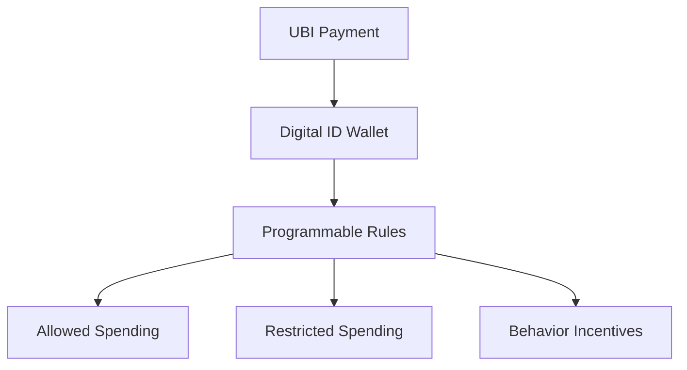

# UBI Conditioning - The End of Work Ethic

**UBI không chỉ là câu hỏi kinh tế: “ai trả tiền?” Nó là câu hỏi tâm lý và quyền lực: nếu income bị tách khỏi work, ownership bị thay bằng access, và payment rail là programmable, thì con người tự do hơn hay phụ thuộc hơn?**

*UBI is not only an economic question. It is a psychological and power question: if income is decoupled from work, ownership from access, and payments move through programmable rails, does humanity become freer or more dependent?*

---

## Vault Position / Vị Trí Trong Vault

Bài này nằm trong series **Gen Z & Agenda 2030 Path** và [[MOC - Financial Sovereignty]]. Nó không phủ định mọi ý tưởng về basic income. Trong một thế giới AI/automation, câu hỏi “con người sống sao khi labor bị thay thế?” là thật.

Nhưng vault đọc rủi ro ở chỗ:

```text
AI displacement
+ housing unaffordable
+ work despair
+ UBI dependency
+ CBDC/payment app
+ digital ID
= conditional survival rail
```

UBI bằng cash vô điều kiện khác rất xa UBI qua programmable wallet gắn identity và compliance.

---

## 1. Work Ethic Không Tự Nhiên Mà Chết

Surface narrative nói Gen Z lười. Nhưng deeper math phức tạp hơn.

Nhiều người trẻ nhìn thấy:

- nhà quá đắt so với thu nhập,
- promotion không đổi đời,
- inflation ăn lương,
- credential mất giá,
- AI đe dọa job,
- corporate loyalty không được đền đáp,
- hustle culture làm bố mẹ burnout.

Nếu phương trình cũ là:

```text
work hard → save → own home → raise family → retire
```

thì phương trình mới nhiều khi thành:

```text
work hard → rent forever → subscribe everything → maybe replaced → still anxious
```

Khi effort không còn dẫn tới ownership, work ethic mất myth.

---

## 2. Quiet Quitting Là Triệu Chứng, Không Phải Gốc Bệnh

Quiet quitting có thể là boundaries lành mạnh. Nhưng nó cũng có thể thành learned helplessness.

```text
system feels rigged
→ ambition feels naive
→ minimum effort feels rational
→ identity shifts from builder to survivor
→ dependency solution becomes attractive
```

Đây là nơi UBI trở nên psychologically seductive. Không phải vì Gen Z “muốn ăn bám”, mà vì system đã làm work mất ý nghĩa rồi đưa dependency ra như relief.

---

## 3. Antiwork Narrative: Liberation Hay Soft Surrender?

Antiwork có phần đúng: nhiều job vô nghĩa, exploitative, underpaid, soul-draining.

Nhưng nếu critique lao động không đi kèm ownership, skill, craft, community và production, nó dễ thành soft surrender:

> “Work sucks” → “Production sucks” → “Ambition sucks” → “Let the system provide.”

Hệ thống rất thích một population ghét lao động nhưng vẫn cần consumption. Vì lúc đó họ cần một rail phân phối purchasing power từ trên xuống.

---

## 4. UBI Có Hai Linh Hồn

### UBI như freedom floor

Ở phiên bản đẹp nhất, UBI có thể:

- giảm desperation,
- giúp người thoát abusive job,
- tạo room học skill,
- hỗ trợ người bị automation thay thế,
- giảm bureaucracy của welfare.

### UBI như dependency rail

Ở phiên bản tối, UBI trở thành:

- income có điều kiện,
- money gắn identity,
- compliance reward,
- political pacifier,
- substitute cho ownership,
- managed poverty with good UX.

Vì vậy câu hỏi không phải “UBI tốt hay xấu?”. Câu hỏi là:

> UBI bằng gì, qua rail nào, có điều kiện gì, ai có quyền đổi rule?

---

## 5. UBI + CBDC Là Cấu Hình Rủi Ro Nhất

UBI bằng cash hoặc bank transfer thường vẫn có friction và autonomy nhất định.

UBI qua programmable CBDC/wallet có thể thêm rule:

- hết hạn cuối tháng,
- chỉ dùng cho category nhất định,
- không chuyển cho người khác,
- không mua “hàng xấu”,
- giảm nếu vi phạm policy,
- tăng nếu hành vi “tốt”,
- carbon-linked spending,
- geofenced benefits.



Khi survival money bị gắn rule, politics đi vào dạ dày.

---

## 6. AI Displacement Là Catalyst

AI làm câu hỏi UBI trở nên thật hơn. Nếu automation thay thế nhiều cognitive/service jobs, xã hội phải xử lý income distribution.

Nhưng chú ý incentive:

- Big Tech build AI thay lao động.
- Capital sở hữu models/robots/infrastructure.
- Workers mất bargaining power.
- Government cần stability.
- UBI xuất hiện như solution.

Nếu người sở hữu robots cũng định nghĩa UBI rail, thì “post-work future” có thể không phải tự do. Nó có thể là neo-feudalism với app đẹp.

> Work optional for whom? Và ai sở hữu machines?

---

## 7. Dependency Trap

Dependency không xảy ra trong một ngày.

```text
Year 1: UBI là bonus
Year 3: UBI cover basics
Year 5: skills outdated, work optional
Year 10: UBI là lifeline
```

Khi lifeline đến từ một rail duy nhất, người nhận sẽ tự kiểm duyệt:

- không protest quá mạnh,
- không nói điều risk account,
- không giao dịch ngoài rule,
- không làm hệ thống tức giận.

Không cần đàn áp toàn dân nếu mọi người sợ mất access.

---

## 8. Work Ethic Cần Được Rebuilt, Không Phục Cổ

Không thể nói với Gen Z “cứ cày như bố mẹ”. Myth cũ đã nứt.

Nhưng cũng không thể bỏ work ethic. Vì nếu không sản xuất, con người mất agency.

Work ethic mới cần đổi từ corporate obedience sang sovereign production:

- học skill thật,
- build asset nhỏ,
- craft,
- local exchange,
- digital product,
- open-source/network production,
- tự hiểu tiền,
- giữ optionality.

Không phải “live to work”. Mà là:

> work as agency, not worship.

---

## 9. UBI Claim Discipline

Không nên claim “mọi UBI là bẫy”. Một số experiment có thể giúp người nghèo thật.

Nhưng phải hỏi:

| Câu hỏi | Vì sao quan trọng |
|---|---|
| Unconditional không? | Nếu có điều kiện, ai định nghĩa điều kiện? |
| Paid as cash/bank/CBDC? | Rail quyết định control surface |
| Có expiry/category restriction không? | Quyền tiêu dùng bị policy hóa |
| Có gắn digital ID/social score không? | Survival bị gắn behavior profile |
| Có thay thế welfare/health/jobs không? | UBI có thể thành excuse cắt hệ thống khác |
| Ai fund và ai sở hữu automation? | Distribution không giải quyết ownership nếu capital vẫn tập trung |

---

## Synthesis

UBI có thể là floor của tự do hoặc leash của dependency. Sự khác biệt nằm ở architecture.

> Nếu UBI giúp con người có thời gian build, học, chăm sóc nhau và rời khỏi abusive work, nó mở freedom.  
> Nếu UBI đi qua programmable wallet, gắn digital ID và thay thế ownership bằng allowance, nó là soft cage.

Gen Z không cần bị mắng là lười. Họ cần thấy bẫy sâu hơn:

> Khi work mất ý nghĩa, đừng vội trao ý nghĩa sống cho hệ thống phân phối allowance.

---

## Related

- [[Gen Z - Phân Tích Phản Biện]]
- [[Gen Z và CBDC - Programmable Money Psychology]]
- [[Tiền Pháp Định]]
- [[MOC - Financial Sovereignty]]
- [[Digital ID Normalization - From Instagram to Government ID]]
- [[Báo Cáo 2030]]
