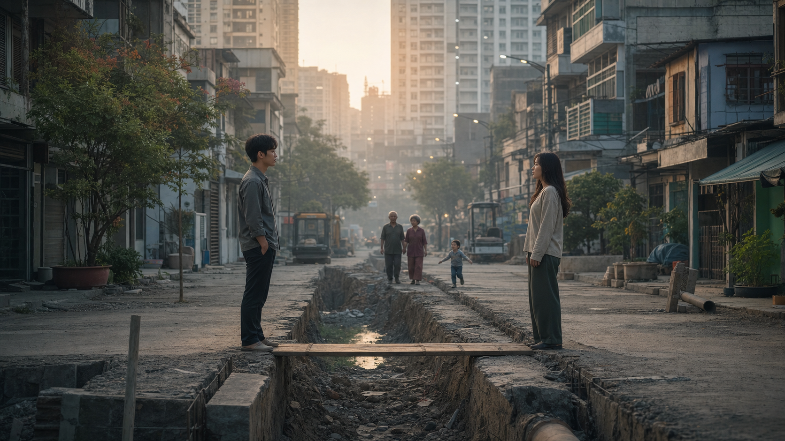
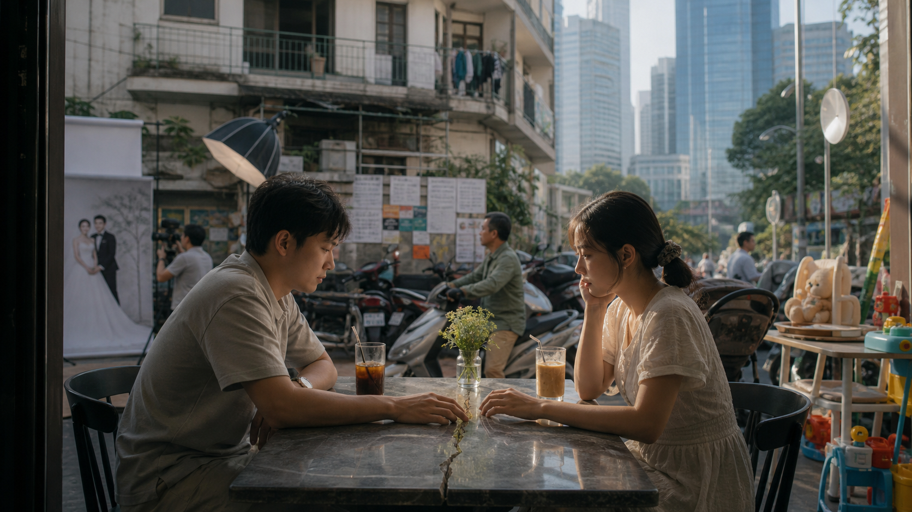
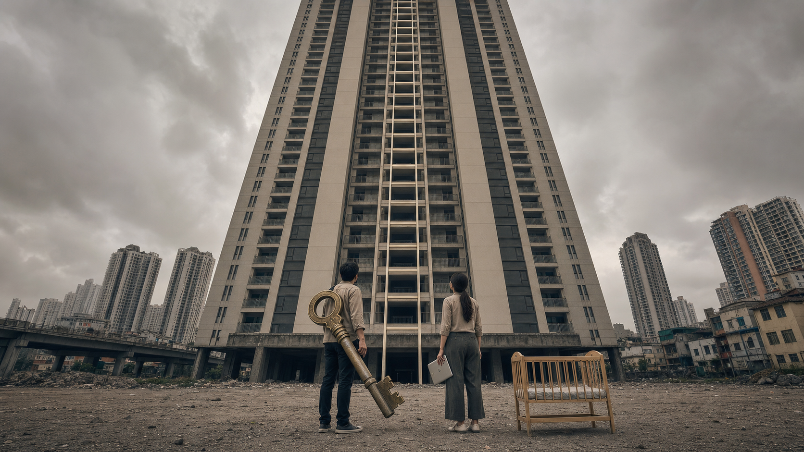
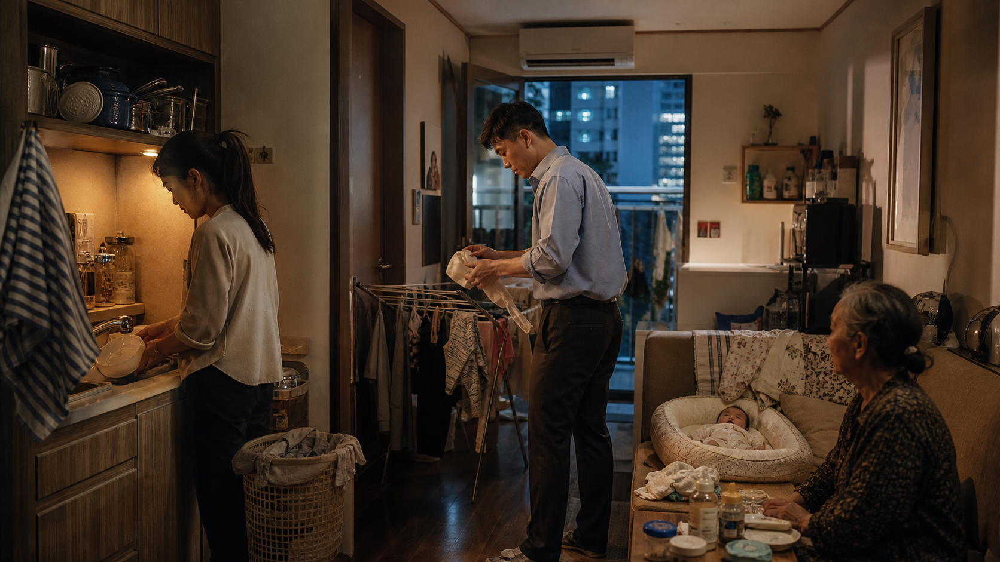
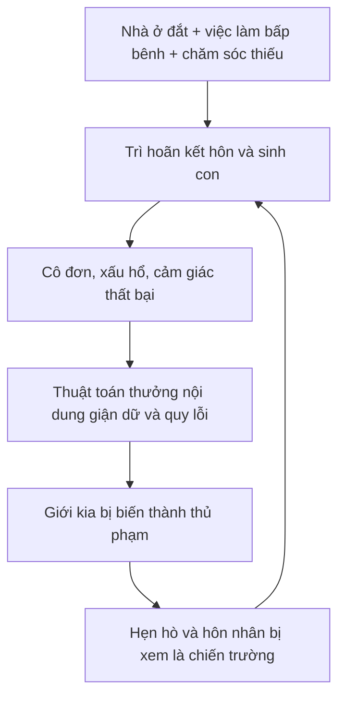

# Việt Nam Trước Hai Chiến Hào: Khi Nam Nữ Cùng Đòi Quyền Làm Người

**Hàn Quốc không phải tương lai tất yếu của Việt Nam. Nhưng nó là một lời cảnh báo giai đoạn muộn: khi nhà ở, việc làm, lao động chăm sóc và phẩm giá cùng thất bại, nỗi đau kinh tế rất dễ bị dịch thành chiến tranh giới. Phụ nữ nói “tôi không muốn làm vợ, làm mẹ theo một hợp đồng bất công”. Đàn ông nói “tôi không muốn bị xem như ví tiền, lao động dùng một lần hay nghi phạm mặc định”. Cả hai đang đòi quyền làm người. Nếu hệ thống khiến họ chỉ nghe thấy lời buộc tội của đối phương, hai nhu cầu chính đáng ấy sẽ đào thành hai chiến hào.**

*Bài này không hỏi nam hay nữ đúng hơn. Nó hỏi ai được lợi khi hai giới trẻ, cùng bị nhà ở đắt đỏ, việc làm bấp bênh, cô đơn và kiệt sức, quay sang xem nhau là nguyên nhân chính của đời mình.*

---

## Vị Trí Trong Kho Tri Thức Và Kỷ Luật Bằng Chứng

Bài này nối bốn node trong cụm Gia Đình, Dopamine Và Những Đứa Trẻ Bị Tách Khỏi Dòng Máu. [[Tâm Lý Học Tiến Hóa Về Giới Tính]] cung cấp một lăng kính về xu hướng và động cơ lợi ích khác nhau giữa hai giới, nhưng **xu hướng quần thể không phải bản án cho từng cá nhân**. [[Hormone Hôn Nhân Và Cái Bẫy Giải Phóng Sinh Học]] nhắc rằng sinh học là thật nhưng không được dùng để hạ nhục. [[Care Economy Và Cách Ma Trận Làm Rỗng Gia Đình]] chỉ ra chăm sóc là hạ tầng, không phải thiên chức miễn phí của phụ nữ. [[Tình Nghĩa Là Hạ Tầng Cuối Cùng]] đưa ra đối trọng: quan hệ không thể sống lâu nếu chỉ còn mặc cả quyền lợi.

Để tránh biến bài thành một bài chiến tranh văn hóa khác, cần giữ bốn tầng tuyên bố:

| Tầng | Bài này có thể nói | Bài này không được nói |
|---|---|---|
| **Dữ kiện** | Số liệu sinh suất, chênh lệch tiền lương, khảo sát sau bỏ phiếu, tuổi kết hôn và gánh nặng chăm sóc từ nguồn được nêu. | Không suy ra động cơ của hàng triệu người từ một con số. |
| **Mẫu hình** | Bất an vật chất và bất công giới có thể bị chính trị hóa thành đối kháng nam-nữ. | Không tuyên bố Hàn Quốc và Việt Nam là cùng một xã hội. |
| **Biểu tượng** | “Hai chiến hào” mô tả sự co cụm bản sắc và mất vùng đối thoại. | Không dùng hình ảnh chiến tranh để kích động chiến tranh thật. |
| **Tổng hợp** | Việt Nam còn cửa tránh kịch bản giai đoạn muộn nếu sửa hạ tầng trước khi thù ghét thành căn tính. | Không xem đây là dự báo chắc chắn. |

Các số liệu bầu cử được dùng dưới đây chủ yếu là **khảo sát sau bỏ phiếu của ba đài KBS, MBC và SBS**, không phải kiểm phiếu hành chính theo giới. Chúng phù hợp để đọc mẫu hình cử tri, không phải để đóng đinh mọi thanh niên Hàn Quốc vào một nhãn.

---

## Từ Khóa Cần Hiểu

**Phân cực giới** không chỉ là nam nữ bất đồng. Nó là trạng thái trong đó giới tính trở thành lối tắt chính trị: biết một người là nam hay nữ trẻ đã giúp đoán khá nhiều về lá phiếu, nguồn tin, nỗi sợ và nhóm mà họ cho là thủ phạm.

**4B** là tên gọi gắn với bốn từ tiếng Hàn bắt đầu bằng *bi*, nghĩa là “không”: không hẹn hò với đàn ông, không quan hệ tình dục với đàn ông, không kết hôn với đàn ông, không sinh con. 4B có ý nghĩa biểu tượng và truyền thông lớn, nhưng không có bằng chứng tốt cho thấy nó là một phong trào đại chúng đại diện cho phụ nữ Hàn Quốc. Không nên lấy một cộng đồng trực tuyến khó đo quy mô làm nguyên nhân duy nhất của sinh suất thấp.

**Lao động chăm sóc** là lao động chăm sóc có trả lương hoặc không trả lương: nuôi con, việc nhà, chăm người bệnh, chăm người già, quản lý cảm xúc và hậu cần gia đình. Nó tạo ra con người có khả năng đi học, đi làm và sống tiếp, nhưng phần lớn không xuất hiện trong GDP hay bảng lương.

**Khoảng cách giữa mong muốn sinh con và khả năng thực hiện** là khoảng cách giữa số con một người mong muốn và số con họ tin mình có thể có. Khái niệm này quan trọng vì sinh suất thấp không đồng nghĩa đơn giản với “giới trẻ ghét trẻ con”. Nhiều người muốn gia đình nhưng không thấy điều kiện an toàn để xây.

---

## 1. Hàn Quốc Ở Giai Đoạn Muộn: Khi Nỗi Đau Có Đảng Phái Và Giới Tính

Hàn Quốc đã đi qua một quá trình hiện đại hóa cực nhanh: giáo dục cạnh tranh cao, thị trường lao động phân tầng, giờ làm dài, nhà ở đô thị đắt, nghĩa vụ quân sự chỉ dành cho nam, thứ bậc doanh nghiệp nặng, và một mô hình gia đình vẫn đặt nhiều lao động chăm sóc lên phụ nữ dù phụ nữ đã học và đi làm gần ngang nam giới.

Trong cấu trúc ấy, cả hai giới đều có lý do thật để thấy bất công.

Phụ nữ nhìn thấy một “cái giá nghề nghiệp của việc làm mẹ” rất cụ thể: nếu kết hôn và sinh con, họ có nguy cơ nhận thêm ca làm thứ hai tại nhà, gián đoạn nghề nghiệp và thu nhập. Dữ liệu OECD tiếp tục xếp Hàn Quốc vào nhóm có khoảng cách lương theo giới lớn nhất khối; chỉ số chính xác thay đổi theo năm và định nghĩa, nhưng khoảng cách ở mức gần 30% trong các năm gần đây vẫn là một dấu hiệu cấu trúc, không phải cảm giác cá nhân ([OECD về chênh lệch tiền lương theo giới](https://www.oecd.org/en/data/indicators/gender-wage-gap.html)). Chênh lệch tiền lương không chứng minh mọi phụ nữ bị trả ít hơn một đồng nghiệp nam làm cùng việc; nó đo chênh lệch thu nhập trung vị giữa lao động nam và nữ toàn thời gian, nơi phân ngành nghề, thâm niên, thời gian nghỉ chăm con và thăng tiến đều cùng xuất hiện.

Nam giới trẻ nhìn thấy một hệ bất bình đẳng khác. Họ phải thực hiện nghĩa vụ quân sự, cạnh tranh trong thị trường việc làm và nhà ở khắc nghiệt, trong khi nhiều chính sách và diễn ngôn công khai gọi tên bất lợi của phụ nữ rõ hơn bất lợi của họ. Khi phần thưởng của “vai trò trụ cột” ngày càng xa nhưng nghĩa vụ vẫn còn, một bộ phận nam giới diễn giải bình đẳng giới như một trò chơi tổng bằng không: phụ nữ tiến lên có nghĩa là họ bị đẩy xuống.

Hai trải nghiệm có thể cùng đúng mà không triệt tiêu nhau. Vấn đề giai đoạn muộn bắt đầu khi chính trị không còn ghép chúng vào một bức tranh chung về quyền lực, nhà ở, lao động và chăm sóc. Thay vào đó, mỗi bên được trao một câu chuyện đơn giản hơn: **đời bạn khó vì giới kia được ưu ái**.

---

## 2. Lá Phiếu 2022 Và 2025: Vết Nứt Không Tự Liền

Cuộc bầu cử tổng thống năm 2022 đưa vết nứt giới trẻ ra ánh sáng. Theo khảo sát sau bỏ phiếu được báo chí Hàn Quốc tổng hợp, 58,7% nam cử tri độ tuổi 20 trở xuống bỏ phiếu cho ứng viên bảo thủ Yoon Suk-yeol, trong khi khoảng 58% nữ cùng nhóm tuổi ủng hộ ứng viên Dân chủ Lee Jae-myung. Chiến dịch của Yoon khai thác mạnh bất mãn chống nữ quyền và hứa giải thể Bộ Bình đẳng giới.

Có thể đã hy vọng đây chỉ là một khoảnh khắc chiến dịch. Nhưng khảo sát sau bỏ phiếu năm 2025 cho thấy đường nứt không biến mất, thậm chí tách nhánh.

Trong nhóm nam tuổi 20, ứng viên Reform Party Lee Jun-seok nhận 37,2%, ứng viên People Power Party Kim Moon-soo 36,9%, còn Lee Jae-myung 24,0%. Nghĩa là 74,1% nam nhóm này chia phiếu cho hai ứng viên bảo thủ. Trong khi đó, 58,1% nữ tuổi 20 chọn Lee Jae-myung; ở nhóm nữ tuổi 30, tỷ lệ là 57,3%. Nam tuổi 30 phân tán hơn nhưng 60,3% vẫn chọn hai ứng viên bảo thủ. Các con số xuất phát từ khảo sát sau bỏ phiếu chung của KBS, MBC và SBS, được [Korea JoongAng Daily](https://www.koreajoongangdaily.com/korea/gender-generation-gap-on-full-display-in-exit-poll-showing-entrenched-differences/12087216) và [Hankyoreh English](https://english.hani.co.kr/arti/english_edition/e_national/1201346.html) công bố; [CFR](https://www.cfr.org/articles/women-week-female-voters-propel-liberal-presidential-candidate-victory-south-korea) cũng ghi nhận 58% phụ nữ tuổi 20 và 57% phụ nữ tuổi 30 ủng hộ Lee.

Điều đáng chú ý không phải “đàn ông bảo thủ, phụ nữ cấp tiến” như hai bản chất cố định. Ở các nhóm tuổi 40 và 50, khoảng cách giới nhỏ hơn nhiều; Lee nhận hơn 68% ở cả nam và nữ. Nghĩa là **thế hệ và hoàn cảnh lịch sử** quan trọng. Phân cực giới không mọc thẳng từ nhiễm sắc thể. Nó được sản xuất bởi trải nghiệm kinh tế, chính sách, truyền thông và cộng đồng trực tuyến.

> Khi giới tính bắt đầu dự báo lá phiếu mạnh nhất ở chính thế hệ đang bước vào hẹn hò, kết hôn và sinh con, khủng hoảng chính trị và khủng hoảng gia đình không còn là hai chuyện riêng.

---

## 3. 4B: Một Biểu Tượng Có Thật, Không Phải Lời Giải Thích Tổng Thể

4B thường được báo chí quốc tế trình bày như thể hàng triệu phụ nữ Hàn Quốc đồng loạt “tuyệt giao với đàn ông”. Cách kể đó vừa hấp dẫn vừa thiếu kỷ luật.

Điều có thể nói chắc là 4B xuất hiện trong các không gian nữ quyền trực tuyến Hàn Quốc cuối thập niên 2010, diễn đạt sự từ chối bốn thiết chế mà một số phụ nữ xem là bất lợi hoặc nguy hiểm: hẹn hò, tình dục dị tính, hôn nhân và sinh con. Nó kết tinh nỗi phẫn nộ thật quanh bạo lực tình dục, quay lén, tiêu chuẩn sắc đẹp, việc nhà và cái giá nghề nghiệp của việc làm mẹ.

Điều **không** thể nói chắc là quy mô thành viên, mức cam kết, hay phần đóng góp của nó vào mức sinh quốc gia. Không có danh sách thành viên chính thức; lượt theo dõi trên một diễn đàn không đồng nghĩa với thực hành bốn điều suốt đời. Nhiều nhà nghiên cứu và nhà báo Hàn Quốc mô tả 4B là một dòng nữ quyền cực đoan có sức vang biểu tượng lớn hơn quy mô xã hội.

Sinh suất Hàn Quốc tăng nhẹ từ 0,72 con/phụ nữ năm 2023 lên 0,75 năm 2024, lần tăng đầu tiên sau chín năm, nhưng vẫn thấp nhất thế giới theo số liệu Statistics Korea được [Reuters](https://www.reuters.com/world/asia-pacific/south-koreas-world-lowest-fertility-rate-rises-first-time-nine-years-2025-02-26/) tường thuật. Không thể giải thích mức này bằng một khẩu hiệu mạng. Nó là kết quả chồng lớp của giá nhà, giáo dục, việc làm, tuổi kết hôn, gánh nặng chăm sóc, bất bình đẳng nơi làm việc và một thị trường hôn nhân mà cả hai giới ngày càng đánh giá là rủi ro.

4B nên được đọc như **đèn báo cháy**, không phải toàn bộ đám cháy.

---

## 4. Việt Nam Ở Giai Đoạn Sớm: Chưa Có Hai Khối, Nhưng Đã Có Vết Nứt

Việt Nam chưa có khoảng cách lá phiếu nam-nữ kiểu Hàn Quốc vì cấu trúc chính trị, truyền thông và bầu cử khác hẳn. Cũng chưa có bằng chứng về một phong trào 4B bản địa quy mô đáng kể. Nếu gắn nhãn “Hàn Quốc tiếp theo” ngay bây giờ, ta sẽ làm phẳng khác biệt và có thể tự tạo ra thứ mình sợ.

Nhưng giai đoạn sớm không có nghĩa là không có tín hiệu.

**Tín hiệu thứ nhất là sinh suất.** Tổng tỷ suất sinh của Việt Nam giảm từ 2,01 con/phụ nữ năm 2022 xuống 1,96 năm 2023 và 1,91 năm 2024, mức thấp nhất từng ghi nhận. Thành thị ở mức khoảng 1,67, nông thôn 2,08. UNFPA không diễn giải điều này như một lỗi đạo đức của phụ nữ, mà như dấu hiệu những dự định sinh sản không được thực hiện vì khó khăn tài chính, chuẩn mực giới và mất cân bằng công việc-cuộc sống ([UNFPA Việt Nam, 2025](https://vietnam.unfpa.org/en/news/unfpa-representative-%E2%80%9Cyoung-people-are-not-afraid-having-children-they-are-trapped-barriers%E2%80%9D)).

**Tín hiệu thứ hai là kết hôn và sinh con muộn hơn.** Dữ liệu Điều tra dân số và nhà ở giữa kỳ 2024 được báo chí dẫn cho thấy tuổi kết hôn lần đầu trung bình đạt 27,3, tăng khoảng 2,1 năm so với 2019; tuổi sinh con trung bình đã lên khoảng 28–29. Đây không tự động là suy đồi. Học lâu hơn, phụ nữ có nghề nghiệp và quyền chọn bạn đời tốt hơn đều là tiến bộ. Nhưng khi trì hoãn chủ yếu vì không mua nổi nhà, thiếu an toàn nghề nghiệp hoặc sợ một hợp đồng gia đình bất công, nó là tín hiệu hạ tầng.

**Tín hiệu thứ ba là ngôn ngữ trực tuyến ngày càng đối kháng.** “Phụ nữ thực dụng”, “đàn ông gia trưởng”, “đào mỏ”, “mẹ đơn thân là dấu hiệu nguy hiểm”, “đàn ông lương thấp không xứng lấy vợ”, “phụ nữ quá 30 mất giá”, “thà độc thân còn hơn nuôi thêm một đứa con trai lớn xác” là những câu cửa miệng khác nhau nhưng cùng một cấu trúc: lấy trải nghiệm tệ có thật, khuếch đại thành bản chất của cả giới kia, rồi biến cảnh giác thành căn tính.

Không có bộ dữ liệu đại diện toàn quốc đủ tốt để kết luận thanh niên Việt Nam đã chia đôi theo giới. Vì vậy phần này phải được gọi đúng tên: **tín hiệu định tính cần theo dõi**, không phải dữ kiện đã chứng minh về toàn thế hệ.

---

## 5. Nhà Ở: Cái Giường Của Gia Đình Đã Thành Tài Sản Đầu Cơ

Mọi lời kêu gọi “giới trẻ hãy cưới và sinh hai con” đều yếu nếu né câu hỏi: họ sẽ sống ở đâu?

Tại Hà Nội và TP.HCM, giá căn hộ tăng nhanh hơn thu nhập trong nhiều năm. Các báo cáo thị trường khác nhau cho ra tỷ lệ giá nhà/thu nhập khác nhau vì cách chọn căn hộ, hộ gia đình và thu nhập, nên không nên đóng đinh một con số duy nhất như chân lý. Nhưng hướng đi là rõ: nhà ở phù hợp tại nơi có việc làm ngày càng xa khả năng của người trẻ nếu không có hỗ trợ gia đình, nợ dài hạn hoặc hai thu nhập.

Hệ quả giới không đối xứng nhưng cùng phá quan hệ. Nam giới vẫn thường chịu kỳ vọng “có nhà mới cưới”, nên giá nhà biến thành phép đo nam tính. Phụ nữ hiểu rằng sinh con trong nhà thuê chật, không có dịch vụ chăm trẻ và công việc không ổn định có thể đẩy mình vào phụ thuộc. Một bên thấy mình bị đánh giá như người gánh tài chính thất bại; bên kia thấy mình sắp ký vào một rủi ro không có lối thoát.

Đây là điểm [[Tâm Lý Học Tiến Hóa Về Giới Tính]] cần được nâng cấp bằng kinh tế chính trị. Xu hướng chọn bạn đời có nguồn lực có thể tồn tại, nhưng nếu đất đai và tín dụng thổi “nguồn lực tối thiểu” lên ngoài tầm với, đừng chỉ trách phụ nữ xu hướng ưu tiên bạn đời có nguồn lực cao hay đàn ông thiếu chí. **Thị trường đã dời cột gôn.**

---

## 6. Gánh Nặng Chăm Sóc: Phụ Nữ Sợ Ca Làm Thứ Hai, Đàn Ông Sợ Không Bao Giờ Đủ

UNFPA nhấn mạnh bất bình đẳng chăm sóc là một trong bốn rào cản khiến người trẻ trì hoãn hoặc từ bỏ sinh con. Trên phạm vi toàn cầu, phụ nữ làm việc nhà và chăm sóc không lương nhiều gấp ba đến mười lần đàn ông tùy bối cảnh. Ở Việt Nam, chênh lệch này gắn với mô hình con dâu chăm con nhỏ lẫn cha mẹ già, trong khi hơn 60% phụ nữ làm trong khu vực phi chính thức không tiếp cận đầy đủ quyền lợi thai sản theo hợp đồng chính thức, theo UNFPA.

Phụ nữ không vô lý khi sợ hôn nhân biến thành hai ca làm: một ca có lương và một ca không tên. Nhưng đàn ông cũng không vô lý khi sợ mình chỉ được yêu khi còn cung cấp được tiền, hoặc bị xem là kém giá trị nếu xin nghỉ chăm con. Chuẩn mực “đàn ông phải gánh” làm tổn thương đàn ông; chuẩn mực “phụ nữ tự nhiên biết chăm” làm tổn thương phụ nữ. Hai chuẩn mực thực ra chống lưng cho nhau.

[[Care Economy Và Cách Ma Trận Làm Rỗng Gia Đình]] gọi đúng cơ chế: hệ thống hút cả hai người lớn vào lao động làm công ăn lương, không định giá chăm sóc, rồi bán lại dịch vụ giữ trẻ, thức ăn, dạy thêm, chăm người già và trị liệu tâm lý như dịch vụ. Cuối ngày, hai người kiệt sức nhìn nhau và tưởng người kia là kẻ đã lấy mất tự do của mình.

> Người phụ nữ không cần “giải phóng” khỏi gia đình để vào một nhà máy kiệt sức. Người đàn ông không cần “trở lại làm chủ” một gia đình mà anh cũng chỉ được phép tồn tại như máy ATM. Cả hai cần quyền tự quyết, thời gian, chăm sóc và phẩm giá.

---

## 7. Cỗ Máy Chuyển Nỗi Đau Thành Kẻ Thù

Phân cực giới không cần một âm mưu trung tâm. Nó có thể nảy sinh từ một cỗ máy động cơ lợi ích rất bình thường:

Một video “tất cả phụ nữ đều…” hoặc “đàn ông Việt Nam vốn…” dễ lan truyền mạnh hơn một bài giải thích thuế đất, quyền thai sản khu vực phi chính thức hay thiết kế ca làm. Kẻ thù có khuôn mặt tạo dopamine mạnh hơn một hệ thống vô hình.

Người ảnh hưởng sống bằng chiến tranh văn hóa có lợi ích trong việc giữ khán giả bị thương. Ứng dụng hẹn hò có lợi khi người dùng tiếp tục quẹt thay vì xây quan hệ bền. Thị trường làm đẹp kiếm tiền từ sự bất an của phụ nữ; hệ sinh thái nội dung nam quyền kiếm tiền từ sự nhục nhã của đàn ông; thị trường đám cưới xa xỉ kiếm tiền từ tiêu chuẩn trình diễn; bất động sản kiếm tiền từ việc biến mái nhà thành địa vị. Không cần các ngành này họp chung. Động cơ lợi ích của chúng đủ để hội tụ.

Ở tầng mẫu hình, đây là “Ma Trận” có thể quan sát mà không cần giả thuyết huyền học: một hệ thống kiếm tiền tốt hơn từ hai cá nhân bất an so với một cặp có khả năng hợp tác và đặt giới hạn với thị trường.

---

## 8. Những Dấu Hiệu Việt Nam Cần Theo Dõi

Việt Nam chưa ở giai đoạn muộn. Chính vì vậy, cần đo lường trước khi biến thành khẩu hiệu.

1. **Khoảng cách thái độ theo giới và thế hệ:** khảo sát đại diện về bình đẳng giới, tin cậy, hẹn hò, bạo lực, hôn nhân, sinh con và phân công chăm sóc. Không dùng vài trăm bình luận làm đại diện quốc gia.
2. **Khoảng cách giữa số con mong muốn và số con dự kiến:** nếu người trẻ muốn hai con nhưng chỉ tin có thể nuôi một, chính sách phải sửa rào cản thay vì dạy đạo đức.
3. **Thời gian chăm sóc không lương theo giới:** không chỉ hỏi ai “giúp việc nhà”, mà đo giờ, gánh nặng ghi nhớ và điều phối và gián đoạn nghề nghiệp.
4. **Khả năng mua/thuê nhà so với thu nhập địa phương:** tách người độc thân, cặp đôi, lao động nhập cư và gia đình có con.
5. **Sức khỏe tinh thần và cô đơn của nam giới:** đặc biệt nhóm thất nghiệp, không học, không làm và không đào tạo, lao động di cư và sau nghĩa vụ/đào tạo nghề. Nỗi đau không có ngôn ngữ thường tìm một kẻ để ghét.
6. **Bạo lực và an toàn của phụ nữ:** từ quấy rối, bạo lực gia đình đến an toàn số. Yêu cầu phụ nữ tin tưởng đàn ông trong khi bỏ qua bạo lực là đạo đức rỗng.
7. **Mức độ cực đoan hóa trực tuyến:** theo dõi mạng lưới nội dung, không hình sự hóa bất đồng. Điều cần đo là phi nhân hóa, công khai thông tin cá nhân để tấn công, cổ vũ bạo lực và cách thuật toán dẫn người trẻ vào đường hầm cực đoan hóa.

Cảnh báo sớm tốt không hỏi “giới nào nguy hiểm hơn?”. Nó hỏi **điều kiện nào biến tổn thương thành thù ghét**.

---

## 9. Những Tài Sản Bảo Vệ Việt Nam Vẫn Còn

Việt Nam không bắt đầu từ số không. Có những tài sản bảo vệ Hàn Quốc đô thị hóa cực nhanh đã làm mỏng đi và Việt Nam vẫn còn, dù đang suy yếu.

**Gia đình liên thế hệ** vẫn là mạng bảo hiểm thực tế. Ông bà hỗ trợ chăm cháu; anh chị em, cô dì chú bác giúp việc, tiền và chỗ ở. Mạng này có thể chứa kiểm soát và áp lực, nhưng cũng là hạ tầng chăm sóc không dễ thay thế.

**Ngôn ngữ tình nghĩa** vẫn sống. [[Tình Nghĩa Là Hạ Tầng Cuối Cùng]] mô tả một loại lòng trung thành không phải gói thuê bao: người còn ở lại khi thân thể, tiền bạc và vẻ ngoài xuống cấp. Nếu tách tình nghĩa khỏi bạo hành và ép buộc, đây là vốn văn hóa chống lại lô-gic chợ trao đổi lợi ích.

**Ký ức về gian khó chung** vẫn khiến nhiều người hiểu gia đình là đội sinh tồn hơn là dự án tối ưu hóa bản thân. Tinh thần cùng làm, cùng nuôi, cùng gửi tiền về quê có thể là nền cho quan hệ hợp tác nam nữ nếu được cập nhật bằng quyền tự quyết hiện đại.

**Nam nữ còn nhiều không gian sống chung**, từ trường học, công sở, khu phố đến họ hàng, thay vì tách hẳn thành hai hệ sinh thái chính trị. Đây là cửa đối thoại, nhưng nó sẽ đóng nếu mọi bất đồng đều bị biến thành nhãn “nữ quyền độc hại” hoặc “nam giới độc hại”.

**Nhà nước còn khả năng thiết kế phổ quát** ở quy mô lớn: nhà ở xã hội, y tế, trường mầm non, luật lao động, nghỉ cha mẹ và dữ liệu dân số. Nếu chính sách hỗ trợ chăm sóc được thiết kế như quyền của mọi gia đình thay vì quà thưởng cho “phụ nữ sinh đủ”, nó giảm cạnh tranh nạn nhân giữa hai giới.

Tài sản bảo vệ không phải lý do để tự mãn. Gia đình liên thế hệ có thể quá tải; tình nghĩa có thể bị dùng để che bạo hành; cộng đồng có thể biến thành giám sát. Cái cần giữ là **chăm sóc và cảm giác thuộc về**, không phải mọi thứ của trật tự cũ.

---

## 10. Chúng Ta Có Thể Làm Gì?

### 10.1. Sửa bài toán vật chất trước khi mở chiến dịch đạo đức

Muốn người trẻ tự do xây gia đình, ưu tiên phải là nhà ở có thể chi trả, việc làm có lịch ổn định, dịch vụ chăm trẻ đủ chất lượng, y tế sinh sản, trường học và giao thông. Tiền thưởng sinh con một lần không bù được hai mươi năm chi phí và mất thời gian.

Chính sách nhà ở cần nhắm vào nơi có việc làm, hạn chế để nhà ở xã hội trở thành tài sản đầu cơ thứ cấp, tăng nguồn cung thuê dài hạn và minh bạch dữ liệu giá/thu nhập. Chính sách dân số phải đo khoảng cách giữa mong muốn sinh con và khả năng thực hiện, không chỉ đếm em bé.

### 10.2. Biến làm cha thành quyền và năng lực, không chỉ nghĩa vụ kiếm tiền

Nghỉ chăm con cho cha phải đủ dài, có phần không chuyển nhượng và có bảo vệ nghề nghiệp; nếu chỉ “cho phép” nhưng văn hóa công ty trừng phạt, chính sách tồn tại trên giấy. Trường học và y tế nên chủ động gọi cha vào vòng chăm sóc, không mặc định mẹ là đầu mối duy nhất.

Điều này giải phóng phụ nữ khỏi ca làm thứ hai và giải phóng đàn ông khỏi vai người gánh tài chính một chiều. Bình đẳng không phải làm nam nữ giống nhau; nó là phân phối quyền, rủi ro và chăm sóc công bằng hơn.

### 10.3. Bảo vệ phụ nữ mà không hình sự hóa nam tính

Bạo lực, quấy rối, quay lén và ép buộc phải được xử lý nghiêm. Nhưng truyền thông phòng chống bạo lực nên phân biệt hành vi với căn tính, mời nam giới vào vai đồng minh và cung cấp đường học lại kỹ năng quan hệ. Nếu mọi cậu bé lớn lên cùng thông điệp “nam tính là nguy hiểm”, một số sẽ co lại, số khác sẽ tìm người ảnh hưởng cực đoan hứa trả lại phẩm giá.

### 10.4. Chăm sức khỏe tinh thần nam giới mà không trao giấy phép ghét phụ nữ

Nam giới cần nơi nói về thất nghiệp, cô đơn, thất bại, tình dục, cha vắng mặt và xấu hổ mà không bị cười nhạo. Nhưng công nhận nỗi đau không có nghĩa xác nhận lời quy tội. Một cộng đồng tốt nói: “nỗi đau của anh là thật; phụ nữ không phải vật tế thần; ta cùng nhìn vào kỹ năng, cấu trúc và trách nhiệm.”

### 10.5. Dạy năng lực hiểu biết về quan hệ, chăm sóc và thuật toán

Giáo dục giới tính không chỉ là tránh thai. Nó cần sự đồng thuận, ranh giới, kỹ năng giải quyết xung đột, tiền bạc, phân công việc nhà, dấu hiệu bạo hành, chăm em bé, chăm người già và cách thuật toán kiếm tiền từ sự phẫn nộ. Thanh niên cần biết một câu chuyện cá biệt lan truyền mạnh không phải dữ liệu quần thể.

[[Source Discipline - Kỷ Luật Nguồn Và Bằng Chứng]] nên áp dụng vào chiến tranh văn hóa: hỏi mẫu bao nhiêu, nguồn nào, định nghĩa gì, tương quan hay quan hệ nhân quả, và ai kiếm tiền khi mình giận.

### 10.6. Thiết kế chính sách phổ quát, rồi thêm hỗ trợ theo nhu cầu

Nếu mọi chính sách được quảng bá như ưu đãi riêng cho một giới, giới kia dễ cảm thấy mất phần. Hạ tầng phổ quát như dịch vụ chăm trẻ, nhà ở, sức khỏe tâm thần, giờ làm hợp lý và nghỉ cha mẹ tạo liên minh rộng hơn. Sau đó mới bổ sung bảo vệ có mục tiêu cho người chịu rủi ro đặc thù như nạn nhân bạo lực, mẹ đơn thân, cha đơn thân, lao động phi chính thức hay người khuyết tật.

### 10.7. Trong từng gia đình: chuyển từ “giúp” sang “đồng sở hữu”

Đàn ông không “giúp vợ” nuôi con hay làm nhà; họ đồng sở hữu trách nhiệm. Phụ nữ không mặc định giữ toàn bộ gánh nặng ghi nhớ và điều phối rồi chấm điểm sự thiếu tinh tế của chồng; cần làm rõ kỳ vọng, tiêu chuẩn và lịch chăm sóc. Cặp đôi nên nói trước hôn nhân về tiền, nhà, cha mẹ hai bên, con cái, nghề nghiệp, việc nhà và lối thoát an toàn khỏi bạo hành.

[[Tình Nghĩa Là Hạ Tầng Cuối Cùng]] chỉ bền khi đi cùng công bằng. Giao ước không phải giấy phép cho một người khai thác người kia. Nhưng hợp đồng công bằng mà không có tình nghĩa cũng dễ vỡ khi đời không còn cân được từng phần.

---

## 11. Quyền Làm Người Của Cả Hai Giới

Phụ nữ có quyền không bị định nghĩa bằng khả năng sinh con, tuổi trẻ, sắc đẹp hay mức độ phục vụ gia đình. Họ có quyền an toàn, tài sản, nghề nghiệp, ham muốn, nghỉ ngơi và chọn có con hay không.

Đàn ông có quyền không bị định nghĩa bằng lương, nhà, chiều cao, sức chịu đựng hay khả năng cung cấp vô hạn. Họ có quyền yếu, được chăm, làm cha hiện diện, được bảo vệ khỏi bạo lực và được xem là con người chứ không phải rủi ro mặc định.

Nhưng quyền làm người cũng có mặt trách nhiệm. Phụ nữ không thể đòi bình đẳng ngoài thị trường rồi mặc định đàn ông vẫn phải gánh toàn bộ tài chính. Đàn ông không thể đòi được tôn trọng như trụ cột rồi từ chối lao động chăm sóc, sự đồng thuận và quyền tự quyết của phụ nữ. Không bên nào có thể chữa vết thương bằng cách tước nhân tính bên kia.

Ở đây, [[Hormone Hôn Nhân Và Cái Bẫy Giải Phóng Sinh Học]] đưa ra câu hỏi đúng: làm sao giữ quyền tự quyết hiện đại mà không đánh mất sinh học, nghĩa vụ và khả năng chứa đựng? Câu trả lời không phải quay về gia đình cũ nguyên xi, cũng không phải giải thể gia đình thành chợ trao đổi lợi ích. Nó là xây một giao ước mới: **hai người trưởng thành, có quyền tự quyết, cùng gánh vật chất, chăm sóc và hậu quả của lựa chọn**.

---

## Chốt Lại: Đừng Để Nỗi Đau Đào Hộ Chiến Hào

Hàn Quốc cho thấy phân cực giới không bắt đầu từ việc hai giới bỗng ghét nhau. Nó bắt đầu khi một thế hệ thấy các lời hứa cũ không còn thực hiện được.

Đàn ông được bảo hãy học, làm, phục vụ và mua nhà, rồi phát hiện chiếc thang đi lên đã bị kéo xa. Phụ nữ được bảo hãy học và độc lập, rồi phát hiện hôn nhân có thể trả họ về ca chăm sóc mặc định. Cả hai nhìn thấy sự bất công thật. Chính trị, thuật toán và thị trường chỉ cần đổi địa chỉ của sự phẫn nộ từ hệ thống sang người đang đứng bên kia bàn hẹn hò.

Việt Nam đã có sinh suất thấp, kết hôn muộn, nhà ở xa tầm với, gánh nặng chăm sóc lệch và ngôn ngữ trực tuyến ngày càng cay độc. Nhưng Việt Nam vẫn còn mạng lưới gia đình, tình nghĩa, ký ức cộng đồng và khoảng thời gian để sửa hạ tầng trước khi bản sắc hai bên đóng cứng.

> Không cần bắt nam nữ yêu nhau bằng khẩu hiệu. Hãy làm cho họ bớt sợ cái giá của việc tin nhau.

Đó là nhà ở không nuốt hết đời lao động. Là làm cha không bị xem như mất nam tính. Là làm mẹ không đồng nghĩa mất bản thân. Là bạo lực được xử lý mà không biến cả một giới thành nghi phạm. Là nỗi đau của nam giới được nghe mà không cần vật tế thần. Là chăm sóc được chia và được định giá. Là quan hệ đủ công bằng để tình nghĩa có đất mọc.

Hai chiến hào chưa hoàn thành. Điều nguy hiểm nhất là tiếp tục tranh cãi xem ai đào trước. Điều cần làm là lấp chúng khi hai bên vẫn còn nhớ người bên kia cũng đang đòi một thứ rất căn bản: **quyền được làm người, được yêu mà không bị khai thác, và được xây một tương lai không bắt mình phải biến ai thành kẻ thù.**

---

## Nguồn Và Ghi Chú Đọc Thêm

1. OECD, **Chênh lệch tiền lương theo giới**: chỉ báo và định nghĩa so sánh quốc tế. https://www.oecd.org/en/data/indicators/gender-wage-gap.html
2. Korea JoongAng Daily, **Khoảng cách giới và thế hệ hiện rõ trong khảo sát sau bỏ phiếu**, 3/6/2025. https://www.koreajoongangdaily.com/korea/gender-generation-gap-on-full-display-in-exit-poll-showing-entrenched-differences/12087216
3. Hankyoreh English, **Young Korean men shifted even more to the right since last presidential election**, 2025. https://english.hani.co.kr/arti/english_edition/e_national/1201346.html
4. Reuters, **Young South Korean women help propel liberal candidate Lee to victory**, 4/6/2025. https://www.reuters.com/world/asia-pacific/young-south-korean-women-help-propel-liberal-candidate-lee-victory-2025-06-04/
5. Council on Foreign Relations, **Female Voters Propel Liberal Presidential Candidate to Victory in South Korea**, 17/6/2025. https://www.cfr.org/articles/women-week-female-voters-propel-liberal-presidential-candidate-victory-south-korea
6. Reuters, **South Korea's world-lowest fertility rate rises for first time in nine years**, 26/2/2025. https://www.reuters.com/world/asia-pacific/south-koreas-world-lowest-fertility-rate-rises-first-time-nine-years-2025-02-26/
7. UNFPA Việt Nam, **Young people are not afraid of having children, they are trapped by barriers**, 2025. https://vietnam.unfpa.org/en/news/unfpa-representative-%E2%80%9Cyoung-people-are-not-afraid-having-children-they-are-trapped-barriers%E2%80%9D
8. Tổng cục Thống kê Việt Nam, **Điều tra dân số và nhà ở giữa kỳ 2024** và các công bố dân số liên quan. Các con số tuổi kết hôn, TFR thành thị/nông thôn trong bài nên được đối chiếu lại với bảng gốc khi bản dữ liệu cuối cùng được cập nhật tại https://www.nso.gov.vn/.

### Ghi chú về giới hạn nguồn

- Số liệu bầu cử theo giới là khảo sát sau bỏ phiếu, có sai số lấy mẫu và không thay thế kết quả kiểm phiếu chính thức.
- Chỉ số chênh lệch tiền lương không đo “cùng một việc, cùng kinh nghiệm” mà đo khoảng cách thu nhập trung vị theo định nghĩa OECD.
- Quy mô 4B không có thống kê thành viên đáng tin cậy; bài cố ý không đưa con số lan truyền trên mạng.
- Nhận định về ngôn ngữ trực tuyến Việt Nam là quan sát mẫu hình, chưa phải khảo sát đại diện quốc gia.
- Số liệu nhà ở thay đổi mạnh theo nguồn và phương pháp; bài chỉ khẳng định hướng bất tương xứng giá/thu nhập, không dùng một tỷ lệ duy nhất làm chân lý.
