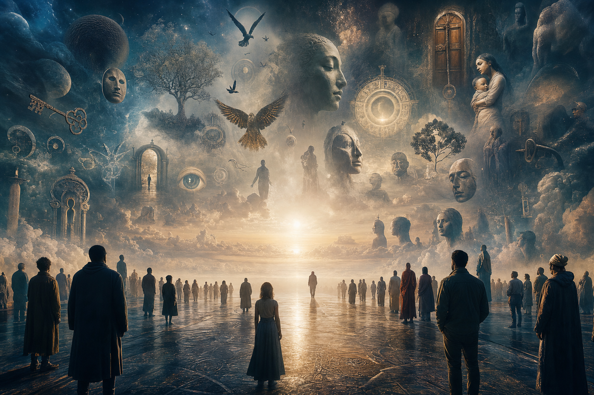
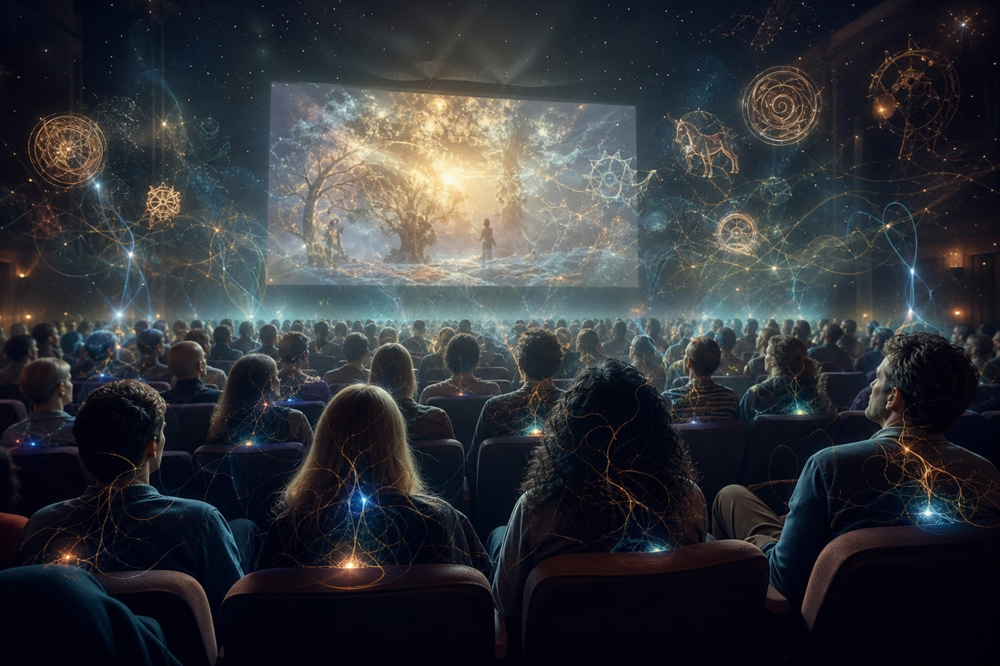
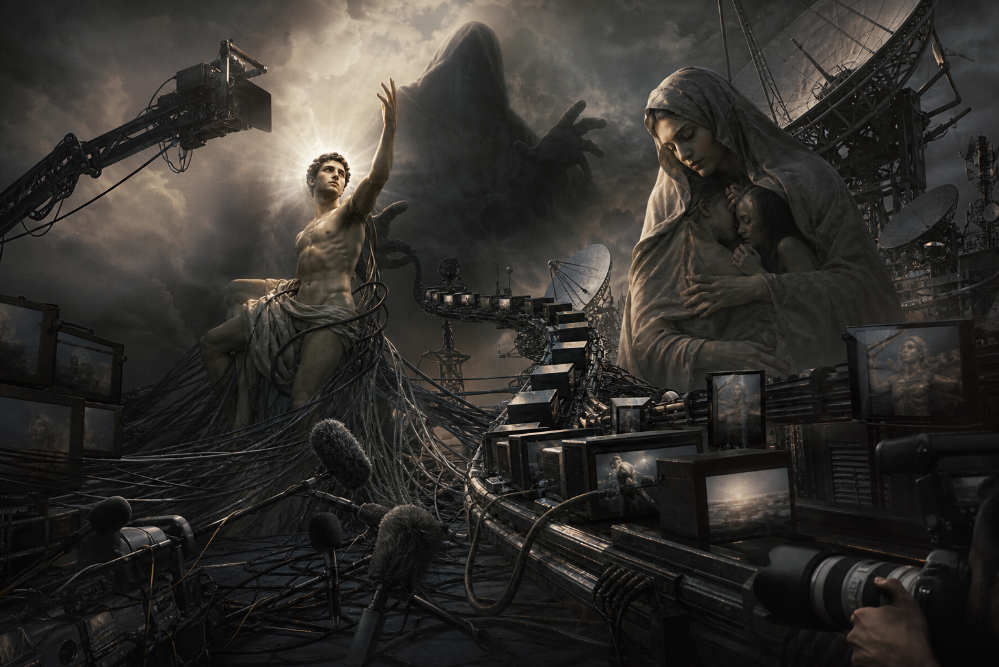

# Vô Thức Tập Thể (Collective Unconscious)

**Vô Thức Tập Thể là tầng sâu của psyche không thuộc riêng cá nhân, nơi các archetype, myth, symbol và pattern phổ quát sống như một kho ký ức chung của nhân loại. Trong Jung, nó là nền của [[Nguyên Mẫu]]. Trong esoterica, nó chạm gần ý niệm Akashic field.**

*The Collective Unconscious is the deep layer of psyche that does not belong to the individual alone. It is the shared symbolic memory field where archetypes, myths, and recurring patterns live.*

---

## Evidence Discipline / Cách Đọc

Vô Thức Tập Thể nằm giữa Jungian psychology, myth reading và esoteric synthesis. Có phần đọc được như tâm lý học biểu tượng. Có phần chỉ nên đọc như pattern language để hiểu vì sao media, ritual và [[Hollywood - Cây Đũa Phép Của Phù Thủy]] có thể đồng bộ cảm xúc tập thể.

Archetype là lens, không phải courtroom exhibit. Đừng dùng một symbol để “chứng minh” một claim cụ thể nếu tầng fact chưa đủ.

---

## Vault Position / Vị Trí Trong Vault

Trong redpill.wiki, Vô Thức Tập Thể nối [[Tâm Lý Học Jung]], [[Nguyên Mẫu]], [[Individuation]], [[Hollywood - Cây Đũa Phép Của Phù Thủy]], [[Gnosis]], [[Monad]] và [[Năng Lượng Aether]].

Nó giải thích vì sao một symbol có thể đánh vào hàng triệu người dù họ không học cùng một sách; vì sao hero, flood, serpent, mother, apocalypse, savior, underworld lặp lại khắp văn hóa.

> Propaganda mạnh nhất không tạo symbol từ số không. Nó hijack symbol đã sống sẵn trong vô thức tập thể.

---

## Jung Nói Gì?

Jung phân biệt conscious mind, personal unconscious và collective unconscious. Conscious mind là phần đang biết. Personal unconscious là ký ức, trauma, desire bị nén của cá nhân. Collective unconscious là tầng pattern/archetype vượt khỏi cá nhân.

Vô thức tập thể không có nghĩa “mọi người nghĩ giống nhau”. Nó là thư viện hình ảnh nguyên thủy mà psyche con người có khả năng truy cập.

---

## Archetype Là Gì?

[[Nguyên Mẫu]] là hình ảnh/pattern phổ quát sống trong vô thức tập thể: Hero, Shadow, Great Mother, Wise Old Man/Woman, Trickster, Self.

Archetype không chỉ nằm trong truyện cổ. Nó sống trong brand, cinema, politics, celebrity, meme và dream. Khi một người nổi tiếng được biến thành savior, khi một nhóm bị đóng vai monster, khi một movement mặc áo apocalypse, đó là archetype đang được kích hoạt.

---

## Dream, Myth Và Culture

Giấc mơ cá nhân thường dùng symbol tập thể: rắn, nước lũ, nhà cũ, em bé, vực sâu, cánh cửa, đền thờ. Đây không chỉ là brain noise. Đôi khi psyche dùng ngôn ngữ archetype để nói điều ego chưa hiểu.

Culture cũng mơ. Cinema là dream công cộng. Đây là lý do Hollywood mạnh: nó chiếu dream lên màn hình lớn, rồi hàng triệu nervous systems cùng entrain vào một archetype.

---

## Akashic Records Connection

Trong Theosophy và nhiều truyền thống esoteric, Akashic Records là thư viện ký ức vũ trụ: mọi sự kiện, ý nghĩ, pattern đều được ghi trong field. Không nên đồng nhất quá nhanh Jung với Akasha. Nhưng hai concept chạm nhau ở một điểm: có một tầng thông tin không thuộc riêng cá nhân.

Có thể đọc hiện tượng này qua nhiều ngôn ngữ: unconscious processing, flow state, archetypal access, Akashic field, divine inspiration. Không cần chọn một quá sớm.

---

## Ma Trận Và Vô Thức Tập Thể

[[Ma Trận]] không chỉ kiểm soát opinion. Nó tác động vào unconscious symbol.

Hero bị biến thành superhero franchise. Shadow bị externalize thành enemy group. Mother bị weaponize thành state/nanny system. Apocalypse bị dùng để bán fear. Savior archetype bị gắn vào politician, billionaire, guru hoặc AI.

Khi archetype bị hijack, public tưởng mình đang chọn bằng lý trí. Thực ra họ đang bị kéo bởi myth.

---

## Kết

Vô Thức Tập Thể là lý do myth không bao giờ chết. Nó chỉ đổi costume: từ thần thoại sang phim ảnh, từ nghi lễ sang concert, từ linh vật sang logo, từ tiên tri sang headline.

Nếu không biết tầng này, con người tưởng mình sống bằng lý trí. Nếu biết tầng này nhưng không có discipline, con người thấy symbol ở mọi nơi rồi mất đất.

> Trưởng thành là học cách đọc symbol mà không bị symbol sở hữu.
