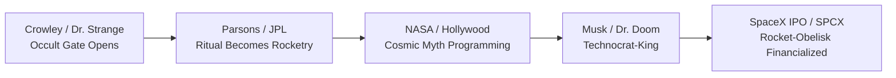
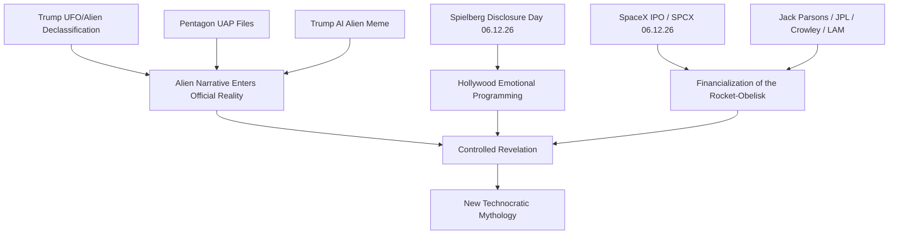

# A LIE N - SpaceX IPO, Disclosure Day và Nghi Lễ Tên Lửa

**Ngày 12/6/2026 không chỉ là ngày SpaceX bước lên Nasdaq. Đó là một điểm hội tụ: UFO disclosure, Spielberg trở lại với người ngoài hành tinh, Trump đẩy narrative alien vào mainstream, Hollywood mở nghi lễ bằng hình ảnh, còn Elon Musk đưa obelisk hiện đại của nhân loại lên sàn chứng khoán. Tên lửa chưa bao giờ chỉ là khoa học. Nó luôn là phép thuật.**

*June 12, 2026 is not merely the day SpaceX steps onto Nasdaq. It is a convergence point: UFO disclosure, Spielberg returning to extraterrestrials, Trump pushing the alien narrative into the mainstream, Hollywood opening the ritual through images, and Elon Musk taking humanity's modern obelisk public. The rocket was never just science. It was always a spell.*

Bài này là phần mở rộng của [[UAP Disclosure - Controlled Revelation]]. Nếu bài kia đặt câu hỏi **“tại sao họ disclose ngay bây giờ?”**, thì bài này hỏi sâu hơn: **“tại sao disclosure lại đi cùng SpaceX, Spielberg, Crowley, Jack Parsons và nghi lễ tên lửa?”**

---

## Bài Này Nằm Ở Đâu Trong Vault?

Bài này không phải một node độc lập. Nó là điểm giao giữa nhiều framework đã có trong redpill.wiki:

| Vault node | Bài này kế thừa gì? |
|---|---|
| [[UAP Disclosure - Controlled Revelation]] | Disclosure không phải truth dump, mà là controlled revelation |
| [[Karma Disclosure - Truth Hidden In Plain Sight]] | Truth phải được hint trước qua fiction, meme, symbol, trailer |
| [[Hollywood - Cây Đũa Phép Của Phù Thủy]] | Hollywood là wand lập trình cảm xúc tập thể trước khi event xảy ra |
| [[Bộ Tam Thánh Mind Control - NASA Disney Hollywood]] | NASA/Disney/Hollywood là ba màn hình của cùng một phép thuật |
| [[Kiểm Soát Tâm Trí]] | Alien narrative là một lớp programming mới trong media/entertainment |
| [[Ma Trận]] | Trong thật có giả, trong giả có thật: reality được vận hành qua nhiều lớp illusion |
| [[Elite]] | Câu hỏi không phải “có thật không?”, mà là “ai được lợi khi nó được reveal theo cách này?” |

Nói cách khác: **A LIE N** là case study 2026 cho toàn bộ vault. Nó cho thấy một symbol có thể đi qua nhà nước, truyền thông, điện ảnh, tài chính, công nghệ và huyền học cùng lúc.

*This article is not a standalone UFO essay. It is a 2026 case study showing how a symbol can move through government, media, cinema, finance, technology, and occultism at the same time.*

## Publication Pack / Disclosure & Spectacle

Bài này thuộc **Disclosure & Spectacle Pack**: đọc current events như media ritual, predictive programming và symbolic rehearsal, nhưng không nhầm symbol thành proof.

Reading path:

1. [[Predictive Programming - Cấy Tương Lai Vào Tiềm Thức]] — method đọc repetition/framing.
2. [[Hollywood - Cây Đũa Phép Của Phù Thủy]] — screen như wand của collective imagination.
3. [[Bộ Tam Thánh Mind Control - NASA Disney Hollywood]] — ba màn hình của myth công nghiệp.
4. [[A LIE N - SpaceX IPO Disclosure Day và Nghi Lễ Tên Lửa]] — disclosure, rocket ritual và techno-myth.
5. [[Brazil 2026 - Khi Bóng Đá Trở Về Với Linh Hồn Tập Thể]] — sports field như collective soul field.
6. [[Spectacle Ritual - World Cup, Super Bowl Và Nghi Lễ Đồng Bộ Đại Chúng]] — spectacle như synchronization infrastructure.

Rule của pack: fact → pattern → symbol → speculative synthesis. Không nhảy thẳng từ coincidence sang certainty.

## 1. Timeline 2026: Khi Alien Bước Vào Mainstream

Trước đây UFO/UAP nằm ở vùng rìa: diễn đàn, phim tài liệu, nhân chứng bị chế giễu, whistleblower bị xem như người lập dị. Nhưng năm 2026, narrative đổi pha. Alien không còn là câu chuyện của người tin UFO. Nó trở thành chuyện của Nhà Trắng, Lầu Năm Góc, Hollywood, Wall Street và SpaceX.

*UFOs used to live on the fringe. In 2026, the narrative changes phase. Aliens become a White House story, a Pentagon story, a Hollywood story, a Wall Street story, and a SpaceX story.*

| Mốc | Sự kiện | Ý nghĩa |
|---|---|---|
| 19/2/2026 | Trump chỉ đạo giải mật hồ sơ UFO/UAP/alien | Nhà nước mở cổng narrative |
| 8/5/2026 | Department of War/Pentagon release đợt UAP files đầu tiên | Disclosure trở thành official channel |
| 17/5/2026 | Trump đăng ảnh AI đi cạnh alien bị còng | Alien trở thành meme chính trị đại chúng |
| 12/6/2026 | Spielberg ra mắt *Disclosure Day* | Hollywood đồng bộ hóa cảm xúc tập thể |
| 12/6/2026 | SpaceX IPO trên Nasdaq, ticker SPCX | Obelisk hiện đại bước vào nghi lễ tài chính |

Điểm đáng chú ý không phải từng sự kiện riêng lẻ. Điểm đáng chú ý là **chúng được xếp sát nhau như một chuỗi programming**.

Không cần tin rằng “tất cả được dàn dựng 100%”. Chỉ cần nhìn thấy một điều: khi nhiều hệ thống quyền lực cùng đẩy một biểu tượng vào tâm trí đại chúng trong cùng một cửa sổ thời gian, đó không còn là noise. Đó là signal.

---

## Evidence Discipline / Cách Đọc Nguồn

Bài này cố tình tách ba tầng đọc để tránh lẫn fact với symbolic synthesis:

| Tầng | Cách đọc | Ví dụ trong bài |
|---|---|---|
| **Fact / documentable** | Sự kiện có thể đối chiếu qua nguồn public/tier-1/official | IPO reporting, government release, film listings, outbreak reports |
| **Pattern reading** | Các event được đặt cạnh nhau để xem nhịp, timing, incentive | disclosure window, Hollywood sync, financialization of space myth |
| **Symbol / myth reading** | Đọc archetype/nghi lễ/interface, không trình bày như fact thô | rocket-obelisk, Dr. Doom/Musk, alien as truth payload + false interface |
| **Speculative synthesis** | Gộp politics, cinema, finance, occult và UAP thành một model vault | ritual calendar, technocratic-cosmic order, A-LIE-N as interface |

Nói cách khác: phần timeline cần nguồn. Phần pattern cần logic. Phần symbol cần đọc như symbolic intelligence, không phải headline journalism.

Nếu một chi tiết factual bị update về sau, thesis của bài vẫn không phụ thuộc vào một headline duy nhất. Thesis nằm ở cấu trúc: **alien narrative đang được official hóa đồng thời qua state, media, market, cinema và technocracy.**

Kỷ luật bổ sung cho bài này: các mốc tương lai hoặc mốc current-event chưa có nguồn gốc trực tiếp phải được đọc như **watchlist claim**, không phải fact đã đóng. Nếu SpaceX IPO, film release, government tranche, outbreak detail hoặc social post chưa có primary source/archived source, nó không được dùng làm cột trụ chứng minh; nó chỉ là điểm cần kiểm.

---

## 2. A LIE N: Word Magic Ngay Trong Cái Tên

Trong bài [[UAP Disclosure - Controlled Revelation]], alien đã được giải mã như một word spell:

| Word | Breakdown | Hidden Meaning |
|---|---|---|
| **ALIEN** | A-LIE-N / A LIE IN | Một lời nói dối được đặt vào bên trong |
| **UFO** | Unidentified Flying Object | Cái không được định danh thì dễ bị định nghĩa bởi quyền lực |
| **UAP** | Unidentified Anomalous Phenomena | Rebrand từ huyền bí sang khoa học |

“A LIE IN” không có nghĩa đơn giản là “alien không tồn tại”. Nó nghĩa là **một lời nói dối được đặt vào bên trong một sự thật lớn hơn**. Lie nằm *in* truth. Truth nằm *in* lie. Đây là cách một narrative cấp cao vận hành.

Có thể có NHI thật, craft thật, crash retrieval thật, suppressed tech thật. Nhưng cái public được dạy để gọi là “alien” có thể vẫn là một wrapper: một frame được thiết kế để che nguồn gốc thật, mục đích thật, hoặc chủ nhân thật của hiện tượng.

Nói cách khác:

> Alien = truth payload + false interface.
>
> Alien = lõi thật + giao diện giả.

*The best lie is not pure fabrication. It contains enough truth to become believable, then wraps that truth inside a controlled frame.*

Đây là lý do disclosure cần được đọc bằng hai mắt:

- Một mắt nhìn fact: tài liệu, video, witness, release.
- Một mắt nhìn frame: ai release, release lúc nào, với narrative gì, để che điều gì.

Đây chính là logic của [[Karma Disclosure - Truth Hidden In Plain Sight]]. Elite không nhất thiết phải giấu mọi thứ. Họ có thể nói ra một phần, nhưng đặt nó trong frame khiến công chúng tự consent với narrative được thiết kế sẵn. Khi sự thật xuất hiện dưới dạng joke, meme, trailer hoặc “fiction”, người xem tưởng mình đang giải trí. Nhưng ở tầng sâu hơn, họ đang được làm quen với một reality sắp được official hóa.

---

## 3. Spielberg: E.T. Và Disclosure Day

Năm 1982, Spielberg làm *E.T. the Extra-Terrestrial*. Người ngoài hành tinh trong phim không phải quái vật. Nó hiền, trẻ thơ, dễ thương, có khả năng chữa lành. Kẻ đáng sợ không phải E.T., mà là chính phủ muốn bắt giữ nó.

Năm 2026, Spielberg trở lại với *Disclosure Day*. Cùng motif cũ, nhưng scale lớn hơn: whistleblower, bí mật chính phủ, phát sóng trực tiếp, thông điệp cho toàn nhân loại.

Đây không chỉ là “một bộ phim alien nữa”. Spielberg là một trong những đạo diễn đã định hình cảm xúc tập thể của phương Tây về người ngoài hành tinh. Nếu Hollywood là cây đũa phép, Spielberg là một trong những pháp sư cấp cao nhất của nghi lễ đó.

*Hollywood does not merely entertain. It rehearses emotions before history requires them.*

E.T. đã dạy công chúng yêu alien. *Disclosure Day* dạy công chúng chuẩn bị cho thời khắc alien bước vào official reality.

Đây là phiên bản điện ảnh của [[Hollywood - Cây Đũa Phép Của Phù Thủy]]. Cây đũa không ép bạn tin. Nó tạo một emotional template để khi sự kiện thật xuất hiện, bạn đã biết phải cảm thấy gì: sợ, thương, tò mò, chấp nhận, hoặc chờ chuyên gia giải thích.

---

## 4. HOPE: Alien Không Chỉ Là Narrative Mỹ

Ngay sau Spielberg là *HOPE* của Na Hong-jin, một phim Hàn Quốc về alien/creature threat tại một thị trấn miền núi. Điều này quan trọng vì disclosure không còn được đóng khung như một myth riêng của Mỹ.

Alien narrative đang được globalize:

- Mỹ: chính phủ, Pentagon, Trump, Spielberg.
- Hàn Quốc: Na Hong-jin, *HOPE*, alien threat ở vùng ngoại vi.
- Mexico: UFO hearing, xác “người ngoài hành tinh”, Teotihuacan.
- Internet: meme, AI image, short video, trailer, reaction culture.

Đây là cách một archetype trở thành planetary narrative. Nó không đi qua một kênh. Nó đi qua mọi kênh cùng lúc.

Trong framework [[Kiểm Soát Tâm Trí]], đây là multi-channel programming: news làm cho narrative có vẻ nghiêm túc, Hollywood làm nó có cảm xúc, meme làm nó viral, còn market/IPO làm nó thành “thực tế kinh tế”. Khi bốn tầng này cùng vận hành, public không còn cảm thấy mình đang bị thuyết phục. Họ chỉ cảm thấy “đây là không khí của thời đại”.

---

## 5. Crowley Và LAM: Grey Alien Trước Khi Grey Alien Thành Văn Hóa Đại Chúng

Aleister Crowley vẽ LAM năm 1919. Hình ảnh này trông giống archetype Grey Alien phổ biến sau này: đầu lớn, mặt nhỏ, mắt sâu, cảm giác phi nhân loại.

Điểm rùng mình không phải là “Crowley chắc chắn gặp alien”. Điểm rùng mình là bức vẽ xuất hiện **trước Roswell, trước văn hóa UFO đại chúng, trước Hollywood alien wave**.

Có ba cách đọc LAM:

| Trường phái | LAM là gì? | Cách hiểu |
|---|---|---|
| UFO modern | Người ngoài hành tinh | Crowley bắt sóng contact sớm |
| Kitô giáo | Ma quỷ/demonic entity | Alien là mask mới của thực thể cũ |
| Esoteric/NHI | Interdimensional intelligence | Cùng một thực thể, mỗi thời đại gọi tên khác nhau |

Cách đọc thứ ba có lực nhất: thời cổ gọi là thần linh, thiên sứ, daemon. Thời trung cổ gọi là yêu tinh, ma quỷ. Thế kỷ 20 gọi là Grey Alien. Thế kỷ 21 gọi là NHI/UAP.

Tên thay đổi. Hiện tượng vẫn ở đó.

---

## 6. Jack Parsons: Tên Lửa Sinh Ra Từ Phòng Thí Nghiệm Và Đền Thờ

Jack Parsons là điểm nối giữa hai thế giới tưởng như đối nghịch:

- Một bên là khoa học tên lửa: JPL, Aerojet, nhiên liệu rắn, nền tảng của chương trình không gian Mỹ.
- Một bên là huyền bí học: Thelema, Crowley, *Hymn to Pan*, Babalon Working.

Parsons không xem khoa học và ma thuật là hai thứ tách biệt. Với ông, phóng tên lửa không chỉ là engineering. Đó là một hành động xâm nhập bầu trời, vượt qua ranh giới của con người, mở cổng vào lãnh địa của thần linh.

Trước các lần thử nghiệm, Parsons đọc *Hymn to Pan*. Địa điểm thử nghiệm đầu tiên gần Devil's Gate — Cổng Quỷ — tại Pasadena.

JPL/NASA về sau giảm nhẹ vai trò Parsons trong lịch sử chính thức. Nhưng nền móng vẫn nằm đó: chương trình không gian hiện đại của Mỹ có một người cha vừa là scientist vừa là occultist.

Đây là nơi bài này nối trực tiếp với [[Bộ Tam Thánh Mind Control - NASA Disney Hollywood]]. NASA không chỉ là “science agency”. Trong vault framework, NASA là màn hình khoa học của cùng một magical system: nó cung cấp cosmology chính thức, hình ảnh chính thức về vũ trụ, và cảm giác rằng chỉ có priesthood kỹ thuật mới được quyền định nghĩa bầu trời.

*Before the rocket was a machine, it was an invocation.*

---

## 7. SpaceX: Obelisk Của Kỷ Nguyên Technocracy

Nếu NASA là obelisk của đế quốc Mỹ thế kỷ 20, SpaceX là obelisk của technocracy thế kỷ 21.

Elon Musk không chỉ điều hành một công ty tên lửa. Ông nằm ở giao điểm của:

| Hệ thống | Công cụ |
|---|---|
| Mobility | Tesla |
| Space | SpaceX |
| Satellite internet | Starlink |
| Brain-machine interface | Neuralink |
| AI | xAI |
| Public square | X/Twitter |

Đây là hình mẫu technocrat hoàn chỉnh: không cần được bầu, nhưng có ảnh hưởng trực tiếp lên hạ tầng, truyền thông, chiến tranh, AI, tiền tệ, không gian và trí tưởng tượng tập thể.

Ông ngoại của Musk, Joshua Haldeman, từng liên quan phong trào Technocracy ở Canada. Dù chi tiết lịch sử cần đọc kỹ, symbolism ở đây rất mạnh: Musk không chỉ là “founder thiên tài”. Ông là avatar đại chúng của một mô hình cai trị mới — nơi engineer, billionaire và platform owner thay thế priest, king và politician.

Technocracy nói ngắn gọn:

> Nếu tôi vừa siêu giàu, vừa siêu giỏi, vừa kiểm soát hạ tầng, thì tôi lead. Không cần hỏi dân chủ quá nhiều.

SpaceX IPO đưa biểu tượng đó vào thị trường tài chính đại chúng. Tên lửa không còn chỉ bay lên trời. Nó được chứng khoán hóa.

Đây là điểm mới so với NASA. NASA là state myth. SpaceX là market myth. Một bên dùng quốc kỳ, ngân sách liên bang và Cold War. Bên kia dùng ticker, valuation, retail investors và cult of founder. Nhưng cả hai đều làm cùng một việc: biến rocket thành biểu tượng cứu rỗi của civilization.

---

## 8. Obelisk: Từ Osiris Đến Apollo, Từ Apollo Đến Starship

Trong hệ biểu tượng Ai Cập, obelisk gắn với dương vật vàng của Osiris — phần bị mất và được thay thế để hoàn tất nghi lễ hồi sinh. Obelisk không chỉ là cột đá. Nó là biểu tượng của quyền lực sinh sản, trục trời-đất, năng lượng mặt trời, và sự hồi sinh của vương quyền.

Rome lấy obelisk từ Ai Cập. Vatican giữ obelisk. Washington DC dựng obelisk. Paris, London, New York đều có obelisk.

Tên lửa là obelisk chuyển động. Nếu obelisk cổ đại cố định quyền lực vào đất, rocket hiện đại phóng quyền lực lên trời. Một cái cắm xuống trung tâm đế quốc. Một cái xuyên qua firmament.

| Thời đại | Obelisk |
|---|---|
| Ai Cập | Cột đá mặt trời |
| Rome/Vatican | Quyền lực đế quốc/tôn giáo |
| Mỹ thế kỷ 20 | Washington Monument, Apollo, NASA |
| Mỹ thế kỷ 21 | Falcon, Starship, SpaceX |

Kennedy tuyên bố đưa người lên Mặt Trăng. Apollo 11 là obelisk bay lên lunar realm. Nếu đọc theo motif Osiris-Horus-MoonChild, chương trình không gian không chỉ là khoa học quốc gia. Nó là nghi lễ chuyển hệ thống.

Elon Musk tiếp tục motif đó: Starship là obelisk của kỷ nguyên Mars, AI và post-human civilization. Dot [[Mỹ Là Ai Cập Tái Sinh]] làm rõ vì sao America dùng Egypt grammar ở scale hiện đại: dollar-pyramid, Washington obelisk, Apollo sky ritual và rocket như obelisk lửa. Dot mở rộng về SpaceX như obelisk lửa, sky fear và techno-king được tách riêng ở [[SpaceX - Obelisk Lửa Và Nỗi Sợ Bầu Trời]] để bài này không lệch khỏi trục A LIE N/disclosure.

---

## 9. Hollywood Là Phép Thuật: Predictive Programming Và Revelation Method

Hollywood không chỉ kể chuyện. Hollywood tạo rehearsal cho tâm trí tập thể.

Trước khi một event thành reality, nó thường xuất hiện dưới dạng fiction:

| Fiction / Simulation | Reality Pattern |
|---|---|
| *Contagion* | Pandemic psychology |
| Event 201 | Pandemic tabletop before Covid |
| Marvel/DC | Archetype hóa technocrat, super-soldier, AI, multiverse |
| *E.T.*, *Close Encounters*, *Disclosure Day* | Alien contact normalization |

Đây là Revelation Method: tiết lộ trước dưới dạng fiction, joke, trailer, meme, symbol. Khi reality xảy ra, công chúng không còn shock. Họ đã rehearsed cảm xúc trước đó.

Television = tell-a-vision. Hollywood = holly wood = wand. Cây đũa phép không biến đá thành vàng theo nghĩa trẻ con. Nó biến narrative thành hành vi.

Đây cũng là lý do alien disclosure không thể tách khỏi Disney/Marvel/DC/NASA. Người lớn cần “science”. Trẻ em cần myth. Đại chúng cần cinema. Ba màn hình khác nhau, cùng một spell.

---

## 10. Marvel Arc: Từ Dr. Strange Đến Dr. Doom

Nếu đọc Marvel như predictive programming, arc lớn không chỉ là superhero entertainment. Nó là một sequence biểu tượng: **phép thuật → đa vũ trụ → technocrat-god**.

Dr. Strange mở cổng. Dr. Doom đóng màn.

### Dr. Strange = Aleister Crowley Archetype

Dr. Strange là bác sĩ, nhà khoa học, người duy lý, sau tai nạn thì bước vào huyền học, nghi lễ, symbol, entity, time loop và multiverse. Đây là hình tượng rất gần với Aleister Crowley ở tầng archetype: con người phương Tây hiện đại đi qua cánh cửa occult và phát hiện reality không chỉ là vật chất.

Crowley không phải “wizard” kiểu cổ tích. Ông là magician của kỷ nguyên hiện đại: ritual, altered states, entity contact, sex magick, Thelema, LAM. Nếu Dr. Strange là Hollywood hóa của occult priest, Crowley là nguyên mẫu đời thật của con người mở cổng.

| Marvel symbol | Real-world archetype | Function |
|---|---|---|
| Dr. Strange | Aleister Crowley | Magician-priest, người mở cổng consciousness/multiverse |
| LAM | NHI / interdimensional entity | Thực thể nhìn qua khe cửa |
| Sanctum / ritual space | Magical order / occult lodge | Nơi reality được bẻ cong bằng will và symbol |

### Jack Parsons = Cầu Nối Giữa Strange Và Doom

Jack Parsons không hoàn toàn là Dr. Strange, cũng chưa hẳn là Dr. Doom. Parsons là bridge: occultist + rocket scientist. Ông mang ritual vào engineering, mang Crowley vào JPL, mang *Hymn to Pan* vào khoảnh khắc phóng tên lửa.

Nếu Crowley mở cổng bằng ritual, Parsons biến cổng đó thành propulsion.

*Crowley opened the gate through ritual. Parsons turned the gate into propulsion.*

### Dr. Doom = Elon Musk Archetype

Dr. Doom là một trong những archetype mạnh nhất của Marvel: thiên tài công nghệ, pháp sư, sovereign ruler, người mặc giáp kim loại, vừa cứu thế vừa độc tài, vừa scientist vừa magician. Doom không chỉ là villain. Doom là hình ảnh của technocrat-king: “tôi đủ thông minh để cai trị thế giới vì tôi thấy xa hơn các người”.

Đây là chỗ Elon Musk match rất mạnh ở tầng biểu tượng.

| Dr. Doom | Elon Musk archetype |
|---|---|
| Genius inventor | Founder-engineer myth: Tesla, SpaceX, Neuralink, xAI |
| Armor / metal mask | Tech persona, machine-man, transhuman aesthetic |
| Science + sorcery | Engineering + simulation/AI/cosmic destiny language |
| Sovereign ruler of Latveria | Platform-state logic: X, Starlink, Mars colony, private space infrastructure |
| Savior complex | “Save humanity”: Mars, AI safety, free speech, sustainable energy |
| Hero/villain ambiguity | Public không biết đang nhìn savior, controlled opposition hay technocrat overlord |

Doom là bước tiếp theo sau Strange. Strange đại diện cho **occult revelation**: reality có nhiều tầng, nhiều chiều, nhiều entity. Doom đại diện cho **technocratic capture**: ai kiểm soát được science + sorcery + infrastructure thì người đó không cần ngai vàng truyền thống nữa.

Vì vậy nếu Marvel bắt đầu mở cửa bằng Dr. Strange và đi tới Dr. Doom, thì đó là cùng một arc với bài này:

Dr. Strange hỏi: “Reality thật sự là gì?”

Dr. Doom trả lời: “Reality thuộc về kẻ đủ thông minh để tái cấu trúc nó.”

Đó là lý do Musk không chỉ match Iron Man. Iron Man là public-friendly mask. Dr. Doom mới là shadow archetype: genius savior với quyền lực quasi-sovereign, đứng giữa science, magic, machine và empire.

---

## 11. Controlled Opposition: Không Ai Là Hero Hoàn Toàn

Trong các narrative lớn, công chúng thường được yêu cầu chọn phe:

- Trump chống Deep State.
- Musk chống censorship.
- Hollywood thức tỉnh disclosure.
- Whistleblower đưa sự thật ra ánh sáng.

Nhưng câu hỏi sâu hơn là: **tại sao những phe “chống hệ thống” này vẫn được hệ thống amplify?**

Trump được giữ sống tài chính bởi Deutsche Bank khi các ngân hàng Mỹ tránh xa. Musk gắn với PayPal mafia, Peter Thiel, Palantir, In-Q-Tel/CIA, Twitter/X. Hollywood vừa “phản kháng” vừa là công cụ programming lớn nhất.

Điều này không có nghĩa họ không làm gì thật. Nó nghĩa là vai diễn của họ nằm trong biên độ mà hệ thống cho phép.

*Khi bạn chọn một trong hai phe được đưa sẵn, bạn vẫn đang chơi trên bàn cờ của người khác.*

---

## 11.5. Trump Moonchild Và Elon False Prophet

Có một dot cần giữ ở tầng symbolic, không đọc như prophecy literal: Trump như **Moonchild / Beast archetype**, Elon như **False Prophet / Dr. Doom archetype**.

Trump sinh gần một lunar eclipse, và trong occult reading điều này mở ra motif Moonchild: một persona phản chiếu collective unconscious hơn là tự phát sáng như solar king. Trump hoạt động đúng như một lunar mirror của American shadow. Người yêu ông thấy savior. Người ghét ông thấy monster. Cả hai phe đều bị kéo vào orbit của ông. Ông không tạo ra toàn bộ rage, nostalgia, grievance và beast-energy của America; ông làm nó hiện hình.

Nếu đọc Revelation như archetype thay vì headline prophecy, Beast không chỉ là một con quái vật. Beast là political-animal power: đám đông, empire, worship, rage, spectacle và wounded restoration. Ở tầng này, Trump là Beast-function của American shadow: một con thú chính trị được sinh ra từ truyền hình, vàng, tower, grievance và myth “make the empire great again”.

Elon đứng ở vai khác. False Prophet không chỉ là người nói dối. Function của False Prophet là làm signs and wonders, thổi hơi vào image, khiến system có vẻ miraculous và đáng tin. Trong modernity, false prophet không cần mặc áo tôn giáo. Ông có thể mặc hoodie, livestream rocket landing, nói về Mars, AI safety, free speech, Neuralink và saving civilization.

Dot X/Twitter làm motif này mạnh hơn: Trump từng bị khóa mõm trên Twitter; Elon mua Twitter, đổi nó thành X, rồi mở lại cổng cho voice của Trump. Symbolically, False Prophet trả lại tiếng nói cho Beast. Không chỉ rocket làm phép lạ trên trời; platform cũng làm phép lạ dưới đất: con thú bị mute được thổi hơi trở lại vào public square.

Trump kích hoạt đám đông. Elon cung cấp miracle-tech và hạ tầng. Trump gọi về past empire. Elon gọi tới future empire. Một người nói “Make America Great Again”. Người kia nói “Make Humanity Multiplanetary”.

Cặp này không cần được đọc như “hai người biết mình đang đóng vai gì”. Archetype thường vận hành qua persona, incentive và collective projection.

> Trump làm con thú có tiếng nói.
> Elon làm con thú có hạ tầng.
> Beast gọi đám đông. False Prophet dựng phép lạ. Empire nhận worship.

---

## 12. Hantavirus, X-Files Và “It Wasn't The Hantavirus”

MV Hondius hantavirus/Andes virus outbreak 2026 là một mảnh ghép lạ trong timeline. Về mặt y tế, đây là một outbreak thật với source từ WHO/ECDC/NEJM. Nhưng khi đặt cạnh X-Files, nó mở ra một tầng symbolic.

Trong *The X-Files: Fight The Future* (1998), Hantavirus được dùng như vỏ bọc cho một kế hoạch liên quan alien. Câu thoại quan trọng:

> “No. I'm saying it wasn't the Hantavirus.”

Không cần kết luận outbreak 2026 là cover-up. Điểm đáng đọc là predictive echo: một disease narrative từng được gắn với alien conspiracy trong fiction, nay xuất hiện cùng cửa sổ thời gian với UFO disclosure, Trump, Spielberg và SpaceX IPO.

Pattern không phải proof. Nhưng pattern là thứ buộc ta đặt câu hỏi tốt hơn.

---

## 13. Synthesis: Tại Sao SpaceX IPO Đúng Lúc Disclosure?

Nếu đọc từng mảnh riêng lẻ, mọi thứ có thể là coincidence:

- Trump thích meme.
- Pentagon release theo schedule.
- Spielberg chọn ngày đẹp.
- SpaceX IPO theo market condition.
- HOPE chỉ là phim alien.
- Hantavirus chỉ là outbreak.

Nhưng nếu đọc như một ritual calendar, ngày 12/6/2026 trở thành một node:

Cái được disclose không chỉ là “aliens”. Cái được disclose là một mythology mới cho kỷ nguyên technocracy:

- Con người không còn chỉ là công dân quốc gia. Họ là species chuẩn bị contact.
- Tên lửa không còn chỉ là phương tiện. Nó là obelisk của civilization.
- Tỷ phú công nghệ không còn chỉ là businessman. Họ là priest-engineer của tương lai.
- Hollywood không còn chỉ là entertainment. Nó là temple của mass consciousness.

---

## 14. Moon Landing Moment 2.0 — Reality Được Cập Nhật

Có thể câu hỏi lớn nhất không phải “ngày 12/6/2026 có alien xuất hiện không?” mà là: **chúng ta có đang chứng kiến một khoảnh khắc reality-shift giống Moon Landing không?**

Moon Landing không chỉ là một sự kiện khoa học. Nó update reality của cả nhân loại. Trước Apollo, bầu trời vẫn là vùng của thần thoại, tôn giáo, thơ ca và giới hạn. Sau Apollo, con người được dạy rằng: bầu trời có thể bị chinh phục bằng state power, rocket science, television và ngân sách quân sự.

Đó là lúc reality tập thể đổi version.

| Reality cũ | Reality mới sau Moon Landing |
|---|---|
| Trời là cõi thiêng / unreachable | Trời là frontier kỹ thuật |
| Quốc gia mạnh nhất kiểm soát đất | Quốc gia mạnh nhất chạm tới Mặt Trăng |
| Mythology thuộc về tôn giáo | Mythology được truyền qua NASA/TV |
| Obelisk đứng yên ở thủ đô | Obelisk bay lên không gian |

Năm 2026 có thể là một update tương tự, nhưng lần này không phải “con người lên Mặt Trăng”. Lần này là: **nhân loại không còn một mình, và kẻ dẫn đường không phải chính phủ dân chủ, mà là technocracy.**

UAP disclosure làm sky trở lại thành vùng bí ẩn. Spielberg/Hollywood dạy public cảm xúc cần có. Trump biến alien thành meme chính trị. Pentagon/Department of War biến nó thành official file. SpaceX IPO biến rocket-obelisk thành financial instrument cho đại chúng tham gia.

Đây là New World Order ở tầng myth, không chỉ tầng policy.

New World Order không nhất thiết xuất hiện bằng một tuyên bố “chúng tôi lập chính phủ thế giới”. Nó có thể xuất hiện bằng cách update shared reality:

- Con người không còn là trung tâm vũ trụ.
- Quốc gia không còn là đơn vị quyền lực tối cao.
- Technocrat và private infrastructure thay thế priest/king/politician.
- Space, AI, satellite, brain-chip và disclosure trở thành một bundle civilization mới.
- “Humanity” được gọi tên như một species cần được quản trị ở planetary scale.

Nếu Moon Landing là ritual khai sinh Space Age của thế kỷ 20, thì SpaceX IPO × Disclosure Day có thể là ritual khai sinh Technocratic-Cosmic Order của thế kỷ 21.

Không cần một UFO hạ cánh trước Nhà Trắng để reality đổi. Reality đổi khi enough institutions cùng nói: “Từ hôm nay, hãy nhìn bầu trời bằng một frame mới.”

*Reality does not change only when a new object appears. Reality changes when the frame through which billions interpret the object is updated.*

---

## 15. Vault Synthesis: Alien Là Một Interface

Nếu gộp các framework trong vault lại, “alien” không nên được hiểu quá hẹp là sinh vật từ hành tinh khác. Alien là một **interface** — một màn hình trung gian để nhiều tầng sự thật/giả cùng hiển thị.

| Tầng | Alien dùng để làm gì? | Vault connection |
|---|---|---|
| Political | Justify secrecy, budget, emergency power | [[Elite]], [[UAP Disclosure - Controlled Revelation]] |
| Psychological | Tạo awe/fear, lower critical thinking | [[Kiểm Soát Tâm Trí]] |
| Esoteric | Rebrand spirit/demon/NHI thành language hiện đại | [[Ma Trận]], [[Karma Disclosure - Truth Hidden In Plain Sight]] |
| Technological | Cover black projects, suppressed propulsion, breakaway tech | [[Khoa Học Xét Lại]], [[Bộ Tam Thánh Mind Control - NASA Disney Hollywood]] |
| Cinematic | Program emotional response before contact narrative | [[Hollywood - Cây Đũa Phép Của Phù Thủy]] |
| Financial | Chứng khoán hóa myth tương lai qua SpaceX/SPCX | [[Elite]] |

Vậy “A LIE N” không có nghĩa đơn giản là alien giả. Nó nghĩa là: **cái gọi là alien là một lie-interface chứa nhiều mảnh truth thật bên trong**.

Nếu người đọc chỉ chọn một phe — “alien thật 100%” hoặc “alien giả 100%” — họ đã rơi vào bẫy nhị nguyên. Bài này không chọn phe. Nó đọc cấu trúc.

*Alien is not merely a being. Alien is an interface: a screen where political secrecy, suppressed technology, spiritual entities, mass psychology, cinema, and finance can all appear under one symbol.*

---

## 16. Kết Luận: Trong Giả Có Thật, Trong Thật Có Giả

Câu hỏi không phải “alien có thật không?” Câu hỏi đúng hơn là:

> Nếu alien có thật, tại sao họ cho ta biết theo cách này?

Và nếu alien là một phần lie, câu hỏi vẫn là:

> Lie đó đang che truth nào?

Trong thật có giả. Trong giả có thật. Trong trắng có đen. Trong đen có trắng. Đó là bản chất của [[Ma Trận]].

Ngày 12/6/2026 không nhất thiết phải có “sự kiện lớn” xảy ra. Có thể nó chỉ là một bước education: normalize alien, normalize SpaceX as civilizational infrastructure, normalize technocracy, normalize idea rằng tương lai không còn nằm trong tay chính phủ dân chủ mà trong tay những priest-engineer kiểm soát rocket, satellite, AI, brain chip và narrative.

The rocket was never just science. It was always a spell.

Tên lửa chưa bao giờ chỉ là khoa học. Nó luôn là phép thuật.

Before it was engineering, it was invocation.

Trước khi là kỹ thuật, nó là một lời triệu hồi.

---

## Source Register / Sổ Nguồn

Register này không phải danh sách citation hoàn chỉnh cho từng câu. Nó là bản đồ nguồn cần dùng để harden bài: fact-level claim cần nguồn gốc trực tiếp; pattern/symbol chỉ được trình bày như pattern/symbol.

### Primary / Official Source Categories

- **U.S. defense/UAP official channels** — dùng cho tầng fact về official disclosure channel, ngày release, tên chương trình, metadata. Nếu chưa có archive/link cụ thể, chỉ giữ như placeholder.
- **Trump official/social channel archives** — dùng để đối chiếu post trực tiếp liên quan UFO/alien imagery hoặc declassification messaging.
- **Official studio/distributor materials** — dùng để xác nhận film slate, title, trailer/press material cho *Disclosure Day* hoặc *HOPE*.
- **Official exchange/company filings** — dùng để xác nhận IPO, ticker, valuation, exchange date. Không dùng rumor market blog làm fact nếu thiếu filing.
- **WHO / ECDC / national public-health agencies** — dùng cho outbreak-level verification.

### Tier-1 / Public Reporting Categories

- **Wire / mainstream reporting** — dùng để dựng public timeline, nhưng phải phân biệt reporting, rumor và opinion.
- **Entertainment trade press / official listings** — dùng cho production/release status; không dùng để chứng minh occult reading.
- **Finance reporting / filings databases** — dùng cho market-facing timeline; filing vẫn mạnh hơn headline.
- **Medical journals / agency outbreak reports** — dùng cho y tế; symbolic X-Files echo không được biến thành claim cover-up.

### Books / Historical Context

- **George Pendle — *Strange Angel: The Otherworldly Life of Rocket Scientist John Whiteside Parsons***. Dùng cho Jack Parsons, JPL, Thelema, Babalon Working context.
- **Aleister Crowley — *The Amalantrah Working* / LAM material**. Dùng cho Crowley-LAM occult/NHI symbolism.
- **Marvel canon / character history** — dùng cho Dr. Strange và Dr. Doom như archetypal comparison, không phải factual evidence về Musk/Crowley.

### Internal Vault Frameworks

- [[UAP Disclosure - Controlled Revelation]]
- [[Bộ Tam Thánh Mind Control - NASA Disney Hollywood]]
- [[Karma Disclosure - Truth Hidden In Plain Sight]]
- [[Hollywood - Cây Đũa Phép Của Phù Thủy]]
- [[Cách Đọc Red Pill Wiki]]
