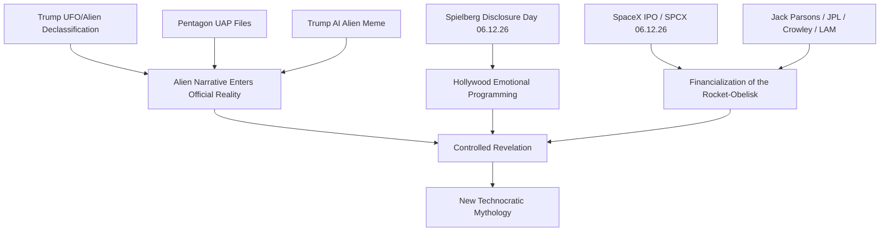

# A LIE N - SpaceX IPO, Disclosure Day và Nghi Lễ Tên Lửa

**Ngày 12/6/2026 không chỉ là ngày SpaceX bước lên Nasdaq. Đó là một điểm hội tụ: UFO disclosure, Spielberg trở lại với người ngoài hành tinh, Trump đẩy narrative alien vào mainstream, Hollywood mở nghi lễ bằng hình ảnh, còn Elon Musk đưa obelisk hiện đại của nhân loại lên sàn chứng khoán. Tên lửa chưa bao giờ chỉ là khoa học. Nó luôn là phép thuật.**

*June 12, 2026 is not merely the day SpaceX steps onto Nasdaq. It is a convergence point: UFO disclosure, Spielberg returning to extraterrestrials, Trump pushing the alien narrative into the mainstream, Hollywood opening the ritual through images, and Elon Musk taking humanity's modern obelisk public. The rocket was never just science. It was always a spell.*

Bài này là phần mở rộng của [[UAP Disclosure - Controlled Revelation]]. Nếu bài kia đặt câu hỏi **“tại sao họ disclose ngay bây giờ?”**, thì bài này hỏi sâu hơn: **“tại sao disclosure lại đi cùng SpaceX, Spielberg, Crowley, Jack Parsons và nghi lễ tên lửa?”**

---

## 1. Timeline 2026: Khi Alien Bước Vào Mainstream

Trước đây UFO/UAP nằm ở vùng rìa: diễn đàn, phim tài liệu, nhân chứng bị chế giễu, whistleblower bị xem như người lập dị. Nhưng năm 2026, narrative đổi pha. Alien không còn là câu chuyện của người tin UFO. Nó trở thành chuyện của Nhà Trắng, Lầu Năm Góc, Hollywood, Wall Street và SpaceX.

*UFOs used to live on the fringe. In 2026, the narrative changes phase. Aliens become a White House story, a Pentagon story, a Hollywood story, a Wall Street story, and a SpaceX story.*

| Mốc | Sự kiện | Ý nghĩa |
|---|---|---|
| 19/2/2026 | Trump chỉ đạo giải mật hồ sơ UFO/UAP/alien | Nhà nước mở cổng narrative |
| 8/5/2026 | Department of War/Pentagon release đợt UAP files đầu tiên | Disclosure trở thành official channel |
| 17/5/2026 | Trump đăng ảnh AI đi cạnh alien bị còng | Alien trở thành meme chính trị đại chúng |
| 12/6/2026 | Spielberg ra mắt *Disclosure Day* | Hollywood đồng bộ hóa cảm xúc tập thể |
| 12/6/2026 | SpaceX IPO trên Nasdaq, ticker SPCX | Obelisk hiện đại bước vào nghi lễ tài chính |

Điểm đáng chú ý không phải từng sự kiện riêng lẻ. Điểm đáng chú ý là **chúng được xếp sát nhau như một chuỗi programming**.

Không cần tin rằng “tất cả được dàn dựng 100%”. Chỉ cần nhìn thấy một điều: khi nhiều hệ thống quyền lực cùng đẩy một biểu tượng vào tâm trí đại chúng trong cùng một cửa sổ thời gian, đó không còn là noise. Đó là signal.

---

## 2. A LIE N: Word Magic Ngay Trong Cái Tên

Trong bài [[UAP Disclosure - Controlled Revelation]], alien đã được giải mã như một word spell:

| Word | Breakdown | Hidden Meaning |
|---|---|---|
| **ALIEN** | A-LIE-N / A LIE IN | Một lời nói dối được đặt vào bên trong |
| **UFO** | Unidentified Flying Object | Cái không được định danh thì dễ bị định nghĩa bởi quyền lực |
| **UAP** | Unidentified Anomalous Phenomena | Rebrand từ huyền bí sang khoa học |

“Alien” không nhất thiết nghĩa là hoàn toàn giả. Một lie hiệu quả nhất luôn chứa truth bên trong. Có thể có NHI thật, craft thật, crash retrieval thật, suppressed tech thật. Nhưng cách public được dạy để hiểu chúng có thể vẫn là một lie.

*The best lie is not pure fabrication. It contains enough truth to become believable, then wraps that truth inside a controlled frame.*

Đây là lý do disclosure cần được đọc bằng hai mắt:

- Một mắt nhìn fact: tài liệu, video, witness, release.
- Một mắt nhìn frame: ai release, release lúc nào, với narrative gì, để che điều gì.

---

## 3. Spielberg: E.T. Và Disclosure Day

Năm 1982, Spielberg làm *E.T. the Extra-Terrestrial*. Người ngoài hành tinh trong phim không phải quái vật. Nó hiền, trẻ thơ, dễ thương, có khả năng chữa lành. Kẻ đáng sợ không phải E.T., mà là chính phủ muốn bắt giữ nó.

Năm 2026, Spielberg trở lại với *Disclosure Day*. Cùng motif cũ, nhưng scale lớn hơn: whistleblower, bí mật chính phủ, phát sóng trực tiếp, thông điệp cho toàn nhân loại.

Đây không chỉ là “một bộ phim alien nữa”. Spielberg là một trong những đạo diễn đã định hình cảm xúc tập thể của phương Tây về người ngoài hành tinh. Nếu Hollywood là cây đũa phép, Spielberg là một trong những pháp sư cấp cao nhất của nghi lễ đó.

*Hollywood does not merely entertain. It rehearses emotions before history requires them.*

E.T. đã dạy công chúng yêu alien. *Disclosure Day* dạy công chúng chuẩn bị cho thời khắc alien bước vào official reality.

---

## 4. HOPE: Alien Không Chỉ Là Narrative Mỹ

Ngay sau Spielberg là *HOPE* của Na Hong-jin, một phim Hàn Quốc về alien/creature threat tại một thị trấn miền núi. Điều này quan trọng vì disclosure không còn được đóng khung như một myth riêng của Mỹ.

Alien narrative đang được globalize:

- Mỹ: chính phủ, Pentagon, Trump, Spielberg.
- Hàn Quốc: Na Hong-jin, *HOPE*, alien threat ở vùng ngoại vi.
- Mexico: UFO hearing, xác “người ngoài hành tinh”, Teotihuacan.
- Internet: meme, AI image, short video, trailer, reaction culture.

Đây là cách một archetype trở thành planetary narrative. Nó không đi qua một kênh. Nó đi qua mọi kênh cùng lúc.

---

## 5. Crowley Và LAM: Grey Alien Trước Khi Grey Alien Thành Văn Hóa Đại Chúng

Aleister Crowley vẽ LAM năm 1919. Hình ảnh này trông giống archetype Grey Alien phổ biến sau này: đầu lớn, mặt nhỏ, mắt sâu, cảm giác phi nhân loại.

Điểm rùng mình không phải là “Crowley chắc chắn gặp alien”. Điểm rùng mình là bức vẽ xuất hiện **trước Roswell, trước văn hóa UFO đại chúng, trước Hollywood alien wave**.

Có ba cách đọc LAM:

| Trường phái | LAM là gì? | Cách hiểu |
|---|---|---|
| UFO modern | Người ngoài hành tinh | Crowley bắt sóng contact sớm |
| Kitô giáo | Ma quỷ/demonic entity | Alien là mask mới của thực thể cũ |
| Esoteric/NHI | Interdimensional intelligence | Cùng một thực thể, mỗi thời đại gọi tên khác nhau |

Cách đọc thứ ba có lực nhất: thời cổ gọi là thần linh, thiên sứ, daemon. Thời trung cổ gọi là yêu tinh, ma quỷ. Thế kỷ 20 gọi là Grey Alien. Thế kỷ 21 gọi là NHI/UAP.

Tên thay đổi. Hiện tượng vẫn ở đó.

---

## 6. Jack Parsons: Tên Lửa Sinh Ra Từ Phòng Thí Nghiệm Và Đền Thờ

Jack Parsons là điểm nối giữa hai thế giới tưởng như đối nghịch:

- Một bên là khoa học tên lửa: JPL, Aerojet, nhiên liệu rắn, nền tảng của chương trình không gian Mỹ.
- Một bên là huyền bí học: Thelema, Crowley, *Hymn to Pan*, Babalon Working.

Parsons không xem khoa học và ma thuật là hai thứ tách biệt. Với ông, phóng tên lửa không chỉ là engineering. Đó là một hành động xâm nhập bầu trời, vượt qua ranh giới của con người, mở cổng vào lãnh địa của thần linh.

Trước các lần thử nghiệm, Parsons đọc *Hymn to Pan*. Địa điểm thử nghiệm đầu tiên gần Devil's Gate — Cổng Quỷ — tại Pasadena.

JPL/NASA về sau giảm nhẹ vai trò Parsons trong lịch sử chính thức. Nhưng nền móng vẫn nằm đó: chương trình không gian hiện đại của Mỹ có một người cha vừa là scientist vừa là occultist.

*Before the rocket was a machine, it was an invocation.*

---

## 7. SpaceX: Obelisk Của Kỷ Nguyên Technocracy

Nếu NASA là obelisk của đế quốc Mỹ thế kỷ 20, SpaceX là obelisk của technocracy thế kỷ 21.

Elon Musk không chỉ điều hành một công ty tên lửa. Ông nằm ở giao điểm của:

| Hệ thống | Công cụ |
|---|---|
| Mobility | Tesla |
| Space | SpaceX |
| Satellite internet | Starlink |
| Brain-machine interface | Neuralink |
| AI | xAI |
| Public square | X/Twitter |

Đây là hình mẫu technocrat hoàn chỉnh: không cần được bầu, nhưng có ảnh hưởng trực tiếp lên hạ tầng, truyền thông, chiến tranh, AI, tiền tệ, không gian và trí tưởng tượng tập thể.

Ông ngoại của Musk, Joshua Haldeman, từng liên quan phong trào Technocracy ở Canada. Dù chi tiết lịch sử cần đọc kỹ, symbolism ở đây rất mạnh: Musk không chỉ là “founder thiên tài”. Ông là avatar đại chúng của một mô hình cai trị mới — nơi engineer, billionaire và platform owner thay thế priest, king và politician.

Technocracy nói ngắn gọn:

> Nếu tôi vừa siêu giàu, vừa siêu giỏi, vừa kiểm soát hạ tầng, thì tôi lead. Không cần hỏi dân chủ quá nhiều.

SpaceX IPO đưa biểu tượng đó vào thị trường tài chính đại chúng. Tên lửa không còn chỉ bay lên trời. Nó được chứng khoán hóa.

---

## 8. Obelisk: Từ Osiris Đến Apollo, Từ Apollo Đến Starship

Trong hệ biểu tượng Ai Cập, obelisk gắn với dương vật vàng của Osiris — phần bị mất và được thay thế để hoàn tất nghi lễ hồi sinh. Obelisk không chỉ là cột đá. Nó là biểu tượng của quyền lực sinh sản, trục trời-đất, năng lượng mặt trời, và sự hồi sinh của vương quyền.

Rome lấy obelisk từ Ai Cập. Vatican giữ obelisk. Washington DC dựng obelisk. Paris, London, New York đều có obelisk.

Tên lửa là obelisk chuyển động.

| Thời đại | Obelisk |
|---|---|
| Ai Cập | Cột đá mặt trời |
| Rome/Vatican | Quyền lực đế quốc/tôn giáo |
| Mỹ thế kỷ 20 | Washington Monument, Apollo, NASA |
| Mỹ thế kỷ 21 | Falcon, Starship, SpaceX |

Kennedy tuyên bố đưa người lên Mặt Trăng. Apollo 11 là obelisk bay lên lunar realm. Nếu đọc theo motif Osiris-Horus-MoonChild, chương trình không gian không chỉ là khoa học quốc gia. Nó là nghi lễ chuyển hệ thống.

Elon Musk tiếp tục motif đó: Starship là obelisk của kỷ nguyên Mars, AI và post-human civilization.

---

## 9. Hollywood Là Phép Thuật: Predictive Programming Và Revelation Method

Hollywood không chỉ kể chuyện. Hollywood tạo rehearsal cho tâm trí tập thể.

Trước khi một event thành reality, nó thường xuất hiện dưới dạng fiction:

| Fiction / Simulation | Reality Pattern |
|---|---|
| *Contagion* | Pandemic psychology |
| Event 201 | Pandemic tabletop before Covid |
| Marvel/DC | Archetype hóa technocrat, super-soldier, AI, multiverse |
| *E.T.*, *Close Encounters*, *Disclosure Day* | Alien contact normalization |

Đây là Revelation Method: tiết lộ trước dưới dạng fiction, joke, trailer, meme, symbol. Khi reality xảy ra, công chúng không còn shock. Họ đã rehearsed cảm xúc trước đó.

Television = tell-a-vision. Hollywood = holly wood = wand. Cây đũa phép không biến đá thành vàng theo nghĩa trẻ con. Nó biến narrative thành hành vi.

---

## 10. Controlled Opposition: Không Ai Là Hero Hoàn Toàn

Trong các narrative lớn, công chúng thường được yêu cầu chọn phe:

- Trump chống Deep State.
- Musk chống censorship.
- Hollywood thức tỉnh disclosure.
- Whistleblower đưa sự thật ra ánh sáng.

Nhưng câu hỏi sâu hơn là: **tại sao những phe “chống hệ thống” này vẫn được hệ thống amplify?**

Trump được giữ sống tài chính bởi Deutsche Bank khi các ngân hàng Mỹ tránh xa. Musk gắn với PayPal mafia, Peter Thiel, Palantir, In-Q-Tel/CIA, Twitter/X. Hollywood vừa “phản kháng” vừa là công cụ programming lớn nhất.

Điều này không có nghĩa họ không làm gì thật. Nó nghĩa là vai diễn của họ nằm trong biên độ mà hệ thống cho phép.

*Khi bạn chọn một trong hai phe được đưa sẵn, bạn vẫn đang chơi trên bàn cờ của người khác.*

---

## 11. Hantavirus, X-Files Và “It Wasn't The Hantavirus”

MV Hondius hantavirus/Andes virus outbreak 2026 là một mảnh ghép lạ trong timeline. Về mặt y tế, đây là một outbreak thật với source từ WHO/ECDC/NEJM. Nhưng khi đặt cạnh X-Files, nó mở ra một tầng symbolic.

Trong *The X-Files: Fight The Future* (1998), Hantavirus được dùng như vỏ bọc cho một kế hoạch liên quan alien. Câu thoại quan trọng:

> “No. I'm saying it wasn't the Hantavirus.”

Không cần kết luận outbreak 2026 là cover-up. Điểm đáng đọc là predictive echo: một disease narrative từng được gắn với alien conspiracy trong fiction, nay xuất hiện cùng cửa sổ thời gian với UFO disclosure, Trump, Spielberg và SpaceX IPO.

Pattern không phải proof. Nhưng pattern là thứ buộc ta đặt câu hỏi tốt hơn.

---

## 12. Synthesis: Tại Sao SpaceX IPO Đúng Lúc Disclosure?

Nếu đọc từng mảnh riêng lẻ, mọi thứ có thể là coincidence:

- Trump thích meme.
- Pentagon release theo schedule.
- Spielberg chọn ngày đẹp.
- SpaceX IPO theo market condition.
- HOPE chỉ là phim alien.
- Hantavirus chỉ là outbreak.

Nhưng nếu đọc như một ritual calendar, ngày 12/6/2026 trở thành một node:

Cái được disclose không chỉ là “aliens”. Cái được disclose là một mythology mới cho kỷ nguyên technocracy:

- Con người không còn chỉ là công dân quốc gia. Họ là species chuẩn bị contact.
- Tên lửa không còn chỉ là phương tiện. Nó là obelisk của civilization.
- Tỷ phú công nghệ không còn chỉ là businessman. Họ là priest-engineer của tương lai.
- Hollywood không còn chỉ là entertainment. Nó là temple của mass consciousness.

---

## 13. Kết Luận: Trong Giả Có Thật, Trong Thật Có Giả

Câu hỏi không phải “alien có thật không?” Câu hỏi đúng hơn là:

> Nếu alien có thật, tại sao họ cho ta biết theo cách này?

Và nếu alien là một phần lie, câu hỏi vẫn là:

> Lie đó đang che truth nào?

Trong thật có giả. Trong giả có thật. Trong trắng có đen. Trong đen có trắng. Đó là bản chất của [[Ma Trận]].

Ngày 12/6/2026 không nhất thiết phải có “sự kiện lớn” xảy ra. Có thể nó chỉ là một bước education: normalize alien, normalize SpaceX as civilizational infrastructure, normalize technocracy, normalize idea rằng tương lai không còn nằm trong tay chính phủ dân chủ mà trong tay những priest-engineer kiểm soát rocket, satellite, AI, brain chip và narrative.

The rocket was never just science. It was always a spell.

Tên lửa chưa bao giờ chỉ là khoa học. Nó luôn là phép thuật.

Before it was engineering, it was invocation.

Trước khi là kỹ thuật, nó là một lời triệu hồi.

---

## Tài Liệu Tham Khảo / References

- Reuters — SpaceX accelerated IPO timeline, June 2026 Nasdaq target, ~$75B raise / ~$1.75T valuation.
- Quartz — SpaceX IPO targets June 12 Nasdaq debut.
- Reuters / CBS / Time — Trump February 2026 directive to identify and declassify UFO/UAP/extraterrestrial files.
- U.S. Department of War — `war.gov/ufo` PURSUE / UAP file releases, first tranche May 8 2026.
- CNN / BBC / Time / Guardian — Pentagon UAP file release coverage.
- USA Today / Newsweek — Trump May 17 2026 AI-generated handcuffed alien image.
- Universal Pictures / IMDb / Variety / Hollywood Reporter — Steven Spielberg *Disclosure Day*.
- NEON / Deadline / FirstShowing — Na Hong-jin *HOPE* official teaser and Fall 2026 release.
- WHO Disease Outbreak News / ECDC / NEJM — MV Hondius Andes hantavirus outbreak.
- George Pendle — *Strange Angel: The Otherworldly Life of Rocket Scientist John Whiteside Parsons*.
- Aleister Crowley — *The Amalantrah Working* / LAM material.
- [[UAP Disclosure - Controlled Revelation]]
- [[Bộ Tam Thánh Mind Control - NASA Disney Hollywood]]
- [[Karma Disclosure - Truth Hidden In Plain Sight]]
