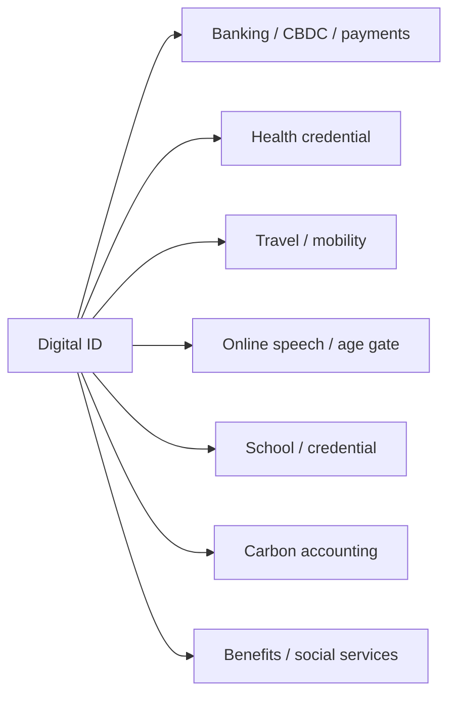
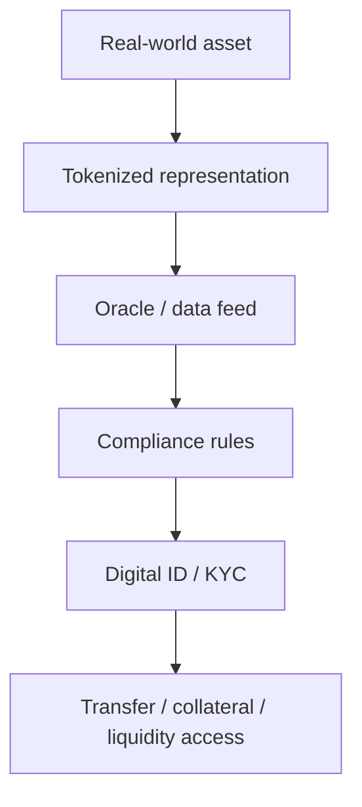

# Báo Cáo 2030: Agenda 2030 Và Kiến Trúc Cấp Quyền

**Agenda 2030 không cần được đọc như một âm mưu cartoon. Nó đáng đọc như một hệ điều hành quản trị đang hiện hình qua các mảnh tưởng như rời rạc: khí hậu, y tế, tiền tệ số, danh tính số, thành phố thông minh, dữ liệu hành vi, ESG, AI governance và ngôn ngữ đạo đức. Bề mặt là phát triển bền vững. Tầng sâu là câu hỏi: ai được quyền đo, chấm điểm, cấp quyền và tắt quyền?**

*Agenda 2030 is less useful as a cartoon conspiracy and more useful as a governance operating system: climate, health, digital money, digital identity, smart cities, behavioral data, ESG, AI governance, and moral language converging into permission architecture.*

---

## Vault Position / Vị Trí Trong Vault

Bài này là cầu nối giữa [[Elite]], [[Ma Trận - Giải Phẫu Hoàn Chỉnh]], [[Kiểm Soát Tâm Trí]], [[Tiền Giấy - Tiền Mặt]], [[Gen Z và CBDC - Programmable Money Psychology]], [[Digital ID Normalization - From Instagram to Government ID]], [[Climate Anxiety as Control - Fear-Based Compliance]] và [[Chainlink - Mắt Xích Của Tokenized World]].

Nó không nói rằng mọi dòng trong tài liệu 2030 đều là một mệnh lệnh bí mật. Nó nói rằng một số language, incentive và infrastructure đang hội tụ thành cùng một dạng xã hội: **xã hội truy cập có điều kiện**.

Nói gọn:

> Không chỉ là `you will own nothing`.
>  
> Sâu hơn là `you will access everything through rails`.

---

## Evidence Discipline / Cách Đọc

| Tầng claim | Đọc như gì | Ví dụ |
|---|---|---|
| Fact / documentable | tài liệu, pilot, policy, statement công khai | UN SDGs, CBDC pilots, digital ID programs, smart-city procurement, ESG reporting, climate accounting |
| Pattern / systems | incentive và hạ tầng khác nhau cùng kéo về một hướng | identity, money, health, carbon, speech, mobility cùng cần account / score / compliance |
| Symbol / myth | ngôn ngữ cứu thế tạo consent cảm xúc | sustainable, inclusive, resilient, safe, equitable, build back better |
| Speculative synthesis | vault model để nối các mảnh | permission architecture, managed civilization, soft social credit, Matrix attractor |

Kỷ luật quan trọng: **hội tụ hạ tầng không đồng nghĩa với chứng minh một kế hoạch hoàn chỉnh đã chắc chắn vận hành toàn cầu.**

Không phải mọi mục tiêu bề mặt đều xấu. Giảm nghèo, y tế tốt hơn, môi trường sạch hơn, thành phố an toàn hơn đều là mục tiêu đẹp. Câu hỏi của vault không phải “mục tiêu đẹp có xấu không?”. Câu hỏi là:

> Mục tiêu đẹp đang được dùng để hợp thức hóa loại hạ tầng nào?

Nếu hạ tầng đó tạo thêm quyền tự chủ, redundancy và local resilience, nó có thể tốt. Nếu hạ tầng đó tập trung quyền đo, quyền cấp phép, quyền khóa tài khoản và quyền định nghĩa đạo đức vào vài lớp platform-state-finance, nó trở thành risk architecture.

---

## Từ Khóa Cần Hiểu

- **Agenda 2030 / SDGs:** bộ mục tiêu phát triển bền vững của Liên Hợp Quốc đến năm 2030.
- **Permission architecture:** kiến trúc xã hội nơi quyền truy cập dịch vụ, tiền, di chuyển, y tế, giáo dục hoặc tiếng nói phụ thuộc vào xác minh, điểm số hoặc điều kiện.
- **Access rails:** các đường ray hạ tầng mà mọi hành vi phải đi qua: ID, payment, app, account, API, compliance layer.
- **Programmable money:** tiền có thể được lập trình điều kiện sử dụng, thời hạn, phạm vi hoặc trạng thái account.
- **Digital ID:** danh tính số dùng để xác minh con người trước platform, ngân hàng, nhà nước hoặc dịch vụ xã hội.
- **ESG / carbon accounting:** framework đo lường đạo đức môi trường-xã hội-quản trị của tổ chức, và có thể mở rộng sang hành vi cá nhân.
- **Matrix attractor:** trường hút hệ thống khiến nhiều actor độc lập cùng dùng một grammar thời đại dù không cần ngồi chung một phòng.

---

## 1. Agenda 2030 Không Phải Một Document. Nó Là Một Stack.

Sai lầm phổ biến là đọc Agenda 2030 như một tờ giấy duy nhất. Một người phản biện lấy tài liệu UN ra, thấy toàn chữ đẹp: poverty reduction, health, education, clean water, equality, climate action. Rồi kết luận: “Có gì đâu mà sợ?”

Một người conspiracy quá đà thì đọc cùng tài liệu đó và nói: “Đây là bản kế hoạch nô lệ hóa nhân loại.” Nhưng nếu chỉ dừng ở câu đó, bài đọc cũng yếu. Nó biến một hệ thống phức tạp thành cartoon.

Cách đọc sắc hơn là đọc 2030 như một **stack**:

```mermaid
flowchart TD
    A["Moral language: sustainability / inclusion / safety"]
    B["Measurement: ESG / carbon / health / behavior data"]
    C["Identity: digital ID / account layer"]
    D["Money: CBDC / programmable payments / banking rails"]
    E["Space: smart cities / mobility / sensors"]
    F["Information: trust & safety / AI moderation / narrative scoring"]
    G["Access: permission society"]
    A --> B
    B --> C
    C --> D
    C --> E
    C --> F
    D --> G
    E --> G
    F --> G
```

Một mảnh riêng lẻ có thể vô hại, thậm chí hữu ích. Digital ID giúp chống fraud. CBDC có thể giảm friction thanh toán. Smart city có thể tối ưu traffic. Health credential có thể xử lý emergency. Carbon accounting có thể đo pollution. AI moderation có thể giảm spam.

Nhưng khi các mảnh này **interoperate**, câu hỏi đổi hoàn toàn.

Không còn là “app này tiện không?”. Mà là:

> Nếu identity là chìa khóa, money là van dòng chảy, city là sensor grid, health là điều kiện truy cập, carbon là điểm đạo đức, và AI là tầng chấm điểm, thì con người còn đứng bên ngoài hệ thống để phản biện nó không?

Đây là điểm quan trọng: power trong kỷ nguyên mới không nhất thiết cần cảnh sát đứng trước cửa. Power có thể là giao diện báo:

`access denied`

---

## 2. Sustainable Development Là Moral Wrapper

Ngôn ngữ “sustainable development” rất khó phản đối. Ai muốn bị gắn nhãn chống bền vững? Ai muốn chống inclusion? Ai muốn chống safety? Ai muốn chống public health?

Đây là sức mạnh của moral wrapper: nó biến policy thành đạo đức.

| Bề mặt | Tầng hạ tầng cần đọc |
|---|---|
| sustainability | ai đo bền vững, đo bằng chỉ số nào, ai bị phạt nếu không đạt |
| inclusion | inclusion vào hệ thống nào, có quyền không tham gia không |
| safety | ai định nghĩa nguy hiểm, ai được quyền chặn |
| resilience | resilience cho cộng đồng hay resilience cho hệ thống quản trị |
| equity | bình đẳng quyền lực hay bình đẳng dependency |
| public health | chăm sóc sức khỏe hay medical permission |
| misinformation control | bảo vệ sự thật hay cấp phép speech |

Không phải moral language tự nó xấu. Nhưng moral language là lớp vỏ hoàn hảo cho control vì nó khiến người phản biện trông như kẻ vô đạo đức trước khi cuộc tranh luận bắt đầu.

Một governance system hiện đại không nói: “Chúng tôi muốn kiểm soát bạn.”

Nó nói:

- để bảo vệ trẻ em;
- để chống fraud;
- để cứu khí hậu;
- để giảm bất bình đẳng;
- để chống misinformation;
- để tăng convenience;
- để xã hội resilient hơn.

Từng câu nghe hợp lý. Nhưng khi mọi câu đều dẫn đến cùng một hướng: thêm tracking, thêm account dependency, thêm compliance, thêm scoring, thêm gateway, thì pattern cần được nhìn thẳng.

---

## 3. Từ Ownership Sang Access

Câu nổi tiếng `you will own nothing and be happy` thường bị đọc quá literal. Vấn đề không chỉ là không sở hữu nhà hay xe. Vấn đề sâu hơn là **đời sống chuyển từ ownership sang access**.

Ownership nghĩa là bạn có một phần đời sống nằm ngoài platform. Access nghĩa là bạn dùng được thứ gì đó khi hệ thống cho phép.

| Vùng đời sống | Ownership logic | Access logic |
|---|---|---|
| Nhà ở | sở hữu / quyền cư trú tương đối ổn định | rent, subscription, smart lease, score-based access |
| Tiền | bearer asset, cash, self-custody | account balance qua rails có thể freeze / limit / expire |
| Identity | con người có quyền trước hệ thống | account xác minh mới có quyền dùng dịch vụ |
| Di chuyển | tự do đi lại mặc định | carbon budget, health status, ID gate, mobility pass |
| Speech | quyền nói mặc định | trust & safety score, platform policy, AI moderation |
| Y tế | consent cá nhân | compliance credential để học, làm, đi lại |
| Giáo dục | tri thức đa nguồn | worldview standardized qua curriculum + AI tutor |
| Thực phẩm | local food, farm, market | supply-chain scoring, synthetic/approved diet, ration logic |

Access không luôn xấu. Thuê xe có thể tiện hơn mua xe. Cloud có thể tiện hơn server riêng. App có thể tiện hơn giấy tờ. Nhưng nếu mọi thứ đều access, và access đều đi qua một vài rails, thì **quyền sống biến thành quyền đăng nhập**.

Đó là sự chuyển dịch mà 2030 cần được đọc kỹ.

Không phải “ngày mai họ lấy hết tài sản”. Mà là đời sống dần quen với trạng thái:

> Mình không sở hữu tầng nền. Mình chỉ có quyền dùng tạm khi account còn good standing.

---

## 4. Digital ID Là Chìa Khóa Của Stack

[[Digital ID Normalization - From Instagram to Government ID]] là một mảnh quan trọng vì digital ID không bắt đầu từ nhà nước. Nó bắt đầu từ platform culture.

Trước khi government ID trở thành bình thường, Gen Z đã được huấn luyện qua:

- verified badge;
- real-name pressure;
- KYC để dùng fintech;
- age verification;
- creator verification;
- account recovery;
- social login;
- one account cho nhiều dịch vụ;
- reputation score mềm qua follower, rating, review, like.

Digital ID được bán như tiện lợi. Và nó thật sự tiện. Nhưng chính vì tiện nên nó nguy hiểm hơn một policy cưỡng bức thô.

Một khi ID trở thành base layer, các layer khác có thể móc vào:

Câu hỏi không phải “ID có ích không?”. Có.

Câu hỏi là:

> Có tồn tại quyền sống offline không? Có tồn tại quyền không bị liên thông mọi hành vi vào một hồ sơ duy nhất không? Có tồn tại due process khi access bị khóa không?

Nếu câu trả lời là không, digital ID không còn là giấy tờ. Nó là chìa khóa của [[Ma Trận - Giải Phẫu Hoàn Chỉnh|Ma Trận]] phiên bản hành chính.

---

## 5. CBDC Và Programmable Money: Tiền Thành Van Điều Khiển

[[Tiền Giấy - Tiền Mặt]] là privacy layer cuối cùng của người thường. Tiền mặt không hoàn hảo, nhưng nó có một tính chất chính trị rất mạnh: nó hoạt động không cần account.

Khi xã hội cashless, mọi giao dịch thành dữ liệu. Khi tiền đi qua rails, rails có thể thêm điều kiện. Khi tiền programmable, điều kiện có thể đi vào chính đơn vị tiền.

| Cash / bearer asset | Programmable rails |
|---|---|
| giao dịch không cần permission trực tiếp | giao dịch qua account / provider |
| khó freeze tức thì ở cấp cá nhân | có thể freeze, limit, flag |
| không cần internet | phụ thuộc hạ tầng số |
| không mặc định tạo behavioral profile | mặc định tạo data trail |
| peer-to-peer | platform-mediated |

Không phải mọi CBDC đều tự động thành tyranny. Nhưng CBDC nằm trong cùng stack với digital ID, ESG, carbon, AI scoring, banking compliance và financial surveillance. Tách riêng từng mảnh sẽ làm nó có vẻ technical. Ghép lại, nó trở thành câu hỏi quyền lực.

[[Gen Z và CBDC - Programmable Money Psychology]] đọc phần tâm lý: một thế hệ lớn lên với in-app currency, subscription, game points, buy-now-pay-later, fintech UX sẽ dễ xem programmable money như bình thường.

Điểm đáng sợ không phải là “tiền số”. Bitcoin cũng là tiền số. Điểm đáng sợ là **tiền số có chủ quyền ngược**: không phải cá nhân sở hữu private key, mà hệ thống sở hữu permission rail.

---

## 6. Tokenized World: Khi Tài Sản Thành API

[[Chainlink - Mắt Xích Của Tokenized World]] mở ra một tầng khác: tokenization.

Tokenization có mặt sáng. Nó có thể làm thị trường minh bạch hơn, settlement nhanh hơn, fractional ownership dễ hơn, và asset di chuyển hiệu quả hơn.

Nhưng nếu mọi tài sản thành token, mọi token cần oracle, mọi oracle cần data feed, mọi transfer cần compliance, và mọi compliance cần identity, thì ownership cũng bị kéo vào access logic.

Tài sản khi đó không chỉ là thứ bạn sở hữu. Nó là object trong một hệ thống có rule engine.

Đây không phải lời kêu gọi chống công nghệ. Vault không anti-tech. Vấn đề là: technology phục vụ sovereignty hay phục vụ managed access?

Một tokenized world có thể là free-market upgrade. Nó cũng có thể là programmable ownership.

Khác biệt nằm ở:

- self-custody hay custodied access;
- open protocol hay permissioned rail;
- privacy by design hay surveillance by default;
- exit option hay total dependency;
- local law / due process hay terms-of-service governance.

---

## 7. Climate As Compliance

Khí hậu là một trong những moral wrappers mạnh nhất thế kỷ 21. Câu “cứu hành tinh” có sức mạnh tôn giáo. Nó tạo cảm giác rằng phản biện policy là phản bội tương lai.

Nhưng cần tách hai tầng:

| Tầng sinh thái thật | Tầng compliance |
|---|---|
| nước sạch, đất khỏe, rừng, local food, giảm ô nhiễm thật | carbon score cá nhân, rationing, mobility limit, consumption shame |
| accountability cho tập đoàn và nhà nước | guilt transfer sang cá nhân |
| local resilience | global technocratic dashboard |
| environmental stewardship | behavioral permission system |

[[Climate Anxiety as Control - Fear-Based Compliance]] quan trọng vì fear là chất dẫn điện của governance. Khi con người sợ đủ lâu, họ dễ đổi tự do lấy cảm giác được bảo vệ.

Vấn đề không phải “khí hậu có thật hay không” trong phạm vi bài này. Vấn đề là:

> Climate language có đang được dùng để chuyển quyền quyết định từ cộng đồng sống với đất sang dashboard quản trị hành vi không?

Nếu một chính sách làm đất sạch hơn, nước tốt hơn, nông dân mạnh hơn, cộng đồng tự chủ hơn, nó khác với một chính sách biến người dân thành carbon profile cần được permission để bay, ăn, mua, sống.

Một bên là stewardship. Một bên là compliance.

---

## 8. Health Passport Và Medical Permission

COVID era cho thế giới một demo lớn: y tế có thể trở thành access layer.

Trước đó, nhiều người nghĩ y tế là quan hệ giữa cá nhân, bác sĩ, cộng đồng và rủi ro sinh học. Sau COVID, y tế trở thành cổng vào:

- đi làm;
- đi học;
- đi máy bay;
- vào nhà hàng;
- tham gia sự kiện;
- giữ account;
- nói gì trên platform.

Một lần nữa, không cần phủ nhận bệnh truyền nhiễm để thấy pattern. Emergency có thể thật. Nhưng câu hỏi governance vẫn phải hỏi:

> Emergency có trở thành template không?

Health sovereignty không có nghĩa là “không bao giờ dùng y tế hiện đại”. Nó nghĩa là quyền consent, quyền đặt câu hỏi, quyền chọn phương án, quyền không bị biến thành outcast vì không đồng ý với một protocol đang đổi theo thời gian.

Khi health credential gắn với digital ID, employment, travel và payment, quyền từ chối không còn là quyền thật. Nó trở thành lựa chọn giữa compliance và social death.

Đây là lý do 2030 không thể đọc riêng ở tầng climate hay finance. Nó phải đọc như stack.

---

## 9. Smart City: Khi Không Gian Thành Interface

Smart city được bán bằng efficiency: đèn thông minh, camera an ninh, giao thông tối ưu, năng lượng tiết kiệm, dịch vụ công nhanh hơn.

Một phần là thật. Thành phố ngu cũng không phải tự do. Kẹt xe, ô nhiễm, tội phạm, giấy tờ thủ công đều có chi phí thật.

Nhưng smart city cũng biến không gian vật lý thành interface:

- camera đọc biển số và khuôn mặt;
- sensor đo lưu lượng người;
- app quyết định quyền dùng dịch vụ;
- mobility pass quản lý di chuyển;
- zoning số hóa hành vi;
- dynamic pricing điều khiển lựa chọn;
- policing dự đoán biến cư dân thành risk score.

Khi thành phố thành interface, quyền tự do không còn là khái niệm trừu tượng. Nó nằm trong UX.

Bạn được vào đâu? Bạn được đi lúc nào? Bạn được trả bằng gì? Bạn bị flag vì hành vi nào? Bạn appeal với ai? Có cash lane không? Có offline option không? Có human override không?

Đây là những câu hỏi chính trị của smart city.

---

## 10. AI Governance Và Trust & Safety

Agenda 2030 thường được đọc qua climate và money, nhưng information layer mới là lớp tinh tế nhất.

Một xã hội cấp quyền không chỉ cần kiểm soát giao dịch. Nó cần kiểm soát **meaning**.

Nếu người dân còn quyền đặt câu hỏi, quyền so sánh tài liệu, quyền chế giễu slogan, quyền nói “tôi không tin”, thì permission architecture luôn bị rò. Vì vậy information layer phải được bọc bằng ngôn ngữ:

- misinformation;
- disinformation;
- hate speech;
- safety;
- harm reduction;
- trust;
- authoritative sources;
- platform integrity.

Một phần các vấn đề này là thật. Spam thật. Lừa đảo thật. Bot thật. Propaganda thật. Nhưng solution có thể trượt từ chống thao túng sang cấp phép nhận thức.

[[Kiểm Soát Tâm Trí]] trong kỷ nguyên cũ là propaganda broadcast. Trong kỷ nguyên mới, nó là feed architecture + moderation policy + AI summary + search ranking + social penalty.

Không cần đốt sách nếu search không hiện. Không cần cấm câu hỏi nếu AI trả lời thay bạn bằng “safe consensus”. Không cần bắt ai im nếu account risk tăng mỗi lần họ nói lệch grammar.

---

## 11. Gen Z Là Target Mềm Của Access Society

[[Gen Z - Phân Tích Phản Biện]] không nên bị đọc như blame thế hệ. Gen Z không tạo ra stack này. Họ sinh vào nó.

Một người lớn lên trước internet còn nhớ:

- tiền mặt;
- mua đứt phần mềm;
- không cần account để đọc tin;
- không cần app để gọi xe;
- không cần verification để nói chuyện;
- không cần cloud để lưu ảnh;
- không cần subscription cho mọi thứ.

Gen Z lớn lên trong logic khác:

| Conditioning | Tâm lý tạo ra |
|---|---|
| app hóa mọi thứ | đời sống mặc định đi qua interface |
| subscription economy | không sở hữu cũng bình thường |
| cashless | privacy tài chính trở nên lạ |
| verified status | danh tính cần platform công nhận |
| social score mềm | giá trị bản thân qua metric |
| climate anxiety | compliance được cảm nhận như đạo đức |
| AI companion / tutor | authority chuyển từ người sang system |

Cái thế hệ cũ gọi là control, thế hệ mới có thể gọi là UX.

Đây là lý do 2030 không cần cưỡng bức quá nhiều. Nếu một thế hệ được nuôi trong account dependency, permission society có thể đến như một upgrade tiện lợi.

---

## 12. Matrix Attractor: Không Cần Một Phòng Họp Duy Nhất

Một lỗi của conspiracy discourse là tưởng mọi thứ phải có một nhóm người ngồi trong phòng ra lệnh từng chi tiết. Có thể có coordination. Có thể có elite networks. Nhưng hệ thống hiện đại còn tinh vi hơn: nó có **attractor**.

Matrix attractor nghĩa là nhiều actor khác nhau cùng bị kéo về một grammar vì incentive giống nhau:

- nhà nước muốn quản lý rủi ro;
- ngân hàng muốn compliance và fee rails;
- Big Tech muốn identity và data;
- NGO muốn funding và moral mandate;
- academia muốn grant và policy relevance;
- media muốn narrative alignment;
- corporations muốn ESG legitimacy;
- security agencies muốn visibility;
- citizens muốn convenience và safety.

Không cần mọi người phải “biết toàn bộ kế hoạch”. Mỗi actor chỉ cần làm phần có lợi cho mình. Kết quả cuối vẫn có thể là cùng một architecture.

Đây là cách [[Spectacle Ritual - World Cup, Super Bowl Và Nghi Lễ Đồng Bộ Đại Chúng|Spectacle Ritual]] và governance gặp nhau: media không chỉ đưa tin, nó chuẩn bị ý nghĩa. Policy không chỉ quản lý, nó rehearsal đời sống mới. Symbol không chỉ trang trí, nó là interface của vô thức tập thể.

Nói cách khác:

> Media không chỉ đưa tin. Media chuẩn bị ý nghĩa.  
> Policy không chỉ giải quyết vấn đề. Policy tập cho xã hội sống trong một grammar mới.  
> Symbol không chỉ trang trí. Symbol là interface của vô thức tập thể.

---

## 13. What This Is Not

Để bài này không rơi vào overclaim, cần nói rõ:

- Không phải mọi người làm trong UN, WEF, ngân hàng, tech, y tế hay climate đều là “agent xấu”.
- Không phải mọi mục tiêu SDG đều là lừa đảo.
- Không phải mọi digital ID, CBDC, smart city hay AI governance đều chắc chắn thành social credit.
- Không phải mọi thứ sẽ xảy ra đúng timeline 2030.
- Không phải một screenshot hoặc quote đủ để chứng minh toàn bộ thesis.

Vault đọc ở tầng systems. Một người có thể thật lòng muốn giúp người nghèo nhưng vẫn phục vụ một architecture tăng dependency. Một kỹ sư có thể chỉ muốn chống fraud nhưng sản phẩm của anh ta trở thành identity gate. Một nhà hoạt động khí hậu có thể thật lòng yêu thiên nhiên nhưng language của phong trào bị dùng để justify carbon bureaucracy.

Đó là bi kịch của Matrix attractor: ý định cá nhân không đủ để cứu architecture.

---

## 14. Resistance: Không Chống Stack Bằng Fantasy

Chống permission architecture không phải là la hét “NWO” rồi sống phụ thuộc y nguyên vào mọi app.

Chống bằng redundancy.

### Financial redundancy

Giữ một phần đời sống tài chính ngoài một rail duy nhất:

- một phần cash;
- một phần self-custody nếu hiểu rủi ro;
- hiểu [[Bitcoin]] và privacy thay vì chỉ chase number;
- không để toàn bộ đời sống phụ thuộc một bank / một app / một exchange.

### Identity redundancy

Đừng để một account là cửa vào mọi thứ:

- backup documents;
- nhiều kênh liên lạc;
- domain riêng nếu làm public work;
- hạn chế social login cho các account quan trọng;
- hiểu rằng convenience thường đổi bằng dependency.

### Health redundancy

[[MOC - Health Sovereignty|Health Sovereignty]] là chính trị ở tầng sinh học:

- ngủ, ăn, vận động, ánh nắng, metabolic health;
- hiểu quyền consent;
- giữ khả năng tự chăm sóc cơ bản;
- không biến cơ thể thành outsourcing hoàn toàn cho medical system.

### Community redundancy

Một cá nhân cô lập rất dễ bị account hóa. Cộng đồng thật tạo exit option:

- local food;
- quan hệ tin cậy;
- skill exchange;
- offline meeting;
- gia đình và bạn bè không trung gian qua platform.

### Meaning redundancy

Đừng outsource nhận thức cho feed:

- đọc tài liệu gốc;
- giữ [[Source Discipline - Kỷ Luật Nguồn Và Bằng Chứng|Source Discipline]];
- phân biệt fact / pattern / symbol / speculation;
- học cách nói “tôi chưa biết” thay vì nuốt narrative sẵn.

---

## 15. Synthesis / Tổng Hợp

Agenda 2030 không cần được tin như lời tiên tri. Nó cần được đọc như một map của grammar quản trị mới.

Điểm cốt lõi không phải là một ngày năm 2030 mọi thứ đổi màu. Điểm cốt lõi là trước 2030, xã hội đã được tập sống trong những rails mới:

- muốn dùng dịch vụ thì cần account;
- muốn account thì cần identity;
- muốn giao dịch thì cần compliance;
- muốn di chuyển thì cần status;
- muốn nói thì cần trust score;
- muốn sở hữu thì cần token / registry / permission;
- muốn phản biện thì phải vượt qua moral wrapper.

Đây là architecture của access society.

Nó không đến bằng một cánh cửa sắt. Nó đến bằng app tiện hơn, slogan đẹp hơn, UX mượt hơn, dashboard sạch hơn, và cảm giác rằng ai phản đối là người lạc hậu, nguy hiểm, ích kỷ hoặc chống tiến bộ.

Vì vậy câu hỏi không phải “Agenda 2030 có thật không?”. Tài liệu thì thật. Policy thì thật. Pilot thì thật. Hạ tầng thì đang được xây ở nhiều nơi.

Câu hỏi đúng hơn là:

> Những mảnh thật đó đang ghép thành loại xã hội nào?

Nếu câu trả lời là một xã hội nơi con người có nhiều sức khỏe hơn, nhiều local resilience hơn, nhiều quyền sở hữu hơn, nhiều privacy hơn, nhiều lựa chọn hơn, thì đó là phát triển thật.

Nếu câu trả lời là một xã hội nơi mọi quyền đi qua ID, payment rail, health status, carbon score, platform policy và AI governance, thì tên gọi đẹp nhất cũng không thay đổi bản chất:

**đó là Ma Trận cấp quyền.**

---

## Related / Đọc Tiếp

- [[Elite]]
- [[Ma Trận - Giải Phẫu Hoàn Chỉnh]]
- [[Tiền Giấy - Tiền Mặt]]
- [[Gen Z và CBDC - Programmable Money Psychology]]
- [[Digital ID Normalization - From Instagram to Government ID]]
- [[Chainlink - Mắt Xích Của Tokenized World]]
- [[Climate Anxiety as Control - Fear-Based Compliance]]
- [[Source Discipline - Kỷ Luật Nguồn Và Bằng Chứng]]
