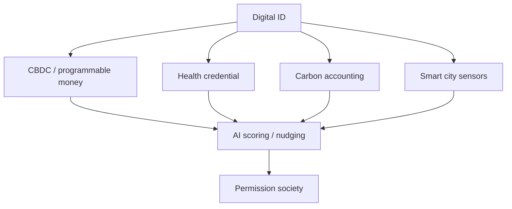

# Báo Cáo 2030: Tầm Nhìn Kỷ Nguyên Mới / Agenda 2030

**Agenda 2030 nên được đọc như một stack hạ tầng quản trị: khí hậu, y tế, tiền tệ, danh tính số, thành phố thông minh, dữ liệu hành vi và truyền thông đạo đức được ghép lại thành permission architecture.** Bề mặt là phát triển bền vững; câu hỏi vault giữ lại là: ai nắm quyền đo, chấm điểm, cấp quyền và tắt quyền?

*Agenda 2030 is best read as a governance infrastructure stack: climate, health, money, digital identity, smart cities, behavioral data, and moral language merged into permission architecture.*

---

## Evidence Discipline / Cách Đọc

| Tầng claim | Cách đọc |
|---|---|
| Fact | UN SDGs, WEF language, CBDC pilots, digital ID programs, smart-city policy, climate accounting |
| Pattern | nhiều policy khác nhau cùng hướng tracking, scoring, compliance, nudging |
| Symbol | "sustainable", "inclusive", "resilience", "build back better" như ngôn ngữ đồng thuận |
| Speculative synthesis | New World Order, social credit toàn cầu, full-spectrum control là vault model, cần tách khỏi document fact |

Không phải mọi mục tiêu bề mặt đều xấu. Giảm nghèo, y tế tốt, môi trường sạch là mục tiêu đẹp. Điểm cần đọc là **hạ tầng nào được dựng dưới khẩu hiệu đẹp**.

Bài này vì vậy không dùng Agenda 2030 như một nhãn dán cho mọi điều xấu. Nó đọc các lớp hạ tầng đang hội tụ. Nếu một claim chỉ có ngôn ngữ policy, nó nằm ở tầng fact/documentable. Nếu claim nói về social credit toàn cầu hoặc New World Order, nó nằm ở tầng synthesis và cần giữ đúng trọng lượng.

---

## Source Register / Sổ Nguồn

Không gắn link giả, không trích dẫn mơ hồ. Khi cần hard-source bài này, dùng source category theo từng tầng claim:

| Nhóm nguồn | Dùng để kiểm gì | Không được dùng để làm gì |
|---|---|---|
| UN / SDG / treaty / policy documents | mục tiêu, thuật ngữ, chỉ tiêu, governance language | chứng minh toàn bộ âm mưu ẩn phía sau |
| WEF / central bank / BIS / IMF / CBDC papers | ngôn ngữ về digital money, identity, resilience, programmable infrastructure | kết luận chắc chắn mọi pilot sẽ thành rollout cưỡng bức |
| Luật, procurement, pilot program, vendor docs | hạ tầng thật đang được mua, thử nghiệm hoặc triển khai | suy diễn ý định tuyệt đối nếu tài liệu chỉ nói capability |
| Báo chí public-record / dữ liệu thị trường | timeline, tổ chức tham gia, funding, phản ứng xã hội | thay thế tài liệu gốc khi claim cần chính xác |
| Vault synthesis | đọc pattern hội tụ giữa ID, tiền, khí hậu, y tế, smart city, AI | đóng giả fact-level proof |

Kỷ luật đọc: **hội tụ hạ tầng không đồng nghĩa với kế hoạch hoàn chỉnh đã chắc chắn vận hành toàn cầu.** Nó là risk architecture: đáng theo dõi vì các mảnh có khả năng ghép lại, không phải vì mọi chi tiết đã được chứng minh như bản thiết kế cuối cùng.

---

## Vault Position / Vị Trí Trong Vault

Bài này nối [[Elite]], [[Tiền Giấy - Tiền Mặt]], [[Gen Z và CBDC - Programmable Money Psychology]], [[Digital ID Normalization - From Instagram to Government ID]], [[Climate Anxiety as Control - Fear-Based Compliance]] và [[Kiểm Soát Tâm Trí]]. Đây là policy map, không phải danh sách "mọi thứ chắc chắn sẽ xảy ra".

---

## Stack 2030 / The Control Stack

Một mảnh riêng lẻ có thể được bán như tiện lợi. Khi ghép lại, nó thành hệ thống: danh tính biết bạn là ai, tiền biết bạn được mua gì, city biết bạn đi đâu, health pass biết bạn có "đủ điều kiện" không, carbon score biết bạn có "đạo đức" không.

Điểm nguy hiểm không nằm ở một app riêng lẻ. Điểm nguy hiểm nằm ở khả năng liên thông: identity làm chìa khóa, money làm van dòng chảy, data làm hồ sơ hành vi, AI làm tầng chấm điểm, và moral language làm lớp miễn dịch chính trị. Khi đã thành stack, người dân không còn tranh luận với một chính sách; họ phải sống bên trong một giao diện.

---

## Cashless Và CBDC

[[Tiền Giấy - Tiền Mặt]] là privacy layer cuối cùng của người thường. Khi xã hội cashless hoàn toàn, mọi giao dịch thành dữ liệu. Khi tiền trở thành programmable, dữ liệu có thể biến thành điều kiện.

| Tiền mặt | Programmable money |
|---|---|
| anonymous by default | tracked by default |
| khó chặn tức thì | có thể freeze, expire, geofence |
| peer-to-peer | platform-mediated |
| không cần account | cần identity layer |

Đây là lý do [[Privacy Is The New Wealth]] không phải khẩu hiệu crypto. Nó là câu hỏi quyền công dân.

Không phải mọi hệ thống thanh toán số đều là tyranny. Nhưng một xã hội không còn phương án offline, không còn tiền bearer, không còn cách giao dịch không bị platform ghi lại, thì đã đổi một phần tự do lấy UX. Đổi bao nhiêu, ai được quyền đổi, và có đường quay lại không là câu hỏi chính trị.

---

## Digital ID: Từ Tiện Lợi Đến Cửa Khóa

Digital ID được bán bằng tiện lợi: đăng nhập nhanh, chống fraud, nhận phúc lợi, xác minh tuổi, bảo vệ trẻ em. Nhưng cùng một hạ tầng có thể trở thành cổng permission cho banking, travel, healthcare, education, internet speech.

[[Digital ID Normalization - From Instagram to Government ID]] cho thấy pattern: trước khi nhà nước yêu cầu, platform tập cho Gen Z quen với verification, badge, real-name pressure và account dependency.

---

## Climate As Compliance

Khí hậu là vùng moral language rất mạnh: ai phản biện policy dễ bị đóng khung là chống khoa học hoặc vô trách nhiệm. Nhưng policy khí hậu có thể đi theo hai hướng khác nhau:

| Hướng thật | Hướng kiểm soát |
|---|---|
| giảm ô nhiễm thực | carbon score cá nhân |
| bảo vệ đất, nước, rừng | rationing bằng app |
| local resilience | global technocratic management |
| accountability cho tập đoàn | guilt transfer sang cá nhân |

[[Climate Anxiety as Control - Fear-Based Compliance]] đọc phần psychological: fear làm con người dễ chấp nhận control nếu control được bán như cứu thế giới.

---

## Health Passport Và Medical Permission

COVID era cho thế giới một demo: y tế có thể trở thành access layer cho xã hội. Health credential ban đầu được giải thích bằng emergency; câu hỏi là emergency có trở thành template cho tương lai không.

Health sovereignty không phủ nhận bệnh truyền nhiễm. Nó hỏi: khi y tế, danh tính, đi lại, công việc và tài khoản gắn lại, quyền từ chối còn là quyền thật không?

---

## Gen Z Là Target Mềm

[[Gen Z - Phân Tích Phản Biện]] quan trọng vì thế hệ này lớn lên trong app, algorithm, cashless, digital status và climate anxiety. Cái mà thế hệ cũ gọi là kiểm soát, Gen Z có thể thấy là UX bình thường.

| Conditioning | Kết quả |
|---|---|
| app hóa mọi thứ | đời sống qua permission layer |
| subscription economy | không sở hữu, chỉ thuê |
| social credit mềm | reputation qua score, like, badge |
| AI tutor / AI friend | authority chuyển từ người sang system |
| cashless | mất kinh nghiệm privacy tài chính |

Đây không phải lỗi đạo đức của Gen Z. Đây là môi trường huấn luyện. Một thế hệ sinh ra trong subscription sẽ ít nhớ cảm giác sở hữu; một thế hệ sinh ra trong feed sẽ ít nhớ attention không bị broker; một thế hệ sinh ra trong verification sẽ ít thấy lạ khi quyền sống online cần giấy phép.

---

## Resistance / Đối Phó Thực Tế

Không chống stack bằng fantasy. Chống bằng redundancy:

1. giữ một phần cash và tài sản ngoài platform;
2. học self-custody, privacy, [[Bitcoin]] nếu phù hợp;
3. xây cộng đồng địa phương;
4. giảm dependency vào một account, một app, một cloud;
5. giữ sức khỏe để ít phụ thuộc medical permission;
6. dạy trẻ đọc propaganda, không chỉ dùng tech;
7. phân biệt môi trường thật với carbon bureaucracy.

---

## Core Insight / Chốt Lại

**Agenda 2030 không cần được đọc như một âm mưu cartoon. Nó nguy hiểm hơn khi được đọc như hạ tầng: từng mảnh đều có vẻ hợp lý, nhưng khi ghép lại có thể biến xã hội thành một hệ thống cấp quyền có điều kiện.**

*The danger is infrastructural: each piece can look reasonable alone, while the combined stack can turn society into conditional permission.*
