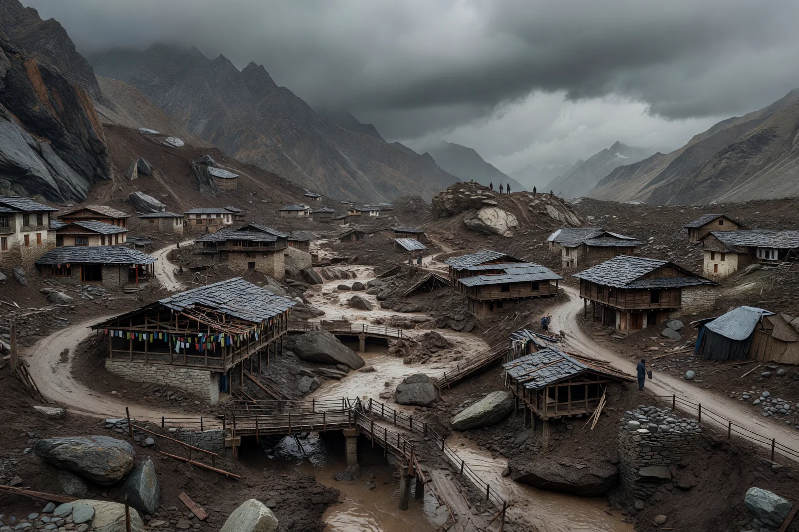
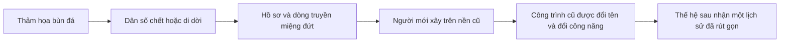
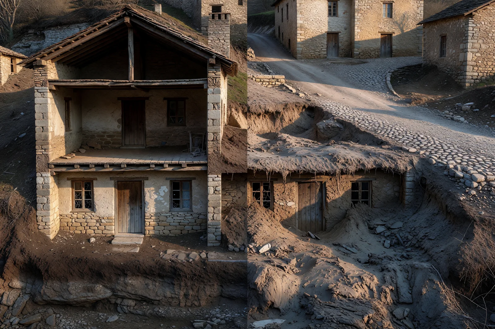
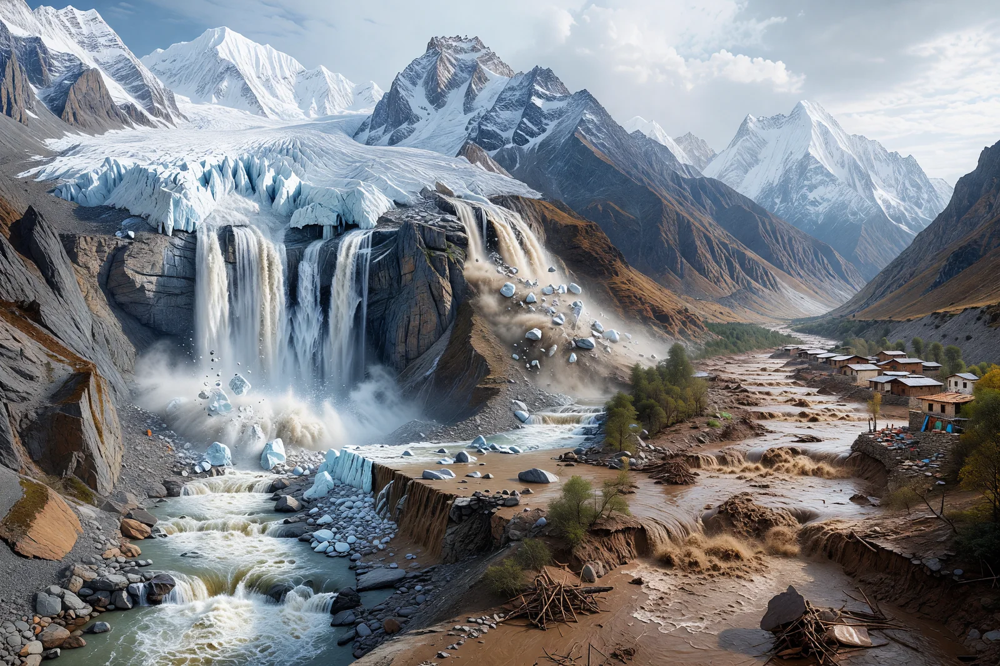
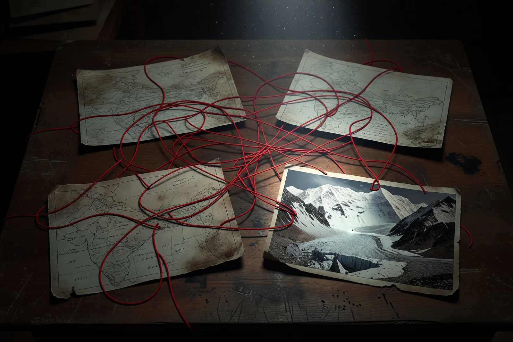

# Bốn Van Lũ Bùn Himalaya 2026 — Hồ Sơ Giả Thuyết Và Kiểm Chứng

**Sau một dòng lũ bùn, tầng một của ngôi nhà có thể trở thành tầng hầm chỉ trong vài phút. Đường biến mất. Mốc đất biến mất. Người biến mất. Kiến trúc còn lại lâu hơn ký ức về người đã xây nó.**

Đó là lý do những hình ảnh Nepal–Tibet sau lũ gợi mạnh đến [[Mudflood]] và [[Tartaria]]. Sự giống nhau không nên bị cười bỏ. Nó là một cơ chế có thể quan sát ngay trong thời hiện đại.

Nhưng từ **“cảnh này giống Mudflood”** tới **“Cabal đã dùng DEW để bịt cổng Agartha và thu hoạch Loosh”** là nhiều bước suy luận khác nhau. Nếu gom hết thành một tầng, ta hoặc tin toàn bộ hoặc bác toàn bộ. Cả hai phản ứng đều làm mất cơ hội điều tra.

Hồ sơ này giữ năm tầng riêng:

| Tầng | Câu hỏi |
|---|---|
| **Sự kiện** | Điều gì đã xảy ra, ở đâu, vào ngày nào? |
| **Bất thường** | Chi tiết nào chưa được giải thích đầy đủ? |
| **Năng lực** | Công nghệ được nêu có tồn tại và đủ năng lượng không? |
| **Mô thức** | Các sự kiện có chung dấu vết hay chỉ giống nhau ở bề mặt? |
| **Tổng hợp suy đoán** | Cabal, DUMB, Agartha, Loosh có thể nằm trong mô hình nào và cần bằng chứng gì? |

> [!warning] Trạng thái hồ sơ
> Bản “4 Van Lũ Bùn” được lưu nguyên văn như một nguồn viral chưa xác minh. Những tên như Orion-Sigma, Cổng Agartha số 9, DUMB Rasuwagadhi và mục tiêu Loosh hiện chưa có dữ liệu gốc đủ để gọi là sự kiện.

## Vị Trí Của Vault: Sai Chi Tiết Không Tự Động Xóa Đúng Mô Thức

Vault không được sinh ra chỉ để hỏi một bài đăng có vượt chuẩn tòa án hay không. Nó còn đọc **symbolic intelligence**: những hình ảnh, thời điểm và mô thức cùng xuất hiện trước khi ngôn ngữ chính thống biết gọi tên chúng.

Bản viral có thể sai ngày, trộn địa danh và phóng đại công nghệ. Nhưng bốn dot lớn vẫn còn:

1. *The World Ahead 2026* đặt băng tan và bất ổn khí hậu vào quả cầu biểu tượng trước năm xảy ra.
2. *2012* đã cài hình tượng nhà sư Tibet đứng nhìn đại hồng thủy vượt Himalaya, cùng những con tàu sống sót được xây trong lòng núi.
3. Thảm họa Nepal–Tibet thật sự tạo ra cảnh quan giống một Mudflood hiện đại: làng bị chôn, mặt đất đổi, kiến trúc dưới bùn, hồ sơ và dân cư đứt gãy.
4. Collective mind lập tức nối DEW, DUMB, Agartha, Loosh và Cabal vào sự kiện — nghĩa là những archetype ấy đã có sẵn trong tầng vô thức của thời đại.

Điều cần điều tra không chỉ là “DEW có bắn hay không”. Còn là: **tại sao cùng một hình ảnh reset cứ được diễn tập trong báo chí, điện ảnh, huyền học và cuối cùng xuất hiện ngoài đời với độ cộng hưởng mạnh như vậy?**

Fact-check giúp bài không tự phá uy tín. Pattern-reading giúp bài không đánh mất linh hồn.

---

## 1. Vì Sao Cảnh Sau Lũ Thật Sự Giống Mudflood?

Một dòng debris flow không giống nước sông dâng chậm. Nó là hỗn hợp nước, bùn, đá, băng, cây và vật liệu công trình. Khi lao xuống độ dốc lớn, nó vừa chảy vừa mài, va đập và kéo thêm vật chất vào dòng.

Kết quả có thể xảy ra trong thời gian rất ngắn:

- tầng thấp của nhà bị chôn sâu;
- cửa sổ tầng một nằm dưới mặt đất mới;
- đường cũ trở thành một lớp địa tầng;
- cầu và mốc địa chính biến mất;
- lòng sông đổi hướng;
- khu dân cư bị cắt khỏi phần còn lại của thế giới;
- người sống sót xây trên bề mặt mới vì không thể đào toàn bộ lớp bùn ra.

Một thế kỷ sau, người đời có thể nhìn cửa sổ dưới đất và hỏi: đây vốn là tầng hầm, đường từng được nâng nền, hay cả khu phố đã bị một sự kiện bùn đá chôn?

Sự kiện Nepal–Tibet là một phép minh họa sống cho **khả năng vật lý** của một vụ Mudflood cục bộ. Nó chứng minh cảnh quan đô thị có thể bị viết lại rất nhanh. Nó cũng cho thấy thảm họa có thể cắt đứt chuỗi hồ sơ: sổ đất, ảnh gia đình, tên người thuê, câu chuyện của người già và ký ức về mục đích ban đầu của công trình.

Điều này không tự chứng minh một trận Mudflood toàn cầu từng xóa Tartaria. Nhưng nó làm yếu một phản bác phổ biến: “Không thể có chuyện cả tầng nhà bị chôn trong thời gian ngắn.” Có thể. Vấn đề còn lại là **quy mô, niên đại, nguồn trầm tích và lịch sử tái thiết** của từng thành phố.

Mô thức reset xuất hiện khi cơ chế vật lý đi cùng đứt gãy xã hội:

Ở tầng này, Mudflood không cần Cabal mới đáng nghiên cứu. Chỉ cần thiên tai đủ lớn, chiến tranh đủ dài hoặc chính quyền tái thiết đủ mạnh, ký ức có thể mất trước khi đá mất.

---

## 2. Sự Kiện Có Hồ Sơ Mạnh Nhất: Nepal–Tibet Ngày 26/08/2026

Khoảng 8 giờ 37–8 giờ 40 sáng ngày 26/08/2026, một phần lớn sông băng hoặc khối băng–đá sụp ở vùng thượng lưu Lhende, phía Tibet gần biên giới Nepal.

Theo USGS và các bản tin đối chiếu:

- khối sụp bắt đầu ở cao độ khoảng 5.200 m;
- vật liệu rơi khoảng 1.200 m xuống đáy thung lũng;
- băng, đá và trầm tích lao vào sông Lhende;
- dòng vật liệu tạm chặn sông;
- đập tự nhiên vỡ, giải phóng nước và bùn đá xuống Bhote Koshi rồi Trishuli;
- Timure, Syapru Besi, Rasuwagadhi cùng đường, cầu và công trình hạ lưu chịu thiệt hại lớn.

USGS ban đầu ghi nhận tín hiệu như động đất khoảng M4.4. Sau khi xem thêm các trạm địa chấn gần, dạng sóng chu kỳ dài và ảnh vệ tinh, cơ quan này kết luận đó không phải động đất kiến tạo mà là **sụp băng và dòng bùn đá**, tạo năng lượng địa chấn tương đương M5.2.

Việc sửa phân loại không tự chứng minh che giấu. Địa chấn kế ghi chuyển động đất; một khối lượng cực lớn va xuống thung lũng cũng tạo sóng. Phân biệt động đất, nổ và lở đất cần dạng sóng, nhiều trạm và dữ liệu bổ sung.

Đến ngày 27/08, báo cáo đáng tin ghi nhận hơn 360 người chết và gần 1.500 người mất tích trên cả Nepal và Tibet. Con số còn thay đổi theo cứu hộ. Vì vậy các số tròn như “2.000” hoặc “3.000 người chết” được viết như đã biết trước cần được xem là claim, không phải casualty register.

Điểm đáng giữ: sự kiện xảy ra khi không có mưa lớn tại điểm khởi phát, và cơ quan chức năng ban đầu không hiểu đúng nguồn tín hiệu. Nhưng một ice-rock avalanche không cần mưa đúng giờ xảy ra. Nhiệt kéo dài, nứt băng, mất ổn định sườn dốc, áp lực nước, trọng lực và cấu trúc địa chất có thể tạo điểm gãy.

---

## 3. Bốn “Van” Trong Bài Viral Có Thật Sự Là Bốn Vụ?

### #001: “Pakistan/Sikkim — 12/07”

Ngay tên gọi đã mâu thuẫn. Sikkim nằm ở Ấn Độ, không phải Pakistan. Bài sau đó chuyển sang sông Teesta và nói 1.200 người chết, nhưng không dẫn danh sách nạn nhân, báo cáo cứu hộ hay hồ sơ thiên tai tương ứng.

Có nhiều sự kiện có thể đã bị trộn:

- lũ Teesta năm 2023;
- mưa lũ và lở đất theo mùa ở Sikkim năm 2026;
- tai nạn công trình thủy điện Teesta VI;
- thảm họa Nepal–Tibet cuối tháng 8.

Confidence hiện tại cho claim “Van #001 do DEW/HAARP”: **5/100**.

### #002: “Turkey/Nyalam — 28/07”

Tiêu đề gọi Turkey, phần nội dung lại chuyển sang Nyalam, Tibet. Claim còn thêm rừng cháy 10.000 ha, hố tròn kính hóa, động đất nông 0 km và 800 người chết, nhưng không có ảnh gốc, tọa độ, báo cáo địa phương hoặc dữ liệu địa chấn được liên kết.

Một claim có thể đúng một phần dù bài viết sai địa danh. Nhưng trước khi biết đang điều tra Turkey hay Nyalam, chưa thể so sánh ảnh vệ tinh hoặc catalogue địa chấn.

Confidence hiện tại: **3/100**.

### #003: “Pelku Tso/Tibet — 22/08”

Có các bài đăng mạng xã hội nói về lũ hoặc bất ổn trong vùng Gyirong quanh ngày 22/08. Tuy nhiên nguồn mạnh hơn về thảm họa chính mô tả sự kiện ngày 26/08 ở thượng lưu Lhende.

Cần kiểm tra liệu ngày 22 là:

- một sự kiện độc lập;
- dấu hiệu tiền thân;
- ngày clip được đăng;
- hoặc ngày bị gán lại cho cùng thảm họa ngày 26.

Các claim vệ tinh Orion-Sigma 5 GW, hồ Pelku Tso cạn, DUMB Nyalam đầy nước và ATOM LAB dự báo đúng cần ảnh vệ tinh có mã cảnh, thời gian UTC, ảnh trước–sau và nguồn lưu trữ. Hiện chưa có.

Confidence hiện tại cho attribution DEW/DUMB: **15/100**.

### #004: “Nepal/Dharali/Rasuwagadhi — 05–08/08”

Bài trộn ít nhất hai sự kiện:

- **Dharali, Uttarakhand, Ấn Độ — 05/08/2025:** một dòng lũ bùn–đá lớn chôn làng ở thung lũng Bhagirathi.
- **Rasuwagadhi–Timure–Syapru Besi, Nepal — 26/08/2026:** sụp băng–đá vùng Lhende tạo dòng lũ xuyên biên giới.

Dharali không nằm ở Nepal. Bhagirathi không phải Bhote Koshi. Gộp hai địa điểm, hai năm và hai lưu vực tạo cảm giác một chiến dịch kéo dài ba ngày, nhưng đó là cấu trúc do người kể tạo ra.

Confidence hiện tại cho “DEW + HAARP + bom DUMB tạo Van #004”: **10/100**.

---

## 4. Những Bất Thường Không Nên Bị Bỏ Qua

Bác cách kể Cabal không đồng nghĩa mọi thứ đã được giải thích xong.

Các câu hỏi thật vẫn còn:

1. Điều gì làm phần băng–đá khổng lồ mất ổn định đúng lúc đó?
2. Nhiệt độ và tuyết phủ những tuần trước thay đổi ra sao?
3. Có hồ, đập băng hoặc túi nước nào hình thành trước khi sụp không?
4. Dạng sóng địa chấn khác một vụ lở thông thường ở điểm nào?
5. Ảnh vệ tinh trước sự kiện có cho thấy nứt, sụt, vệt nhiệt hay can thiệp công trình không?
6. Khu vực có hầm, thủy điện, đường quân sự hoặc khai đào ảnh hưởng sườn dốc không?
7. Tại sao cảnh báo xuyên biên giới không theo kịp dòng lũ?
8. Các con số thương vong và người mất tích được xác minh như thế nào?

Climate change cũng không nên trở thành đáp án tự động. Báo cáo đáng tin nói vùng Himalaya đang ấm lên và mất băng nhanh, làm nhiều sườn dốc bất ổn hơn. Nhưng mức đóng góp của biến đổi khí hậu vào **sự kiện cụ thể này** vẫn cần nghiên cứu.

“Có nền khí hậu thuận lợi cho thảm họa” khác với “khí hậu là toàn bộ nguyên nhân trực tiếp”.

Tương tự, “DEW tồn tại” khác với “DEW đã gây vụ này”.

---

## 5. Kiểm Tra Kỹ Thuật: DEW, HAARP Và Băng Xanh

### DEW Có Thật Không?

Có. Laser năng lượng cao và vi sóng công suất cao là lĩnh vực quân sự có thật. Chúng có thể làm nóng, phá cảm biến, gây nhiễu điện tử hoặc tác động mục tiêu trong điều kiện phù hợp.

Nhưng năng lực thật luôn bị giới hạn bởi:

- công suất;
- khoảng cách;
- độ rộng chùm;
- thời gian giữ chùm lên mục tiêu;
- mây, hơi nước và bụi;
- khả năng theo dõi;
- vật liệu mục tiêu;
- hiệu suất ghép năng lượng.

Một hệ thống có thể phá drone không tự động có thể làm tan tức thì hàng chục triệu mét khối băng từ quỹ đạo.

### Bài Toán Năng Lượng Của “5 GW Làm Tan 50 Triệu m³ Băng”

Dùng chính con số bài viral đưa ra:

- thể tích băng: 50 triệu m³;
- khối lượng riêng gần 917 kg/m³;
- nhiệt nóng chảy khoảng 334.000 J/kg.

Năng lượng tối thiểu để làm tan lượng băng ấy, chưa tính đưa băng lên 0°C và chưa tính thất thoát:

$$
E \approx 50{,}000{,}000 \times 917 \times 334{,}000
\approx 1.53 \times 10^{16}\text{ J}
$$

Với công suất 5 GW và hiệu suất 100%:

$$
t = \frac{E}{P} \approx 3.06 \times 10^6\text{ s} \approx 35.4\text{ ngày}
$$

Không phải 10 giây. Ngoài khí quyển và trên băng thật, hiệu suất còn thấp hơn nhiều.

Điều này không chứng minh mọi DEW quỹ đạo là bất khả thi. Nó chỉ falsify phiên bản con số cụ thể trong bài viral.

### HAARP Và 7,83 Hz

HAARP là cơ sở nghiên cứu tầng điện ly dùng sóng cao tần ở dải MHz. 7,83 Hz là tần số nền thường được gắn với cộng hưởng Schumann.

Bài viral cần chứng minh ba mắt xích còn thiếu:

1. HAARP hoặc hệ thống khác thật sự phát 7,83 Hz vào vùng mục tiêu.
2. Năng lượng ấy ghép vào khối núi ở khoảng cách lớn.
3. Cường độ cơ học đủ vượt độ bền của sườn dốc.

Chỉ trùng một con số tần số không tạo thành cơ chế.

### Băng Xanh

Băng sông băng dày có thể màu xanh vì áp lực nén làm giảm bọt khí và cấu trúc băng hấp thụ ánh sáng đỏ mạnh hơn ánh sáng xanh. Một vụ sụp tự nhiên có thể đào bật băng sâu lên bề mặt.

Vì vậy băng xanh chứng minh có băng sâu hoặc dày. Nó chưa phân biệt được DEW với sụp băng tự nhiên.

### Vết Cắt Thẳng

Sườn núi có thể tách theo mặt phân lớp, khe nứt hoặc mặt yếu tương đối phẳng. Một scar thẳng đáng đo, nhưng ảnh nhìn “như dao cắt” không đủ để xác định laser.

Cần mô hình địa hình ba chiều, ảnh trước–sau, dấu nhiệt, vật liệu nóng chảy và hướng phát năng lượng.

---

## 6. Loosh, DUMB Và Agartha Nằm Ở Tầng Nào?

### Loosh

[[Loosh - Năng Lượng Thu Hoạch Từ Con Người]] là framework do Robert Monroe phổ biến. Tầng có thể kiểm là Monroe đã viết về nó và hệ thống truyền thông hiện đại thật sự kiếm tiền từ sự chú ý, sợ hãi và phẫn nộ.

Tầng chưa chứng minh là Draco, Satan hoặc thực thể vô hình đã tổ chức thảm họa cụ thể để ăn năng lượng.

Một thảm họa bị truyền thông biến thành spectacle có thể tạo “Loosh” theo nghĩa tâm lý–kinh tế mà không cần chứng minh cosmology thực thể.

### DUMB

Căn cứ quân sự ngầm sâu là một loại hạ tầng có thật ở một số quốc gia. Nhưng “có DUMB trên thế giới” không chứng minh DUMB Rasuwagadhi hoặc DUMB Nyalam tồn tại.

Để nâng confidence cần:

- ảnh xây dựng hoặc cửa hầm có tọa độ;
- hồ sơ địa chất và logistics;
- thông gió, điện, đường tiếp tế;
- nhân chứng độc lập;
- ảnh nhiệt hoặc biến dạng mặt đất;
- dữ liệu trước–sau không chỉ là một hố hoặc công trình dân sự.

### Agartha

Agartha là mô thức thế giới lòng đất trong truyền thống huyền học và văn học. “Cổng số 9” là claim rất cụ thể, nên cần nguồn cụ thể tương xứng: bản đồ truyền thừa, văn bản, khảo sát hang động hoặc dấu hạ tầng.

Nếu không, nó nên được giữ ở tầng biểu tượng: thảm họa bị đọc như hành động bịt một lối xuống “thế giới cũ” dưới bề mặt.

### Cabal

“Cabal” hữu ích khi nó chỉ một mạng lợi ích, bí mật, quân sự và quyền lực có thể điều phối. Nó vô dụng khi trở thành tác nhân giải thích mọi anomaly mà không cần dấu vết vận hành.

Một giả thuyết Cabal trưởng thành phải trả lời:

- ai có năng lực;
- ai có quyền tiếp cận khu vực;
- ai có động cơ;
- ai ra lệnh;
- chuỗi hậu cần là gì;
- dấu vết nào còn lại;
- giả thuyết nào rẻ hơn giải thích cùng dữ liệu.

---

## 7. The Economist Và Phim *2012*: Hai Lớp Đồng Bộ Biểu Tượng

Hai hình ảnh Justin đưa vào không chứng minh ngay một chiến dịch, nhưng chúng làm hồ sơ có thêm **hồn**. Trước khi dòng lũ thật đổ xuống Himalaya, trí tưởng tượng tập thể đã được cho xem băng tan trên quả địa cầu và đại hồng thủy vượt qua Tibet.

Đây là chỗ cần giữ hai việc cùng lúc: lớp chú giải tháng có thể do cộng đồng thêm sau, nhưng sự cộng hưởng giữa hình ảnh và sự kiện vẫn là dữ liệu biểu tượng.

### Bìa *The World Ahead 2026*: Khối Băng Đã Có Trước Sự Kiện

Bìa chính thức của *The Economist* đặt một khối băng đang tan giữa quả địa cầu dày đặc biểu tượng chiến tranh, công nghệ, tiền, thuốc, vệ tinh và quyền lực. Nó được công bố từ cuối năm 2025, trước thảm họa Nepal–Tibet.

Vòng tròn chia 12 tháng, các đường màu hồng và tên tháng tiếng Tây Ban Nha trong bản lan truyền là lớp chú giải của người dùng mạng, không phải bìa gốc. Vì vậy không nên nói *The Economist* chính thức mã hóa “tháng Tám”.

Nhưng lớp chú giải cộng đồng cũng là một hiện tượng đáng đọc. Collective mind nhìn một bìa đầy biểu tượng rồi tự chia nó thành lịch tiên tri. Có thể đó là ghép nghĩa sau sự kiện. Cũng có thể nó cho thấy công chúng đã học cách đọc bìa *The Economist* như một loại lịch nghi lễ của elite.

Điểm chắc hơn nằm ở cấp năm, không cấp tháng:

> Trước năm 2026, biểu tượng băng tan đã được đặt vào trung tâm bức tranh về thế giới sắp tới. Đến tháng Tám, một sụp đổ sông băng thật tạo ra một trong những thảm họa lớn nhất Himalaya.

Đó chưa phải operational foreknowledge. Nhưng nó là một sự đồng bộ hình ảnh đáng lưu.

### Nhà Sư Tibet Và Bức Tường Nước Trong *2012*

Phim *2012* ra mắt năm 2009. Trong một cảnh rất dễ nhớ, một nhà sư ở Himalaya đánh chuông khi nhìn bức tường nước vượt qua núi tuyết. Các con tàu cứu thế của elite cũng được xây trong lòng núi Tibet.

Mười bảy năm sau, footage thật từ Nepal–Tibet cho thấy nước, bùn và đá lao qua những thung lũng mà người ta từng nghĩ độ cao sẽ bảo vệ chúng.

Sự giống nhau không nằm ở cơ chế vật lý. Phim kể đại hồng thủy toàn cầu; sự kiện thật là sụp băng–đá và dòng debris theo lưu vực. Sự giống nhau nằm ở **archetype**:

- Himalaya, mái nhà của thế giới;
- không gian Phật giáo/Tibet;
- nước vượt qua hàng rào núi;
- nơi trú ẩn cao nhất cũng không còn an toàn;
- elite có công trình ngầm để sống sót;
- người bình thường chỉ còn vai trò chứng kiến hồi kết.

Đây chính là cách [[Predictive Programming - Cấy Tương Lai Vào Tiềm Thức|lập trình dự báo]] có thể vận hành mà không cần một kịch bản dự báo đúng ngày. Điện ảnh cài sẵn giao diện cảm xúc. Khi sự kiện có hình dạng tương tự xuất hiện, collective mind nhận ra nó như một cảnh đã từng xem.

### Ba Cấp Độ Không Nên Trộn

| Cấp độ | Điều có thể nói |
|---|---|
| **Dự báo chủ đề** | Bìa báo dự báo băng tan, bất ổn khí hậu và thảm họa trong năm 2026. Đây là loại dự báo rộng. |
| **Đồng bộ biểu tượng** | Bìa băng tan + phim *2012* + lũ Himalaya tạo một chuỗi hình ảnh có cộng hưởng mạnh. |
| **Biết trước vận hành** | Elite biết ngày, nơi và phương tiện gây thảm họa. Cấp này cần tài liệu, timestamp giải mã trước sự kiện hoặc dấu vận hành. |

Không chứng minh được cấp ba không có nghĩa cấp hai vô nghĩa.

Vault quan tâm cấp hai vì biểu tượng thường đi trước ngôn ngữ. Hollywood, bìa báo và myth có thể chuẩn bị imagination cho một thế giới mà sau này con người phải sống trong đó — dù đó là kế hoạch có chủ ý, collective unconscious, hay cả hai cùng vận hành.

### Cách Giữ Dot Mà Không Tự Lừa

Ta không cần xóa vòng tháng khỏi hồ sơ. Ta chỉ cần ghi đúng provenance:

1. bìa gốc có khối băng;
2. vòng tháng là chú giải cộng đồng;
3. cảnh *2012* có trước sự kiện 17 năm;
4. sự kiện thật có visual rhyme mạnh;
5. ý nghĩa predictive vẫn là câu hỏi mở.

Như vậy dot vẫn sống mà không phải giả rằng mình đã chứng minh toàn bộ calendar Cabal.

## 8. Giải Phẫu Cách Câu Chuyện Viral Được Dựng

Bài “4 Van Lũ Bùn” rất thuyết phục về mặt kể chuyện vì nó dùng nhiều kỹ thuật tạo cảm giác hồ sơ mật:

1. **Mã số:** #001–#004 tạo ấn tượng chiến dịch có thứ tự.
2. **Giờ phút chính xác:** 02:14, 03:30, 11:17 làm người đọc tưởng có log vận hành.
3. **Con số kỹ thuật:** 5 GW, 7,83 Hz, 50 triệu m³.
4. **Tên thiết bị:** Orion-Sigma, ATOM LAB.
5. **Động cơ hoàn chỉnh:** DUMB, Agartha, Loosh.
6. **Bằng chứng bị xóa:** thiếu dữ liệu được giải thích bằng cover-up.
7. **Mọi phản chứng đều quay thành chứng cứ:** USGS sửa báo cáo được đọc như che giấu, dù sửa là phần bình thường của phân tích.

Đây là cấu trúc **không thể bị bác bỏ**. Nếu có dữ liệu, đó là bằng chứng. Nếu không có dữ liệu, dữ liệu đã bị xóa. Nếu sai ngày, Cabal đánh lạc hướng. Một mô hình không cho phép điều gì làm nó sai thì không còn là giả thuyết kiểm chứng được.

Nhưng bài viral vẫn có giá trị như một tập hợp câu hỏi thô. Công việc của vault là tháo các câu hỏi ấy khỏi certainty và biến chúng thành test.

---

## 9. Hồ Sơ Điều Tra Cần Gì Để Nâng Confidence?

### Ảnh vệ tinh

- mã cảnh Sentinel/Planet/Maxar;
- tọa độ polygon;
- giờ UTC;
- ảnh thô trước và sau;
- dải nhiệt hoặc radar nếu có;
- người xử lý và phép chỉnh ảnh.

### Địa chấn

- waveform thô từ nhiều trạm;
- tỷ lệ P/S;
- phổ tần;
- độ dài tín hiệu;
- mô hình vị trí nguồn;
- so sánh động đất, nổ và lở đất đã biết.

### Nhiệt và vật liệu

- mẫu đá/băng có chain of custody;
- dấu thủy tinh hóa hoặc nóng chảy;
- phân tích khoáng;
- bản đồ nhiệt trước sự kiện;
- cơ chế năng lượng và ngân sách công suất.

### Thủy văn

- mực nước/hồ trước–sau;
- lưu lượng và thể tích;
- đường đi theo lưu vực;
- bằng chứng nước thật sự rời lưu vực hoặc bị bơm đi;
- công suất bơm cần thiết.

### Dấu vận hành

- NOTAM hoặc hoạt động vệ tinh bất thường;
- dữ liệu tần số có định vị;
- phong tỏa quân sự có nguồn;
- thay đổi camera/CCTV có timestamp;
- tài liệu mua sắm hoặc nhân chứng độc lập.

### Điều gì sẽ hạ confidence?

- ảnh “vết laser” hóa ra là mặt trượt theo địa chất;
- tín hiệu khớp thư viện ice-rock avalanche;
- không có anomaly nhiệt;
- nước đi đúng lưu vực tự nhiên;
- địa danh hoặc ngày sự kiện bị trộn;
- casualty claim không khớp danh sách chính thức;
- “dự báo trước” được đăng sau sự kiện hoặc không có archive timestamp.

Một giả thuyết đáng giữ phải có khả năng mất điểm.

---

## 10. Kết Luận: Không Bác Framework, Không Nuốt Câu Chuyện

Thảm họa Nepal–Tibet cho thấy cảnh quan có thể bị bùn đá viết lại trong vài phút. Nó là analog hiện đại rất mạnh cho cơ chế Mudflood cục bộ và cách kiến trúc có thể sống lâu hơn ký ức.

DEW là công nghệ thật. Weather modification có thật ở giới hạn nhất định. Căn cứ ngầm có thật. Loosh là một framework có nguồn lịch sử. Tartaria và Agartha là các vùng giả thuyết quan trọng trong vault.

Nhưng sự tồn tại của từng khái niệm không tự nối chúng thành một chiến dịch cụ thể.

Vị trí trưởng thành là:

> Không bác framework. Không nuốt câu chuyện. Giữ anomaly sống, rồi bắt giả thuyết trả bằng chứng.

Bài viral hiện chưa chứng minh bốn van Cabal. Nó đã vô tình làm một việc khác: cho ta một case study rất rõ về cách thảm họa thật, anomaly thật và framework thật có thể bị ghép thành certainty giả.

Nếu sau này xuất hiện ảnh vệ tinh gốc, waveform, dấu nhiệt, hồ sơ vận hành hoặc bằng chứng DUMB có chuỗi nguồn, confidence phải được cập nhật.

Nếu không, claim vẫn ở tầng suy đoán — không bị cấm nghĩ, nhưng không được mặc áo sự thật.

## Nguồn Và Hồ Sơ

- USGS qua *The Hindu*: sự kiện địa chấn ngày 26/08 được xác định là glacial collapse/debris flow, không phải động đất kiến tạo.
- *Al Jazeera*: địa hình khởi phát, chuỗi sông, khu vực ảnh hưởng, thương vong và mất tích tính đến 27/08.
- BBC/Indian Express/nghiên cứu hậu kiểm Dharali: Dharali thuộc Uttarakhand, Ấn Độ; sự kiện ngày 05/08/2025, tách khỏi Nepal–Tibet 2026.
- `_docs/four-himalayan-mud-valves-viral-source-20260828.md`: bản viral nguyên văn, chỉ dùng làm danh sách claim.
- `_docs/four-himalayan-mud-valves-source-register.json`: bảng sự kiện, nguồn, confidence và phép tính năng lượng.

## Đọc Tiếp

- [[Mudflood]]
- [[Tartaria]]
- [[Vũ Khí Năng Lượng Định Hướng]]
- [[Loosh - Năng Lượng Thu Hoạch Từ Con Người]]
- [[Giải Mã Thiên Tai, Long Mạch và Triết Học Monad]]
- [[MOC - Epistemology & Propaganda]]
