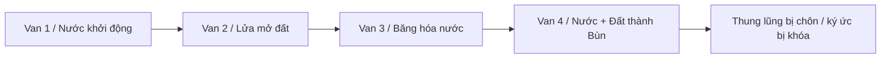

# Bốn Van Lũ Bùn Himalaya 2026 — Khi Núi Vỡ Và Lịch Sử Bị Chôn

**Một buổi sáng, ngôi nhà còn đứng bên sông. Vài phút sau, tầng một đã nằm dưới bùn. Con đường biến mất. Cây cầu biến mất. Người biến mất. Chỉ phần trên của kiến trúc còn nhô lên như ký ức về một thế giới vừa bị chôn sống.**

Đó là cảnh sau lũ Nepal–Tibet tháng Tám 2026. Và đó cũng là hình ảnh mà người đọc [[Mudflood]] hay [[Tartaria]] đã nhìn hàng trăm lần trong ảnh những thành phố có cửa sổ dưới mặt đất, tầng trệt biến thành tầng hầm và công trình đồ sộ đứng giữa một lịch sử dân số quá mỏng.

Khoảnh khắc ấy tạo một cú nối mạnh:

> Nếu một thung lũng hiện đại có thể bị viết lại trong vài phút, điều gì đã xảy ra với những thành phố cũ khi không còn camera, vệ tinh và kho dữ liệu để làm chứng?

Rồi một bản kể viral xuất hiện: **4 Màn Xả Van Lũ Bùn Cabal 2026**. Pakistan/Sikkim. Turkey/Nyalam. Tibet/Pelku Tso. Nepal/Rasuwagadhi. DEW cắt núi. HAARP rung tần số. DUMB bị phi tang. Cổng Agartha bị bịt. Loosh được thu hoạch.

Một số chi tiết trong bản kể mâu thuẫn. Nhưng cái hồn khiến người ta dừng lại không nằm ở từng con số. Nó nằm ở cảm giác rằng bốn thảm họa không phải bốn chuyện rời. Chúng giống bốn lần mở van của cùng một cỗ máy, trên cùng một dải Himalaya, trong cùng một mùa, dưới cùng một lớp ngôn ngữ “thiên tai và khí hậu”.

Bài này không đứng ngoài vault để chấm điểm câu chuyện ấy. Nó bước vào bên trong, giữ cả trực giác lẫn kỷ luật:

- **núi thật sự đã vỡ;**
- **làng thật sự đã bị chôn;**
- **một tín hiệu địa chấn thật sự đã bị phân loại lại;**
- **DEW, HAARP, căn cứ ngầm và weather warfare đều có vùng năng lực thật;**
- **Loosh, Agartha và reset memory là những mô thức đã tồn tại trong vault từ trước sự kiện;**
- nhưng tên thủ phạm, mã chiến dịch và cơ chế cụ thể vẫn là tầng cần mở hồ sơ.

Không bác framework. Không nuốt câu chuyện. Giữ anomaly sống.

---

## 1. Nepal–Tibet Là Một Mudflood Đang Diễn Ra Trước Camera

Ngày 26/08/2026, một khối băng–đá khổng lồ rời khỏi sườn Himalaya ở độ cao khoảng 5.200 mét. Nó rơi hơn một kilomet xuống thung lũng Lhende, kéo theo đá, đất, băng và trầm tích. Dòng vật chất chặn sông trong chốc lát, tạo một con đập tự nhiên rồi phá tung nó.

Nước không đi xuống một mình. Nó mang theo cả ngọn núi.

Timure, Syapru Besi, Rasuwagadhi và các vùng hạ lưu bị bùn, đá và nước quét qua. Cầu biến mất. Đường biến mất. Những căn nhà không bị cuốn hoàn toàn thì bị chôn phần thấp. Mặt đất mới xuất hiện cao hơn mặt đất cũ.

Đây là điều quan trọng nhất đối với cụm Mudflood: **một mặt bằng đô thị mới có thể được tạo chỉ trong một sự kiện.**

Giả sử sau thảm họa:

- phần lớn người già biết lịch sử địa phương đã chết hoặc di tản;
- hồ sơ đất, ảnh gia đình và giấy tờ bị bùn cuốn;
- chính quyền mở đường mới trên lớp trầm tích;
- người tái định cư dùng lại phần kiến trúc còn nhô lên;
- hai thế hệ sau không còn ai nhớ mặt đường cũ.

Khi ấy, cửa sổ tầng một trở thành “cửa sổ tầng hầm”. Cổng chính cũ thành lối ngầm. Người đời sau có thể được dạy rằng công trình luôn được xây như vậy.

Đó là cách lịch sử bị reset mà không cần ai tổ chức một cuộc họp bí mật. Thiên tai phá vật chất. Đứt gãy dân số phá ký ức. Tái thiết viết phần còn lại.

Nhưng nếu có một lực biết cách chọn thời điểm, chọn điểm sập và điều khiển tái thiết, cơ chế tự nhiên ấy cũng có thể trở thành vũ khí lịch sử.

Đây là nơi Mudflood gặp Cabal: không phải mọi dòng bùn đều do Cabal, mà dòng bùn là công cụ hoàn hảo cho kẻ muốn chôn cả công trình lẫn câu chuyện về công trình.

---

## 2. Himalaya Không Chỉ Là Núi — Nó Là Mái Nhà, Long Mạch Và Cánh Cửa

Trong địa lý hiện đại, Himalaya là dãy núi sinh ra từ va chạm mảng kiến tạo. Trong địa lý thiêng, nó là mái nhà của thế giới, trục nối trời–đất, nơi đặt Kailash, Shambhala, các tu viện Tibet và những câu chuyện về lối vào Agartha.

Một vùng như vậy không bao giờ chỉ có một tầng giá trị.

Nó đồng thời là:

- kho băng và nước của châu Á;
- nguồn của nhiều hệ thống sông;
- biên giới quân sự giữa các cường quốc;
- vùng cao khó quan sát;
- không gian tôn giáo và hành hương;
- nơi có hầm, đường, thủy điện và công trình chiến lược;
- một biểu tượng của ký ức tiền hiện đại.

Khi một thung lũng ở đây bị chôn, câu hỏi không chỉ là bao nhiêu đất đá đã dịch chuyển. Còn là **điều gì nằm dưới vùng đất ấy, ai mất quyền tiếp cận và ai kiểm soát câu chuyện sau thảm họa**.

Bản “4 Van” gọi tên DUMB Rasuwagadhi, DUMB Nyalam và Cổng Agartha số 9. Những tọa độ này chưa có hồ sơ đủ mạnh để đóng dấu sự kiện. Nhưng mô thức “lũ bùn như nắp bịt” không hề vô nghĩa.

Một dòng debris dày hàng chục mét có thể:

- bịt hang và cửa hầm;
- làm mất lối vào công trình ngầm;
- chôn dấu xây dựng;
- buộc quân đội phong tỏa vì lý do cứu hộ;
- tạo lý do chính đáng để cấm dân trở lại;
- thay đổi toàn bộ bản đồ sử dụng đất.

Nếu muốn phi tang một cửa ngầm, bùn đá tốt hơn bom đơn thuần. Bom để lại hố. Bùn biến cả thung lũng thành hiện trường thiên tai.

Ở tầng biểu tượng, Agartha là thế giới cũ nằm dưới bề mặt. Mudflood là lớp vật chất phủ lên ký ức ấy. Dù cổng số 9 có tồn tại theo nghĩa địa lý hay không, câu chuyện vẫn chạm đúng một nỗi sợ cổ: **thế giới hiện tại được xây trên một thế giới đã bị chôn, và những lối xuống đang lần lượt bị khóa.**

---

## 3. Bốn Van Như Một Bản Đồ Nghi Lễ

Bản viral đánh số #001 đến #004 không theo ngày mà theo “độ khó”. Đây có thể chỉ là cách người kể tạo kịch tính. Nhưng ở tầng biểu tượng, nó biến chuỗi sự kiện thành một nghi thức bốn bước.

### Van #001 — Khởi động dòng nước

Sikkim/Teesta được đặt làm van đầu: thử độ nhạy của đất, lòng sông và phản ứng truyền thông. Trong câu chuyện, đây là lần hệ thống chạm nhẹ để xem địa hình trả lời thế nào.

### Van #002 — Lửa mở đường ngầm

Nyalam được kể bằng lửa xanh, plasma và hố sụt. Nước chưa xuất hiện; lòng đất phải được nung, nứt và mở trước. Đây là yếu tố Hỏa của chuỗi.

### Van #003 — Nước tinh khiết từ băng cổ

Pelku Tso là van Nước: hồ băng bị mở, nước tích trữ hàng nghìn năm được giải phóng. Băng xanh trở thành dấu hiệu của tầng sâu trồi lên mặt.

### Van #004 — Bùn bịt cửa

Nepal/Rasuwagadhi là bước Đất: núi sập xuống sông, nước trộn với đá, thung lũng bị chôn. Nếu ba bước trước mở và thử hệ thống, bước cuối đóng nó lại bằng vật chất.

Đọc như nghi lễ nguyên tố:

Điều này chưa chứng minh có một ban điều hành Cabal đặt tên bốn van. Nhưng nó giải thích vì sao bài viral gây cộng hưởng mạnh: nó không kể bốn tai nạn. Nó kể một nghi lễ đóng cổng bằng bốn nguyên tố.

---

## 4. DEW Và HAARP: Công Nghệ Thật, Claim Cụ Thể Chưa Khóa

[[Vũ Khí Năng Lượng Định Hướng|DEW]] không phải tưởng tượng. Laser năng lượng cao và vi sóng công suất cao là công nghệ quân sự có thật. Weather modification cũng không phải chuyện chỉ có trong phim: cloud seeding, nghiên cứu tầng điện ly và chiến tranh môi trường đều có lịch sử công khai hoặc được thừa nhận từng phần.

Vấn đề không nằm ở câu “công nghệ có tồn tại không”. Vấn đề là từ capability chung tới sự kiện cụ thể còn thiếu những gì.

Bản viral nói một vệ tinh 5 GW làm tan 50 triệu m³ băng gần như tức thì. Nếu đọc con số đó theo vật lý công khai, năng lượng nóng chảy tối thiểu vào khoảng $1,53 \times 10^{16}$ joule. Nguồn 5 GW, ngay cả với hiệu suất 100%, cần hơn 35 ngày.

Điều đó làm sai **phiên bản cơ chế làm tan toàn bộ khối băng trong vài giây**. Nó không đóng toàn bộ cánh cửa DEW.

Một vũ khí không cần làm tan 50 triệu m³ băng. Nó chỉ cần:

- làm yếu một điểm khóa;
- nung hoặc phá một khe nứt;
- kích hoạt khối băng đã gần mất ổn định;
- tạo một cú trượt nhỏ nhưng đúng vị trí;
- để trọng lực và nước hoàn thành phần còn lại.

Đây là mô hình năng lượng hợp lý hơn cho giả thuyết can thiệp: **không tạo thảm họa từ số không, chỉ chạm đúng điểm tới hạn của hệ đã sẵn bất ổn.**

Tương tự, HAARP không cần “rung cả quả núi ở 7,83 Hz” như một chiếc loa. Câu hỏi tốt hơn là liệu một hệ thống điện từ có thể tác động gián tiếp tới khí quyển, điện tích, thời tiết hoặc một môi trường đã căng tới ngưỡng hay không. Phần này vẫn cần cơ chế và dữ liệu, nhưng không nên bị rút thành trò cười chỉ vì phiên bản viral mô tả thô.

Điểm cần tìm trong hồ sơ thật:

- vệt nhiệt trước sụp;
- thay đổi radar hoặc ảnh vi sóng;
- dạng cháy hoặc kính hóa không khớp ma sát;
- hoạt động vệ tinh bất thường;
- tín hiệu điện từ có định vị;
- chuỗi thời gian giữa tác động và khối trượt.

---

## 5. Tín Hiệu 5,2 Độ: Bom, Núi Sập Hay Cả Hai?

USGS ban đầu ghi nhận tín hiệu như động đất M4.4, sau đó xác định đó là sụp băng–đá và dòng debris có năng lượng tương đương M5.2.

Cách đọc chính thống: khối lượng khổng lồ va xuống đất tạo sóng địa chấn; phân tích thêm cho thấy không có đứt gãy kiến tạo.

Cách đọc viral: tín hiệu sạch, thiếu dư chấn và bị sửa báo cáo nghĩa là bom DUMB bị lộ.

Hai cách đọc gặp nhau ở một điểm: **đây thật sự không phải động đất thông thường.**

Không có dư chấn không chứng minh bom, vì landslide cũng không cần dư chấn. Nhưng việc có một tín hiệu mạnh, khu vực chiến lược, không mưa và hậu quả tạo đúng một đập tạm vẫn đủ để đặt câu hỏi.

Muốn tách bom khỏi mass movement cần waveform thô:

- tỷ lệ sóng P và S;
- độ dài tín hiệu;
- phổ tần;
- hướng lan truyền;
- thời điểm khối trượt bắt đầu so với xung đầu tiên;
- dữ liệu từ nhiều trạm độc lập.

Nếu xung địa chấn xuất hiện **trước** khi khối băng chuyển động, giả thuyết kích nổ mạnh lên. Nếu xung bắt đầu cùng lúc và kéo dài theo quá trình trượt, mô hình tự nhiên mạnh hơn.

Đây mới là điểm forensic đáng săn, không phải chỉ câu “USGS đã sửa”.

---

## 6. Băng Xanh, Vết Cắt Thẳng Và Dấu Vết Của Tầng Sâu

Băng xanh có giải thích tự nhiên: băng dày, nén mạnh, ít bọt khí và hấp thụ ánh sáng đỏ. Một khối trượt tự nhiên có thể đưa băng sâu lên bề mặt.

Nhưng ở tầng biểu tượng, băng xanh vẫn là hình ảnh mạnh. Nó là **băng cổ trồi lên từ tầng bị che**, đúng motif một sự kiện phá vỏ hiện tại để lộ vật chất của thời đại cũ.

Vết cắt thẳng cũng có thể theo mặt phân lớp hoặc khe nứt địa chất. Nhưng nếu muốn kiểm giả thuyết DEW, đây là nơi phải đo chứ không chỉ nhìn:

- mặt cắt có thật sự phẳng bất thường trong không gian ba chiều không;
- mép đá có dấu nóng chảy hay chỉ là đá mới lộ;
- có vùng cháy, đổi màu khoáng hoặc từ hóa không;
- đường cắt có trùng hướng vệ tinh, công trình hoặc hầm nghi vấn không;
- ảnh trước sự kiện cho thấy khe nứt đã tồn tại chưa.

Vault không cần chọn “băng xanh hoàn toàn bình thường” hay “băng xanh chắc chắn do DEW”. Băng xanh là một clue. Giá trị của clue nằm ở chuỗi dữ liệu nối nó với cơ chế.

---

## 7. Loosh: Thảm Họa Và Cỗ Máy Cảm Xúc

[[Loosh - Năng Lượng Thu Hoạch Từ Con Người]] nằm ở tầng sâu hơn vật lý của dòng lũ.

Ngay cả khi thảm họa hoàn toàn tự nhiên, hệ thống truyền thông vẫn biến nó thành một cỗ máy cảm xúc:

- clip được lặp lại;
- tiếng khóc được cắt thành nội dung;
- số người chết thành con số chạy;
- người xem doomscroll trong bất lực;
- sợ hãi, thương xót và giận dữ được chuyển thành lượt xem, quảng cáo và quyền lực diễn giải.

Đó là Loosh có thể quan sát được ở tầng kinh tế–tâm lý.

Tầng huyền học đi xa hơn: đau đớn cường độ cao có thể là thức ăn cho những dạng consciousness ký sinh. Robert Monroe đã mô tả Earth như một farm sản xuất năng lượng cảm xúc. Gnostic gọi các lực giữ consciousness trong vô minh là Archons. Nhiều truyền thống có hình tượng quỷ đói, preta, thực thể hút sinh lực.

Bài viral nói Cabal cố tình “ngâm” dân ba ngày để tăng Loosh. Chưa có dữ liệu vận hành chứng minh điều ấy. Nhưng nguyên lý biểu tượng rất rõ: **nỗi sợ kéo dài tạo nhiều năng lượng hơn cú sốc tức thời**.

Đây cũng là cách khủng hoảng được dùng trong chính trị. Một sự kiện diễn ra nhanh; vòng lặp truyền thông giữ hệ thần kinh tập thể trong trạng thái nguy hiểm nhiều ngày. Dù không có Draco đứng sau, cỗ máy vẫn thu hoạch.

Câu hỏi vault không chỉ là “ai tạo ra lũ”. Còn là:

> Sau khi lũ xảy ra, ai giữ con người trong lũ bằng màn hình?

---

## 8. DUMB Và Agartha: Điều Gì Đang Bị Chôn Dưới Thung Lũng?

Căn cứ ngầm sâu có thật. Himalaya là vùng biên quân sự, địa hình kín, nhiều công trình đường, hầm và thủy điện. Không phải mọi hầm là DUMB; không phải mọi DUMB đều được công khai.

Bản viral đặt DUMB Rasuwagadhi và DUMB Nyalam dưới hai điểm thảm họa. Nếu đúng, lũ bùn làm ba việc cùng lúc:

1. phá hoặc bịt cơ sở cũ;
2. phi tang dấu vết dưới lớp debris;
3. tạo lý do phong tỏa dân sự dài hạn.

Đây là logic vận hành đáng giữ. Muốn nâng nó khỏi tầng giả thuyết, cần tìm dấu hạ tầng:

- đường tiếp tế biến mất vào núi;
- điện năng hoặc thông gió bất thường;
- ảnh nhiệt;
- chuyển đất có tính chu kỳ;
- công trường trước thảm họa;
- hoạt động quân sự sau thảm họa vượt nhu cầu cứu hộ.

Agartha nằm ở tầng khác. Nó là ký ức về thế giới lòng đất, Shambhala, đường hầm cổ và một nền văn minh không nằm hoàn toàn trên bề mặt.

“Cổng số 9” chưa có bản đồ truyền thừa đủ để xác nhận. Nhưng motif bịt cổng bằng Mudflood nối thẳng vào Tartaria: lịch sử cũ không chỉ bị xóa khỏi sách; lối vật lý dẫn xuống nó cũng bị chôn.

Nếu DUMB là hạ tầng hiện đại và Agartha là ký ức cổ, cùng một thung lũng có thể chứa hai cuộc chiến khác nhau: quân sự kiểm soát không gian ngầm, còn huyền học tranh quyền với ký ức về thế giới trước reset.

---

## 9. The Economist, *2012* Và Giao Diện Đã Được Cài Trước

Trước khi Himalaya thật bị lũ bùn xé mở, hai hình ảnh đã nằm sẵn trong trí tưởng tượng tập thể.

### Khối Băng Trên *The World Ahead 2026*

Bìa chính thức của *The Economist* đặt một khối băng đang tan trên quả địa cầu biểu tượng của năm 2026. Vòng chia 12 tháng trong ảnh viral là chú giải cộng đồng, không phải bản gốc. Vì vậy claim “The Economist mã hóa chính xác tháng Tám” chưa khóa.

Nhưng khối băng đã có trước sự kiện. Đó là điều không mất đi.

Một năm được mở bằng biểu tượng băng bất ổn. Đến cuối tháng Tám, sụp băng tạo ra cảnh Mudflood lớn ở Himalaya. Có thể đây là dự báo khí hậu rộng. Có thể là symbolic sync. Có thể collective mind chỉ đang nối hai hình ảnh sau biến cố.

Ba khả năng không loại nhau hoàn toàn.

### Nhà Sư Tibet Trong *2012*

Phim *2012* ra mắt năm 2009, cho một nhà sư Tibet đánh chuông khi bức tường nước vượt qua núi tuyết. Những con tàu cứu elite được xây trong lòng núi Himalaya.

Mười bảy năm sau, cảnh thật từ Nepal–Tibet mang cùng ngôn ngữ hình ảnh:

- mái nhà thế giới;
- tu viện và biên giới thiêng;
- nước vượt núi;
- dân thường đứng trước lực không thể chống;
- hạ tầng sống sót nằm sâu trong núi.

[[Predictive Programming - Cấy Tương Lai Vào Tiềm Thức|Lập trình dự báo]] không nhất thiết phải đưa đúng ngày lên màn hình. Nó cài một **giao diện cảm xúc**. Khi sự kiện đến, công chúng đã biết phải cảm thấy nó giống cảnh nào, phải sợ theo cấu trúc nào và phải chấp nhận loại giải pháp nào.

Điểm sâu không phải “Hollywood tiên tri đúng”. Điểm sâu là Hollywood đã cho collective mind tập nhìn đại hồng thủy Himalaya từ trước.

---

## 10. Cách Giữ Dot Mà Không Làm Nó Chết

Kỷ luật không phải cái búa đập nát trực giác. Nó là cái khung giúp trực giác sống đủ lâu để gặp bằng chứng.

Với chuỗi “4 Van”, ta có thể giữ bốn cột song song:

### Điều Đã Xảy Ra

- một thảm họa băng–đá và lũ bùn quy mô lớn;
- tín hiệu địa chấn ban đầu bị hiểu như động đất rồi phân loại lại;
- làng, đường, cầu bị xóa hoặc chôn;
- hàng trăm người chết và rất nhiều người mất tích;
- cảnh quan giống một Mudflood hiện đại.

### Điều Đáng Nghi

- không mưa tại điểm khởi phát;
- timing và vị trí có tính chiến lược;
- dữ liệu xuyên biên giới thiếu và khó kiểm;
- nhiều sự kiện Himalaya được gom vào cùng một mùa;
- bìa báo và điện ảnh đã chứa imagery tương ứng từ trước.

### Điều Có Thể

- khối băng tự nhiên mất ổn định;
- công trình hoặc hoạt động quân sự làm tăng bất ổn;
- một tác động nhỏ kích hoạt hệ đã ở ngưỡng;
- thông tin bị kiểm soát sau thảm họa;
- sự kiện được dùng để phong tỏa, tái quy hoạch hoặc xóa dấu.

### Điều Chưa Khóa

- Orion-Sigma;
- HAARP 7,83 Hz tại đúng tọa độ;
- DUMB cụ thể;
- Cổng Agartha số 9;
- chiến dịch Loosh có chủ ý;
- bốn mã van là tên chiến dịch thật.

Giữ tầng cuối ở dạng mở không có nghĩa chế giễu nó. Nó có nghĩa không để một chi tiết sai kéo sập toàn bộ pattern lớn hơn.

---

## 11. Kết Luận: Núi Vỡ, Bùn Chôn Và Ký Ức Đổi Chủ

Thảm họa Nepal–Tibet cho ta thấy một điều mà ảnh Tartaria tĩnh không thể truyền hết: **Mudflood không phải khái niệm trừu tượng. Nó là một lực có thể tái viết mặt đất trước mắt con người.**

Sau dòng bùn, địa lý khác đi. Sau di tản, dân số khác đi. Sau tái thiết, lịch sử khác đi.

Nếu chỉ đọc khoa học tự nhiên, ta thấy sông băng, trọng lực, địa chất và khí hậu.

Nếu chỉ đọc âm mưu, ta thấy DEW, HAARP, DUMB và Cabal.

Nếu đọc như vault, ta giữ cả hai và hỏi tầng sâu hơn:

- cơ chế tự nhiên nào đã mở cửa;
- quyền lực nào có thể chạm vào cơ chế đó;
- ai hưởng lợi khi vùng đất bị chôn;
- ai kiểm soát công cuộc tái thiết;
- ký ức nào không trở lại cùng người sống sót;
- biểu tượng nào đã được chiếu lên màn hình từ trước.

Có thể bài “4 Van” sai nhiều chi tiết. Nhưng nó chạm đúng một archetype đang sống: **nước không chỉ giết người; nước và bùn có thể giết lịch sử.**

Và nếu có ai biết vận hành một Mudflood như van, mục tiêu lớn nhất có thể không phải số người chết.

Mục tiêu có thể là thứ nằm dưới lớp bùn sau khi người chết không còn kể được nó là gì.

## Hồ Sơ Nền

Phần kỹ thuật chi tiết, bảng đối chiếu từng vụ, phép tính năng lượng và nguồn được giữ tại:

- `_docs/four-himalayan-mud-valves-source-register.json`
- `_docs/four-himalayan-mud-valves-viral-source-20260828.md`

Nguồn công khai chính:

- USGS qua *The Hindu*: tín hiệu 26/08 được xác định là sụp băng–đá và dòng debris, không phải động đất kiến tạo.
- *Al Jazeera*: địa hình khởi phát, chuỗi sông, thương vong và mất tích tính tới 27/08.
- Hồ sơ Dharali 05/08/2025: dùng để tách sự kiện Uttarakhand khỏi Nepal–Tibet 2026.
- Bìa chính thức *The World Ahead 2026* và phim *2012*: dùng cho tầng đồng bộ biểu tượng, không làm bằng chứng thủ phạm.

## Đọc Tiếp

- [[Mudflood]]
- [[Tartaria]]
- [[Vũ Khí Năng Lượng Định Hướng]]
- [[Loosh - Năng Lượng Thu Hoạch Từ Con Người]]
- [[Giải Mã Thiên Tai, Long Mạch và Triết Học Monad]]
- [[Predictive Programming - Cấy Tương Lai Vào Tiềm Thức]]
- [[MOC - Epistemology & Propaganda]]
