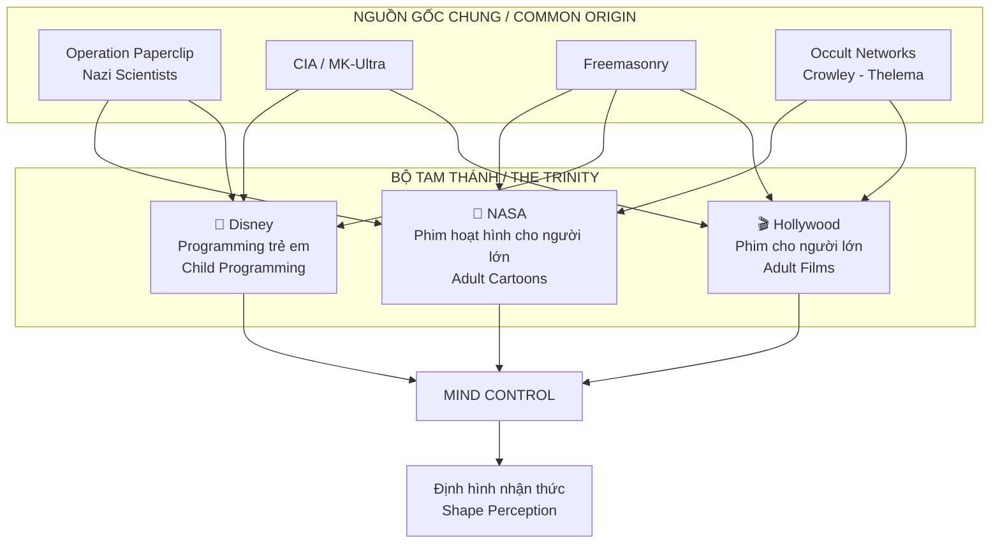
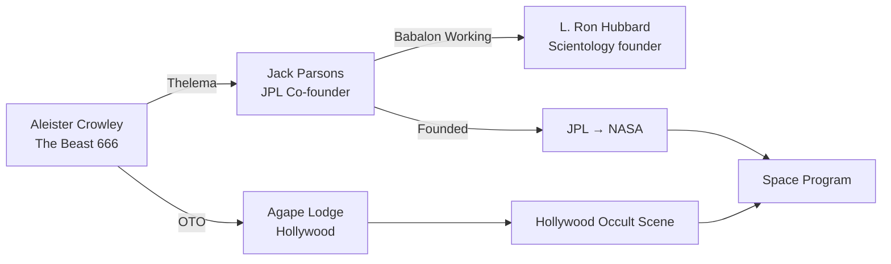
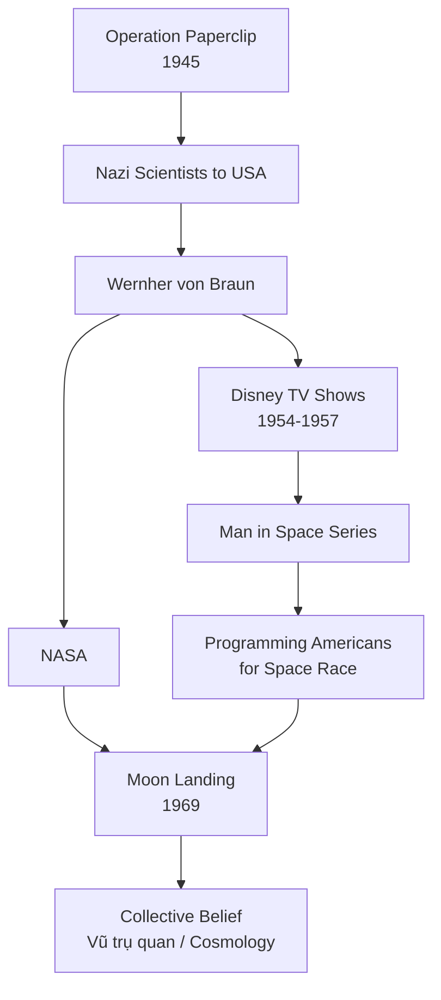
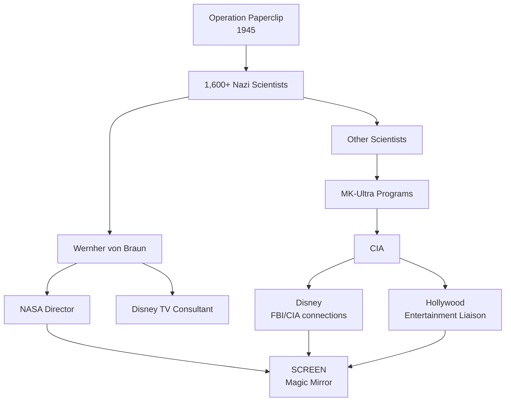
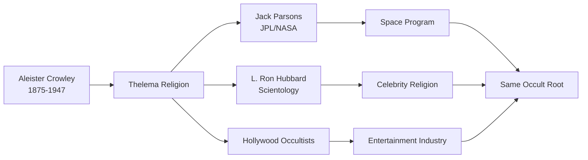
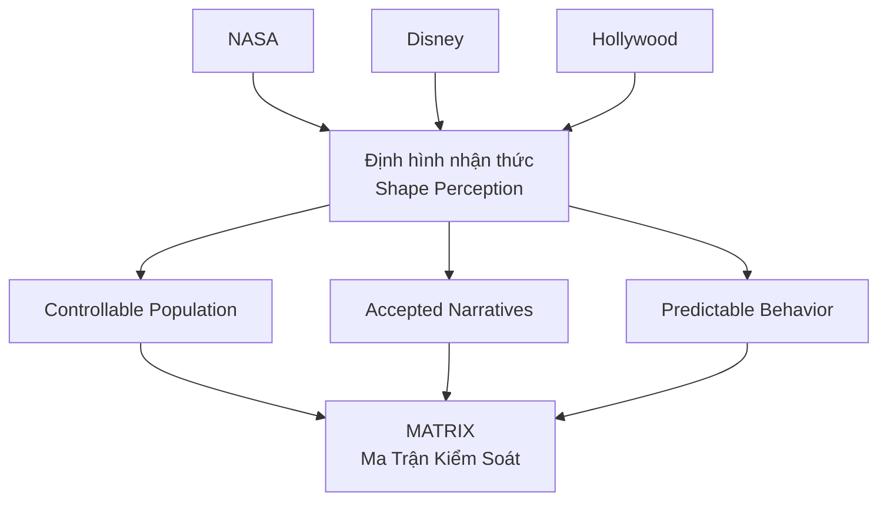

# Bộ Tam Thánh Mind Control: NASA - Disney - Hollywood

> *"Ba đứa con của cùng một cha. Ba màn hình cho cùng một phép thuật."*
> *"Three children of the same father. Three screens for the same spell."*

**NASA**, **Disney**, và **Hollywood** thường được xem như ba ngành riêng biệt: khoa học, giải trí trẻ em, và phim người lớn. Nhưng khi truy về nguồn gốc, bạn sẽ thấy **chúng đều về một mối** — cùng mạng lưới, cùng mục đích, cùng phép thuật.

*NASA, Disney, and Hollywood are often seen as three separate industries: science, children's entertainment, and adult films. But when you trace their origins, you'll find they all lead back to the same source — same networks, same purpose, same magic.*

---

## Tổng Quan / Overview

---

## Cùng Một Công Thức / Same Formula

| Đối tượng / Target | Phương tiện / Medium | Chức năng / Function |
|-------------------|---------------------|---------------------|
| **Trẻ em** | Disney | Programming từ nhỏ, cấy archetype |
| **Người lớn (giải trí)** | Hollywood | Predictive programming, normalization |
| **Người lớn (trí thức)** | NASA | "Khoa học" như giải trí, định hình vũ trụ quan |

> *"Disney program trẻ em để chúng lớn lên xem Hollywood. NASA cho những ai cần 'bằng chứng khoa học' để tin."*
>
> *"Disney programs children so they grow up watching Hollywood. NASA exists for those who need 'scientific proof' to believe."*

---

## I. NASA — Phim Hoạt Hình Cho Người Lớn / Adult Cartoons

### Origin Story: Operation Paperclip

Sau Thế chiến II, Mỹ bí mật đưa **hơn 1,600 nhà khoa học Nazi** sang Mỹ qua **Operation Paperclip**. Trong đó có:

| Nhân vật / Figure | Vai trò Nazi | Vai trò NASA |
|-------------------|-------------|--------------|
| **Wernher von Braun** | SS Officer, V-2 rocket designer | Director NASA Marshall Space Flight Center |
| **Kurt Debus** | V-2 launch director | Director Kennedy Space Center |
| **Arthur Rudolph** | Mittelwerk (slave labor) | Saturn V program manager |

*After WWII, America secretly brought over 1,600 Nazi scientists through Operation Paperclip. Including SS officers who became NASA directors.*

> *"Những kẻ thiết kế V-2 giết người Anh, sau đó thiết kế Saturn V 'đưa người lên Mặt trăng'."*
>
> *"Those who designed V-2s to kill British civilians later designed Saturn V to 'send men to the Moon.'"*

### Jack Parsons: Occult Father of NASA

**Jack Parsons** — co-founder của **JPL (Jet Propulsion Laboratory)**, tiền thân của NASA:

**Facts về Jack Parsons:**
- Follower của Aleister Crowley, thực hành **Thelema** rituals
- Thành viên **Ordo Templi Orientis (O.T.O.)**
- Thực hiện **Babalon Working** ritual với L. Ron Hubbard (founder Scientology)
- Died mysteriously in 1952 (explosion tại home lab, tuổi 37)
- NASA vẫn có **crater trên Mặt trăng mang tên ông**

> *"Cha đẻ của rocket science Mỹ là một occultist theo Crowley. Bạn có nghĩ điều này ảnh hưởng đến 'khoa học' của NASA không?"*
>
> *"The father of American rocket science was a Crowley occultist. Do you think this influenced NASA's 'science'?"*

### Von Braun + Disney Connection

**Wernher von Braun** không chỉ xây dựng NASA — ông còn **làm việc trực tiếp với Walt Disney**:

| Năm / Year | Collaboration |
|------------|--------------|
| **1954-1957** | Disney TV series "Man in Space" — von Braun xuất hiện như expert |
| **1955** | "Man and the Moon" — programming cho Moon mission |
| **1957** | "Mars and Beyond" — seeding Mars exploration |
| **1965** | von Braun mời Disney Imagineers đến thăm NASA |

> *"Von Braun là cầu nối giữa Nazi rocket science, NASA, và Disney. Một người đóng vai cả ba."*
>
> *"Von Braun was the bridge between Nazi rocket science, NASA, and Disney. One man playing all three roles."*

### NASA = Expensive CGI Studio?

Những câu hỏi về NASA:

| Question | Implication |
|----------|-------------|
| Tại sao không có sao trong ảnh Moon landing? | Staged lighting |
| Van Allen Belt radiation — sao astronauts không chết? | Didn't pass through |
| Original Moon landing tapes "accidentally erased"? | Destroying evidence |
| Tại sao chưa quay lại Mặt trăng từ 1972? | Never went in first place? |
| ISS footage — bubbles underwater? | Filmed in pool |

> *"NASA tiêu $60+ million/ngày. Bạn nghĩ họ làm khoa học hay làm phim?"*
>
> *"NASA spends $60+ million/day. Do you think they're doing science or filmmaking?"*

**NASA's real function:**
- Kiểm soát nhận thức về vũ trụ / Control perception of universe
- Che giấu true cosmology (Flat Earth? Tartaria? Firmament?)
- Tiêu tiền thuế cho black budget projects
- "Adult cartoons" cho những ai cần "khoa học" để tin

---

## II. Disney — Programming Trẻ Em Từ Bé / Programming Children From Birth

### Walt Disney: FBI Informant

**Walt Disney** có quan hệ đặc biệt với **J. Edgar Hoover** và **FBI**:

| Fact | Source |
|------|--------|
| FBI informant từ **1936** đến khi chết (1966) | Declassified FBI files |
| **30 năm** làm informant | NYT, 1993 |
| Báo cáo "communists" trong Hollywood | House Committee testimony |
| Title: "Special Agent in Charge Contact" (1954) | FBI records |
| FBI được film positive trong Disney productions | Quid pro quo agreement |

*Walt Disney was an FBI informant for 30 years, reporting on "communists" in Hollywood in exchange for positive FBI portrayal in his films.*

### Disney + Nazi Scientists

**Von Braun trên Disney TV:**
- Xuất hiện như "friendly scientist" / appeared as friendly scientist
- Nazi past completely hidden / quá khứ Nazi hoàn toàn che giấu
- Giáo dục trẻ em Mỹ về space / educated American children about space

> *"Một SS Officer Nazi dạy trẻ em Mỹ về vũ trụ qua Disney. Let that sink in."*

### Club 33 — Freemasonry Connection

**Club 33** — private club trong Disneyland:

| Fact | Implication |
|------|-------------|
| Tên "33" | 33rd degree Freemasonry |
| Members-only, invitation only | Elite access |
| Wait list: 14+ years | Exclusive |
| What happens inside? | Secret rituals? |
| Annual fee: $15,000-$30,000 | Not for common people |

> *"33 là số thiêng của Freemasonry. Disney đặt tên club này là trùng hợp?"*
>
> *"33 is the sacred number of Freemasonry. Disney naming this club 33 is coincidence?"*

### Disney + MK-Ultra: Programming Trẻ Em

**Project Monarch** — alleged sub-project của MK-Ultra:

| Element | Disney Connection |
|---------|-------------------|
| Trauma-based mind control | Dark themes in "children's" films |
| Dissociation programming | Fantasy worlds, escaping reality |
| Handler/slave dynamics | Villains controlling heroes |
| Butterfly symbolism | Throughout Disney imagery |
| Alice in Wonderland | Classic MK-Ultra programming tool |

**Recurring themes in Disney:**
- Mồ côi / Orphans (Cinderella, Snow White, Bambi, Frozen...)
- Evil stepmothers / Handlers
- Magic / Spells
- Transformation / Dissociation
- "Happily ever after" reward for compliance

> *"Disney dạy trẻ em: chịu đựng trauma → tuân phục → được thưởng bằng 'happy ending'."*
>
> *"Disney teaches children: endure trauma → obey → be rewarded with 'happy ending.'"*

### Occult Symbolism in Disney

| Symbol | Xuất hiện / Appears in |
|--------|----------------------|
| **All-Seeing Eye** | Multiple films |
| **666** | Hidden in logos, artwork |
| **Pentagrams** | Background details |
| **Sexual subliminals** | Little Mermaid, Lion King, etc. |
| **Skull imagery** | Pirates, villains |
| **Monarch butterflies** | MK-Ultra symbolism |

---

## III. Hollywood — Ma Thuật Cho Người Lớn / Magic for Adults

### CIA Entertainment Liaison Office

**CIA có văn phòng chuyên làm việc với Hollywood:**

| Fact | Evidence |
|------|----------|
| CIA Entertainment Liaison Office | Official, public |
| Thousands of films influenced | Academic research |
| Scripts reviewed and modified | Declassified documents |
| Propaganda since 1915 | "Birth of a Nation" |
| Full-time staff for Hollywood | Current |

*The CIA has a dedicated Entertainment Liaison Office that has influenced thousands of films — documented fact, not conspiracy theory.*

**Films với CIA involvement:**
- Top Gun (recruitment tool)
- Zero Dark Thirty (torture justification)
- Argo (CIA hero narrative)
- The Recruit (partially written by CIA)
- Captain Marvel (Air Force recruitment)

> *"Hollywood không reflect reality. Hollywood CREATES reality cho masses."*
>
> *"Hollywood doesn't reflect reality. Hollywood CREATES reality for the masses."*

### Etymology: Holy Wood

Xem chi tiết tại [[Hollywood - Cây Đũa Phép Của Phù Thủy]]

| Element | Meaning |
|---------|---------|
| **Holly** | Cây thiêng của Druids |
| **Holly Wood** | Gỗ làm đũa phép / Wand wood |
| **Hollywood** | Casting spells trên masses |
| **Screen** | Scrying mirror |
| **Spelling** | Chính tả = phép thuật / Literally magic |

> *"Khi bạn watch a 'movie' on a 'screen', bạn đang bị 'spelled' bởi 'holy wood'."*

### Predictive Programming Examples

| Film/Show | Concept | Reality sau đó |
|-----------|---------|---------------|
| **The Simpsons** | Trump presidency | 2016 |
| **Contagion (2011)** | Pandemic, WHO, lockdowns | COVID-19 (2020) |
| **Back to Future** | 9/11 references | 2001 |
| **The Matrix** | Simulation, control | Mainstream concept |
| **Black Mirror** | Social credit, AI | China, current tech |

---

## IV. Connections: Cùng Một Mạng Lưới / Same Network

### Operation Paperclip → All Three

### Freemasonry Throughout

| Industry | Masonic Connection |
|----------|-------------------|
| **NASA** | Buzz Aldrin — 33rd degree Mason |
| **NASA** | Many astronauts are Masons |
| **Disney** | Club 33, symbolism throughout |
| **Hollywood** | Cecil B. DeMille — 33rd degree |
| **Hollywood** | John Wayne, many actors — Masons |

### Crowley's Influence

---

## V. Cơ Chế Mind Control / Mind Control Mechanism

### Three-Pronged Attack

| Target | Medium | Programming |
|--------|--------|-------------|
| **Children (0-12)** | Disney | Foundational archetypes, trauma tolerance |
| **Teens/Adults (entertainment)** | Hollywood | Predictive programming, normalization |
| **Adults (intellectual)** | NASA | "Scientific" worldview, cosmology |

### The Screen as Scrying Mirror

> *"Mỗi màn hình là một gương thần. Bạn không xem — bạn bị hypnotized."*
>
> *"Every screen is a scrying mirror. You don't watch — you get hypnotized."*

**Techniques:**
1. **Flicker rate** — induces trance state
2. **Blue light** — disrupts circadian, keeps watching
3. **Narrative structure** — bypasses critical thinking
4. **Emotional manipulation** — creates association
5. **Repetition** — normalizes concepts

### Disclosure / Karmic Loophole

Tại sao họ tiết lộ qua entertainment?

| Reason | Explanation |
|--------|-------------|
| **Karmic law** | Must "tell" before doing |
| **Consent loophole** | You watched = you consented |
| **Plausible deniability** | "It's just fiction" |
| **Mockery** | "We told you, you didn't believe" |
| **Testing** | Gauge public reaction |

> *"Họ phải nói cho bạn biết trước. Nếu bạn không phản đối, đó là sự đồng ý."*
>
> *"They must tell you first. If you don't object, that's consent."*

---

## VI. The Same Magic / Cùng Một Phép Thuật

### All Three Use Same Tools

| Tool | NASA | Disney | Hollywood |
|------|------|--------|-----------|
| **Screen** | CGI space footage | Animation, films | Movies, TV |
| **Narrative** | "Space exploration" | "Magic kingdoms" | "Entertainment" |
| **Authority** | Scientists | Beloved characters | Celebrities |
| **Emotion** | Wonder, awe | Joy, wonder | Full spectrum |
| **Repetition** | Constant "discoveries" | Franchise, sequels | Remakes, series |

### Same Outcome

---

## VII. Practical Implications / Ứng Dụng Thực Tiễn

### Khi Tiêu Thụ Media / When Consuming Media

- [ ] Nguồn gốc của content này là gì? / What's the origin of this content?
- [ ] Ai funding? Ai benefit? / Who's funding? Who benefits?
- [ ] Concept nào đang được normalized? / What concept is being normalized?
- [ ] Có hidden symbols không? / Are there hidden symbols?
- [ ] Emotional manipulation đang target gì? / What emotion is being targeted?

### Questions to Ask

**Về NASA:**
- Tại sao original Moon tapes "mất"?
- Van Allen Belt radiation?
- Tại sao không quay lại Moon từ 1972?
- ISS footage anomalies?

**Về Disney:**
- Tại sao nhiều dark themes cho "trẻ em"?
- Club 33 là gì?
- Nazi scientist connections?
- MK-Ultra symbolism?

**Về Hollywood:**
- CIA Entertainment Liaison làm gì?
- Tại sao nhiều films "predict" future events?
- Hidden symbols mean gì?
- Ai control narratives?

---

## Core Insight / Insight Cốt Lõi

**NASA = Phim hoạt hình cho người lớn** (CGI, "khoa học")
**Disney = Phim hoạt hình cho trẻ em** (foundation programming)
**Hollywood = Phim cho người lớn** (predictive programming)

> *"Ba màn hình, cùng một phép thuật. Ba target audience, cùng một mục đích: kiểm soát nhận thức."*
>
> *"Three screens, same magic. Three target audiences, same purpose: control perception."*

Khi truy về nguồn gốc:
- **Operation Paperclip** — Nazi scientists created NASA, consulted Disney
- **CIA/MK-Ultra** — Connected to Disney and Hollywood
- **Freemasonry** — Throughout all three
- **Occult (Crowley/Thelema)** — Jack Parsons (NASA), Hollywood networks

**Không phải ngẫu nhiên. Không phải riêng lẻ. Cùng một hệ thống.**

*Not coincidence. Not separate. Same system.*

---

## Vault Connections

### Related Notes
- [[Hollywood - Cây Đũa Phép Của Phù Thủy]] — Chi tiết về Hollywood
- [[Predictive Programming - Cấy Tương Lai Vào Tiềm Thức]] — Cơ chế hoạt động
- [[Inception - Predictive Programming Về Kiểm Soát Tâm Trí]] — Case study
- [[Ma Trận]] — Hệ thống kiểm soát tổng thể
- [[Kiểm Soát Tâm Trí]] — Mind control techniques

### Occult & Elite
- [[Cabal]] — Networks behind all three
- [[Saturn Cube]] — Symbolism connections
- [[Manly P. Hall]] — Esoteric knowledge disclosure
- [[Gnosis]] — Hidden wisdom in plain sight

### Science & Control
- [[Khoa Học Xét Lại]] — Questioning official narratives
- [[Tartaria]] — What NASA might be hiding
- [[Thuyết Trái Đất Phẳng]] — Alternative cosmology

---

## Sources

### Operation Paperclip & NASA
- NASA.gov — Wernher von Braun biography
- Wikipedia — Operation Paperclip
- Science History Institute — Jack Parsons
- Caltech — Jack Parsons legacy

### Disney
- New York Times (1993) — "Disney Link To the F.B.I."
- Euronews — Walt Disney FBI informant
- Declassified FBI files on Walt Disney
- Scottish Rite NMJ — Disney Masonic connections

### Hollywood
- Wiley Online Library — "Historical Roots of CIA-Hollywood Propaganda"
- MR Online — Pentagon and CIA shaped Hollywood
- WSWS — "National Security Cinema" review
- CIA Entertainment Liaison Office — public acknowledgment

### Mind Control
- CIA declassified MK-Ultra documents
- Project Monarch research
- Predictive programming analysis

---

*Lần cuối cập nhật: 2026-04-30*
