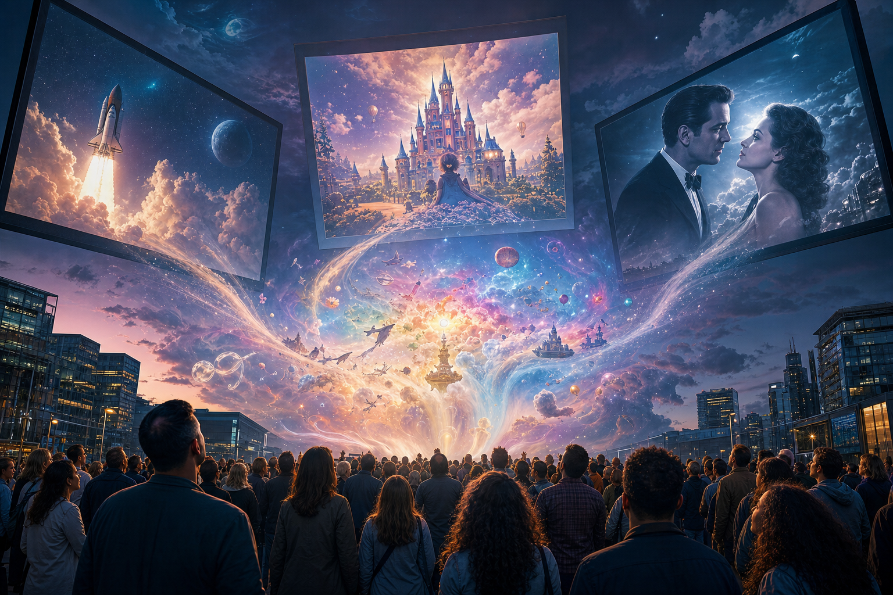
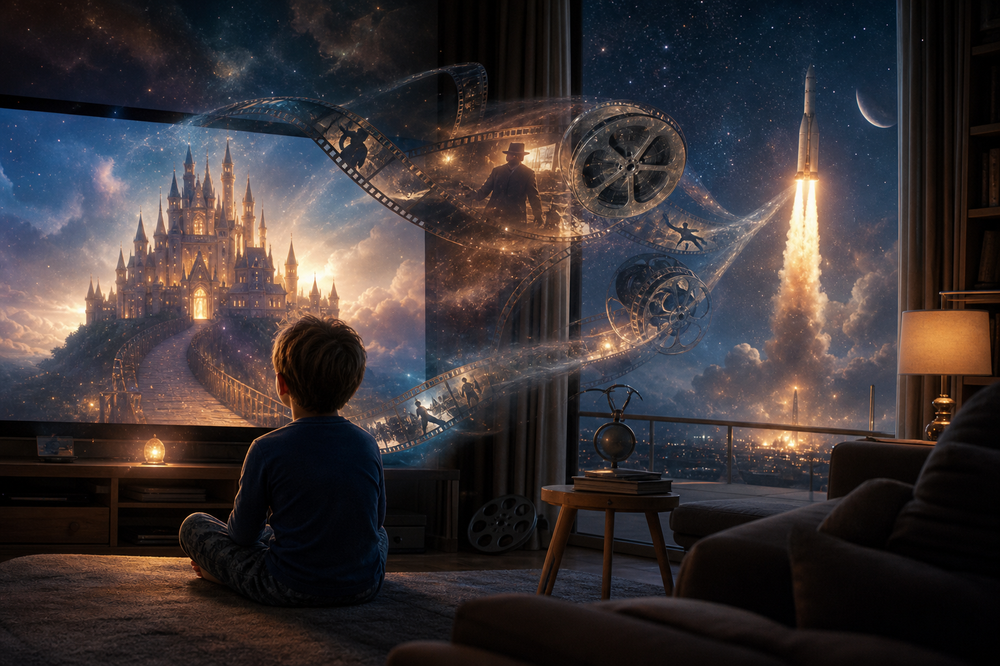
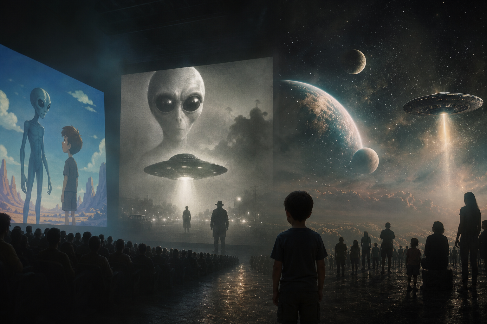

# Bộ Tam Thánh Mind Control: NASA - Disney - Hollywood

**NASA, Disney và Hollywood thường được nhìn như ba ngành riêng: khoa học không gian, giải trí trẻ em, và phim người lớn. Nhưng trong vault, chúng còn có thể được đọc như ba màn hình của cùng một hệ myth công nghiệp: NASA quản sky myth cho người lớn cần “khoa học”, Disney quản childhood myth khi imagination còn mềm, Hollywood quản adult myth nơi public rehearsal tương lai chính trị, công nghệ và tâm linh.**

*NASA, Disney, and Hollywood can be read as three screens of industrial myth: sky myth for adults who need science, childhood myth for young imagination, and adult myth for collective rehearsal.*

“Ba đứa con của cùng một cha. Ba màn hình cho cùng một phép thuật.” Câu này không nên đọc như proof rằng mọi thứ do một phòng kín điều khiển. Nó là symbolic key: nếu muốn định hình reality của một nền văn hóa, hãy kiểm soát bầu trời, tuổi thơ và giấc mơ người lớn.

---

## Evidence Discipline / Cách Đọc

Bài này có nhiều tầng claim nên phải giữ kỷ luật.

Ở tầng fact, có các sự kiện public như Operation Paperclip, vai trò của Wernher von Braun trong rocket program và truyền thông phổ thông, Walt Disney/FBI relationship từng được nhắc trong hồ sơ và báo chí, Hollywood/intelligence/military cooperation trong một số production, NASA như institution khoa học-truyền thông. Những fact này cần nguồn riêng khi viết research sâu.

Ở tầng pattern, ta đọc convergence: science spectacle, childhood programming, entertainment, national myth, space frontier, alien archetype, war/safety narrative.

Ở tầng symbol, NASA/Disney/Hollywood là ba màn hình của collective imagination.

Ở tầng speculative synthesis, các claim như staged cosmology, occult network, total mind-control grid, hidden cosmology phải được đọc như hypothesis vault, không phải fact-level conclusion.

Không nên đọc tầng speculative như chứng cứ thô. Nhưng cũng không nên dùng fact-level limitation để phủ định toàn bộ symbolic intelligence.

---

## Ba Màn Hình Của Cùng Một Myth Machine

Disney nói với đứa trẻ: thế giới có phép màu, công chúa, lâu đài, animal spirits, hero journey, innocence và emotional grammar.

Hollywood nói với người lớn: thế giới có apocalypse, alien, surveillance, AI god, superhero, secret society, simulation, romance, war, sacrifice và salvation.

NASA nói với người cần authority: vũ trụ là frontier, rocket là ritual, scientist là priest, space là destiny, sky là domain của institution.

Ba màn hình này không cần phát cùng một thông điệp bằng lời. Chúng cùng xây một thư viện hình ảnh. Đứa trẻ học archetype từ Disney, lớn lên gặp phiên bản adult trong Hollywood, rồi được NASA/space spectacle đóng dấu “realistic/scientific” cho myth về bầu trời và tương lai.

---

## NASA: Sky Myth Cho Người Lớn

NASA không chỉ làm science. Nó cũng làm public imagination. Rocket launch, Moon landing, Mars mission, astronaut hero, black sky, blue marble, countdown, control room: tất cả đều là image có sức mythic rất lớn.

Điều này không phủ định science. Một institution có thể làm research thật và myth-making cùng lúc. Vấn đề là public thường không tách hai tầng này. Khi hình ảnh được gắn với authority khoa học, nó đi vào mind bằng một con đường khác với phim.

Operation Paperclip và Wernher von Braun là node lịch sử quan trọng vì chúng nối Nazi rocket science, American space program và truyền thông phổ thông thời Space Race. Von Braun xuất hiện trong các chương trình Disney về space exploration. Đây là điểm giao giữa science, state và entertainment.

Cách đọc kỷ luật: fact này không tự động chứng minh mọi footage là giả. Nhưng nó cho thấy space imagination của public từng được xây qua một liên minh giữa kỹ thuật, nhà nước và entertainment.

---

## Disney: Childhood Myth Và Emotional Grammar

Disney không chỉ bán phim trẻ em. Disney dạy emotional grammar: good/evil trông như thế nào, princess là gì, magic là gì, animal nói chuyện ra sao, villain có shape nào, rescue fantasy vận hành thế nào, family wound được hát thành bài ra sao.

Trẻ em không xem Disney như ideology. Chúng xem như world. Vì vậy Disney mạnh. Nó vào trước khi critical thinking trưởng thành.

Walt Disney từng có quan hệ với FBI trong một số hồ sơ và giai đoạn chính trị Hollywood. Dù đọc fact này tới đâu, điểm pattern vẫn rõ: children's media chưa bao giờ “chỉ là trẻ em”. Ai viết myth cho trẻ em sẽ chạm vào nền imagination của người lớn tương lai.

Đây là lý do Disney nằm trong mind-control stack của vault. Không phải vì mọi phim Disney là dark ritual. Mà vì childhood myth là hạ tầng mềm nhất của reality programming.

---

## Hollywood: Adult Dream Factory

[[Hollywood - Cây Đũa Phép Của Phù Thủy]] là màn hình adult myth. Nó đưa public qua war, alien, apocalypse, surveillance, AI, secret societies, transhumanism, simulation, disclosure, hero sacrifice và villain archetype.

Hollywood mạnh vì người xem tự hạ guard: “chỉ là giải trí”. Trong trạng thái đó, một concept khó chấp nhận trong politics có thể được feel trước trong story. Đây là vùng của [[Predictive Programming - Cấy Tương Lai Vào Tiềm Thức]] và [[Karma Disclosure - Truth Hidden In Plain Sight]].

Nếu Disney cài archetype từ nhỏ, Hollywood update archetype đó cho adult society. NASA/space myth đóng thêm dấu “vũ trụ thật đang đi hướng này”.

---

## Space, Alien Và Disclosure Stack

Ba màn hình này gặp nhau rõ nhất ở alien/UAP/disclosure.

Disney làm alien dễ thương, kỳ diệu hoặc đáng thương. Hollywood làm alien thành invader, savior, experimenter, trickster, god, demon, interdimensional being. NASA làm sky/space thành domain của expert, mission, telescope, rocket và official wonder. Khi [[UAP Disclosure - Controlled Revelation]] tăng nhịp, public không gặp một chủ đề mới. Public gặp cả thư viện archetype đã được cài sẵn.

Đây là power của myth machine: trước khi event đến, reaction template đã có.

Câu hỏi không phải “alien thật hay giả” trong bài này. Câu hỏi là: ai viết sẵn các hình ảnh để public tưởng tượng về cái chưa biết?

---

## Mind Control Không Nhất Thiết Là Thôi Miên Thô

Mind control trong vault không nên hiểu quá hẹp như một người bị điều khiển bằng remote. Nó là field conditioning: repeated images, emotional anchors, authority cues, childhood imprinting, social proof, ritual spectacle, algorithmic repetition.

NASA tạo authority cue. Disney tạo childhood imprint. Hollywood tạo emotional rehearsal. Platform algorithm lặp lại tất cả.

Khi cùng một myth đi qua bốn tầng này, nó không cần cưỡng ép. Nó trở thành “bình thường”.

Đó là mind control mềm: không cấm bạn nghĩ khác, chỉ làm cho một số imagination có sẵn đường cao tốc, còn imagination khác phải đi đường rừng.

---

## Decoder Mindset

Đọc bài này không phải để ghét NASA, Disney hay Hollywood một cách phản xạ. Ghét phản xạ vẫn là reaction được điều khiển. Đọc đúng là xem chúng như myth infrastructure.

Hỏi: hình ảnh nào được lặp từ childhood tới adulthood? Bầu trời được đóng khung bởi ai? Công nghệ nào được làm kỳ diệu? Công cụ kiểm soát nào được gắn với hero? Alien được làm sợ, yêu hay thờ? Trẻ em được dạy desire gì trước khi biết đặt câu hỏi?

Một người tỉnh vẫn có thể xem phim, thích animation, follow space news. Khác biệt là họ không outsource imagination.

---

## Kết

NASA, Disney và Hollywood không cần là một conspiracy cartoon để đáng đọc cùng nhau. Chúng là ba màn hình quyền lực vì chúng shape ba vùng sâu nhất của public imagination: bầu trời, tuổi thơ và giấc mơ người lớn.

Nếu [[Ma Trận]] vận hành qua perception, thì perception được nuôi bằng image. Và image mạnh nhất thường không đến như lệnh cấm. Nó đến như phép màu, phiêu lưu, giải trí, khoa học, nostalgia và awe.

> Ai viết tuổi thơ, ai viết bầu trời, ai viết giấc mơ người lớn, người đó không cần kiểm soát mọi suy nghĩ. Họ đã thiết kế nơi suy nghĩ mọc lên.

---

## Reading Path / Đọc Tiếp

- [[Hollywood - Cây Đũa Phép Của Phù Thủy]] — màn hình adult myth
- [[Predictive Programming - Cấy Tương Lai Vào Tiềm Thức]] — rehearsal tương lai qua fiction
- [[UAP Disclosure - Controlled Revelation]] — alien/UAP qua controlled revelation
- [[Karma Disclosure - Truth Hidden In Plain Sight]] — truth visible but dismissed
- [[Khoa Học Xét Lại]] — science as method vs science as institution
