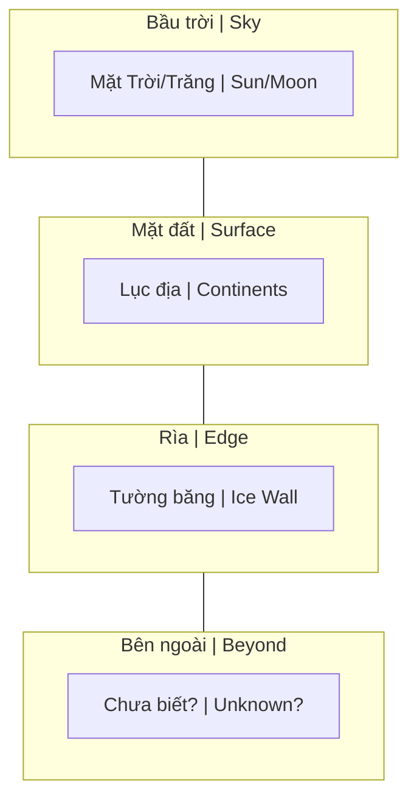

# Bức Tường Băng (Ice Wall)

**Bức Tường Băng** là khái niệm trong [[Thuyết Trái Đất Phẳng]], mô tả một vành đai băng khổng lồ ở rìa Trái Đất (thường được gọi là "Antarctica"), giữ nước đại dương không tràn ra ngoài và che giấu những vùng đất bí ẩn.

*The **Ice Wall** is a concept in [[Thuyết Trái Đất Phẳng|Flat Earth Theory]], describing a massive ice barrier at Earth's edge (commonly called "Antarctica") that prevents ocean water from spilling over and conceals mysterious lands beyond.*

---

## Mô Hình Flat Earth / Flat Earth Model

**Mô hình Flat Earth (nhìn từ bên cạnh) / Side view:**

> Theo mô hình này: Mặt Trời/Trăng quay trên đầu, các lục địa nằm trên mặt phẳng với Bắc Cực ở giữa, bức tường băng (Nam Cực) là rìa, và phía sau đó là vùng đất chưa được khám phá.
>
> *According to this model: Sun/Moon rotate overhead, continents lie on a flat plane with North Pole at center, ice wall (Antarctica) is the edge, and beyond lies unexplored territory.*

### Đặc Điểm Theo Model / Characteristics

| Thuộc tính / Attribute | Mô tả / Description |
|------------------------|---------------------|
| **Vị trí / Location** | Bao quanh rìa đĩa phẳng / Surrounds the flat disc's edge |
| **Chiều cao / Height** | 60-100+ mét / 60-100+ meters |
| **Chiều dài / Length** | Vô tận hoặc rất dài / Infinite or extremely long |
| **Chức năng / Function** | Giữ nước, barrier / Contains water, acts as barrier |
| **Beyond / Bên ngoài** | Vùng đất chưa biết? Mái vòm? Rìa? / Unknown lands? Dome? Edge? |

---

## Hiệp Ước Nam Cực 1959 / Antarctic Treaty 1959

### Sự Kiện Thực / Historical Facts
- 12 quốc gia ký kết / 12 nations signed
- Cấm quân sự hóa / Military activities prohibited
- Cấm khai thác tài nguyên / Resource extraction banned
- Chỉ cho nghiên cứu / Research only

*12 nations signed. Military activities prohibited. Resource extraction banned. Research purposes only.*

### Góc Nhìn Conspiracy / Conspiracy View
- Tại sao hợp tác khi Cold War đang xảy ra?
- Tại sao cấm thường dân tự do khám phá?
- Ai đang bảo vệ cái gì?

*Why cooperation during the Cold War? Why ban civilian free exploration? Who is protecting what?*

Xem thêm: [[Nam Cực - Bí Mật Được Canh Giữ]]

---

## Bằng Chứng Gợi Ý / Suggestive Evidence

### 1. Đô Đốc Byrd (1947) / Admiral Byrd

- Chiến dịch Highjump / Operation Highjump
- Tuyên bố thấy "vùng đất bên ngoài cực" / Claimed seeing "land beyond the pole"
- "Lục địa lớn bằng châu Mỹ" / "Continent as big as America"
- Phỏng vấn: "Các cực là lối vào thế giới bên trong" / Interview: "The poles are entrances to inner world"

### 2. Không Có Khám Phá Độc Lập / No Independent Exploration
- Không ai được đi tự do / No one allowed free access
- Chỉ có tour có hướng dẫn / Guided tours only
- Đắt đỏ, hạn chế / Expensive, restricted

### 3. Đường Bay / Flight Paths
- Tại sao không bay thẳng qua Nam Cực? / Why no direct flights over Antarctica?
- Lo ngại "hạ cánh khẩn cấp" / "Emergency landing" concerns
- Flat earth: Khoảng cách quá xa / Distance too far

---

## Phản Biện / Counter-Arguments

### 1. Ảnh Từ Không Gian / Photos from Space
- Trái Đất hình cầu / Earth is spherical
- Nam Cực là lục địa / Antarctica is a continent

### 2. Các Cuộc Thám Hiểm / Expeditions
- Nhiều người đã băng qua Nam Cực / People have crossed Antarctica
- Các căn cứ khoa học tồn tại / Scientific bases exist

### 3. Vật Lý / Physics
- Hình cầu giải thích được trọng lực / Sphere explains gravity
- Nước đứng yên nhờ trọng lực / Water stays due to gravity

---

## Tuyên Ngôn Bức Tường Băng / The Ice Wall Manifesto

"The Ice Wall Manifesto" là một tài liệu tham khảo cốt lõi cho dự án xây dựng thế giới **"Beyond the Ice Wall" (Bên Kia Bức Tường Băng - BTIW)**.

*"The Ice Wall Manifesto" is a core reference document for the world-building project "Beyond the Ice Wall" (BTIW).*

### Các Khái Niệm Cốt Lõi / Core Concepts

#### 1. Vũ Trụ Luận / Cosmology
- **Hình dạng Thế giới:** Không phải hành tinh quay trong không gian. Nó là một cấu trúc dạng "người tuyết" gồm các khối hành tinh xếp chồng lên nhau (Earth, Atlas, Akupara).
- **Thế giới Rác thải:** Bên ngoài rìa của Akupara là một vùng bình nguyên phẳng vô tận.
- **Trứng Vũ trụ:** Toàn bộ tạo hóa nằm bên trong một "quả trứng vũ trụ".

*World is not a spinning planet. It's a "snowman" structure of stacked planetoids. Beyond the edge is an infinite plain. All creation exists within a "cosmic egg".*

#### 2. Các Lực Lượng Cơ Bản / Fundamental Forces
- **Aether:** Chất lấp đầy không gian, tạo trọng lực và ổn định thực tại.
- **Azoth:** Bản chất của Chúa, tiềm năng thuần túy.
- **Vril & Orgone:** Vril là sức mạnh ý chí của sinh vật sống; Orgone là năng lượng khi ý chí bị bẻ gãy, dùng cho ma thuật hắc ám.

#### 3. Lịch Sử Thế Giới / World History
- **Tiền sử:** Chủng tộc bò sát (Suminites/Reptilians) từng thống trị.
- **Thời kỳ hoàng kim:** Con người Hyperborea đạt trình độ vượt bậc.
- **The Mudflood Era:** Reptilians gây ra "Lũ Bùn". Lịch sử bị viết lại, kiến thức về thế giới bên ngoài bức tường băng bị xóa sổ.
- **The New World Order (1910-nay):** Kế hoạch cuối cùng của Reptilians là "làm phẳng Trái Đất".

---

## Ý Nghĩa Biểu Tượng / Symbolic Meaning

Dù Ice Wall có thật hay không, khái niệm này đại diện cho:

*Whether the Ice Wall is real or not, the concept represents:*

1. **Giới hạn kiến thức / Limits of knowledge** — Những gì chúng ta không được biết / What we're not allowed to know
2. **Kiểm soát truy cập / Controlled access** — Gác cổng thông tin / Information gatekeeping
3. **Nỗi sợ vô định / Fear of unknown** — Giữ dân số trong vòng kiềm tỏa / Keep population contained
4. **Thế giới ẩn giấu / Hidden worlds** — Còn gì khác đang bị che đậy? / What else is being hidden?

---

## Related

- [[Thuyết Trái Đất Phẳng]]
- [[Trái Đất Phẳng]]
- [[Nam Cực - Bí Mật Được Canh Giữ]]
- [[Ma Trận]]
- [[Mô Hình Địa Tâm]]
- [[Khoa Học Xét Lại]]
- [[Elite]]
- [[Mudflood]]
- [[Tartaria]]
- [[Năng Lượng Aether]]

---

*Lần cuối cập nhật: 2026-04-30*
