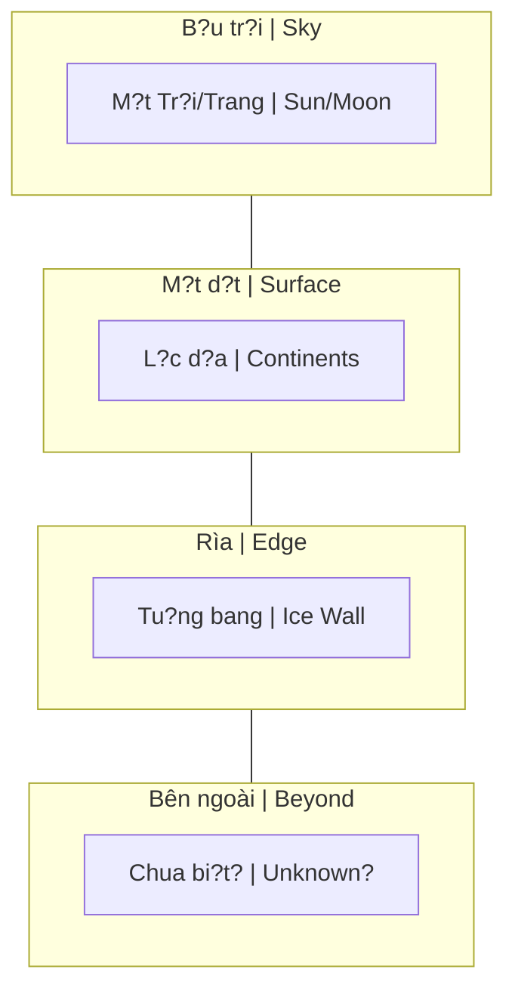

# B?c Tu?ng Bang (Ice Wall)

**B?c Tu?ng Bang** là khái ni?m trong [[Thuy?t Trái Ð?t Ph?ng]], mô t? m?t vành dai bang kh?ng l? ? rìa Trái Ð?t (thu?ng du?c g?i là "Antarctica"), gi? nu?c d?i duong không tràn ra ngoài và che gi?u nh?ng vùng d?t bí ?n.

*The **Ice Wall** is a concept in [[Thuy?t Trái Ð?t Ph?ng|Flat Earth Theory]], describing a massive ice barrier at Earth's edge (commonly called "Antarctica") that prevents ocean water from spilling over and conceals mysterious lands beyond.*

---

## Mô Hình Flat Earth / Flat Earth Model

**Mô hình Flat Earth (nhìn t? bên c?nh) / Side view:**

> Theo mô hình này: M?t Tr?i/Trang quay trên d?u, các l?c d?a n?m trên m?t ph?ng v?i B?c C?c ? gi?a, b?c tu?ng bang (Nam C?c) là rìa, và phía sau dó là vùng d?t chua du?c khám phá.
>
> *According to this model: Sun/Moon rotate overhead, continents lie on a flat plane with North Pole at center, ice wall (Antarctica) is the edge, and beyond lies unexplored territory.*

### Ð?c Ði?m Theo Model / Characteristics

| Thu?c tính / Attribute | Mô t? / Description |
|------------------------|---------------------|
| **V? trí / Location** | Bao quanh rìa dia ph?ng / Surrounds the flat disc's edge |
| **Chi?u cao / Height** | 60-100+ mét / 60-100+ meters |
| **Chi?u dài / Length** | Vô t?n ho?c r?t dài / Infinite or extremely long |
| **Ch?c nang / Function** | Gi? nu?c, barrier / Contains water, acts as barrier |
| **Beyond / Bên ngoài** | Vùng d?t chua bi?t? Mái vòm? Rìa? / Unknown lands? Dome? Edge? |

---

## Hi?p U?c Nam C?c 1959 / Antarctic Treaty 1959

### S? Ki?n Th?c / Historical Facts
- 12 qu?c gia ký k?t / 12 nations signed
- C?m quân s? hóa / Military activities prohibited
- C?m khai thác tài nguyên / Resource extraction banned
- Ch? cho nghiên c?u / Research only

*12 nations signed. Military activities prohibited. Resource extraction banned. Research purposes only.*

### Góc Nhìn Conspiracy / Conspiracy View
- T?i sao h?p tác khi Cold War dang x?y ra?
- T?i sao c?m thu?ng dân t? do khám phá?
- Ai dang b?o v? cái gì?

*Why cooperation during the Cold War? Why ban civilian free exploration? Who is protecting what?*

Xem thêm: [[Nam C?c - Bí M?t Ðu?c Canh Gi?]]

---

## B?ng Ch?ng G?i Ý / Suggestive Evidence

### 1. Ðô Ð?c Byrd (1947) / Admiral Byrd

- Chi?n d?ch Highjump / Operation Highjump
- Tuyên b? th?y "vùng d?t bên ngoài c?c" / Claimed seeing "land beyond the pole"
- "L?c d?a l?n b?ng châu M?" / "Continent as big as America"
- Ph?ng v?n: "Các c?c là l?i vào th? gi?i bên trong" / Interview: "The poles are entrances to inner world"

### 2. Không Có Khám Phá Ð?c L?p / No Independent Exploration
- Không ai du?c di t? do / No one allowed free access
- Ch? có tour có hu?ng d?n / Guided tours only
- Ð?t d?, h?n ch? / Expensive, restricted

### 3. Ðu?ng Bay / Flight Paths
- T?i sao không bay th?ng qua Nam C?c? / Why no direct flights over Antarctica?
- Lo ng?i "h? cánh kh?n c?p" / "Emergency landing" concerns
- Flat earth: Kho?ng cách quá xa / Distance too far

---

## Ph?n Bi?n / Counter-Arguments

### 1. ?nh T? Không Gian / Photos from Space
- Trái Ð?t hình c?u / Earth is spherical
- Nam C?c là l?c d?a / Antarctica is a continent

### 2. Các Cu?c Thám Hi?m / Expeditions
- Nhi?u ngu?i dã bang qua Nam C?c / People have crossed Antarctica
- Các can c? khoa h?c t?n t?i / Scientific bases exist

### 3. V?t Lý / Physics
- Hình c?u gi?i thích du?c tr?ng l?c / Sphere explains gravity
- Nu?c d?ng yên nh? tr?ng l?c / Water stays due to gravity

---

## B?c Tu?ng Bang / The Ice Wall Manifesto

"The Ice Wall Manifesto" là m?t tài li?u tham kh?o c?t lõi cho d? án xây d?ng th? gi?i **"Beyond the Ice Wall" (Bên Kia B?c Tu?ng Bang - BTIW)**.

*"The Ice Wall Manifesto" is a core reference document for the world-building project "Beyond the Ice Wall" (BTIW).*

### Các Khái Ni?m C?t Lõi / Core Concepts

#### 1. Vu Tr? Lu?n / Cosmology
- **Hình d?ng Th? gi?i:** Không ph?i hành tinh quay trong không gian. Nó là m?t c?u trúc d?ng "ngu?i tuy?t" g?m các kh?i hành tinh x?p ch?ng lên nhau (Earth, Atlas, Akupara).
- **Th? gi?i Rác th?i:** Bên ngoài rìa c?a Akupara là m?t vùng bình nguyên ph?ng vô t?n.
- **Tr?ng Vu tr?:** Toàn b? t?o hóa n?m bên trong m?t "qu? tr?ng vu tr?".

*World is not a spinning planet. It's a "snowman" structure of stacked planetoids. Beyond the edge is an infinite plain. All creation exists within a "cosmic egg".*

#### 2. Các L?c Lu?ng Co B?n / Fundamental Forces
- **Aether:** Ch?t l?p d?y không gian, t?o tr?ng l?c và ?n d?nh th?c t?i.
- **Azoth:** B?n ch?t c?a Chúa, ti?m nang thu?n túy.
- **Vril & Orgone:** Vril là s?c m?nh ý chí c?a sinh v?t s?ng; Orgone là nang lu?ng khi ý chí b? b? gãy, dùng cho ma thu?t h?c ám.

#### 3. L?ch S? Th? Gi?i / World History
- **Ti?n s?:** Ch?ng t?c bò sát (Suminites/Reptilians) t?ng th?ng tr?.
- **Th?i k? hoàng kim:** Con ngu?i Hyperborea d?t trình d? vu?t b?c.
- **The Mudflood Era:** Reptilians gây ra "Lu Bùn". L?ch s? b? vi?t l?i, ki?n th?c v? th? gi?i bên ngoài b?c tu?ng bang b? xóa s?.
- **The New World Order (1910-nay):** K? ho?ch cu?i cùng c?a Reptilians là "làm ph?ng Trái Ð?t".

---

## Ý Nghia Bi?u Tu?ng / Symbolic Meaning

Dù Ice Wall có th?t hay không, khái ni?m này d?i di?n cho:

*Whether the Ice Wall is real or not, the concept represents:*

1. **Gi?i h?n ki?n th?c / Limits of knowledge** - Nh?ng gì chúng ta không du?c bi?t / What we're not allowed to know
2. **Ki?m soát truy c?p / Controlled access** - Gác c?ng thông tin / Information gatekeeping
3. **N?i s? vô d?nh / Fear of unknown** - Gi? dân s? trong vòng ki?m t?a / Keep population contained
4. **Th? gi?i ?n gi?u / Hidden worlds** - Còn gì khác dang b? che d?y? / What else is being hidden?

---

## Related

- [[Thuy?t Trái Ð?t Ph?ng]]
- [[Trái Ð?t Ph?ng]]
- [[Nam C?c - Bí M?t Ðu?c Canh Gi?]]
- [[Ma Tr?n]]
- [[Mô Hình Ð?a Tâm]]
- [[Khoa H?c Xét L?i]]
- [[Elite]]
- [[Mudflood]]
- [[Tartaria]]
- [[Nang Lu?ng Aether]]

---

*L?n cu?i c?p nh?t: 2026-04-30*
