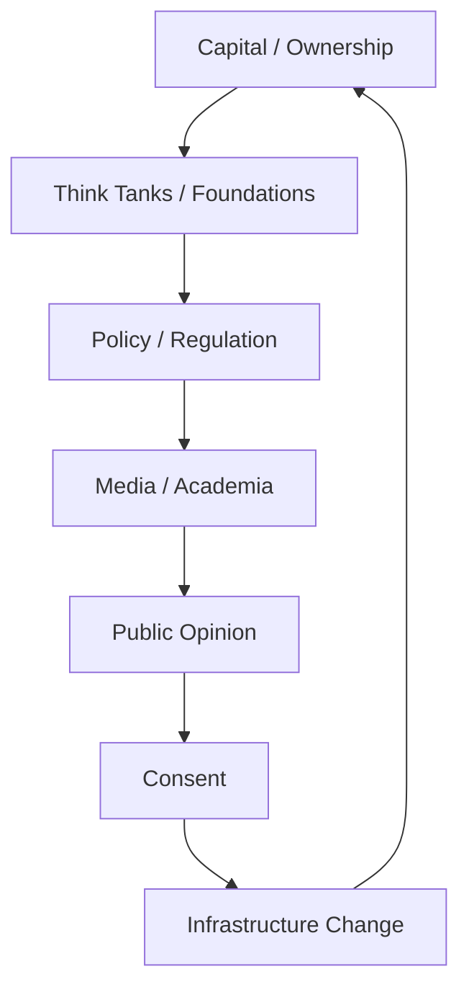
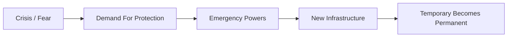

# Elite (Giới Tinh Hoa / The Global Elite)

**Elite không chỉ là “một nhóm người xấu bí mật cai trị thế giới”. Elite là tầng quyền lực có khả năng thiết kế default options: tiền tệ, luật chơi, narrative, hạ tầng, giáo dục, science consensus, media frame và permission structure mà số đông tưởng là reality tự nhiên.**

*The Elite is not merely “a secret group of bad people ruling the world.” It is the layer of power capable of designing default options: money, rules, narratives, infrastructure, education, scientific consensus, media frames, and permission structures that the masses mistake for natural reality.*

---

## Vault Position / Vị Trí Trong Vault

Trong redpill.wiki, **Elite** là node nối tầng institutional của [[Ma Trận]] với các applied systems:

- [[Báo Cáo 2030]] — blueprint tái cấu trúc xã hội
- [[Kiểm Soát Tâm Trí]] — programming nhận thức cộng đồng
- [[Tiền Giấy - Tiền Mặt]] — fiat, debt, inflation, programmable money
- [[Khoa Học Xét Lại]] — science as institution vs science as method
- [[UAP Disclosure - Controlled Revelation]] — controlled revelation và limited hangout
- [[Hollywood - Cây Đũa Phép Của Phù Thủy]] — myth/narrative programming

Cách đọc yếu nhất là săn một danh sách tên rồi gọi đó là “Elite”. Cách đọc mạnh hơn là thấy **network of incentives**: capital, state, intelligence, banking, philanthropy, media, academia, entertainment và technology cùng tạo một field quyền lực.

> Elite không cần kiểm soát mọi người mọi lúc. Họ chỉ cần kiểm soát default options mà số đông tưởng là lựa chọn tự do.

---

## Evidence Discipline / Cách Đọc Claim

| Tầng | Cách đọc | Ví dụ |
|---|---|---|
| **Fact / documentable** | cấu trúc sở hữu, lobbying, central banking, revolving doors, wealth concentration | asset managers, central banks, think tanks, media consolidation |
| **Pattern / systems reading** | nhiều institution khác nhau nhưng cùng đẩy một direction | cashless, digital ID, climate governance, censorship, biosecurity |
| **Symbol / myth reading** | ritual, logo, hội kín, occult timing, public disclosure qua fiction | WEF language, Hollywood, disclosure symbolism |
| **Speculative synthesis** | Cabal/Illuminati/occult governance, non-human influence | đọc như model huyền học, không thay thế evidence |

Nếu không tách tầng, người đọc dễ rơi vào hai bẫy: hoặc dismiss tất cả là “conspiracy”, hoặc tin mọi claim yếu chỉ vì nó anti-mainstream.

---

## 1. Elite Là Gì? / What Is The Elite?

Elite là tầng quyền lực có khả năng chuyển ý chí thành infrastructure.

Người bình thường có opinion. Elite có institution.

Người bình thường phản ứng với narrative. Elite tài trợ, test, distribute và normalize narrative.

Người bình thường dùng tiền. Elite thiết kế monetary system.

Người bình thường đọc news. Elite sở hữu hoặc ảnh hưởng gatekeeping layer của news, academia, philanthropy, platform và policy.

Elite không nhất thiết phải đồng thuận 100% với nhau. Các faction có thể cạnh tranh. Nhưng họ cùng chia sẻ một tầng quyền lực mà public không có: khả năng định nghĩa arena trước khi trận đấu bắt đầu.

---

## 2. Bốn Hình Thức Quyền Lực / Four Forms Of Power

### 1. Monetary Power

Ai kiểm soát tiền không chỉ kiểm soát giao dịch. Họ kiểm soát thời gian sống.

| Công cụ | Cách vận hành |
|---|---|
| Central banking | tạo tiền, kiểm soát lãi suất, chu kỳ boom/bust |
| Debt system | biến tương lai thành nghĩa vụ hiện tại |
| Inflation | rút giá trị khỏi người giữ tiền pháp định |
| CBDC | programmable money, permissioned transaction |
| Asset management | sở hữu gián tiếp qua index funds, votes, governance |

Đây là lý do [[Tiền Giấy - Tiền Mặt]], [[Bitcoin]], [[Privacy]] và [[MOC - Financial Sovereignty]] không phải chủ đề tài chính thuần túy. Chúng là sovereignty layer.

### 2. Narrative Power

Narrative power là quyền định nghĩa câu chuyện trước khi public bắt đầu tranh luận.

- vấn đề nào được gọi là crisis,
- expert nào được mời lên TV,
- từ nào được phép dùng,
- ai bị fact-check,
- ai được gọi là extremist,
- điều gì được xem là “settled science”,
- điều gì được đóng khung là misinformation.

[[Kiểm Soát Tâm Trí]] không cần thôi miên kiểu phim. Chỉ cần lặp đủ frame, đủ lâu, qua đủ kênh.

### 3. Infrastructure Power

Infrastructure power là quyền thiết kế cái nền mà mọi người buộc phải dùng.

| Infrastructure | Quyền lực ẩn |
|---|---|
| payment rails | cho phép/chặn giao dịch |
| cloud / app stores | cho phép/chặn speech và business |
| IDs / passports | cho phép/chặn movement |
| health systems | cho phép/chặn participation |
| satellite / internet | cho phép/chặn connection |
| AI models | định hình knowledge interface |

Khi power chuyển từ law sang infrastructure, censorship không cần luôn luôn giống “cấm”. Nó có thể chỉ là friction, ranking, demonetization, compliance, API denial.

### 4. Mythic Power

Power bền cần myth.

Đế chế cũ có divine right. Quốc gia hiện đại có flag, anthem, school history, hero, enemy. Technocracy có “science”, “safety”, “progress”, “planet”, “humanity”, “innovation”.

Đây là nơi [[Hollywood - Cây Đũa Phép Của Phù Thủy]], [[Bộ Tam Thánh Mind Control - NASA Disney Hollywood]] và [[A LIE N - SpaceX IPO Disclosure Day và Nghi Lễ Tên Lửa]] nối vào Elite. Elite không chỉ quản trị luật. Họ quản trị imagination.

---

## 3. Elite Không Phải Một Khối Đồng Nhất

Một lỗi lớn của cartoon conspiracy là tưởng Elite là một nhóm duy nhất, luôn đồng lòng, luôn kiểm soát hoàn hảo.

Thực tế mạnh hơn:

- có faction,
- có cạnh tranh,
- có betrayal,
- có national vs transnational interest,
- có old money vs tech money,
- có finance vs intelligence vs military vs platform power,
- có human-level ambition và có symbolic/metaphysical layer.

Nhưng cạnh tranh trong tầng Elite không giống cạnh tranh của public. Public tranh luận trong arena. Elite tranh quyền thiết kế arena.

> Faction war ở tầng trên không đồng nghĩa với freedom ở tầng dưới.

---

## 4. Công Cụ Kiểm Soát / Tools Of Control

### Money

Fiat money là một social contract có cưỡng chế. Khi tiền là debt, society chạy bằng repayment pressure. Khi tiền digital hóa và programmable hóa, permission trở thành một feature.

→ Xem: [[Tiền Giấy - Tiền Mặt]], [[Gen Z và CBDC - Programmable Money Psychology]], [[MOC - Financial Sovereignty]].

### Media

Media không chỉ nói dối. Nó chọn rhythm cho nervous system tập thể.

- crisis cycle,
- outrage cycle,
- hero/villain cycle,
- grief cycle,
- hope cycle,
- ridicule cycle.

Một narrative không cần thắng bằng logic nếu nó kiểm soát emotional tempo.

### Education

Education tạo compliance bằng cách gọi nó là success.

Nó dạy con người:

- ngồi yên,
- chờ chuông,
- xin phép,
- trả lời theo rubric,
- sợ sai,
- tối ưu điểm thay vì truth.

### Science Institution

Science như method cần được bảo vệ. Science như institution cần được nghi ngờ.

Khi funding, journal prestige, regulatory capture và career incentives quyết định câu hỏi nào được hỏi, science có thể thành priesthood mới.

→ Xem: [[Khoa Học Xét Lại]], [[MOC - Science Revisionism]].

### Philanthropy

Philanthropy là một trong những công cụ quyền lực mềm tinh vi nhất.

Nó biến wealth concentration thành moral authority. Một billionaire không cần thắng election nếu foundation của họ tài trợ research, education, public health, media và global policy networks.

### Crisis Management

Crisis là lúc public dễ đổi freedom lấy safety.

Không phải crisis nào cũng fake. Nhưng crisis nào cũng là opportunity cho governance expansion.

---

## 5. Agenda 2030 Và New World Order

[[Báo Cáo 2030]] không nên được đọc như một “document duy nhất chứng minh mọi thứ”. Nó là biểu hiện công khai của một direction lớn hơn: planetary management.

Ngôn ngữ bề mặt:

- sustainability,
- inclusion,
- safety,
- resilience,
- public health,
- climate action,
- digital transformation.

Pattern bên dưới:

- tracking,
- scoring,
- permissioning,
- rationing,
- nudging,
- behavioral governance,
- dependency,
- programmable money,
- digital identity.

New World Order không nhất thiết đến bằng một tuyên bố lập chính phủ thế giới. Nó có thể đến bằng một bundle infrastructure khiến mọi quốc gia tự đồng bộ qua standards, finance, climate metrics, health protocols, digital IDs và AI governance.

> Global governance không cần một ngai vàng toàn cầu nếu mọi hệ thống địa phương đều chạy cùng một protocol.

---

## 6. Controlled Opposition

Elite system luôn cần opposition. Không có opposition, public sẽ thấy cage quá rõ.

Controlled opposition có nhiều dạng:

| Dạng | Cách vận hành |
|---|---|
| safety valve | cho public xả giận trong biên độ vô hại |
| false hero | một nhân vật “chống hệ thống” nhưng vẫn giữ public trong game |
| limited hangout | tiết lộ một phần truth để che phần sâu hơn |
| faction theater | biến tranh chấp nội bộ thành drama cho public chọn phe |
| conspiracy containment | cho public một narrative alternative nhưng không dẫn tới sovereignty |

Điều này không có nghĩa mọi người nổi tiếng đều fake. Nó nghĩa là phải hỏi: vai trò của họ trong hệ thống là gì, họ mở cửa nào, họ đóng cửa nào, và họ được amplify bởi ai?

---

## 7. Hidden Knowledge / Tri Thức Bị Giấu

Elite không chỉ che thông tin. Họ quản lý timing, framing và permission của knowledge.

### Cosmology

- [[Chu Kỳ Hoàng Đạo]]
- [[Chu Kỳ Vũ Trụ — Yugas & Kalpas]]
- [[Mô Hình Địa Tâm]]
- [[Thuyết Trái Đất Phẳng]]

### Hidden History

- [[Tartaria]]
- [[Atlantis]]
- [[Lemuria]]
- [[Nam Cực - Bí Mật Được Canh Giữ]]
- [[Operation Paperclip]]

### Suppressed Tech / Science

- [[Nikola Tesla]]
- [[Năng Lượng Aether]]
- [[Giải Mã Năng Lượng Hạt Nhân & Cú Lừa Phóng Xạ]]
- [[Vũ Khí Năng Lượng Định Hướng]]

### Spiritual Knowledge

- [[Gnosis]]
- [[Monad]]
- [[Sự Nhất Thể]]
- [[Word Magic - Ngôn Ngữ Của Phù Thủy]]

Điểm chung: những knowledge này nếu được hiểu sâu sẽ làm con người ít lệ thuộc hơn vào authority trung gian.

---

## 8. Làm Gì Với Kiến Thức Này? / What To Do With This?

Mục tiêu không phải sống trong paranoia.

Nếu đọc Elite xong chỉ sợ hơn, ghét hơn, hoặc ám ảnh hơn, bạn mới nuốt poison chứ chưa tiêu hóa knowledge.

Chiến lược đúng:

1. **Perception sovereignty** — không để media quyết định nervous system.
2. **Financial sovereignty** — hiểu tiền, nợ, privacy, asset risk.
3. **Health sovereignty** — giữ cơ thể không quá mệt để suy nghĩ.
4. **Information sovereignty** — đọc source, đọc incentive, đọc frame.
5. **Spiritual sovereignty** — không outsource connection to Source.
6. **Local resilience** — quan hệ thật, skill thật, community thật.

Elite system mạnh khi con người atomized, exhausted, dependent và confused. Nó yếu khi con người grounded, networked, sovereign và khó lập trình.

---

## 9. Synthesis / Tổng Hợp

Elite là tầng người, institution và network vận hành gần mặt đất nhất của [[Ma Trận]]. Nhưng Elite không phải toàn bộ Ma Trận. Elite là operator layer trong một system sâu hơn: perception, incentive, identity, myth và forgetting.

Nếu chỉ căm ghét Elite, người đọc vẫn bị mắc trong binary.

Nếu chỉ phủ định Elite, người đọc bị naive.

Cách đọc đúng là: thấy power structure, thấy incentive, thấy myth, thấy frame, rồi lấy lại sovereignty từng tầng.

> Elite thắng khi bạn chỉ còn hai lựa chọn: phục tùng hoặc phản ứng. Tự do bắt đầu khi bạn xây lựa chọn thứ ba.

---

## Related

### Core Control System

- [[Ma Trận]]
- [[Ma Trận - Giải Phẫu Hoàn Chỉnh]]
- [[Kiểm Soát Tâm Trí]]
- [[Báo Cáo 2030]]

### Money & Infrastructure

- [[Tiền Giấy - Tiền Mặt]]
- [[Gen Z và CBDC - Programmable Money Psychology]]
- [[Bitcoin]]
- [[Privacy]]
- [[MOC - Financial Sovereignty]]

### Narrative & Knowledge

- [[Khoa Học Xét Lại]]
- [[Hollywood - Cây Đũa Phép Của Phù Thủy]]
- [[Karma Disclosure - Truth Hidden In Plain Sight]]
- [[UAP Disclosure - Controlled Revelation]]
- [[MOC - Epistemology & Propaganda]]

### Hidden History / Suppressed Knowledge

- [[Tartaria]]
- [[Operation Paperclip]]
- [[Nikola Tesla]]
- [[Năng Lượng Aether]]
