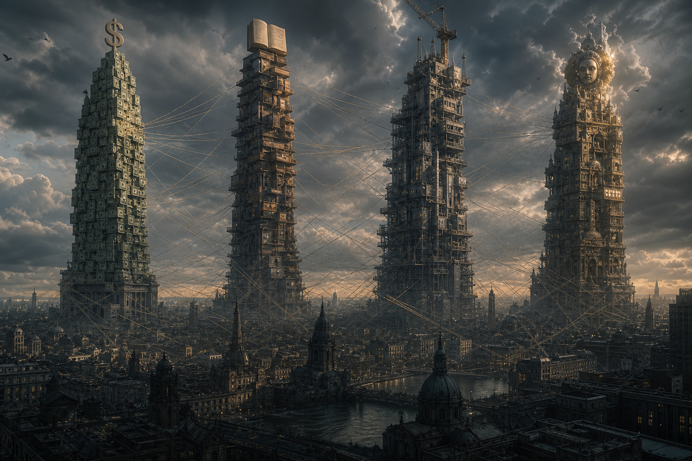

# Elite (Giới Tinh Hoa / The Global Elite)

**Elite không chỉ là “một nhóm người xấu bí mật cai trị thế giới”. Elite là tầng quyền lực có khả năng thiết kế default options: tiền tệ, luật chơi, narrative, hạ tầng, giáo dục, science consensus, media frame và permission structure mà số đông tưởng là reality tự nhiên.**

*The Elite is not merely “a secret group of bad people ruling the world.” It is the layer of power capable of designing default options: money, rules, narratives, infrastructure, education, scientific consensus, media frames, and permission structures that the masses mistake for natural reality.*

Cách đọc yếu nhất là săn một danh sách tên rồi gọi đó là Elite. Cách đọc mạnh hơn là thấy network of incentives: capital, state, intelligence, banking, philanthropy, media, academia, entertainment và technology cùng tạo một field quyền lực.

> Elite không cần kiểm soát mọi người mọi lúc. Họ chỉ cần kiểm soát default options mà số đông tưởng là lựa chọn tự do.

---

## Evidence Discipline / Cách Đọc Claim

Ở tầng fact, ta có thể kiểm tra cấu trúc sở hữu, lobbying, central banking, revolving doors, wealth concentration, think tanks, foundations, media consolidation, asset managers và public-private partnerships.

Ở tầng pattern, ta đọc nhiều institution khác nhau cùng đẩy một direction: cashless, digital ID, climate governance, censorship infrastructure, biosecurity, programmable money, managed speech, tokenized assets.

Ở tầng symbol, ta đọc ritual, logo, hội kín, occult timing, Hollywood, disclosure symbolism như language của mythic power.

Ở tầng speculative synthesis, các claim về Cabal, Illuminati, occult governance hoặc non-human influence phải được đọc như model huyền học/conspiracy, không thay thế evidence.

Nếu không tách tầng, người đọc rơi vào hai bẫy: dismiss tất cả là “conspiracy”, hoặc tin mọi claim yếu chỉ vì nó anti-mainstream.

---

## Vault Position / Vị Trí Trong Vault

Trong redpill.wiki, **Elite** là node nối tầng institutional của [[Ma Trận]] với các applied systems: [[Báo Cáo 2030]], [[Kiểm Soát Tâm Trí]], [[Tiền Giấy - Tiền Mặt]], [[Khoa Học Xét Lại]], [[UAP Disclosure - Controlled Revelation]], [[Hollywood - Cây Đũa Phép Của Phù Thủy]], [[Bitcoin]] và [[Privacy]].

Elite là bài giúp người đọc chuyển từ “ai là người xấu?” sang “quyền lực vận hành qua cấu trúc nào?”. Vì nhiều khi một hệ thống không cần một villain hoàn hảo. Nó chỉ cần incentives, career paths, funding channels, gatekeeping và fear of exclusion.

---

## Elite Là Gì?

Elite là tầng quyền lực có khả năng chuyển ý chí thành infrastructure.

Người bình thường có opinion. Elite có institution. Người bình thường phản ứng với narrative. Elite tài trợ, test, distribute và normalize narrative. Người bình thường dùng tiền. Elite thiết kế monetary system. Người bình thường đọc news. Elite sở hữu hoặc ảnh hưởng gatekeeping layer của news, academia, philanthropy, platform và policy.

Elite không nhất thiết đồng thuận 100%. Có faction, cạnh tranh, betrayal, national vs transnational interest, old money vs tech money, finance vs intelligence vs military vs platform power. Nhưng cạnh tranh trong tầng Elite không giống cạnh tranh của public. Public tranh luận trong arena. Elite tranh quyền thiết kế arena.

> Faction war ở tầng trên không đồng nghĩa với freedom ở tầng dưới.

---

## Bốn Hình Thức Quyền Lực

**Monetary power** là quyền định nghĩa tiền, tín dụng, lãi suất, thanh khoản, tài sản thế chấp, payment rails và khả năng freeze. Ai kiểm soát tiền không chỉ kiểm soát giao dịch. Họ kiểm soát thời gian sống. Đây là lý do [[Bitcoin]], [[Privacy]] và [[MOC - Financial Sovereignty]] không phải chủ đề tài chính thuần túy.

**Narrative power** là quyền định nghĩa câu chuyện trước khi public bắt đầu tranh luận: crisis nào được ưu tiên, expert nào được mời, từ nào được phép dùng, ai bị fact-check, ai bị gọi là extremist, điều gì được xem là settled science. [[Kiểm Soát Tâm Trí]] không cần thôi miên kiểu phim. Chỉ cần lặp đủ frame, đủ lâu, qua đủ kênh.

**Infrastructure power** là quyền thiết kế nền mọi người buộc phải dùng: payment rails, app stores, cloud, IDs, passports, health systems, satellite, internet, AI models. Khi power chuyển từ law sang infrastructure, censorship có thể chỉ là friction, ranking, demonetization, compliance, API denial.

**Mythic power** là quyền viết câu chuyện lớn: progress, safety, planet, humanity, innovation, national destiny, space frontier, alien disclosure. Power bền cần myth. Đây là nơi [[Hollywood - Cây Đũa Phép Của Phù Thủy]] và spectacle nối vào Elite.

---

## Default Options Là Quyền Lực Thật

Default options quyết định phần lớn hành vi. Người dùng hiếm khi đọc terms. Công dân hiếm khi đọc luật. Học sinh hiếm khi tự thiết kế curriculum. Người lao động hiếm khi tự chọn monetary regime. Người online hiếm khi biết ranking model đang đưa gì lên trước.

Vì vậy, quyền lực thật không chỉ nằm ở lệnh cấm. Nó nằm ở cái được đặt làm mặc định.

Default payment app. Default curriculum. Default news frame. Default health protocol. Default identity layer. Default search answer. Default compliance assumption. Default acceptable opinion.

Một xã hội có thể cảm thấy tự do vì vẫn có nhiều lựa chọn ở bề mặt, trong khi toàn bộ menu đã được thiết kế sẵn.

Elite không cần ép bạn chọn A. Họ chỉ cần làm A thành đường ít ma sát nhất, B thành đường đầy friction, và C không bao giờ xuất hiện trong imagination.

---

## Không Cartoon Conspiracy

Cartoon conspiracy làm người đọc yếu đi. Nó biến quyền lực thành vài khuôn mặt phản diện. Nó khiến người ta nghĩ nếu lộ danh sách tên là xong. Nhưng power hiện đại thường vận hành qua cấu trúc, không chỉ cá nhân.

Một CEO có thể rời ghế, incentive còn đó. Một politician có thể thua election, bureaucracy còn đó. Một platform đổi brand, data architecture còn đó. Một foundation đổi slogan, funding logic còn đó.

Điều đáng sợ không phải một người xấu điều khiển mọi thứ hoàn hảo. Điều đáng sợ hơn là một hệ thống nơi nhiều người bình thường, theo career incentive bình thường, cùng đẩy hướng phi nhân mà không ai cần thấy toàn bộ bức tranh.

Đó là Ma Trận ở tầng institutional.

---

## Elite Và Ma Trận

[[Ma Trận]] không chỉ là illusion metaphysical. Ở tầng xã hội, nó là hệ thống default perception: bạn nên sợ gì, muốn gì, tin ai, ghét ai, mua gì, học gì, nói gì, im gì, ký vào đâu, giao data cho ai, dùng tiền gì, chữa bệnh ra sao, mơ tương lai nào.

Elite là tầng architect của nhiều default đó. Không phải architect tuyệt đối. Không phải omnipotent. Nhưng đủ quyền lực để shape terrain.

Một người tỉnh không cần tưởng Elite là thần. Thần hóa Elite là một dạng worship ngược. Họ có lỗi, mâu thuẫn, giới hạn, panic, incompetence và faction war. Nhưng coi họ như “không tồn tại” cũng ngây thơ.

Đọc đúng: Elite là một field quyền lực có pattern. Không phải demon để worship, không phải joke để dismiss.

---

## Sovereignty Response

Phản ứng đúng không phải ám ảnh danh sách kẻ thù. Phản ứng đúng là giảm phụ thuộc vào default options.

Tài chính: học [[Bitcoin]], [[Privacy]], cash, custody, risk discipline, không để một account là single point of failure.

Nhận thức: học [[Source Discipline - Kỷ Luật Nguồn Và Bằng Chứng]], [[Nghịch Lý Của Hiểu Biết]], không để một narrative chiếm toàn bộ mind.

Media: hiểu [[Predictive Programming - Cấy Tương Lai Vào Tiềm Thức]], [[Hollywood - Cây Đũa Phép Của Phù Thủy]], không giao subconscious cho màn hình.

Body/community: giữ health, family, skill, local trust, real-world competence. Người chỉ “biết âm mưu” nhưng không có đời sống tự chủ vẫn dễ bị hệ thống kéo.

Sovereignty không phải rút vào paranoia. Sovereignty là có nhiều lớp tự chủ đến mức default options không còn là nhà tù.

---

## Kết

Elite là tầng quyền lực thiết kế default options. Không phải vì họ là thần toàn năng, mà vì họ kiểm soát nhiều cửa: money, narrative, infrastructure, myth, education, science institution, entertainment, platform và policy.

Đọc Elite đúng sẽ làm người đọc tỉnh và thực tế hơn. Đọc sai sẽ làm người đọc hoặc ngây thơ, hoặc paranoid. Cả hai đều phục vụ Ma Trận.

> Câu hỏi không phải “ai điều khiển tất cả?”. Câu hỏi sắc hơn là: “ai thiết kế cái menu mà tôi tưởng là lựa chọn tự do?”

---

## Reading Path / Đọc Tiếp

- [[Ma Trận]] — hệ điều hành perception và default reality
- [[Báo Cáo 2030]] — blueprint/governance stack của trật tự mới
- [[Privacy]] — tuyến phòng thủ chống surveillance power
- [[Bitcoin]] — exit khỏi monetary permission rails
- [[Hollywood - Cây Đũa Phép Của Phù Thủy]] — mythic power qua màn hình
- [[UAP Disclosure - Controlled Revelation]] — controlled revelation và limited hangout
