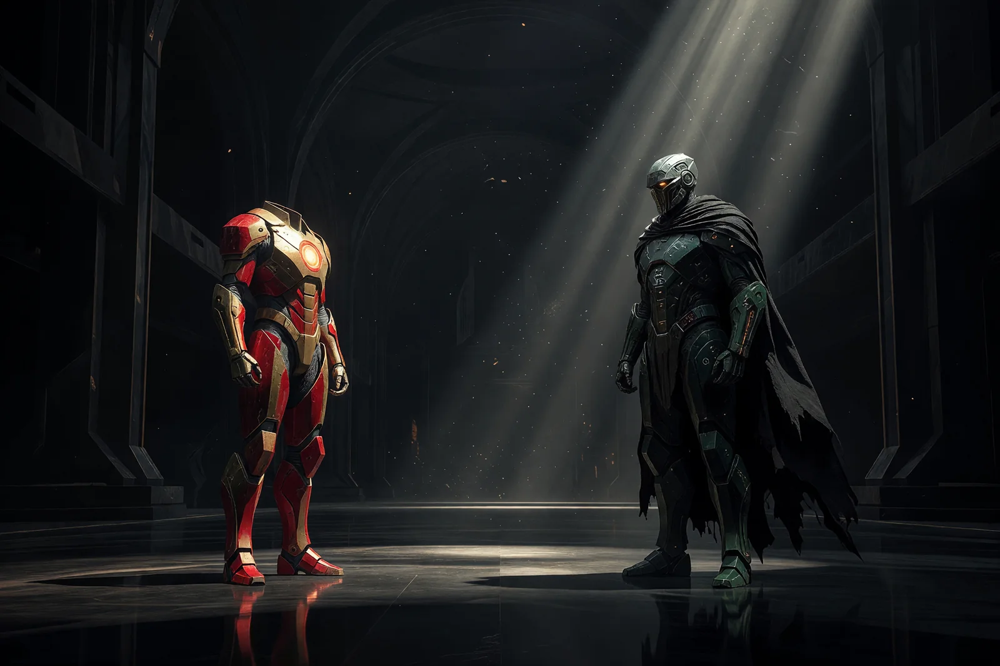
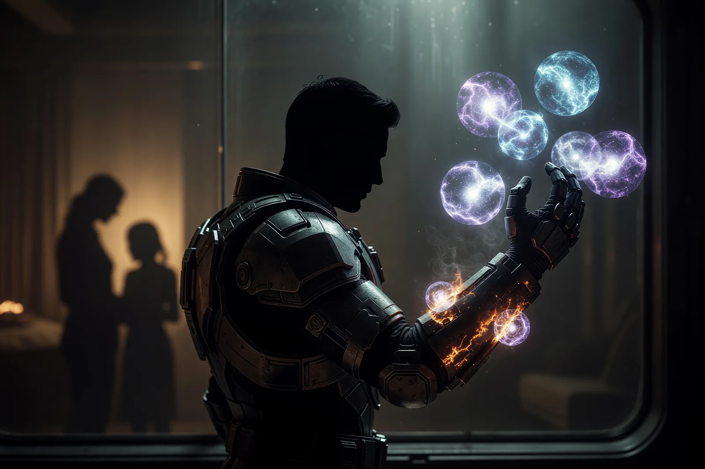
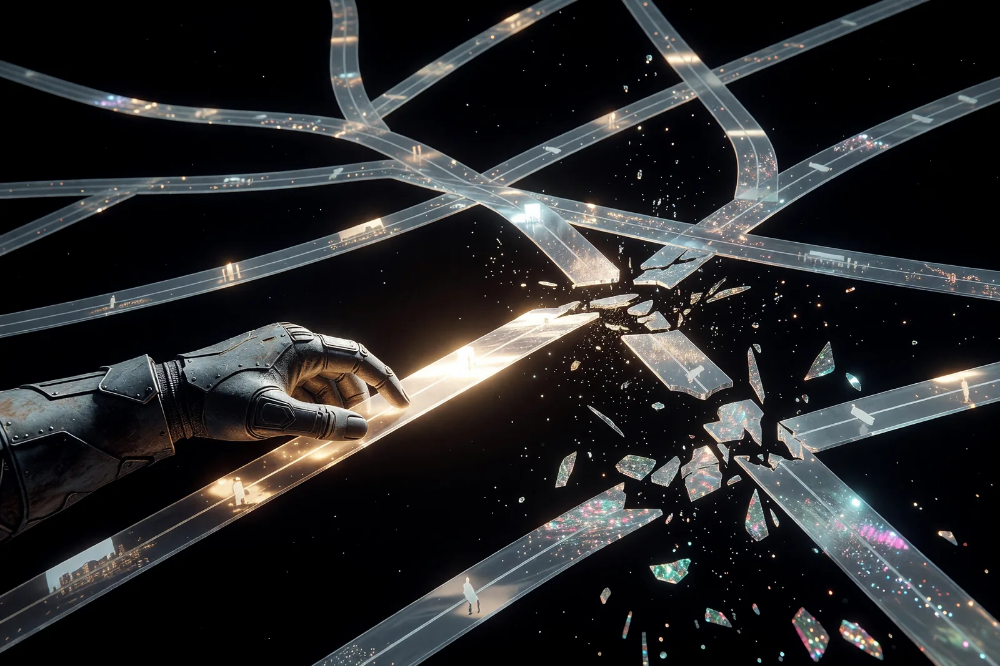
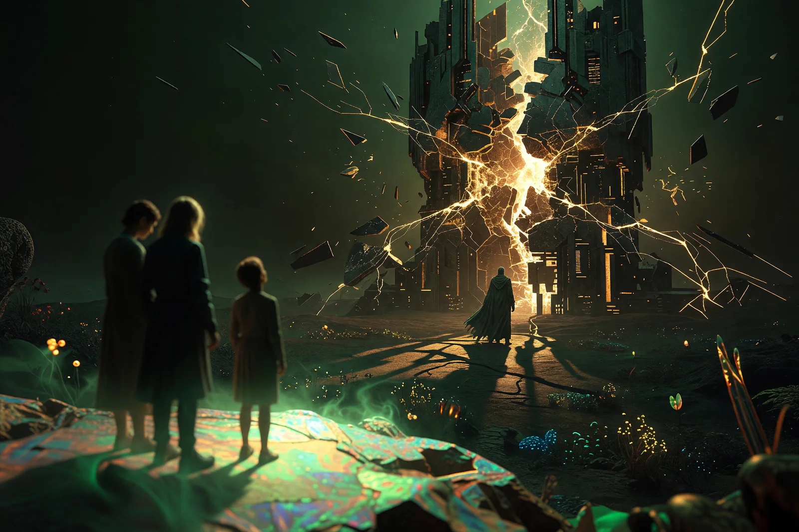
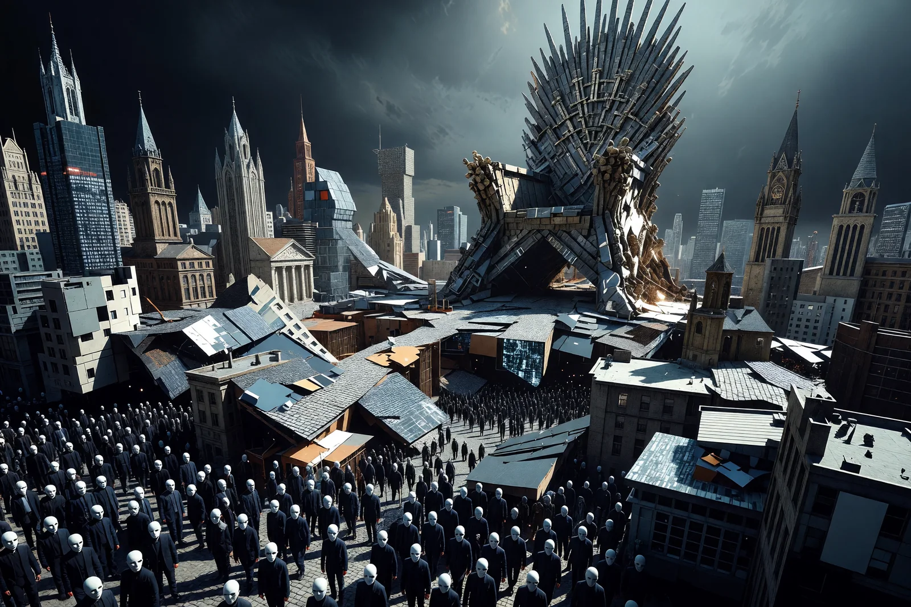
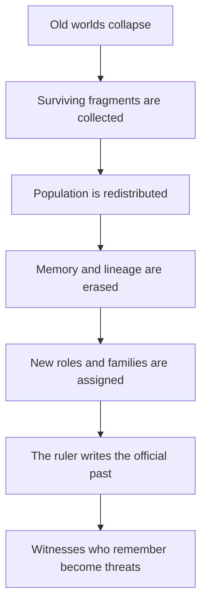
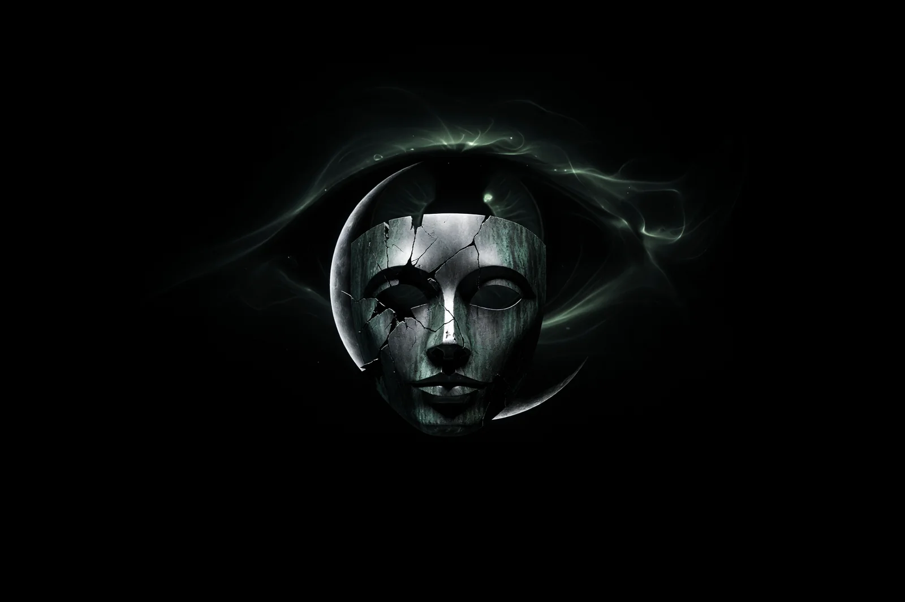

# I Am Iron Man, I Am Doom — Cái Giá Của Người Hùng

**Tony Stark chết để cứu một thực tại. Doctor Doom có thể xuất hiện để hỏi thực tại ấy đã được cứu bằng cuộc đời của ai.**

*Tony Stark died to save a reality. Doctor Doom may arrive to ask whose lives that reality was built upon.*

Marvel bắt đầu đế chế điện ảnh của mình bằng khuôn mặt Robert Downey Jr. Một thiên tài đứng trước thế giới, thú nhận mình là người mặc giáp, rồi biến câu **“I am Iron Man”** thành lời khai sinh của MCU.

Gần hai thập kỷ sau, cùng khuôn mặt ấy trở lại. Không còn ánh đỏ-vàng. Không còn lò phản ứng phát sáng trên ngực. Chỉ còn mặt nạ sắt, áo choàng xanh và một lời tự xưng khác:

> **I’m Doom.**

Nếu đây chỉ là casting stunt, nó đã đủ mạnh. Nhưng đặt cạnh cái chết của Tony trong *Endgame*, bản leak *Avengers: Doomsday*, lời cảnh báo về những **“cuộc đời bị đánh cắp”** và hình ảnh Robert Downey Jr. từng xuất hiện với một bên mắt bầm, ta có một cấu trúc biểu tượng sâu hơn.

Đây không phải bằng chứng Marvel đang thực hiện nghi lễ bí mật. Đây là cách đọc một câu chuyện đang dùng cùng một gương mặt để đặt hai hình thái quyền lực cạnh nhau:

- thiên tài cứu thế chấp nhận chết để người khác sống;
- thiên tài cai trị quyết định người khác phải sống trong thế giới do mình tạo.

---

## 1. Tony Không Phải Người Duy Nhất Chết — Nhưng Anh Là Người Phải Khép Vòng

Nói Tony là người duy nhất hy sinh trong *Endgame* không chính xác. Natasha chết ở Vormir để đổi lấy Soul Stone. Vision và Gamora đã chết trước đó. Steve bỏ lại hiện tại để sống một đời khác. Thor mất gia đình, quê hương và phần lớn căn tính cũ.

Nhưng Tony là người hy sinh ở **điểm đóng của toàn bộ Infinity Saga**. Cái chết của anh không chỉ giải quyết trận chiến. Nó hoàn tất câu hỏi đã bắt đầu từ bộ phim *Iron Man* đầu tiên: một con người có trí tuệ và quyền lực vượt xa người khác sẽ dùng nó để làm gì?

Tony ban đầu sống bằng ba lớp phòng thủ: tiền, trí thông minh và sự hài hước. Anh chế tạo vũ khí nhưng không muốn nhìn thấy người bị vũ khí làm tổn thương. Anh yêu tự do cá nhân nhưng liên tục dựng bộ giáp lớn hơn để kiểm soát tương lai. Sau trận New York, nỗi sợ thất bại biến thành Ultron, thành giấc mơ “bộ giáp bao quanh thế giới”, thành cuộc xung đột với Steve Rogers.

Tony không thiếu lòng tốt. Anh thiếu khả năng chấp nhận rằng mình không thể kiểm soát mọi kết quả.

Đến *Endgame*, anh cuối cùng có điều đáng giữ hơn bản ngã: Pepper, Morgan và một mái nhà bình yên. Vì vậy cú búng tay cuối mới có trọng lượng. Người không còn gì để mất lao vào cái chết là bi kịch. Người đang có một đời đáng sống nhưng vẫn chọn trả giá cho người khác mới hoàn thành vòng cung người hùng.

Steve và Tony đi theo hai hướng ngược nhau:

- Steve luôn biết hy sinh nhưng không biết sống cho mình.
- Tony luôn biết sống cho mình nhưng phải học cách buông mình vì người khác.

Kết thúc trao cho mỗi người bài học còn thiếu. Tony chết để người khác được sống. Steve sống cuộc đời mà anh luôn trì hoãn.

---

## 2. Endgame Không Chỉ Cứu Thế Giới — Nó Chọn Phiên Bản Thế Giới Được Tồn Tại

Cú búng tay của Hulk đưa những người bị Thanos xóa trở lại. Nhưng Tony đặt một điều kiện: **không được xóa năm năm vừa qua**. Nếu quay mọi thứ về đúng khoảnh khắc trước Snap, Morgan có thể không còn tồn tại.

Đó là quyết định của một người cha. Nhưng xét ở quy mô vũ trụ, Avengers đã tự chọn:

- ai được đưa trở lại;
- năm năm lịch sử nào phải được giữ;
- gia đình nào phải sống với một người trở về sau khi họ đã đi tiếp;
- tài sản, biên giới và quan hệ nào phải thích nghi với hàng tỷ người xuất hiện lại;
- dòng thời gian nào có thể bị mượn Infinity Stones;
- sự tồn tại của ai có thể trở thành giá phải trả.

Marvel kể quyết định ấy từ phía những người được cứu. Từ góc nhìn ấy, Avengers là anh hùng.

Nhưng Multiverse Saga mở một góc nhìn khác: điều gì xảy ra với những timeline bị can thiệp? Một lựa chọn cứu Earth-616 có thể tạo Incursion ở thế giới khác. Một người được trả lại cuộc đời có thể vô tình chiếm mất cuộc đời người khác đã xây trong năm năm vắng họ.

Đây là nơi lời buộc tội **“stolen lives”** có sức nặng. Người hùng không cần có ý định xấu để lấy mất đời người khác. Chỉ cần họ có quyền quyết định thực tại nào đáng được giữ, còn những người bị ảnh hưởng không có mặt trong căn phòng quyết định.

Avengers gọi đó là cứu thế.

Doom gọi cùng quyền lực ấy là cai trị.

---

## 3. Bốn Thế Giới Và Một Phép Toán: Ai Phải Chết Để Ai Được Sống?

Phần này thuộc **leak claim**, chưa phải canon đã phát hành.

Bản leak đầy đủ làm rõ cấu trúc đa vũ trụ hơn bản tóm tắt đầu tiên:

| Thế giới | Vai trò trong leak |
|---|---|
| **Earth-96238** | Thế giới của Spider-Man Tobey. X-Men từ Earth-10005 mang thiết bị sang phá hủy nó để chặn Incursion. Wolverine và Spider-Man bị kẹt lại. |
| **Earth-10005** | Thế giới X-Men. Từng sống sót qua nhiều Incursion bằng cách hy sinh thế giới khác; sau đó bị Doom phá Cerebro và kích hoạt sụp đổ. |
| **Earth-828** | Thế giới Fantastic Four và Doom. Loki đưa gia đình Steve tới đây. Sự hiện diện của họ góp phần tạo biến cố giết gia đình Doom. |
| **Earth-616** | Thế giới MCU chính. Avengers và Wakanda dựng khẩu đại bác thứ ba; cuối cùng va chạm với Earth-828. |

Opening đã đặt câu hỏi đạo đức ngay lập tức. Magneto, Deadpool và Wolverine không phá Earth-96238 vì ghét Spider-Man. Họ làm vậy vì tin rằng nếu không hủy một thế giới, cả hai sẽ chết.

Tobey Spider-Man chống lại họ vì từ góc nhìn người đang bị chọn làm vật hy sinh, “không còn lựa chọn nào khác” chỉ là cách kẻ có bom giải thích quyền giết thế giới mình.

Đến Act 2, chính Earth-10005 — thế giới từng hy sinh Earth-96238 — lại bị Doom đẩy vào hủy diệt. Nạn nhân của một Incursion trở thành thủ phạm ở Incursion trước, rồi lại thành nạn nhân của Incursion sau. Không phe nào giữ được vị trí anh hùng vĩnh viễn.

Sau khi Earth-10005 biến mất, Final Incursion còn lại Earth-616 và Earth-828. Doom để hai thế giới va chạm, dùng tim Loki, Franklin Richards và ma thuật để tái tạo những mảnh vỡ thành Battleworld.

Toàn bộ phim, nếu leak đúng, được xây trên cùng một phép toán:

> Một thế giới phải chết để một thế giới khác được sống.  
> Nhưng ai được quyền chọn thế giới phải chết?

### Steve Rogers Là Bằng Chứng Sống Cho Cáo Buộc Của Doom

Theo leak, Steve trở về quá khứ, sống cùng Peggy và có con trai tên James. Loki chống lệnh TVA để cứu happy ending ấy, đưa gia đình Steve sang Earth-828.

Nhìn từ Earth-616, Steve cuối cùng được trả lại cuộc đời chiến tranh đã lấy khỏi anh.

Nhìn từ phía Doom, Steve đã sống một cuộc đời không thuộc timeline mình. Việc Loki đặt gia đình ấy vào Earth-828 làm thí nghiệm của Doom phát nổ, giết vợ con hắn và phá hủy khuôn mặt hắn.

Bản leak mới còn làm tragedy nặng hơn: Doom cho một phù thủy giả dạng Peggy dẫn James tới, rồi giết cậu bé trước mặt Steve. Sau đó hắn giết Bucky trong trận cuối. Steve nhìn cả con trai lẫn người bạn lâu đời nhất chết vì hậu quả của một cuộc đời mà anh từng nghĩ là phần thưởng xứng đáng.

Điều này làm Doom nguy hiểm hơn một phản diện chỉ muốn quyền lực. Hắn có một cáo buộc có phần đúng: người hùng đã thay đổi cấu trúc thực tại, còn gia đình hắn trả giá.

Nhưng Doom đi từ bất công thật tới đáp án độc tài. Vì các anh hùng từng chọn sai, hắn kết luận chỉ một người hoàn hảo mới được quyền chọn — chính hắn.

Đây là công thức quen thuộc của vua kỹ trị:

1. Chỉ ra một hệ thống đã thất bại thật.
2. Chứng minh những người cầm quyền cũ không đủ năng lực.
3. Biến năng lực cá nhân thành lý do được cai trị tất cả.

---

## 4. “I Am Iron Man” Và “I’m Doom” — Cùng Một Thiên Tài, Hai Quan Hệ Với Quyền Lực

Hai câu có cùng cấu trúc. Cả hai không giới thiệu nghề nghiệp. Chúng tuyên bố một căn tính toàn vẹn.

> **Tony:** Tôi có sức mạnh thay đổi thế giới, nên tôi phải trả giá cho cách dùng nó.
>
> **Doom:** Tôi có sức mạnh thay đổi thế giới, nên thế giới phải thuộc về tôi.

Tony đạt đỉnh khi buông quyền kiểm soát. Doom được sinh ra từ việc không bao giờ muốn bất lực lần nữa.

Tony hiểu rằng bộ giáp không thể bảo vệ mọi người mãi. Doom kết luận phải xây một thế giới nơi không ai còn khả năng làm trái kế hoạch của hắn.

Đó là lý do Battleworld quan trọng. Theo leak, Doom không chỉ hồi sinh những người đã chết. Hắn xóa ký ức của họ và cho mỗi người một cuộc đời mới. Không ai nhớ thế giới trước đó, nên không ai có cơ sở phản đối thế giới hiện tại.

Leak đầy đủ cho thấy sự chiếm đoạt này rất cụ thể:

- Sue trở thành vợ Doom; Franklin và bé gái chưa sinh trở thành con hắn.
- Reed là người hiếm hoi bị giữ ký ức để phải chứng kiến gia đình mình sống trong câu chuyện của Doom.
- Thor mất ký ức và dẫn đầu Thor Corps.
- Strange trở thành cảnh sát trưởng, đứng cạnh Ancient One, Clea và Sylvie.
- Những mảnh Earth-616 và Earth-828 nằm cạnh nhau như tàn tích, còn lâu đài Doom nguyên vẹn ở trung tâm.

After-credit còn để Tobey Spider-Man và Wolverine sống trong The Void, mang theo thứ nguy hiểm nhất đối với một chế độ xây bằng ký ức giả: họ vẫn nhớ.

Battleworld vì vậy không chỉ là thế giới Doom cứu. Nó là một hệ điều hành lịch sử: ai giữ ký ức có thể biết thực tại đã bị đánh cắp; ai mất ký ức chỉ còn khả năng thờ người đã viết lại nó.

### Battleworld Là Địa Ngục Hay Một Thế Giới Đã Được Cứu?

Từ góc nhìn Avengers, hành động của Doom là tội ác. Hắn để các vũ trụ sụp đổ, chiếm quyền năng của Loki và Franklin, xóa ký ức người sống rồi đặt mình lên ngai vàng.

Nhưng từ góc nhìn Doom, câu chuyện có thể hoàn toàn khác.

Khi mọi thực tại chỉ còn cách hư vô một bước, Doom đứng trước hai lựa chọn:

- để tất cả biến mất;
- hoặc cứu những mảnh còn lại và dựng một thế giới mới.

Hắn chọn cứu.

Chỉ có điều Doom không muốn làm người cứu thế vô danh. Với lòng kiêu hãnh của mình, hắn phải trở thành Chúa của thế giới vừa cứu.

Điểm làm câu chuyện khó hơn là Battleworld không nhất thiết trông như địa ngục. Trong truyện tranh, Latveria thường được mô tả như một quốc gia nhỏ trở nên trật tự, hiện đại và tương đối an toàn dưới Victor von Doom. Cái giá là toàn bộ quyền lực nằm trong tay một nhà vua không chấp nhận bị thách thức.

Battleworld có thể dùng cùng lời hứa ở quy mô vũ trụ:

- không còn đói nghèo;
- nền văn minh đổ nát được dựng lại;
- chiến tranh giữa các thế giới chấm dứt;
- người chết được hồi sinh;
- mọi người có một vai trò và một nơi để thuộc về.

Với nhiều cư dân chưa từng biết thế giới cũ, Doom có thể thật sự là Đấng Cứu Thế. Họ thức dậy trong một trật tự có thức ăn, gia đình và tương lai. Chỉ những người còn ký ức mới thấy nền móng bên dưới: thế giới này được dựng bằng những thực tại bị xóa, những căn tính bị đánh cắp và lịch sử bị viết lại.

Vậy khi các siêu anh hùng đứng lên phá Battleworld, câu hỏi khó nhất không còn là:

> Doom có phải kẻ xấu không?

Mà là:

> Nếu Battleworld thực sự tốt hơn thế giới cũ, các anh hùng còn có quyền phá nó để trả lại một sự thật mà phần lớn cư dân không nhớ và có thể không muốn nhận không?

Đây là ranh giới mỏng giữa Đấng Cứu Thế và Kẻ Độc Tài. Không chỉ nằm ở kết quả người ấy tạo ra. Nó nằm ở việc người sống trong thế giới ấy có được biết sự thật, có quyền không đồng ý và có thể rời khỏi trật tự đó hay không.

Một thế giới hoàn hảo mà không ai được quyền từ chối vẫn có thể là nhà tù hoàn hảo.

Tony trả mạng sống mình để người khác trở về với ký ức và tự do của họ.

Doom lấy ký ức của người khác để thế giới hắn tạo ra không thể bị thách thức.

Cả hai đều sửa thực tại. Khác biệt nằm ở **ai trả giá** và **người được cứu còn quyền lựa chọn hay không**.

---

## 5. Battleworld Là Một Cuộc Reset Lịch Sử Hoàn Chỉnh

Battleworld chạm rất gần một cụm motif đã có trong vault: [[Tartaria]], [[Mudflood]], thế kỷ trống, kiến trúc thế giới cũ và [[Orphan Train 2.0 - Khi Ma Trận Chở Trẻ Em Ra Khỏi Dòng Máu]].

Không phải vì Marvel chứng minh các giả thuyết ấy. Mà vì Battleworld dùng đúng cùng một kiến trúc reset:

### Incursion Là Đại Hồng Thủy Của Đa Vũ Trụ

Trong cụm Tartaria/Mudflood, reset bắt đầu bằng một thảm họa làm đứt lịch sử cũ. Thành phố bị chôn, dân số biến mất, công trình còn lại nhưng câu chuyện về người xây bị thay thế.

Trong *Doomsday*, Incursion làm việc tương tự ở cấp vũ trụ. Các Trái Đất không chỉ thua trận. Chúng bị nghiền thành mảnh. Earth-96238 biến mất. Earth-10005 biến mất. Earth-616 và 828 va vào nhau. Khi Battleworld xuất hiện, không còn thế giới gốc nào đủ nguyên vẹn để phản bác lịch sử mới.

Doom không cần đốt toàn bộ thư viện. Hắn phá chính nơi mà thư viện từng thuộc về.

### Kiến Trúc Cũ Còn Đó, Nhưng Chủ Nhân Cũ Biến Mất

Leak nói trên Battleworld vẫn có thể thấy tàn tích Tòa nhà Baxter và Tháp Avengers, còn lâu đài Doom nguyên vẹn.

Đây là motif old-world architecture rất rõ:

- công trình của thời đại trước vẫn đứng;
- người xây và mục đích cũ không còn được nhớ;
- chế độ mới chiếm dụng di tích;
- lịch sử chính thức gán mọi trật tự còn lại cho người chiến thắng.

Một đứa trẻ sinh ra trên Battleworld có thể nhìn các tòa tháp ấy nhưng không biết từng tồn tại Fantastic Four hay Avengers. Với nó, các di tích chỉ là phần tự nhiên của thế giới Doom luôn cai trị.

Kiến trúc tồn tại lâu hơn ký ức. Người kiểm soát ký ức sẽ được quyền đặt tên lại kiến trúc.

### Orphan Train Ở Cấp Độ Cả Thế Giới

Orphan Train trong vault không chỉ là đoàn tàu chở trẻ không cha mẹ. Nó là motif **tách con người khỏi dòng máu, tên cũ và ký ức gốc**, rồi đưa họ vào một trật tự mới nơi lịch sử được dạy lại từ đầu.

Battleworld thực hiện điều ấy với toàn bộ dân số.

Sue không còn là vợ Reed mà trở thành vợ Doom. Franklin không còn là con Reed. Bé gái chưa sinh được đặt vào gia đình mới. Thor trở thành người dẫn Thor Corps. Strange trở thành cảnh sát trưởng. Những người từng là Avengers, X-Men và Fantastic Four được phân lại vai như trẻ em bước xuống một chuyến tàu mà không nhớ ga xuất phát.

Họ không nhất thiết cảm thấy mình bị bắt cóc. Ký ức về gia đình cũ đã mất, nên gia đình mới có vẻ hoàn toàn tự nhiên.

Đây là dạng orphan sâu nhất: không chỉ mất cha mẹ, mà mất luôn khả năng nhớ rằng mình từng có cha mẹ khác.

### Reed Là Người Sống Qua “Thế Kỷ Trống”

Doom giữ ký ức cho Reed. Đây có thể là hình phạt tàn nhẫn nhất trong leak.

Tất cả mọi người sống trong hiện tại mới như thể nó luôn tồn tại. Chỉ Reed biết có một khoảng lịch sử đã bị xóa. Anh nhìn vợ mình làm vợ Doom, con mình gọi Doom là cha, và một thế giới vận hành bình thường trên nền của nhiều thế giới đã chết.

Reed là nhân chứng của thế kỷ trống: người biết giữa lịch sử cũ và lịch sử chính thức có một đoạn bị cắt, nhưng không còn archive công khai để chứng minh.

Tobey Spider-Man và Wolverine trong The Void cũng giữ ký ức. Họ là oral history sống sót ngoài hệ thống — hai người mang câu chuyện mà Battleworld không thể cho phép trở về.

Một chế độ xây trên ký ức giả có thể chịu được quân nổi dậy. Nó khó chịu được nhân chứng nhớ đúng.

### Reset Thành Công Nhất Khi Đời Sống Mới Có Vẻ Tốt Hơn

Nếu Battleworld chỉ có đau khổ, người dân sẽ muốn lật Doom. Nhưng nếu nó an toàn, đủ ăn và có trật tự, ký ức cũ trở thành mối đe dọa đối với chính hạnh phúc hiện tại.

Đó là câu hỏi khó nhất của mọi reset-history thesis:

> Nếu chế độ mới thực sự cho phần lớn người dân một đời sống ổn định hơn, sự thật về thế giới bị xóa có còn đủ để biện minh cho việc phá trật tự ấy không?

Lịch sử không chỉ được viết lại bằng bạo lực. Nó được bảo vệ bằng lợi ích của những người đang sống tốt trong phiên bản mới.

Ở tầng pattern, Doom không chỉ là God Emperor. Hắn là người giữ archive, đặt lịch, phân vai gia đình và quyết định quá khứ nào được phép tồn tại.

Battleworld là một thế giới sau reset nơi vị vua không chỉ sở hữu đất. Hắn sở hữu **ký ức về việc đất ấy từng là gì**.

## 6. Cùng Khuôn Mặt RDJ Là Một Cái Bẫy Dành Cho Khán Giả

Marvel xác nhận Robert Downey Jr. đóng Victor von Doom. Nhưng Marvel chưa xác nhận Doom là một biến thể Tony Stark. Bản leak được lưu lại còn nói không có liên hệ cốt truyện trực tiếp giữa hai người.

Vậy tại sao dùng cùng diễn viên?

Vì khán giả không nhìn khuôn mặt RDJ như khuôn mặt trung tính. Nó đã tích lũy hơn mười năm niềm tin. Ta nhìn anh và nhớ:

- người đã bay qua cổng không gian với quả bom hạt nhân;
- người ôm Peter Parker khi cậu biến mất;
- người có con gái và cuối cùng học cách làm cha;
- người nói “I am Iron Man” rồi chết để mọi người sống.

Doom bước vào với toàn bộ **tín dụng đạo đức** Tony để lại. Trước khi nhân vật làm gì, khuôn mặt đã khiến người xem muốn tin, muốn tha thứ hoặc muốn tìm Tony bên trong hắn.

Đó có thể là cái bẫy của phim. Doom không cần giả dạng Tony trong cốt truyện. Casting đã khiến hắn mang mặt nạ Tony trong tâm trí khán giả.

Iron Man là mặt sáng của nhà cứu thế công nghệ: thiên tài, khiếm khuyết, hài hước, cuối cùng biết hy sinh.

Doom là bóng tối của cùng hình tượng: nhà khoa học–pháp sư, vua kỹ trị, người vừa cứu thế vừa tin rằng chỉ mình đủ thông minh để cai trị.

Trong vault, đây cũng là lý do Dr. Doom thường được đặt cạnh archetype Elon Musk. Iron Man là chiếc mặt nạ thân thiện của techno-savior. Doom là phần shadow: khi người xây hạ tầng bắt đầu tin rằng khả năng xây cho mình quyền quyết định thay người khác.

---

## 7. Mắt Bầm Của Robert Downey Jr.: Fact, Tin Đồn Và Biểu Tượng

Có ảnh Robert Downey Jr. xuất hiện với vùng mắt trái bị bầm vào khoảng năm 2005. Hình ảnh ấy là có thật và đã được các trang báo đại chúng đăng lại.

Nhưng từ đó tới khẳng định RDJ tham gia một nghi lễ bí mật là một bước nhảy không có bằng chứng.

Internet thường gom những bức ảnh người nổi tiếng, chính trị gia hoặc thành viên hoàng gia bị bầm quanh mắt vào khái niệm **“Black Eye Club”**. Một số phiên bản nói đây là dấu hiệu gia nhập Illuminati, “ăn đau” để được trao quyền lực, hoặc thậm chí “soul scalping”. Những câu chuyện này không có bằng chứng đáng tin cho thấy một tổ chức hay nghi thức như vậy thật sự tồn tại.

Nhiều trường hợp có giải thích bình thường:

- tai nạn;
- thể thao;
- va chạm;
- trang điểm sân khấu hoặc điện ảnh;
- thủ thuật y khoa.

Với riêng RDJ, nguồn báo chí chỉ chứng minh **bức ảnh có vùng mắt bầm đã lưu hành**. Nó không chứng minh nguyên nhân nghi lễ.

Vậy tại sao vẫn đáng đưa vào bài?

Không phải như chứng cứ. Như **biểu tượng**.

Con mắt là cơ quan của việc thấy. Một mắt bị thương gợi hình ảnh cái thấy đã phải trả giá, một người bước qua ngưỡng rồi mang dấu vết trên khuôn mặt. Trong thần thoại Ai Cập, mắt trái của Horus gắn với Mặt Trăng, thương tích, phân mảnh và phục hồi. Nhưng sự tương đồng biểu tượng không chứng minh RDJ đang tái hiện nghi lễ Horus.

Điểm dark nằm ở sự cộng hưởng:

- Tony là người thấy tương lai Thanos và bị ám ảnh bởi điều đã thấy.
- Doom là người thấy nhiều reality cùng lúc và kết luận phải kiểm soát chúng.
- Cùng diễn viên từng được chụp với một bên mắt bầm trở thành khuôn mặt của hai thiên tài “nhìn xa hơn người khác”.

Đây là symbolic reading, không phải hồ sơ buộc tội.

---

## 8. Doom Là Hóa Đơn Chưa Thanh Toán Của Endgame

Tony chết, nên anh không còn ở đó để trả lời hậu quả dài hạn của time heist.

Doom có thể là hóa đơn quay lại từ phía những thế giới không được tính trong phép toán của Avengers.

> Các anh hùng nghĩ một mạng sống hy sinh có thể cân bằng mọi thứ.  
> Doom đến từ phía những mạng sống không được đưa vào phép tính ấy.

Điểm làm Doom đáng sợ không phải hắn hoàn toàn sai. Avengers, TVA, X-Men và các nhóm khác đều đã thay đổi hoặc hủy thế giới để cứu thực tại mình ưu tiên.

Nếu bản leak đúng, X-Men mở phim bằng việc phá hủy cả một thế giới để ngăn Incursion. Steve sống một đời không thuộc timeline của mình. Doom để các Incursion xảy ra rồi tái tạo tất cả theo ý mình.

Mỗi bên đều có cùng câu biện hộ:

> Không còn lựa chọn nào khác.

Đó có thể là câu hỏi thật của *Doomsday*: ai được quyền tuyên bố không còn lựa chọn nào khác?

Tony trả lời bằng việc đặt chính mình vào cái giá.

Doom trả lời bằng việc đặt toàn bộ thế giới vào cái giá, rồi tự phong mình là người duy nhất đủ tư cách quyết định.

MCU bắt đầu bằng một thiên tài công nghệ nói:

> **I am Iron Man.**

Multiverse Saga có thể kết bằng bóng tối của cùng huyền thoại:

> **I’m Doom.**

Không phải Tony trở về từ cõi chết.

Mà là cái bóng của giấc mơ cứu thế trở về để hỏi: khi một người đủ mạnh để cứu thế giới, điều gì ngăn người ấy tin rằng thế giới phải thuộc về mình?

---

## Kỷ Luật Đọc

| Tầng | Điều có thể nói |
|---|---|
| **Fact** | RDJ được Marvel xác nhận đóng Victor von Doom; D23 công bố footage; MCU đã kể nhiều lần can thiệp timeline; ảnh RDJ có vùng mắt bầm từng lưu hành. |
| **Leak** | Earth-96238 bị X-Men phá hủy; Earth-10005 sụp; Steve/Peggy/James ở Earth-828; Doom mất gia đình, lấy tim Loki, giết James và Bucky; Thor mất tay; Doom tạo Battleworld, chiếm gia đình Reed và xóa ký ức; Tobey/Wolverine còn nhớ trong The Void. Leak có thể thay đổi hoặc sai. |
| **Pattern** | Người hùng ngày càng có quyền chọn timeline và sự sống nào được ưu tiên. |
| **Symbol** | Iron Man là mặt sáng, Doom là bóng tối của nhà cứu thế công nghệ; mắt bầm là motif cái thấy bị thương. |
| **Speculative synthesis** | Doom là hóa đơn đạo đức của Endgame; casting RDJ buộc khán giả đối diện mặt tối của niềm tin đặt vào Tony. |

Không có tầng nào ở trên chứng minh “Black Eye Club” là thật hoặc RDJ tham gia nghi lễ bí mật.

## Nguồn

- Marvel, **D23 2026: The Stars of Avengers: Doomsday Unveil New Footage, Poster** — xác nhận RDJ là Doctor Doom, Steve/Peggy trở lại và ba vũ trụ trên đường va chạm.
- **Full leak snapshot do Justin cung cấp ngày 2026-08-24** — lưu nguyên văn tại `_docs/avengers-doomsday-full-leak-justin-20260824.md`; dùng cho cấu trúc bốn thế giới, ba act, trận Latveria, Battleworld và after-credit. Đây là leak chưa xác minh.
- Bản tóm tắt leak của ComicBookMovie được lưu trong hồ sơ làm việc tháng 8/2026 — nguồn đối chiếu sớm cho Earth-828, gia đình Doom, Loki và Battleworld; bài gốc về sau không còn truy cập ổn định.
- *Avengers: Endgame* và các phim MCU đã phát hành — dùng cho time heist, điều kiện giữ năm năm, cái chết Tony và các can thiệp timeline.
- Daily Mail, **Conspiracy theorists say stars with black eyes are part of Illuminati** — dùng để xác nhận ảnh RDJ bị bầm quanh mắt từng lưu hành và mô tả Black Eye Club là conspiracy theory; không dùng làm bằng chứng nghi lễ.

## Đọc Tiếp

- [[A LIE N - SpaceX IPO Disclosure Day và Nghi Lễ Tên Lửa]]
- [[SpaceX - Obelisk Lửa Và Nỗi Sợ Bầu Trời]]
- [[Mỹ Là Ai Cập Tái Sinh]]
- [[Hollywood - Cây Đũa Phép Của Phù Thủy]]
- [[Predictive Programming - Cấy Tương Lai Vào Tiềm Thức]]
