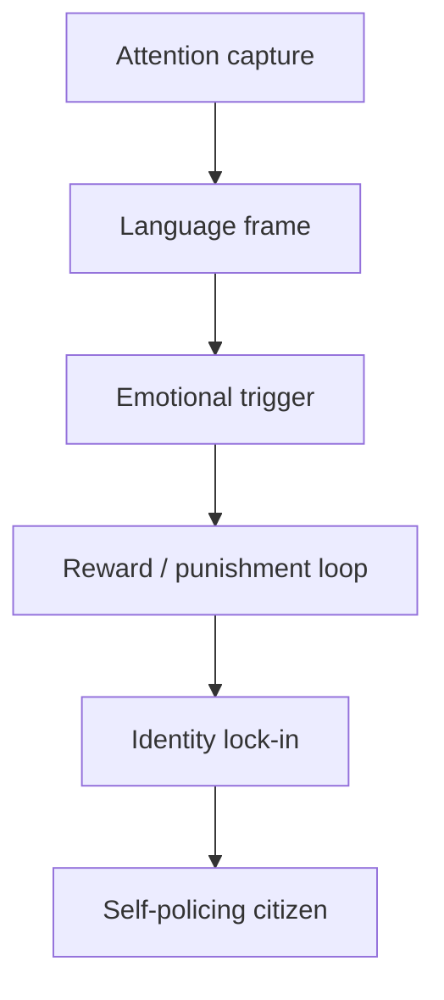
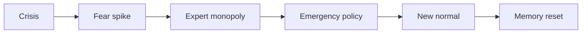

---
title: "Kiểm Soát Tâm Trí (Mind Control)"
date: 2026-04-07
tags: [politics-conspiracy, propaganda, consciousness]
status: refined
related:
  - "[[MOC - Epistemology & Propaganda]]"
  - "[[Elite]]"
  - "[[Ma Trận]]"
  - "[[Báo Cáo 2030]]"
  - "[[Bộ Tam Thánh Mind Control - NASA Disney Hollywood]]"
  - "[[Dopamine Economy - Nền Kinh Tế Của Sự Thèm Muốn]]"
---
# Kiểm Soát Tâm Trí (Mind Control)

**Kiểm soát tâm trí không nên được đọc như cảnh phim thôi miên một cá nhân trong phòng kín. Nó là kỹ nghệ quản trị attention, reward, fear, language và memory ở quy mô xã hội.** Khi [[Elite]] kiểm soát được thứ con người chú ý, điều họ sợ, điều họ ham, ngôn ngữ họ dùng và lịch sử họ nhớ, phần lớn hành vi có thể được dẫn mà không cần dây xích.

*Mind control is less about cinematic hypnosis and more about governing attention, reward, fear, language, and memory at scale.*

> "Government" = "Govern" (kiểm soát / control) + "Ment" (tâm trí / mind, từ Latin *mentis*). Đây là word reading, không phải bằng chứng lịch sử tự thân.

---

## Vault Position / Vị Trí Trong Vault

Bài này là node cầu giữa [[MOC - Epistemology & Propaganda]], [[Ma Trận]], [[Báo Cáo 2030]], [[Bộ Tam Thánh Mind Control - NASA Disney Hollywood]] và [[Dopamine Economy - Nền Kinh Tế Của Sự Thèm Muốn]]. Nó không gom mọi hiện tượng thành một âm mưu duy nhất. Nó đọc các cơ chế lặp lại: schooling chuẩn hóa, media framing, entertainment programming, thuật toán reward, chemical load và crisis governance.

Nếu [[Ma Trận]] là hệ điều hành perception, thì mind control là bộ API: ngôn ngữ, hình ảnh, phần thưởng, trừng phạt, nhịp khủng hoảng và danh tính xã hội.

---

## Evidence Discipline / Cách Đọc Claim

Bài này thuộc nhóm politics/conspiracy nên cần tách rõ nhiều tầng claim:

| Tầng | Cách đọc | Ví dụ |
|---|---|---|
| **Fact / documentable** | tài liệu, sự kiện, public record, lời nói/chính sách có thể kiểm | official docs, hearings, corporate records, timelines |
| **Pattern / systems reading** | incentive, timing, coordination, institutional convergence | crisis → solution, limited hangout, policy sync |
| **Symbol / myth reading** | archetype, logo, ritual, media framing, language spell | predictive programming, public myth, occult symbolism |
| **Speculative synthesis** | mô hình vault nối nhiều tầng lại | [[Ma Trận]], [[Elite]], [[Kiểm Soát Tâm Trí]] |

Không nên đọc tầng speculative như fact thô. Nhưng cũng không nên dùng fact-level để phủ định toàn bộ pattern và symbolic intelligence.

---

## Source Register / Nguồn Nên Đối Chiếu

Khi citation pass sâu hơn, ưu tiên:

- official documents, speeches, laws, public records,
- tier-1 reporting / archival sources,
- primary video/transcript/source material nếu có,
- financial/policy/institutional records,
- historical context từ nhiều phía,
- các node liên quan: [[Ma Trận]], [[Elite]], [[MOC - Epistemology & Propaganda]].

---

## Control Stack / Các Tầng Kiểm Soát

Mind control mạnh nhất khi nó không xuất hiện như "kiểm soát". Nó xuất hiện như giáo dục, tin tức, giải trí, convenience, an toàn, health, moral consensus và peer pressure. Mỗi tầng có một chức năng riêng; ghép lại, chúng tạo một đường ray nhận thức.

| Tầng | Cơ chế chính | Điều cần kiểm chứng |
|---|---|---|
| Giáo dục | chuẩn hóa curriculum, lịch sử chính thống, obedience ritual | ai viết chương trình, điều gì bị bỏ khỏi syllabus |
| Truyền thông | framing, repetition, expert gatekeeping, crisis tempo | nguồn sở hữu, source chain, timing, ngôn ngữ lặp |
| Giải trí | myth, archetype, predictive programming, idol culture | biểu tượng, narrative, hành vi được bình thường hóa |
| Social platform | algorithmic feed, outrage, badge, cancel/reward loop | incentive engagement, moderation rule, data capture |
| Hóa chất / sinh lý | food additive, pharma dependence, sleep disruption, EMF stress | bằng chứng sinh học cụ thể, tránh overclaim |

[[Điều mà nền giáo dục và chính phủ không dạy bạn]] nằm ở tầng đầu: không chỉ thiếu kiến thức, mà thiếu khả năng hỏi đúng câu hỏi. [[Bộ Tam Thánh Mind Control - NASA Disney Hollywood]] nằm ở tầng myth-media: khi hình ảnh lặp đủ lâu, nó trở thành trực giác xã hội.

---

## Cướp Dopamine (Dopamine Hijacking)

Không cần ép một xã hội làm nô lệ nếu có thể làm nó nghiện. Dopamine hijacking biến freedom thành feed: con người tưởng mình chọn, nhưng lựa chọn đã được kiến trúc quanh craving, novelty và validation.

| Sản phẩm / Product | Mồi câu / Hook | Hậu quả / Effect |
|--------------------|----------------|------------------|
| Mạng xã hội / Social media | Likes, thông báo / Likes, notifications | Nghiện được công nhận / Validation addiction |
| Phim khiêu dâm / Porn | Kích thích siêu thường / Supernormal stimulus | Cạn kiệt năng lượng tình dục / Sexual energy drain |
| Đồ ăn vặt / Junk food | Đường, béo, muối / Sugar, fat, salt | Phá hủy sức khỏe / Health destruction |
| Game | Vòng lặp thành tích / Achievement loops | Hao mòn thời gian / Time sink |
| Tin tức / News | Phẫn nộ / Outrage | Lo âu, chia rẽ / Anxiety, division |

Đây là nơi bài này nối trực tiếp với [[Dopamine Economy - Nền Kinh Tế Của Sự Thèm Muốn]]. Một dân số mất attention sẽ khó đọc tài liệu dài, khó theo logic phức tạp, khó ở một mình với lương tâm, và dễ outsource phán đoán cho "trend". Mind control hiện đại không cần luôn luôn nói dối; nó chỉ cần làm sự thật trở nên quá chậm, quá khô, quá ít dopamine.

---

## MK-Ultra & Beyond

MK-Ultra là phần dễ kiểm hơn của chủ đề: một chương trình CIA trong thế kỷ 20 liên quan đến LSD, thôi miên, trauma, interrogation và kiểm soát hành vi. Tầng documentable dừng ở hồ sơ đã công khai và các điều trần liên quan.

Phần "beyond" phải đọc kỷ luật hơn: trauma-based programming, Monarch programming, celebrity breakdowns và symbolic triggers thuộc tầng speculative/symbolic nếu không có hồ sơ cụ thể. Chúng có thể là model hữu ích để đọc pattern, nhưng không được trình bày như fact chỉ vì nghe hợp vibe.

> Redpill thật không phải tin mọi thứ đen tối. Redpill thật là biết claim nào đứng trên tài liệu, claim nào đứng trên pattern, claim nào chỉ là biểu tượng, và claim nào vẫn là giả thuyết.

---

## Chemical And Body Layer / Tầng Cơ Thể

Mind control không chỉ đi qua nội dung. Nó đi qua cơ thể: ngủ kém, đường huyết loạn, stress mạn, ánh sáng xanh, dược phẩm dùng sai, thực phẩm siêu chế biến, nghiện porn, nghiện news. Một nervous system bị kích thích liên tục sẽ khó có [[Trí Tuệ]].

Các claim như fluoride, EMF, phụ gia hoặc [[Tuyến Tùng]] cần giữ đúng tầng bằng chứng. Có câu hỏi đáng hỏi về endocrine, sleep, neuroinflammation và circadian rhythm; nhưng không nên biến mọi thứ thành một nguyên nhân duy nhất. Cách đọc vững hơn là: bất cứ thứ gì làm suy giảm attention, sleep, hormone, gut và nervous system đều làm dân số dễ bị dẫn hơn.

---

## Crisis Template / Mẫu Khủng Hoảng

Mind control cấp xã hội thường tăng tốc trong crisis. Khủng hoảng tạo fear; fear tạo demand for safety; safety tạo permission cho biện pháp trước đó khó bán.

Đây là cầu nối với [[Báo Cáo 2030]]: khi identity, money, health, speech và mobility đi vào cùng một hạ tầng permission, kiểm soát tâm trí không còn chỉ là propaganda. Nó trở thành interface đời sống.

---

## Thoát Khỏi (Breaking Free)

Thoát không phải là "không bao giờ bị ảnh hưởng". Thoát là giảm attack surface.

1. Information diet: giảm news loop, ưu tiên primary source, đọc chậm, ghi lại claim theo tầng.
2. Digital detox: đặt giờ không điện thoại, không scroll trước ngủ, bỏ notification không cần thiết.
3. Body sovereignty: ngủ, nắng, vận động, thực phẩm thật, nước sạch, giảm phụ thuộc dược phẩm khi không cần thiết.
4. Mind training: thiền định, tư duy phản biện, shadow work qua [[Individuation]], luyện khả năng ở yên.
5. Community: kết nối offline, nói chuyện với người thật, xây network không phụ thuộc hoàn toàn vào platform.

---

## Core Insight / Chốt Lại

**Kiểm soát tâm trí hiện đại không cần biến con người thành zombie. Nó chỉ cần làm con người mệt, nghiện, sợ, phân tán và tự kiểm duyệt. Chủ quyền bắt đầu khi attention quay về tay mình.**

*Modern mind control does not need zombies. It only needs people tired, addicted, afraid, distracted, and self-policing. Sovereignty begins when attention returns to the self.*
