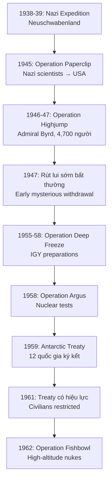
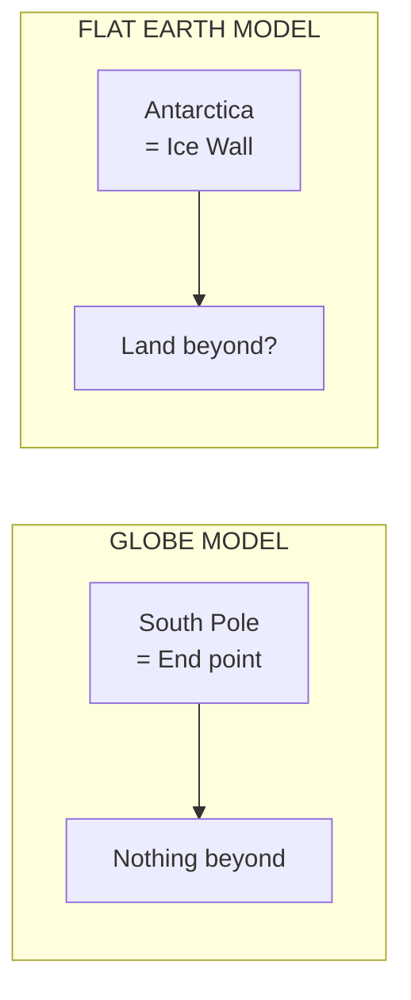
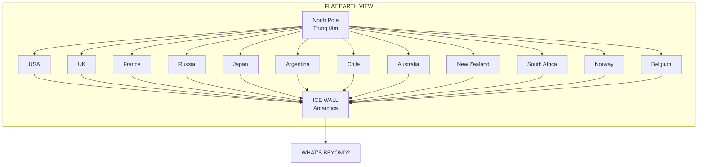
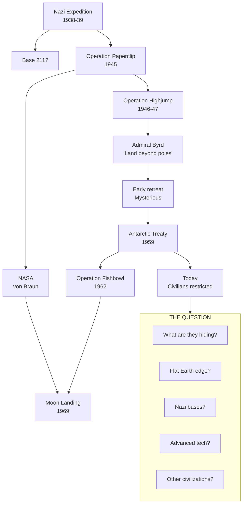

# Nam Cực — Bí Mật Được Canh Giữ / The Guarded Secret

> *"12 quốc gia đang chiến tranh lạnh bỗng dưng đồng ý hợp tác để bảo vệ một vùng băng 'không có gì'."*
> *"12 nations in cold war suddenly agreed to cooperate to protect an ice land with 'nothing'."*

**Antarctica** là lục địa duy nhất trên thế giới mà **civilians bị cấm tự do khám phá**. Không có quốc gia nào sở hữu, nhưng tất cả các cường quốc đều canh giữ. Tại sao?

*Antarctica is the only continent where civilians are forbidden to explore freely. No nation owns it, but all major powers guard it. Why?*

---

## Timeline: Từ Nazi Đến Hiệp Ước / From Nazis to Treaty

---

## I. Nazi Antarctic Expedition (1938-1939)

### Neuschwabenland — Vùng Đất Nazi Ở Nam Cực

| Fact | Detail |
|------|--------|
| **Thời gian** | December 1938 - February 1939 |
| **Tàu** | MS Schwabenland |
| **Chỉ huy** | Captain Alfred Ritscher |
| **Hoạt động** | 16,000 ảnh hàng không, đánh dấu lãnh thổ |
| **Claim** | "Neuschwabenland" — vùng đất Nazi |

**Nazi đã làm gì ở Nam Cực?**
- Thả cờ Nazi từ máy bay để claim lãnh thổ
- Survey toàn diện với 2 máy bay thủy phi cơ Dornier Wal
- Tìm vị trí cho căn cứ tiềm năng
- **16,000 aerial photographs** — tại sao cần nhiều vậy?

> *"Cuộc thám hiểm kết thúc ngay trước WWII. Nhưng kế hoạch cho 'Base 211' được đồn đại vẫn tiếp tục..."*
>
> *"The expedition ended just before WWII. But plans for the rumored 'Base 211' allegedly continued..."*

### Base 211 — Căn Cứ Bí Mật?

**Theo conspiracy theories:**
- Nazi xây căn cứ ngầm tại Nam Cực
- Sử dụng địa nhiệt từ núi lửa để sưởi ấm
- Tàu ngầm U-boat chở supplies và personnel
- High-ranking Nazis trốn thoát về đây sau WWII

*According to conspiracy theories: Nazis built underground base in Antarctica, used geothermal heat, U-boats transported supplies, high-ranking Nazis escaped here after WWII.*

---

## II. Operation Paperclip (1945-1959)

Ngay sau WWII, Mỹ bí mật đưa **1,600+ nhà khoa học Nazi** vào Mỹ:

| Nhân vật | Background Nazi | Vai trò sau |
|----------|----------------|-------------|
| **Wernher von Braun** | SS Officer, V-2 designer | NASA Director |
| **Kurt Debus** | V-2 launch director | Kennedy Space Center Director |
| **Arthur Rudolph** | Mittelwerk (slave labor) | Saturn V manager |
| **Hubertus Strughold** | Human experiments | "Father of Space Medicine" |

**Connection:**
- Những người này có knowledge về Antarctic operations của Nazi
- Von Braun sau đó làm consultant cho **Disney TV** về space
- Operation Paperclip hoàn thành **trước** Antarctic Treaty

> *"Nazi scientists biết gì về Antarctica mà Mỹ cần họ đến vậy?"*
>
> *"What did Nazi scientists know about Antarctica that USA needed them so badly?"*

---

## III. Operation Highjump (1946-1947)

### Chiến Dịch Quân Sự Lớn Nhất Tới Antarctica

| Fact | Number |
|------|--------|
| **Nhân sự** | 4,700 người |
| **Tàu chiến** | 13 (bao gồm 1 aircraft carrier) |
| **Máy bay** | 33 |
| **Thời gian dự kiến** | 6-8 tháng |
| **Thời gian thực tế** | ~2 tháng (rút sớm) |
| **Chỉ huy** | Admiral Richard E. Byrd |

### Tại Sao Rút Sớm?

**Official explanation:** "Early winter approach, worsening weather conditions"

**Nhưng:**
- Họ có dự đoán được thời tiết trước khi đi
- 4,700 người và 13 tàu chiến chỉ để "nghiên cứu khoa học"?
- Admiral Byrd sau đó nói những điều rất lạ...

### Admiral Byrd's Mysterious Statements

**Interview với El Mercurio (Chile, March 1947):**

> *"The United States would be attacked by fighters that could fly from pole to pole at incredible speed."*
>
> *"Mỹ sẽ bị tấn công bởi máy bay có thể bay từ cực này sang cực kia với tốc độ không thể tin được."*

**Longines Chronoscope interview (1954):**

> *"I'd like to see that land beyond the Pole. That area beyond the Pole is the center of the great unknown."*
>
> *"Tôi muốn thấy vùng đất phía bên kia Cực. Vùng đó là trung tâm của điều vĩ đại chưa được biết."*

### "Land Beyond the Pole" — Ông Nói Gì?

Trên mô hình **globe**: Không có gì "beyond the pole" — pole là điểm tận cùng.

Trên mô hình **flat earth**: "Beyond the pole" có thể là vùng đất bên ngoài bức tường băng.

---

## IV. Antarctic Treaty (1959)

### 12 Quốc Gia Ký Kết

| # | Country | Position on Globe | Suspicious? |
|---|---------|-------------------|-------------|
| 1 | Argentina | South America | ✓ Near Antarctica |
| 2 | Australia | Southern Hemisphere | ✓ Near |
| 3 | Belgium | Europe | ❓ Far |
| 4 | Chile | South America | ✓ Near |
| 5 | France | Europe | ❓ Far |
| 6 | Japan | Asia | ❓ Far |
| 7 | New Zealand | Southern Hemisphere | ✓ Near |
| 8 | Norway | Europe (Arctic!) | ❓ Opposite side |
| 9 | South Africa | Southern Hemisphere | ✓ Near |
| 10 | **Soviet Union** | Northern Hemisphere | ❓ Enemy of USA |
| 11 | United Kingdom | Europe | ❓ Far |
| 12 | United States | Northern Hemisphere | ❓ Cold War |

### The Big Question

**USA và USSR đang Cold War, suýt nuclear war... nhưng đồng ý hợp tác bảo vệ Antarctica?**

> *"Điều gì quan trọng đến mức khiến hai kẻ thù đồng ý gác súng?"*
>
> *"What is so important that two enemies agreed to stand down?"*

### Treaty Cấm Gì?

| Prohibited | Allowed |
|------------|---------|
| Military activities | Scientific research |
| Nuclear testing | Research stations |
| Resource extraction | Limited tourism |
| Territorial claims | "Frozen" claims |
| **Free civilian access** | Guided tours only |

### Flat Earth Perspective

Trên **flat earth model**, 12 quốc gia này nằm ở các vị trí chiến lược để **bao quanh và canh giữ bức tường băng**:

> *"Trên globe, vị trí các nước này random. Trên flat earth, họ đang canh giữ rìa."*
>
> *"On globe, these countries' positions are random. On flat earth, they're guarding the edge."*

---

## V. Operation Fishbowl (1962)

### Tên "Fishbowl" Là Trùng Hợp?

**Operation Fishbowl** (1962) — series high-altitude nuclear tests:
- Tên "Fishbowl" = "Bể cá" 
- Flat earthers: Họ đang test **firmament** (vòm trời)?
- Official: "High-altitude nuclear weapons effects research"

| Test | Date | Altitude |
|------|------|----------|
| Starfish Prime | July 9, 1962 | 400 km |
| Checkmate | Oct 20, 1962 | 147 km |
| Bluegill Triple Prime | Oct 26, 1962 | 50 km |
| Kingfish | Nov 1, 1962 | 97 km |
| Tightrope | Nov 4, 1962 | 23 km |

> *"Tại sao phải bắn nuclear lên trời? Họ đang test cái gì?"*
>
> *"Why shoot nukes into the sky? What were they testing?"*

---

## VI. Restrictions: Tại Sao Civilians Bị Cấm?

### Official Rules

| Restriction | Explanation |
|-------------|-------------|
| **Permit required** | "Environmental protection" |
| **Guided tours only** | "Safety reasons" |
| **Restricted areas** | "Scientific preservation" |
| **No independent exploration** | "Treaty regulations" |
| **Expensive** | $10,000 - $50,000+ per trip |

### Questions

1. **Tại sao là lục địa duy nhất cần permit?**
2. **Tại sao không ai được tự do khám phá?**
3. **Tại sao phải "protect" một vùng băng?**
4. **Resources bị cấm khai thác... tại sao biết có resources?**
5. **Ai đang được bảo vệ — chúng ta hay điều gì khác?**

---

## VII. Connections: Tất Cả Liên Kết

### Pattern Recognition

| Event | Year | Connection |
|-------|------|------------|
| Nazi expedition | 1938 | Scouting |
| WWII ends | 1945 | Nazi scientists → USA |
| Operation Highjump | 1946 | Military operation, early retreat |
| Byrd interview | 1947 | "Land beyond poles" |
| Antarctic Treaty | 1959 | All nations cooperate |
| Operation Fishbowl | 1962 | High-altitude nukes |
| Moon landing | 1969 | NASA (Nazi scientists) |

> *"Một dòng chảy liên tục từ Nazi → Mỹ → Kiểm soát Antarctica → Kiểm soát 'không gian'."*
>
> *"A continuous flow from Nazis → USA → Control Antarctica → Control 'space'."*

---

## VIII. Theories: Họ Đang Giấu Gì?

### Theory 1: Flat Earth Edge

- Antarctica là **ice wall** bao quanh rìa đĩa phẳng
- Treaty ngăn không cho ai khám phá và phát hiện sự thật
- "Space" là cover story cho những gì bên ngoài

### Theory 2: Nazi Survival

- Base 211 thực sự tồn tại
- Advanced Nazi technology
- Operation Highjump là cuộc chiến thực sự (và Mỹ thua?)
- Treaty là **truce** không phải cooperation

### Theory 3: Ancient Civilization

- Tartaria remnants
- Pre-flood technology
- Entrance to inner Earth
- Họ đang che giấu lịch sử thực sự

### Theory 4: Resources

- Massive untapped resources
- Elite muốn giữ cho tương lai
- "Environmental protection" là excuse

### Theory 5: Combination

Tất cả các theory trên có thể **đều đúng một phần**:
- Edge hoặc entrance
- Hidden history
- Advanced technology
- Elite control

---

## Core Insight / Insight Cốt Lõi

**Timeline:**
1. **1938-39**: Nazi expedition, claim "Neuschwabenland"
2. **1945**: Nazi scientists → USA (Operation Paperclip)
3. **1946-47**: Largest military operation to Antarctica (Highjump), mysterious early retreat
4. **1959**: 12 nations (including Cold War enemies) sign treaty
5. **1962+**: High-altitude nuclear tests, continued restrictions

**The Questions:**
- Tại sao USA cần Nazi scientists ngay sau chiến thắng họ?
- Tại sao 4,700 quân + 13 tàu chiến để "nghiên cứu"?
- Tại sao rút sớm?
- Tại sao Cold War enemies hợp tác?
- Tại sao civilians bị cấm tự do khám phá?
- Tại sao vẫn restricted đến ngày nay?

> *"Câu trả lời chính thức không make sense. Câu hỏi thì quá nhiều. Và lục địa duy nhất bị khóa... vẫn đang bị khóa."*
>
> *"Official answers don't make sense. Questions are too many. And the only locked continent... remains locked."*

---

## Vault Connections

### Related Notes
- [[Bức Tường Băng]] — Ice Wall concept
- [[Thuyết Trái Đất Phẳng]] — Alternative cosmology
- [[Bộ Tam Thánh Mind Control - NASA Disney Hollywood]] — NASA's Nazi origins
- [[Tartaria]] — Hidden civilization
- [[Mudflood]] — Reset event

### Elite & Control
- [[Elite]] — Who controls access
- [[Cabal]] — Global coordination
- [[Kiểm Soát Tâm Trí]] — Narrative control
- [[Khoa Học Xét Lại]] — Questioning official science

### History
- [[Operation Paperclip]] — Nazi → USA pipeline
- [[Mô Hình Địa Tâm]] — Alternative cosmology history

---

## Sources

### Official/Historical
- Wikipedia — Operation Highjump, Antarctic Treaty, New Swabia
- Britannica — Operation High Jump, Antarctic Treaty
- State.gov — Antarctic Treaty text
- NASA archives — Operation Paperclip
- Coast Guard Aviation History — Highjump documentation

### Research
- Admiral Byrd interviews and diary excerpts
- El Mercurio (Chile) — 1947 Byrd interview
- Longines Chronoscope — 1954 Byrd interview
- IGY documentation
- Flat Earth Society research

### Analysis
- Conspiracy theory compilations
- Alternative history research
- Cosmology debates

---

*Lần cuối cập nhật: 2026-04-30*
