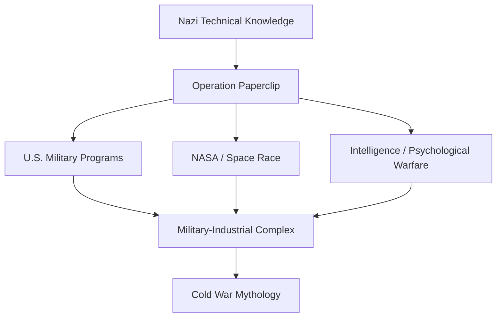

# Operation Paperclip

**Operation Paperclip là chương trình hậu Thế chiến II đưa các nhà khoa học, kỹ sư và chuyên gia Đức Quốc Xã sang Mỹ. Ở tầng lịch sử, đây là Cold War talent acquisition. Ở tầng vault, nó là bằng chứng rằng empire không chỉ đánh bại kẻ thù — nó hấp thụ tri thức của kẻ thù rồi đổi logo cho infrastructure mới.**

*Operation Paperclip was the post-WWII program that brought Nazi scientists, engineers, and specialists into the United States. At the historical level, it was Cold War talent acquisition. At the vault level, it shows that empire does not merely defeat an enemy — it absorbs the enemy's knowledge and rebrands it into new infrastructure.*

---

## Evidence Discipline / Cách Đọc Claim

| Tầng | Cách đọc | Ví dụ |
|---|---|---|
| **Fact / documentable** | Paperclip là chương trình lịch sử có thật | Nazi scientists moved into U.S. programs after WWII |
| **Pattern / systems reading** | đạo đức công khai thua nhu cầu chiến lược | war criminals reclassified as assets |
| **Symbol / myth reading** | Nazi rocket science → NASA space myth | occult/rocket/space-age symbolism |
| **Speculative synthesis** | Antarctica, breakaway tech, hidden continuity | đọc như vault hypothesis, không trộn với fact thô |

---

## Vault Position / Vị Trí Trong Vault

Trong redpill.wiki, **Operation Paperclip** là bridge giữa hidden history, [[Khoa Học Xét Lại]], [[Elite]], NASA/Disney/Hollywood, [[Nam Cực - Bí Mật Được Canh Giữ]] và 2026 disclosure narratives như [[A LIE N - SpaceX IPO Disclosure Day và Nghi Lễ Tên Lửa]].

Nó cho thấy một pattern quyền lực rất quan trọng:

> Khi tri thức đủ hữu dụng, hệ thống sẽ rửa sạch đạo đức của người sở hữu tri thức đó.

Paperclip không chỉ là “Mỹ tuyển nhà khoa học Đức”. Nó là một ritual chuyển giao: từ Nazi war machine sang American military-industrial-space complex.

---

## 1. Operation Paperclip Là Gì?

Sau WWII, Mỹ và Liên Xô chạy đua giành các nhà khoa học Đức, đặc biệt trong:

- rocket technology,
- aeronautics,
- chemical weapons,
- medicine,
- intelligence,
- psychological warfare,
- space research.

Ở Mỹ, chương trình này được biết đến với tên **Operation Paperclip**. Nhiều chuyên gia Đức từng phục vụ Nazi Germany được đưa sang Mỹ, hồ sơ được làm sạch hoặc giảm nhẹ để họ có thể làm việc cho các chương trình quân sự/khoa học mới.

Tên “Paperclip” gợi tới việc kẹp hồ sơ mới vào file cũ: một symbolic image rất đúng. Past được kẹp lại, refiled, rồi đưa vào future.

---

## 2. Wernher Von Braun Và NASA Myth

Nhân vật nổi tiếng nhất là **Wernher von Braun**: kỹ sư rocket Đức, liên quan V-2 rocket program, sau này thành gương mặt lớn trong chương trình không gian Mỹ.

V-2 từng là weapon. Sau Paperclip, rocket trở thành dream of mankind.

| Nazi Germany | Postwar America |
|---|---|
| V-2 rocket | Saturn V / space race |
| weapon of terror | symbol of progress |
| military engineering | NASA mythology |
| war infrastructure | cosmic frontier narrative |

Đây là một transformation rất quan trọng trong vault: cùng một technology, đổi narrative là đổi đạo đức cảm nhận của public.

Rocket từ vũ khí thành biểu tượng cứu rỗi.

---

## 3. Science, Morality And Empire

Paperclip đặt một câu hỏi khó chịu:

> Nếu một người có tri thức đủ quan trọng, hệ thống có sẵn sàng bỏ qua tội ác của họ không?

Lịch sử trả lời: có.

Đây là nơi [[Elite]] và [[Khoa Học Xét Lại]] gặp nhau. Science không tồn tại trong vacuum đạo đức. Nó có patron, military use, funding và geopolitical objective.

Science như method có thể đẹp. Science như empire tool có thể rất lạnh.

Một công nghệ không tự nói nó phục vụ freedom hay domination. Infrastructure quyết định nó phục vụ ai.

---

## 4. Paperclip Và Military-Industrial Complex

Paperclip đổ tri thức vào thứ sau này gọi là military-industrial complex:

Không phải mọi thứ trong NASA là “Nazi”. Nhưng không thể tách NASA myth khỏi dòng chuyển giao nhân sự, rocket knowledge và Cold War military context.

Đây là lý do [[Bộ Tam Thánh Mind Control - NASA Disney Hollywood]] quan trọng: NASA cung cấp cosmology chính thức, Disney/Hollywood package nó thành myth dễ nuốt, và military/intelligence giữ phần infrastructure bên dưới.

---

## 5. Antarctica Connection

Trong vault, Paperclip thường được đọc cùng [[Nam Cực - Bí Mật Được Canh Giữ]] vì nhiều narrative xoay quanh:

- Nazi Antarctic expeditions,
- Operation Highjump,
- postwar disappearance networks,
- Antarctic Treaty,
- restricted access,
- hidden bases / breakaway civilization hypotheses.

Tầng fact: Antarctica có lịch sử expedition, military interest, treaty system và access restriction thật.

Tầng speculative: Nazi bases, hidden tech, breakaway civilization cần đọc như hypothesis trong hidden-history cluster, không trình bày như fact đã đóng.

Điểm mạnh của connection này không phải “chắc chắn có căn cứ Nazi dưới băng”. Điểm mạnh là pattern:

> Sau chiến tranh, thứ biến mất không chỉ là người. Có thể là công nghệ, hồ sơ, network và continuity.

---

## 6. Paperclip Và Technocracy

Paperclip giúp tạo nền cho thế kỷ của engineer-priest: chuyên gia kỹ thuật có quyền định nghĩa future.

- rocket scientist định nghĩa bầu trời,
- nuclear physicist định nghĩa energy/fear,
- psychologist định nghĩa mind control,
- computer scientist định nghĩa AI interface,
- biosecurity expert định nghĩa participation in society.

Đây là technocracy: quyền lực không cần crown, chỉ cần credential + infrastructure.

Trong [[A LIE N - SpaceX IPO Disclosure Day và Nghi Lễ Tên Lửa]], motif này tiếp tục qua SpaceX/Musk/Dr. Doom archetype: rocket không chỉ là engineering, mà là priesthood mới của civilization.

---

## 7. Từ Paperclip Đến Disclosure

Paperclip nối WWII → Cold War → NASA → space myth → alien/disclosure narrative.

Nếu Moon Landing là ritual khai sinh Space Age thế kỷ 20, thì disclosure/SpaceX/IPOs có thể là ritual khai sinh Technocratic-Cosmic Order thế kỷ 21.

Paperclip là một trong những bridge lịch sử giúp hiểu vì sao “space” luôn đi cùng military, occult, propaganda và finance.

---

## 8. Bài Học Cốt Lõi

Operation Paperclip dạy ba điều:

1. **Empire hấp thụ tri thức của kẻ thù nếu tri thức đó hữu dụng.**
2. **Science institution không tách khỏi military và geopolitics.**
3. **Narrative có thể rửa sạch technology: weapon hôm qua thành dream hôm nay.**

Điều này không có nghĩa mọi nhà khoa học sau WWII đều là villain. Nó nghĩa là infrastructure tri thức luôn cần được đọc cùng patron của nó.

---

## Synthesis

Paperclip là một vết nối giữa lịch sử chính thống và hidden continuity. Nó không chỉ là chương trình tuyển dụng. Nó là bằng chứng rằng “chiến thắng” đôi khi không xóa hệ thống cũ, mà chuyển hệ thống cũ vào hình dạng mới.

Nazi rocket science không biến mất. Nó đổi quốc kỳ, đổi uniform, đổi myth, rồi bay lên trời dưới tên Space Age.

> Paperclip là lời nhắc: empire không chỉ chiến thắng kẻ thù. Nó tuyển dụng kẻ thù khi tri thức của họ hữu dụng.

---

## Related

- [[Nam Cực - Bí Mật Được Canh Giữ]]
- [[Bộ Tam Thánh Mind Control - NASA Disney Hollywood]]
- [[Khoa Học Xét Lại]]
- [[Elite]]
- [[A LIE N - SpaceX IPO Disclosure Day và Nghi Lễ Tên Lửa]]
- [[MOC - Ancient Civilizations & Hidden History]]
- [[MOC - Science Revisionism]]
