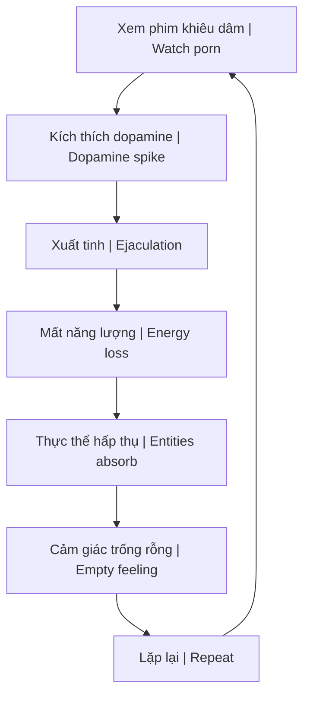
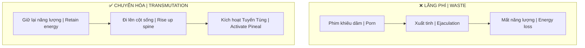

---
title: "Sự Thật Đen Tối Về Phim Khiêu Dâm"
aliases: ["The Dark Truth About Porn", "Porn Truth"]
date: 2026-04-07
tags: [politics-conspiracy, esoterica]
status: refined
---

# Sự Thật Đen Tối Về Phim Khiêu Dâm (The Dark Truth About Porn)

Bài phân tích này bóc trần bản chất thực sự của ngành công nghiệp khiêu dâm dưới góc độ năng lượng tâm linh và sự thao túng nhận thức.

*This analysis exposes the true nature of the porn industry from the perspective of spiritual energy and cognitive manipulation.*

---

## Tổng Quan / Overview

> **Phim khiêu dâm không chỉ là giải trí — đó là công cụ Kiểm Soát Tâm Trí quy mô toàn cầu.**
>
> *Porn is not just entertainment — it's a global Mind Control tool.*

### Tại sao nó "MIỄN PHÍ"? / Why Is It "FREE"?

| Câu hỏi / Question | Trả lời / Answer |
|--------------------|------------------|
| Tại sao miễn phí? | Vì **bạn là sản phẩm** / Because **you are the product** |
| Họ thu gì? | Năng lượng tình dục của bạn / Your sexual energy |
| Ai hưởng lợi? | [[Elite]], [[Thực Thể Cõi Trung Giới]] |

---

## 1. Độc Quyền MindGeek / MindGeek Monopoly

### Một công ty kiểm soát tất cả / One Company Controls All

**MindGeek** sở hữu phần lớn mạng lưới khiêu dâm toàn cầu:

*MindGeek owns most of the global porn network:*

| Website | Thuộc MindGeek |
|---------|----------------|
| Pornhub | ✅ |
| RedTube | ✅ |
| YouPorn | ✅ |
| Brazzers | ✅ |
| Reality Kings | ✅ |
| + nhiều hơn nữa | + many more |

### Hệ quả / Consequences

Việc tập trung quyền lực này cho phép **thao túng nhận thức tình dục** của toàn nhân loại.

*This concentration of power enables **manipulation of sexual perception** of all humanity.*

---

## 2. Rút Kiệt Năng Lượng / Energy Drain

### Cơ chế / Mechanism

### Ách tắc năng lượng / Energy Blockage

Các cảm xúc tiêu cực kẹt lại ở các [[Chakra]] dưới cùng:

*Negative emotions stuck at lower Chakras:*

| Cảm xúc / Emotion | Tiếng Anh / English |
|-------------------|---------------------|
| Tội lỗi | Guilt |
| Xấu hổ | Shame |
| Đau đớn | Pain |
| Nghiện ngập | Addiction |
| Sự đồi bại | Perversion |

### Thực Thể Cõi Trung Giới / Astral Entities

Mỗi khi thỏa mãn dục vọng qua màn hình, bạn đang **hiến tế năng lượng sống** cho các [[Thực Thể Cõi Trung Giới|thực thể ký sinh]].

*Every time you satisfy lust through a screen, you're **sacrificing life energy** to parasitic [[Thực Thể Cõi Trung Giới|astral entities]].*

→ Xem thêm: [[Quy Luật Trao Đổi Tâm Linh]]

---

## 3. Vòng Lặp Dopamine / Dopamine Loop

### Lập trình tiềm thức / Subconscious Programming

| Thông điệp ẩn / Hidden Message | Hệ quả / Consequence |
|--------------------------------|----------------------|
| Con người = công cụ tình dục | Mất nhân tính / Dehumanization |
| Thỏa mãn tức thời là tốt | Mất khả năng trì hoãn / Loss of delayed gratification |
| Nhiều đối tác = thành công | Phá hủy quan hệ / Relationship destruction |

### Hội chứng "Wojak" hiện đại / Modern "Wojak" Syndrome

Thanh niên hiện đại:
- ❌ Không hiểu vì sao trầm cảm / Don't understand why depressed
- ❌ Đổ lỗi di truyền / Blame genetics
- ✅ Hàng ngày: Porn + Junk Food + TikTok + Tinder / Daily: Porn + Junk Food + TikTok + Tinder

> **Họ không nhận ra mình đang tự đầu độc.**
>
> *They don't realize they're poisoning themselves.*

→ Xem thêm: [[Điều mà nền giáo dục và chính phủ không dạy bạn]], [[Bộ Não Rỗng và AI Brain Rot]]

---

## 4. Giả Kim Thuật Cơ Thể / Body Alchemy

### Năng lượng sinh dục = Năng lượng sống / Sexual Energy = Life Force

| Bộ phận / Part | Liên kết / Connection |
|----------------|----------------------|
| Tinh trùng / Sperm | Cấu trúc giống não bộ / Brain-like structure |
| Cột sống / Spine | 33 đốt sống / 33 vertebrae |
| Năng lượng Kundalini | Đi lên qua cột sống / Rises through spine |

### Chuyển hóa (Transmutation) / Transmutation

Khi năng lượng được giữ lại và chuyển hóa:
- Đi lên qua **33 đốt sống** / Rises through 33 vertebrae
- Kích hoạt **Tuyến Tùng (Pineal Gland)** / Activates Pineal Gland
- Mở ra **nhận thức vũ trụ** / Opens cosmic awareness

*When energy is retained and transmuted: rises through 33 vertebrae, activates Pineal Gland, opens cosmic awareness.*

→ Xem thêm: [[Tuyến Tùng]], [[Tinh Khí Thần]]

---

## 5. Ma Trận Kiểm Soát / Matrix Control

### Trục kiểm soát / Control Axis

| Kiểm soát qua | Control through |
|---------------|-----------------|
| Giác quan / Senses | Ăn vặt, TV, Mua sắm, Porn / Junk food, TV, Shopping, Porn |
| Mục tiêu / Goal | Giữ bạn ở tần số thấp / Keep you at low frequency |
| Kết quả / Result | Nô lệ dục vọng / Slave to desires |

### Con đường thoát / Escape Path

| Thay vì / Instead of | Hãy / Do |
|----------------------|----------|
| Nuôi dưỡng **Giác quan** | Nuôi dưỡng **Linh hồn** |
| Feed **Senses** | Feed **Soul** |

> **Khi bạn làm chủ bản thân, bạn thoát khỏi Ma Trận.**
>
> *When you master yourself, you escape the Matrix.*

→ Xem thêm: [[Ma Trận]], [[Mental Model - Ma Trận Kiểm Soát Kép]]

---

## 6. Hướng Dẫn Thực Hành / Practical Guidance

### Cai nghiện / Quitting

| Bước / Step | Hành động / Action |
|-------------|-------------------|
| 1 | Nhận ra vấn đề / Recognize the problem |
| 2 | Xóa mọi bookmark, history / Delete all bookmarks, history |
| 3 | Tìm hoạt động thay thế / Find replacement activities |
| 4 | Tập thể dục để chuyển hóa năng lượng / Exercise to transmute energy |
| 5 | Thiền định, nội tâm / Meditation, inner work |

### NoFap / Semen Retention

| Lợi ích / Benefit | Thời gian / Timeline |
|-------------------|---------------------|
| Tăng năng lượng / More energy | 7 ngày / 7 days |
| Tập trung tốt hơn / Better focus | 14 ngày / 14 days |
| Tự tin hơn / More confidence | 30 ngày / 30 days |
| Thay đổi cuộc sống / Life transformation | 90+ ngày / 90+ days |

---

## Kết Luận / Conclusion

> **Phim khiêu dâm không miễn phí — bạn trả bằng năng lượng sống, sức khỏe tâm thần, và tiềm năng tâm linh của mình.**
>
> *Porn isn't free — you pay with your life energy, mental health, and spiritual potential.*

> **Năng lượng tình dục là năng lượng sáng tạo mạnh mẽ nhất của con người. Đừng lãng phí nó cho màn hình.**
>
> *Sexual energy is humanity's most powerful creative energy. Don't waste it on screens.*

---

## Related / Liên quan

### Năng lượng & Tâm linh / Energy & Spirituality
- [[Năng Lượng Tình Dục]] — Sexual energy
- [[S.E.X]] — Sacred Energy eXchange
- [[Tinh Khí Thần]] — Three treasures
- [[Tuyến Tùng]] — Pineal gland
- [[Quy Luật Trao Đổi Tâm Linh]] — Spiritual exchange law

### Thực thể & Ma Trận / Entities & Matrix
- [[Thực Thể Cõi Trung Giới]] — Astral entities
- [[Ma Trận]] — The Matrix
- [[Mental Model - Ma Trận Kiểm Soát Kép]] — Dual control matrix
- [[Kiểm Soát Tâm Trí]] — Mind control

### Sức khỏe & Xã hội / Health & Society
- [[Điều mà nền giáo dục và chính phủ không dạy bạn]] — What they don't teach
- [[Sự Thật Về Ma Túy]] — Truth about drugs
- [[Bộ Não Rỗng và AI Brain Rot]] — Brain rot
- [[Elite]] — Who benefits
