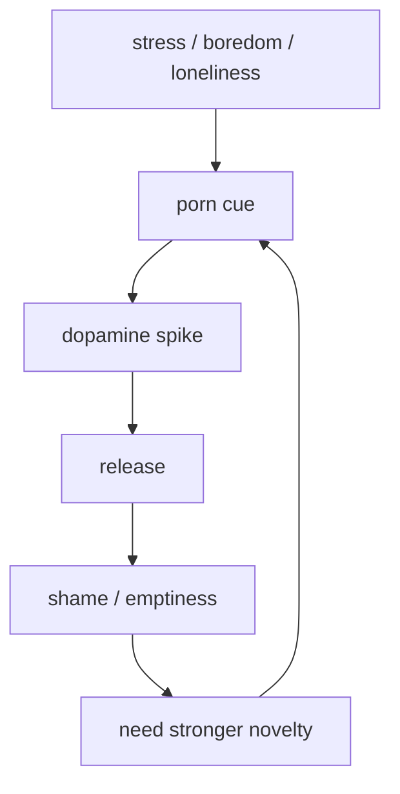

# Sự Thật Đen Tối Về Phim Khiêu Dâm

**Porn không chỉ là nội dung người lớn; nó là một hệ thống công nghiệp hóa ham muốn, biến năng lượng tình dục thành dopamine loop, data, shame, fantasy và dependency.** Trong vault, porn được đọc ở ba tầng cùng lúc: neurobiology của nghiện, political economy của attention, và esoteric reading về thất thoát [[Năng Lượng Tình Dục]].

*Porn industrializes desire: sexual energy becomes dopamine loop, data, shame, fantasy, and dependency.*

---

## Evidence Discipline / Cách Đọc

| Tầng claim | Cách đọc |
|---|---|
| Fact | porn online có quy mô lớn, dễ truy cập, có tranh luận về nghiện hành vi, dopamine, quan hệ, bóc lột và quản trị nội dung |
| Pattern | free content thường đổi bằng attention, data, escalation và dependency |
| Symbol | sacral drain, lower chakra fixation, succubus/incubus motif là ngôn ngữ esoteric |
| Speculative synthesis | astral entities, loosh harvesting, ritual sex inversion là vault lens, không phải fact y khoa |

Medical/mental health caution: người đang nghiện nặng, có compulsive sexual behavior, trầm cảm hoặc trauma tình dục nên tìm hỗ trợ chuyên môn. Shame không chữa addiction; shame thường nuôi addiction.

---

## Vault Position / Vị Trí Trong Vault

Bài này nối [[Dopamine Economy - Nền Kinh Tế Của Sự Thèm Muốn]], [[Năng Lượng Tình Dục]], [[S.E.X]], [[Chakra]], [[Kundalini]] và [[Kiểm Soát Tâm Trí]]. Nó không moralize tình dục. Nó phân biệt tình dục sống, thân mật, có tim với tình dục màn hình, lặp, vô thân và bị tối ưu hóa bởi nền tảng.

---

## Vì Sao "Miễn Phí"?

Khi một sản phẩm cực kỳ kích thích được cho dùng miễn phí, câu hỏi đầu tiên là: thứ gì đang được thu?

| Thứ người dùng thấy | Thứ hệ thống thu |
|---|---|
| khoái cảm tức thì | attention |
| fantasy vô tận | behavioral data |
| novelty | dopamine dependency |
| privacy giả | tracking / profiling |
| giải tỏa stress | habit loop |

Porn platform không cần người dùng hạnh phúc. Nó cần người dùng quay lại.

---

## Dopamine Escalation

Porn mạnh vì nó ghép ba thứ: novelty vô hạn, reward tình dục, và friction gần như bằng 0. Não không tiến hóa để xử lý hàng nghìn partner ảo trong một buổi tối.

Vòng này giống các addiction loop khác trong [[Dopamine Economy - Nền Kinh Tế Của Sự Thèm Muốn]]: kích thích càng mạnh, đời thường càng nhạt; đời thường càng nhạt, người dùng càng cần kích thích mạnh hơn.

---

## Sexual Energy Không Chỉ Là Moral Issue

Trong ngôn ngữ [[Tinh Khí Thần]], sexual energy là sinh lực thô có thể đi ba hướng: sinh sản, thân mật, hoặc sáng tạo/tinh luyện. Porn thêm hướng thứ tư: xả vào màn hình.

| Hướng năng lượng | Kết quả |
|---|---|
| intimacy | kết nối, oxytocin, vulnerability |
| creation | drive, art, work, discipline |
| transmutation | [[Kundalini]], clarity, self-mastery |
| screen discharge | mệt, shame, fantasy imprint, dissociation |

Điểm này không có nghĩa "xuất tinh là xấu". Claim đó quá phẳng. Vấn đề là compulsion: khi hành vi không còn phục vụ love, health hoặc sovereignty.

---

## Lower Chakra Capture

Porn giữ attention ở tầng [[Chakra]] dưới: root fear/loneliness, sacral lust, solar plexus shame/control. Khi các tầng này bị kích hoạt liên tục, tim và trực giác khó mở.

| Tầng | Porn khai thác |
|---|---|
| Root | cô đơn, stress, cảm giác thiếu an toàn |
| Sacral | novelty, fantasy, objectification |
| Solar plexus | shame, dominance, humiliation |
| Heart | tách sex khỏi tình yêu |
| Throat | không nói thật về nhu cầu và nỗi đau |

Đây là lý do porn không chỉ phá focus. Nó có thể phá khả năng gặp người thật.

---

## Mind Control Không Cần Âm Mưu Cartoon

[[Kiểm Soát Tâm Trí]] ở đây vận hành rất thực tế: lặp hình ảnh đủ nhiều để định nghĩa lại điều gì là sexy, bình thường, mong muốn, đáng xấu hổ hoặc đáng bắt chước.

Porn dạy bằng body memory, không bằng lecture. Nó có thể condition:

1. xem người khác như body part;
2. cần novelty để arousal;
3. nhầm intensity với intimacy;
4. nhầm domination với masculinity;
5. nhầm performance với sex;
6. mất kiên nhẫn với tình yêu thật.

---

## Esoteric Layer / Tầng Huyền Học

Ở tầng symbol, porn là nghi lễ đảo ngược của [[S.E.X]]: thay vì sacred energy exchange giữa hai người có mặt, nó là energy discharge vào image-field. Motif [[Thực Thể Cõi Trung Giới]] nên đọc như cách nói về parasitic patterns: thứ gì sống bằng shame, compulsion và thất thoát sinh lực.

Không cần chứng minh thực thể theo nghĩa vật lý mới thấy pattern: sau một vòng compulsive porn, nhiều người không thấy đầy hơn; họ thấy rỗng hơn.

---

## Recovery / Thoát Vòng

Không cai bằng ghét bản thân. Cai bằng thiết kế lại terrain:

- bỏ friction thấp: chặn nguồn, xóa stash, tránh trigger;
- ngủ và vận động để giảm stress load;
- thay dopamine rẻ bằng việc sâu;
- nói thật với một người đáng tin;
- làm việc với shame và trauma;
- học lại intimacy ngoài màn hình;
- chuyển năng lượng sang body, craft, service, prayer.

Nếu relapse, đọc nó như data: trigger là gì, cảm xúc nào, thời điểm nào, cô đơn hay stress nào?

---

## Core Insight / Chốt Lại

**Porn không miễn phí. Người dùng trả bằng attention, energy, arousal pattern, intimacy capacity và đôi khi cả linh hồn sáng tạo của mình.**

*Porn is paid for with attention, energy, arousal pattern, intimacy capacity, and sometimes creative soul-force.*
