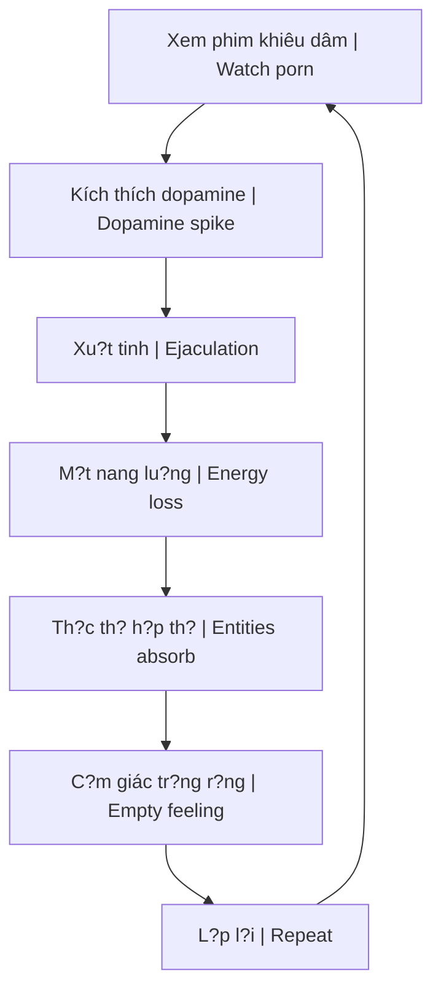

# S? Th?t Ðen T?i V? Phim Khiêu Dâm (The Dark Truth About Porn)

Bài phân tích này bóc tr?n b?n ch?t th?c s? c?a ngành công nghi?p khiêu dâm du?i góc d? nang lu?ng tâm linh và s? thao túng nh?n th?c.

*This analysis exposes the true nature of the porn industry from the perspective of spiritual energy and cognitive manipulation.*

---

## T?ng Quan / Overview

> **Phim khiêu dâm không ch? là gi?i trí - dó là công c? Ki?m Soát Tâm Trí quy mô toàn c?u.**
>
> *Porn is not just entertainment - it's a global Mind Control tool.*

### T?i sao nó "MI?N PHÍ"? / Why Is It "FREE"?

| Câu h?i / Question | Tr? l?i / Answer |
|--------------------|------------------|
| T?i sao mi?n phí? | Vì **b?n là s?n ph?m** / Because **you are the product** |
| H? thu gì? | Nang lu?ng tình d?c c?a b?n / Your sexual energy |
| Ai hu?ng l?i? | [[Elite]], [[Th?c Th? Cõi Trung Gi?i]] |

---

## 1. Ð?c Quy?n MindGeek / MindGeek Monopoly

### M?t công ty ki?m soát t?t c? / One Company Controls All

**MindGeek** s? h?u ph?n l?n m?ng lu?i khiêu dâm toàn c?u:

*MindGeek owns most of the global porn network:*

| Website | Thu?c MindGeek |
|---------|----------------|
| Pornhub | ? |
| RedTube | ? |
| YouPorn | ? |
| Brazzers | ? |
| Reality Kings | ? |
| + nhi?u hon n?a | + many more |

### H? qu? / Consequences

Vi?c t?p trung quy?n l?c này cho phép **thao túng nh?n th?c tình d?c** c?a toàn nhân lo?i.

*This concentration of power enables **manipulation of sexual perception** of all humanity.*

---

## 2. Rút Ki?t Nang Lu?ng / Energy Drain

### Co ch? / Mechanism

### Ách t?c nang lu?ng / Energy Blockage

Các c?m xúc tiêu c?c k?t l?i ? các [[Chakra]] du?i cùng:

*Negative emotions stuck at lower Chakras:*

| C?m xúc / Emotion | Ti?ng Anh / English |
|-------------------|---------------------|
| T?i l?i | Guilt |
| X?u h? | Shame |
| Ðau d?n | Pain |
| Nghi?n ng?p | Addiction |
| S? d?i b?i | Perversion |

### Th?c Th? Cõi Trung Gi?i / Astral Entities

M?i khi th?a mãn d?c v?ng qua màn hình, b?n dang **hi?n t? nang lu?ng s?ng** cho các [[Th?c Th? Cõi Trung Gi?i|th?c th? ký sinh]].

*Every time you satisfy lust through a screen, you're **sacrificing life energy** to parasitic [[Th?c Th? Cõi Trung Gi?i|astral entities]].*

? Xem thêm: [[Quy Lu?t Trao Ð?i Tâm Linh]]

---

## 3. Vòng L?p Dopamine / Dopamine Loop

### L?p trình ti?m th?c / Subconscious Programming

| Thông di?p ?n / Hidden Message | H? qu? / Consequence |
|--------------------------------|----------------------|
| Con ngu?i = công c? tình d?c | M?t nhân tính / Dehumanization |
| Th?a mãn t?c th?i là t?t | M?t kh? nang trì hoãn / Loss of delayed gratification |
| Nhi?u d?i tác = thành công | Phá h?y quan h? / Relationship destruction |

### H?i ch?ng "Wojak" hi?n d?i / Modern "Wojak" Syndrome

Thanh niên hi?n d?i:
- ? Không hi?u vì sao tr?m c?m / Don't understand why depressed
- ? Ð? l?i di truy?n / Blame genetics
- ? Hàng ngày: Porn + Junk Food + TikTok + Tinder / Daily: Porn + Junk Food + TikTok + Tinder

> **H? không nh?n ra mình dang t? d?u d?c.**
>
> *They don't realize they're poisoning themselves.*

? Xem thêm: [[Ði?u mà n?n giáo d?c và chính ph? không d?y b?n]], [[B? Não R?ng và AI Brain Rot]]

---

## 4. Gi? Kim Thu?t Co Th? / Body Alchemy

### Nang lu?ng sinh d?c = Nang lu?ng s?ng / Sexual Energy = Life Force

| B? ph?n / Part | Liên k?t / Connection |
|----------------|----------------------|
| Tinh trùng / Sperm | C?u trúc gi?ng não b? / Brain-like structure |
| C?t s?ng / Spine | 33 d?t s?ng / 33 vertebrae |
| Nang lu?ng Kundalini | Ði lên qua c?t s?ng / Rises through spine |

### Chuy?n hóa (Transmutation) / Transmutation

Khi nang lu?ng du?c gi? l?i và chuy?n hóa:
- Ði lên qua **33 d?t s?ng** / Rises through 33 vertebrae
- Kích ho?t **Tuy?n Tùng (Pineal Gland)** / Activates Pineal Gland
- M? ra **nh?n th?c vu tr?** / Opens cosmic awareness

*When energy is retained and transmuted: rises through 33 vertebrae, activates Pineal Gland, opens cosmic awareness.*

? Xem thêm: [[Tuy?n Tùng]], [[Tinh Khí Th?n]]

---

## 5. Ma Tr?n Ki?m Soát / Matrix Control

### Tr?c ki?m soát / Control Axis

| Ki?m soát qua | Control through |
|---------------|-----------------|
| Giác quan / Senses | An v?t, TV, Mua s?m, Porn / Junk food, TV, Shopping, Porn |
| M?c tiêu / Goal | Gi? b?n ? t?n s? th?p / Keep you at low frequency |
| K?t qu? / Result | Nô l? d?c v?ng / Slave to desires |

### Con du?ng thoát / Escape Path

| Thay vì / Instead of | Hãy / Do |
|----------------------|----------|
| Nuôi du?ng **Giác quan** | Nuôi du?ng **Linh h?n** |
| Feed **Senses** | Feed **Soul** |

> **Khi b?n làm ch? b?n thân, b?n thoát kh?i Ma Tr?n.**
>
> *When you master yourself, you escape the Matrix.*

? Xem thêm: [[Ma Tr?n]], [[Ma Tr?n - Gi?i Ph?u Hoàn Ch?nh]]

---

## 6. Hu?ng D?n Th?c Hành / Practical Guidance

### Cai nghi?n / Quitting

| Bu?c / Step | Hành d?ng / Action |
|-------------|-------------------|
| 1 | Nh?n ra v?n d? / Recognize the problem |
| 2 | Xóa m?i bookmark, history / Delete all bookmarks, history |
| 3 | Tìm ho?t d?ng thay th? / Find replacement activities |
| 4 | T?p th? d?c d? chuy?n hóa nang lu?ng / Exercise to transmute energy |
| 5 | Thi?n d?nh, n?i tâm / Meditation, inner work |

### NoFap / Semen Retention

| L?i ích / Benefit | Th?i gian / Timeline |
|-------------------|---------------------|
| Tang nang lu?ng / More energy | 7 ngày / 7 days |
| T?p trung t?t hon / Better focus | 14 ngày / 14 days |
| T? tin hon / More confidence | 30 ngày / 30 days |
| Thay d?i cu?c s?ng / Life transformation | 90+ ngày / 90+ days |

---

## K?t Lu?n / Conclusion

> **Phim khiêu dâm không mi?n phí - b?n tr? b?ng nang lu?ng s?ng, s?c kh?e tâm th?n, và ti?m nang tâm linh c?a mình.**
>
> *Porn isn't free - you pay with your life energy, mental health, and spiritual potential.*

> **Nang lu?ng tình d?c là nang lu?ng sáng t?o m?nh m? nh?t c?a con ngu?i. Ð?ng lãng phí nó cho màn hình.**
>
> *Sexual energy is humanity's most powerful creative energy. Don't waste it on screens.*

---

## Related / Liên quan

### Nang lu?ng & Tâm linh / Energy & Spirituality
- [[Nang Lu?ng Tình D?c]] - Sexual energy
- [[S.E.X]] - Sacred Energy eXchange
- [[Tinh Khí Th?n]] - Three treasures
- [[Tuy?n Tùng]] - Pineal gland
- [[Quy Lu?t Trao Ð?i Tâm Linh]] - Spiritual exchange law

### Th?c th? & Ma Tr?n / Entities & Matrix
- [[Th?c Th? Cõi Trung Gi?i]] - Astral entities
- [[Ma Tr?n]] - The Matrix
- [[Ma Tr?n - Gi?i Ph?u Hoàn Ch?nh]] - Dual control matrix
- [[Ki?m Soát Tâm Trí]] - Mind control

### S?c kh?e & Xã h?i / Health & Society
- [[Ði?u mà n?n giáo d?c và chính ph? không d?y b?n]] - What they don't teach
- [[S? Th?t V? Ma Túy]] - Truth about drugs
- [[B? Não R?ng và AI Brain Rot]] - Brain rot
- [[Elite]] - Who benefits

