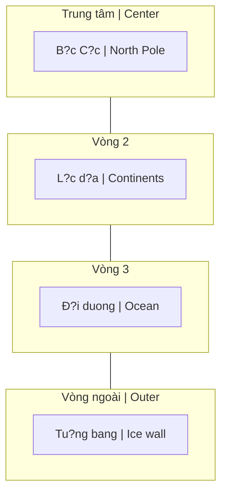

# Thuy?t Trái Ð?t Ph?ng (Flat Earth Theory)

**Thuy?t Trái Ð?t Ph?ng** là phong trào ph?n bác mô hình vu tr? Nh?t tâm và Trái Ð?t hình c?u. Gây tranh cãi m?nh nhung d?t ra câu h?i thú v? v? epistemology - "Làm sao chúng ta bi?t nh?ng gì ta bi?t?"

*Flat Earth Theory is a movement challenging the heliocentric model and spherical Earth. Highly controversial, but raises interesting questions about epistemology - "How do we know what we know?"*

> **Disclaimer / Tuyên b?:** Bài này trình bày các lu?n di?m c?a phong trào d? hi?u, không kh?ng d?nh dúng hay sai.
>
> *This article presents the movement's arguments for understanding, not claiming right or wrong.*

---

## Mô Hình Ð? Xu?t / Proposed Model

### B?n d? Flat Earth / Flat Earth Map

**Mô hình d?ng tâm (t? trong ra ngoài):**

*Concentric model (from center outward):*

> **Hình dung:** Nhìn t? trên xu?ng - B?c C?c ? gi?a, các l?c d?a xoay quanh, d?i duong bao b?c, và b?c tu?ng bang Nam C?c là rìa ngoài cùng.
>
> *Visualize: Looking down from above - North Pole at center, continents arranged around, ocean surrounding, and Antarctic ice wall as the outer edge.*

### Các tuyên b? chính / Key Claims

| Ti?ng Vi?t | English |
|------------|---------|
| Trái Ð?t là dia ph?ng | Earth is a flat disc |
| Nam C?c = b?c tu?ng bang bao quanh | Antarctica = ice wall perimeter |
| M?t Tr?i/M?t Trang nh? hon, g?n hon | Sun/Moon smaller and closer |
| B?u tr?i có mái vòm (dome/firmament) | Sky has a dome (firmament) |
| Các vì sao c? d?nh trên vòm | Stars fixed in the firmament |

---

## Lu?n Ði?m Chính / Main Arguments

### 1. Ð?t v?n d? v? Tr?ng l?c / Questioning Gravity

Phong trào Flat Earth bác b? c? tr?ng l?c Newton l?n lý thuy?t không-th?i gian cong c?a Einstein.

*Flat Earthers reject both Newton's gravity and Einstein's curved spacetime theory.*

**Lu?n di?m:** "Nu?c không th? bám trên m?t qu? c?u dang quay."

*Argument: "Water cannot stick to a spinning ball."*

#### Mô hình thay th?: Tinh di?n / Alternative: Electrostatics

| Mô hình Tr?ng l?c | Mô hình Tinh di?n |
|-------------------|-------------------|
| Kh?i lu?ng hút kh?i lu?ng | Ði?n tích hút di?n tích |
| G = 6.67×10?¹¹ (y?u) | k = 8.99×10? (m?nh hon nhi?u) |
| "Tác d?ng t? xa" | D?a trên tru?ng |
| Mass attracts mass | Charge attracts charge |

**Công th?c / Formula:** F = k·|q1·q2| / r²

- B? m?t Trái Ð?t = di?n tích âm / Earth surface = negative charge
- Khí quy?n = ion duong / Atmosphere = positive ions
- "Roi" = l?c hút tinh di?n / "Falling" = electrostatic attraction

### 2. Không th?y d? cong / Missing Curvature

| Lu?n di?m / Argument | Chi ti?t / Detail |
|----------------------|-------------------|
| ?nh ch?p t?m xa không th?y cong | Long-range photos show no curve |
| Th? nghi?m laser trên m?t nu?c | Laser tests over water |
| Th?y tòa nhà vu?t "du?ng cong" | Buildings visible beyond "curve" |
| Công th?c "8 inch/mile²" không kh?p | "8 inches per mile squared" not observed |

**Công th?c chu?n (Globe model):** Ð? gi?m = 8 inch × (kho?ng cách tính b?ng mile)²

*Standard formula (Globe model): Drop = 8 inches × (distance in miles)²*

### 3. Hoài nghi NASA / NASA Skepticism

| Nghi v?n / Suspicion | Chi ti?t / Detail |
|----------------------|-------------------|
| Hình ?nh CGI | Tuyên b? các ?nh Trái Ð?t là d? h?a |
| "Không có ?nh th?t" | "No real photos of Earth" |
| Vành dai Van Allen | Nghi ng? Apollo missions |
| Ngân sách $50B+/nam | "Ti?n di dâu?" / "Where does the money go?" |

### 4. Nam C?c b? khóa / Antarctica Locked

| S? ki?n / Event | Ý nghia / Meaning |
|-----------------|-------------------|
| Hi?p u?c Nam C?c 1959 | 12 qu?c gia ký, c?m quân s? hóa |
| Không ai du?c t? do khám phá | No independent exploration allowed |
| H?n ch? quân s? | Military restrictions |
| "H? dang gi?u gì?" | "What are they hiding?" |

**Câu h?i:** T?i sao gi?a Cold War, M? và Liên Xô l?i h?p tác b?o v? Nam C?c?

*Question: Why did US and USSR cooperate to protect Antarctica during the Cold War?*

---

## Ph?n Bi?n / Counter-Arguments

### Ch?ng l?i Flat Earth / Against Flat Earth

| B?ng ch?ng / Evidence | Gi?i thích / Explanation |
|-----------------------|--------------------------|
| Tàu bi?n m?t t? du?i lên | Ships disappear bottom-first over horizon |
| Múi gi? | Time zones work on a globe |
| V? tinh ho?t d?ng | Satellite technology works |
| Ði vòng quanh th? gi?i | Circumnavigation possible |
| Sao khác nhau B?c/Nam | Different star patterns N/S hemispheres |
| Nguy?t th?c | Lunar eclipse shows Earth's round shadow |

### Ph?n h?i c?a Flat Earthers / Flat Earthers' Response

| B?ng ch?ng / Evidence | Ph?n h?i / Response |
|-----------------------|---------------------|
| Tàu bi?n m?t t? du?i | Do perspective/khúc x? |
| Múi gi? | M?t tr?i xoay nhu spotlight |
| V? tinh | Th?c ra là khinh khí c?u t?m cao |
| Ði vòng quanh | Ði vòng tròn trên dia ph?ng |
| Sao khác nhau | Dome t?o ra các pattern khác nhau |

---

## Câu H?i Sâu Hon / Deeper Questions

### Epistemology / Nh?n th?c lu?n

Flat Earth d?t ra câu h?i quan tr?ng v? cách chúng ta "bi?t" di?u gì dó:

*Flat Earth raises important questions about how we "know" something:*

| Câu h?i / Question | Ý nghia / Meaning |
|--------------------|-------------------|
| Làm sao xác minh tuyên b?? | How do we verify claims? |
| Ni?m tin vào t? ch?c | Trust in institutions |
| Ki?n th?c cá nhân vs du?c k? | Personal vs received knowledge |
| "Tôi du?c b?o" vs "Tôi dã ki?m ch?ng" | "I was told" vs "I verified" |

### N?u dúng, ý nghia gì? / If True, What Does It Mean?

| H? qu? / Consequence | Chi ti?t / Detail |
|----------------------|-------------------|
| Toàn b? v?t lý sai | All of physics wrong |
| Khám phá không gian là gi? | Space exploration is fake |
| Vu tr? h?c vi?t l?i | Cosmology rewritten |
| Ý nghia t?n t?i | We're not random - we're special |

### K?t n?i [[Ma Tr?n]] / Matrix Connection

| Quan di?m / View | Gi?i thích / Explanation |
|------------------|--------------------------|
| "L?i nói d?i l?n nh?t" | "Biggest lie ever told" |
| Ki?m soát qua vu tr? h?c gi? | Control through false cosmology |
| Làm con ngu?i th?y nh? bé, ng?u nhiên | Make humans feel small/random |
| Che gi?u b?n ch?t th?c s? | Hide true nature of reality |

---

## Các Mô Hình Liên Quan / Related Models

### So sánh các mô hình / Model Comparison

| Mô hình / Model | Trái Ð?t / Earth | Trung tâm / Center | Ngu?n / Source |
|-----------------|------------------|---------------------|----------------|
| Nh?t tâm (Heliocentric) | C?u, quay | M?t Tr?i | Khoa h?c hi?n d?i |
| Ð?a tâm (Geocentric) | C?u, d?ng yên | Trái Ð?t | C? d?i, Ptolemy |
| Flat Earth | Ph?ng | B?c C?c | Phong trào hi?n d?i |
| [[Núi Tu Di]] | Ph?ng + Núi | Tu Di | Ph?t giáo, Hindu |
| Biblical Firmament | Ph?ng + Vòm | Trái Ð?t | Kinh Thánh |

### Ði?m chung / Common Threads

T?t c? các mô hình c? d?i d?u có:
- Trái Ð?t ? trung tâm ho?c d?c bi?t
- Vòm tr?i (firmament/dome)
- Con ngu?i có ý nghia, không ng?u nhiên

*All ancient models share:*
- *Earth at center or special*
- *Sky dome (firmament)*
- *Humans have meaning, not random*

---

## K?t Lu?n / Conclusion

> **Dù b?n tin hay không**, Flat Earth d?t ra m?t câu h?i quan tr?ng: **B?n có th?c s? ki?m ch?ng nh?ng gì b?n "bi?t", hay b?n ch? tin vì du?c b?o?**

> *Whether you believe or not, Flat Earth raises an important question: **Have you actually verified what you "know", or do you just believe because you were told?***

Ðây chính là giá tr? c?a phong trào - không nh?t thi?t ? k?t lu?n, mà ? **câu h?i** nó d?t ra v? ni?m tin và ki?n th?c.

*This is the value of the movement - not necessarily in its conclusions, but in the **questions** it raises about belief and knowledge.*

---

## Related / Liên quan

### Vu tr? h?c / Cosmology
- [[Mô Hình Ð?a Tâm]] - Geocentric alternative
- [[Núi Tu Di]] - Buddhist cosmology
- [[Vu Tr? H?c Ph?t Giáo]] - Ancient cosmology
- [[B?c Tu?ng Bang]] - Ice Wall concept

### Ma Tr?n & Ki?m soát / Matrix & Control
- [[Ma Tr?n]] - Control through false reality
- [[Khoa H?c Xét L?i]] - Questioning mainstream science
- [[Ði?u mà n?n giáo d?c và chính ph? không d?y b?n]] - Hidden knowledge
- [[Elite]] - Who controls the narrative

### Epistemology / Nh?n th?c lu?n
- [[Gnosis]] - Direct knowing vs belief
- [[Trí Tu?]] - Wisdom vs information
