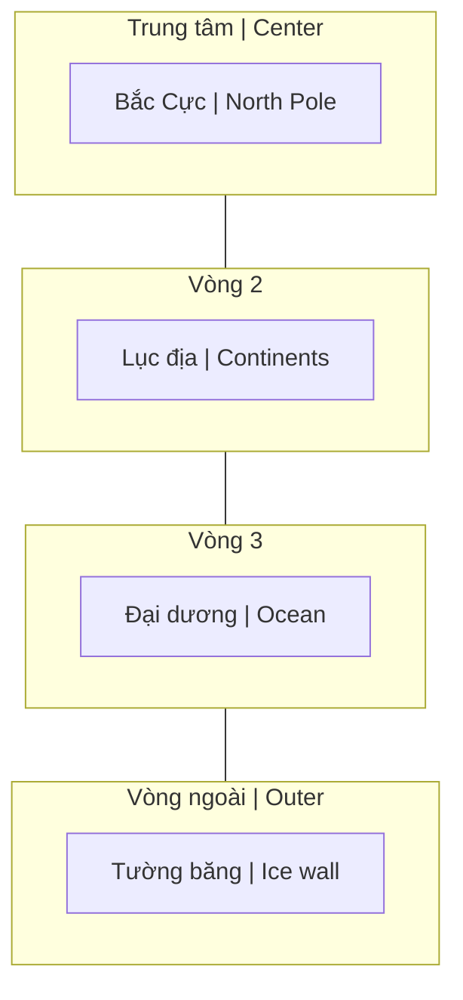

---
title: "Thuyết Trái Đất Phẳng (Flat Earth Theory)"
aliases: ["Flat Earth", "Trái Đất Phẳng", "Flat Earth Theory"]
date: 2026-04-05
tags: [politics-conspiracy, esoterica]
status: refined
---

# Thuyết Trái Đất Phẳng (Flat Earth Theory)

**Thuyết Trái Đất Phẳng** là phong trào phản bác mô hình vũ trụ Nhật tâm và Trái Đất hình cầu. Gây tranh cãi mạnh nhưng đặt ra câu hỏi thú vị về epistemology — "Làm sao chúng ta biết những gì ta biết?"

*Flat Earth Theory is a movement challenging the heliocentric model and spherical Earth. Highly controversial, but raises interesting questions about epistemology — "How do we know what we know?"*

> **Disclaimer / Tuyên bố:** Bài này trình bày các luận điểm của phong trào để hiểu, không khẳng định đúng hay sai.
>
> *This article presents the movement's arguments for understanding, not claiming right or wrong.*

---

## Mô Hình Đề Xuất / Proposed Model

### Bản đồ Flat Earth / Flat Earth Map

**Mô hình đồng tâm (từ trong ra ngoài):**

*Concentric model (from center outward):*

> **Hình dung:** Nhìn từ trên xuống — Bắc Cực ở giữa, các lục địa xoay quanh, đại dương bao bọc, và bức tường băng Nam Cực là rìa ngoài cùng.
>
> *Visualize: Looking down from above — North Pole at center, continents arranged around, ocean surrounding, and Antarctic ice wall as the outer edge.*

### Các tuyên bố chính / Key Claims

| Tiếng Việt | English |
|------------|---------|
| Trái Đất là đĩa phẳng | Earth is a flat disc |
| Nam Cực = bức tường băng bao quanh | Antarctica = ice wall perimeter |
| Mặt Trời/Mặt Trăng nhỏ hơn, gần hơn | Sun/Moon smaller and closer |
| Bầu trời có mái vòm (dome/firmament) | Sky has a dome (firmament) |
| Các vì sao cố định trên vòm | Stars fixed in the firmament |

---

## Luận Điểm Chính / Main Arguments

### 1. Đặt vấn đề về Trọng lực / Questioning Gravity

Phong trào Flat Earth bác bỏ cả trọng lực Newton lẫn lý thuyết không-thời gian cong của Einstein.

*Flat Earthers reject both Newton's gravity and Einstein's curved spacetime theory.*

**Luận điểm:** "Nước không thể bám trên một quả cầu đang quay."

*Argument: "Water cannot stick to a spinning ball."*

#### Mô hình thay thế: Tĩnh điện / Alternative: Electrostatics

| Mô hình Trọng lực | Mô hình Tĩnh điện |
|-------------------|-------------------|
| Khối lượng hút khối lượng | Điện tích hút điện tích |
| G = 6.67×10⁻¹¹ (yếu) | k = 8.99×10⁹ (mạnh hơn nhiều) |
| "Tác dụng từ xa" | Dựa trên trường |
| Mass attracts mass | Charge attracts charge |

**Công thức / Formula:** F = k·|q₁·q₂| / r²

- Bề mặt Trái Đất = điện tích âm / Earth surface = negative charge
- Khí quyển = ion dương / Atmosphere = positive ions
- "Rơi" = lực hút tĩnh điện / "Falling" = electrostatic attraction

### 2. Không thấy độ cong / Missing Curvature

| Luận điểm / Argument | Chi tiết / Detail |
|----------------------|-------------------|
| Ảnh chụp tầm xa không thấy cong | Long-range photos show no curve |
| Thử nghiệm laser trên mặt nước | Laser tests over water |
| Thấy tòa nhà vượt "đường cong" | Buildings visible beyond "curve" |
| Công thức "8 inch/mile²" không khớp | "8 inches per mile squared" not observed |

**Công thức chuẩn (Globe model):** Độ giảm = 8 inch × (khoảng cách tính bằng mile)²

*Standard formula (Globe model): Drop = 8 inches × (distance in miles)²*

### 3. Hoài nghi NASA / NASA Skepticism

| Nghi vấn / Suspicion | Chi tiết / Detail |
|----------------------|-------------------|
| Hình ảnh CGI | Tuyên bố các ảnh Trái Đất là đồ họa |
| "Không có ảnh thật" | "No real photos of Earth" |
| Vành đai Van Allen | Nghi ngờ Apollo missions |
| Ngân sách $50B+/năm | "Tiền đi đâu?" / "Where does the money go?" |

### 4. Nam Cực bị khóa / Antarctica Locked

| Sự kiện / Event | Ý nghĩa / Meaning |
|-----------------|-------------------|
| Hiệp ước Nam Cực 1959 | 12 quốc gia ký, cấm quân sự hóa |
| Không ai được tự do khám phá | No independent exploration allowed |
| Hạn chế quân sự | Military restrictions |
| "Họ đang giấu gì?" | "What are they hiding?" |

**Câu hỏi:** Tại sao giữa Cold War, Mỹ và Liên Xô lại hợp tác bảo vệ Nam Cực?

*Question: Why did US and USSR cooperate to protect Antarctica during the Cold War?*

---

## Phản Biện / Counter-Arguments

### Chống lại Flat Earth / Against Flat Earth

| Bằng chứng / Evidence | Giải thích / Explanation |
|-----------------------|--------------------------|
| Tàu biến mất từ dưới lên | Ships disappear bottom-first over horizon |
| Múi giờ | Time zones work on a globe |
| Vệ tinh hoạt động | Satellite technology works |
| Đi vòng quanh thế giới | Circumnavigation possible |
| Sao khác nhau Bắc/Nam | Different star patterns N/S hemispheres |
| Nguyệt thực | Lunar eclipse shows Earth's round shadow |

### Phản hồi của Flat Earthers / Flat Earthers' Response

| Bằng chứng / Evidence | Phản hồi / Response |
|-----------------------|---------------------|
| Tàu biến mất từ dưới | Do perspective/khúc xạ |
| Múi giờ | Mặt trời xoay như spotlight |
| Vệ tinh | Thực ra là khinh khí cầu tầm cao |
| Đi vòng quanh | Đi vòng tròn trên đĩa phẳng |
| Sao khác nhau | Dome tạo ra các pattern khác nhau |

---

## Câu Hỏi Sâu Hơn / Deeper Questions

### Epistemology / Nhận thức luận

Flat Earth đặt ra câu hỏi quan trọng về cách chúng ta "biết" điều gì đó:

*Flat Earth raises important questions about how we "know" something:*

| Câu hỏi / Question | Ý nghĩa / Meaning |
|--------------------|-------------------|
| Làm sao xác minh tuyên bố? | How do we verify claims? |
| Niềm tin vào tổ chức | Trust in institutions |
| Kiến thức cá nhân vs được kể | Personal vs received knowledge |
| "Tôi được bảo" vs "Tôi đã kiểm chứng" | "I was told" vs "I verified" |

### Nếu đúng, ý nghĩa gì? / If True, What Does It Mean?

| Hệ quả / Consequence | Chi tiết / Detail |
|----------------------|-------------------|
| Toàn bộ vật lý sai | All of physics wrong |
| Khám phá không gian là giả | Space exploration is fake |
| Vũ trụ học viết lại | Cosmology rewritten |
| Ý nghĩa tồn tại | We're not random — we're special |

### Kết nối [[Ma Trận]] / Matrix Connection

| Quan điểm / View | Giải thích / Explanation |
|------------------|--------------------------|
| "Lời nói dối lớn nhất" | "Biggest lie ever told" |
| Kiểm soát qua vũ trụ học giả | Control through false cosmology |
| Làm con người thấy nhỏ bé, ngẫu nhiên | Make humans feel small/random |
| Che giấu bản chất thực sự | Hide true nature of reality |

---

## Các Mô Hình Liên Quan / Related Models

### So sánh các mô hình / Model Comparison

| Mô hình / Model | Trái Đất / Earth | Trung tâm / Center | Nguồn / Source |
|-----------------|------------------|---------------------|----------------|
| Nhật tâm (Heliocentric) | Cầu, quay | Mặt Trời | Khoa học hiện đại |
| Địa tâm (Geocentric) | Cầu, đứng yên | Trái Đất | Cổ đại, Ptolemy |
| Flat Earth | Phẳng | Bắc Cực | Phong trào hiện đại |
| [[Núi Tu Di]] | Phẳng + Núi | Tu Di | Phật giáo, Hindu |
| Biblical Firmament | Phẳng + Vòm | Trái Đất | Kinh Thánh |

### Điểm chung / Common Threads

Tất cả các mô hình cổ đại đều có:
- Trái Đất ở trung tâm hoặc đặc biệt
- Vòm trời (firmament/dome)
- Con người có ý nghĩa, không ngẫu nhiên

*All ancient models share:*
- *Earth at center or special*
- *Sky dome (firmament)*
- *Humans have meaning, not random*

---

## Kết Luận / Conclusion

> **Dù bạn tin hay không**, Flat Earth đặt ra một câu hỏi quan trọng: **Bạn có thực sự kiểm chứng những gì bạn "biết", hay bạn chỉ tin vì được bảo?**

> *Whether you believe or not, Flat Earth raises an important question: **Have you actually verified what you "know", or do you just believe because you were told?***

Đây chính là giá trị của phong trào — không nhất thiết ở kết luận, mà ở **câu hỏi** nó đặt ra về niềm tin và kiến thức.

*This is the value of the movement — not necessarily in its conclusions, but in the **questions** it raises about belief and knowledge.*

---

## Related / Liên quan

### Vũ trụ học / Cosmology
- [[Mô Hình Địa Tâm]] — Geocentric alternative
- [[Núi Tu Di]] — Buddhist cosmology
- [[Vũ Trụ Học Phật Giáo]] — Ancient cosmology
- [[Bức Tường Băng]] — Ice Wall concept

### Ma Trận & Kiểm soát / Matrix & Control
- [[Ma Trận]] — Control through false reality
- [[Khoa Học Xét Lại]] — Questioning mainstream science
- [[Điều mà nền giáo dục và chính phủ không dạy bạn]] — Hidden knowledge
- [[Elite]] — Who controls the narrative

### Epistemology / Nhận thức luận
- [[Gnosis]] — Direct knowing vs belief
- [[Trí Tuệ]] — Wisdom vs information
