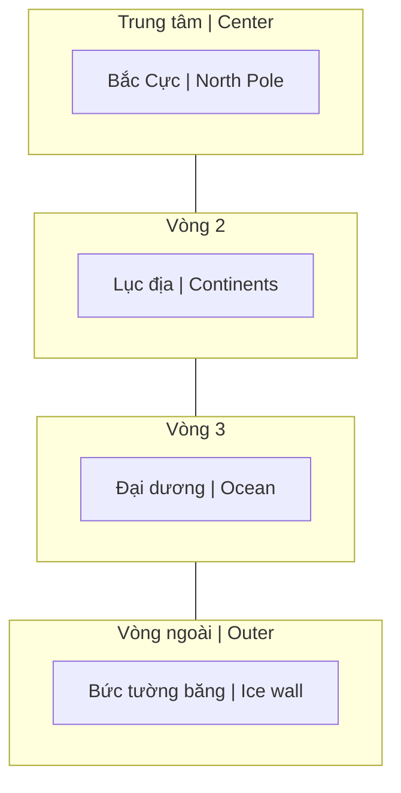

# Thuyết Trái Đất Phẳng (Flat Earth Theory)

**Thuyết Trái Đất Phẳng** là phong trào phản bác mô hình vũ trụ Nhật tâm và Trái Đất hình cầu. Gây tranh cãi mạnh nhưng đặt ra câu hỏi thú vị về epistemology — "Làm sao chúng ta biết những gì ta biết?"

> **Disclaimer**: Bài này trình bày arguments của phong trào để hiểu, không khẳng định đúng/sai.

## Mô Hình Đề Xuất

### Flat Earth Map

**Mô hình đồng tâm (từ trong ra ngoài):**

*Concentric model (from center outward):*

> Hình dung: như nhìn xuống từ trên cao — Bắc Cực ở giữa, các lục địa xoay quanh, đại dương bao bọc, và bức tường băng Nam Cực là rìa ngoài cùng.
>
> *Visualize: looking down from above — North Pole at center, continents arranged around, ocean surrounding, and Antarctic ice wall as the outer edge.*

### Key Claims
- Trái Đất là đĩa phẳng
- Nam Cực = bức tường băng bao quanh
- Mặt Trời/Mặt Trăng nhỏ hơn, gần hơn
- Quay trên bầu trời phẳng (dome)
- Stars fixed in firmament

## Luận Điểm Chính

### 1. Gravity Questioned
- Bác bỏ Newton's gravity
- Bác bỏ Einstein's spacetime curvature
- "Nước không thể bám trên quả cầu quay"

### Alternative: Electrostatics
| Gravity Model | Electrostatic Model |
|---------------|---------------------|
| Mass attracts mass | Charge attracts |
| G = 6.67×10⁻¹¹ | k = 8.99×10⁹ |
| "Action at distance" | Field-based |
| Weak force | Much stronger |

Formula: F = k·|q₁·q₂| / r²
- Earth surface = negative charge
- Atmosphere = positive ions
- "Falling" = electrostatic attraction

### 2. Curvature Missing
- Long-range photos show no curve
- Laser tests over water
- Buildings visible beyond "curve"
- "8 inches per mile squared" not observed

### 3. NASA Skepticism
- CGI imagery claims
- "No real photos of Earth"
- Van Allen belts (moon landing doubt)
- $50B+ annual budget

### 4. Antarctica Locked
- Antarctic Treaty (1959)
- No independent exploration
- Military restrictions
- "What are they hiding?"

## Counter-Arguments

### Against Flat Earth
- Ships disappear bottom-first
- Time zones
- Satellite technology works
- Circumnavigation
- Different star patterns N/S
- Lunar eclipses

### Flat Earthers' Response
- Perspective/refraction
- Sun spotlight effect
- Satellites = high-altitude balloons
- Circumnavigation is circular on flat disc
- Dome creates star patterns

## Deeper Questions

### Epistemology
- How do we verify claims?
- Trust in institutions
- Personal vs received knowledge
- "I was told" vs "I verified"

### Why It Matters (if true)
- All of physics wrong
- Space exploration fake
- Cosmology rewritten
- Implications for meaning (not random)

### [[Ma Trận]] Connection
- "Biggest lie ever told"
- Control through false cosmology
- Make humans feel small/random
- Hide true nature of reality

## Related Models

- [[Mô Hình Địa Tâm]] — Earth-centered (spherical)
- [[Núi Tu Di (Mount Meru)]] — Buddhist cosmology
- [[Vũ Trụ Học Phật Giáo]] — Alternative cosmology
- Biblical Firmament — Dome model

## Related

- [[Ma Trận]] — Control through false reality
- [[Khoa Học Xét Lại (Revisionist Science)]]
- [[Vũ Trụ Học Phật Giáo]] — Ancient cosmology
- [[Mô Hình Địa Tâm]] — Geocentric alternative
- [[Núi Tu Di (Mount Meru)]]
- [[Điều mà nền giáo dục và chính phủ không dạy bạn]]
