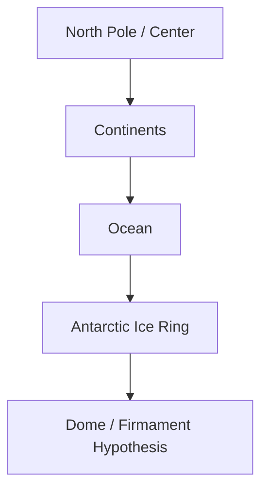

# Thuyết Trái Đất Phẳng (Flat Earth Theory)

**Thuyết Trái Đất Phẳng là một trong những chủ đề gây tranh cãi nhất của Khoa Học Xét Lại. Giá trị chính của nó trong vault không phải bắt người đọc tin Trái Đất phẳng, mà là buộc họ đối diện câu hỏi epistemology: bao nhiêu phần “vũ trụ” ta tin là observation trực tiếp, và bao nhiêu phần là trust vào institution?**

*Flat Earth Theory is one of the most controversial subjects in revisionist science. Its core value in the vault is not forcing belief in a flat Earth, but forcing the epistemological question: how much of the “cosmos” we believe comes from direct observation, and how much comes from trust in institutions?*

---

## Evidence Discipline / Cách Đọc Claim

| Tầng | Cách đọc | Ví dụ |
|---|---|---|
| **Observation** | điều người thường có thể tự thấy/đo | horizon, water level, sun path |
| **Mainstream model** | globe/heliocentric explanation | gravity, curvature, satellites |
| **Alternative model** | flat plane, dome, local sun/moon | hypothesis cần kiểm |
| **Institution critique** | NASA/media/education có monopoly cosmology không? | [[Bộ Tam Thánh Mind Control - NASA Disney Hollywood]] |

Bài này không khẳng định mọi claim Flat Earth đúng. Nó dùng Flat Earth như stress test cho authority, ridicule và model-dependence.

---

## 1. Vì Sao Chủ Đề Này Quan Trọng?

Flat Earth là một memetic grenade. Chỉ cần nhắc tới, nhiều người lập tức ridicule trước khi nghe argument.

Điều đó đáng chú ý.

Một claim sai có thể được phản biện bình tĩnh. Nhưng khi một chủ đề bị biến thành biểu tượng của “ngu”, nó thường đang bảo vệ một ranh giới tâm lý nào đó.

Câu hỏi vault:

> Điều gì trong cosmology khiến hệ thống cần ridicule mạnh đến vậy?

---

## 2. Mô Hình Flat Earth Cơ Bản

Các version khác nhau, nhưng thường gồm:

- Bắc Cực ở trung tâm,
- lục địa trải quanh,
- Nam Cực là vòng băng/rìa,
- Mặt Trời/Mặt Trăng nhỏ và gần hơn,
- bầu trời như dome/firmament,
- stars gắn với vòng quay trên cao.

Đây là model alternative, không phải fact mặc định.

---

## 3. Các Câu Hỏi Chính

Flat Earth communities thường đặt câu hỏi về:

- curvature measurement,
- horizon always rising to eye level,
- long-distance visibility,
- water seeking level,
- flight routes,
- Antarctic access,
- NASA imagery,
- satellites/ISS,
- gravity vs density/electromagnetism.

Một số argument yếu, một số đáng kiểm. Vấn đề là public thường không được dạy cách tự phân loại claim, chỉ được dạy cười.

---

## 4. Gravity, Water, Horizon

Flat Earth critique thường bắt đầu từ intuition: nước tìm mặt phẳng, horizon trông phẳng, ta không cảm thấy Trái Đất quay.

Mainstream trả lời bằng gravity, scale, optics, inertial frames.

Revisionist hỏi lại: các câu trả lời đó có tự kiểm được không, hay cần tin model/math/institution?

Đây là nơi [[Khoa Học Xét Lại]] quan trọng: không phải phủ định math, mà hỏi math đang mô tả reality hay đang cứu model.

---

## 5. NASA Và Cosmology Authority

Flat Earth chạm trực tiếp NASA.

Nếu NASA là source chính của hình ảnh không gian, thì cosmology của public phụ thuộc vào một institution có:

- military origin,
- Cold War context,
- propaganda value,
- huge budgets,
- Hollywood-grade imagery,
- symbolic power.

Điều này không chứng minh NASA fake. Nhưng nó khiến câu hỏi về trust trở nên hợp lý.

→ Xem: [[Bộ Tam Thánh Mind Control - NASA Disney Hollywood]], [[Operation Paperclip]].

---

## 6. Bức Tường Băng Và Nam Cực

Trong flat earth lens, Antarctica không phải continent ở cực nam mà là outer boundary.

Trong broader vault lens, [[Nam Cực - Bí Mật Được Canh Giữ]] và [[Bức Tường Băng]] quan trọng vì access restriction, treaty system và hidden-history hypotheses.

Tầng fact: Antarctica có treaty, restrictions, military/scientific interest.

Tầng speculative: ice wall/firmament/outer lands cần đọc như model, không phải fact đã đóng.

---

## 7. Bẫy Của Flat Earth

- biến skepticism thành identity,
- xem ai không đồng ý là NPC,
- gom mọi evidence vào một kết luận,
- bỏ qua argument mạnh của mainstream,
- nhầm ridicule với proof-of-truth,
- mất ability to rank confidence.

Flat Earth chỉ có ích nếu nó làm bạn biết hỏi tốt hơn. Nếu nó làm bạn thành giáo đồ mới, nó lại là Ma Trận.

---

## Synthesis

Thuyết Trái Đất Phẳng là một mirror cực đoan. Nó phản chiếu mối quan hệ của con người với authority, observation và ridicule.

Có thể nhiều claim Flat Earth sai. Nhưng câu hỏi nó đặt ra vẫn đáng giữ:

> Bạn biết Trái Đất như thế nào? Tự thấy, tự đo, hay tin một chain authority?

Nếu câu hỏi đó làm bạn khiêm nhường và sắc bén hơn, nó có giá trị. Nếu nó làm bạn chắc chắn mù quáng hơn, nó đã thất bại.

---

## Related

- [[Mô Hình Địa Tâm]]
- [[Khoa Học Xét Lại]]
- [[Bộ Tam Thánh Mind Control - NASA Disney Hollywood]]
- [[Bức Tường Băng]]
- [[Nam Cực - Bí Mật Được Canh Giữ]]
- [[MOC - Science Revisionism]]
