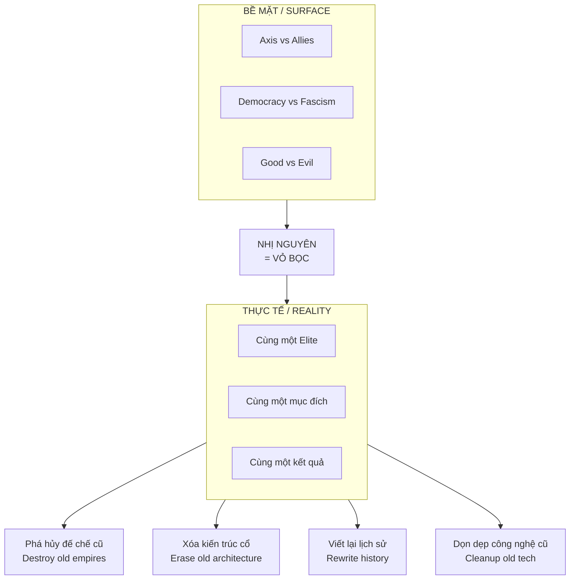
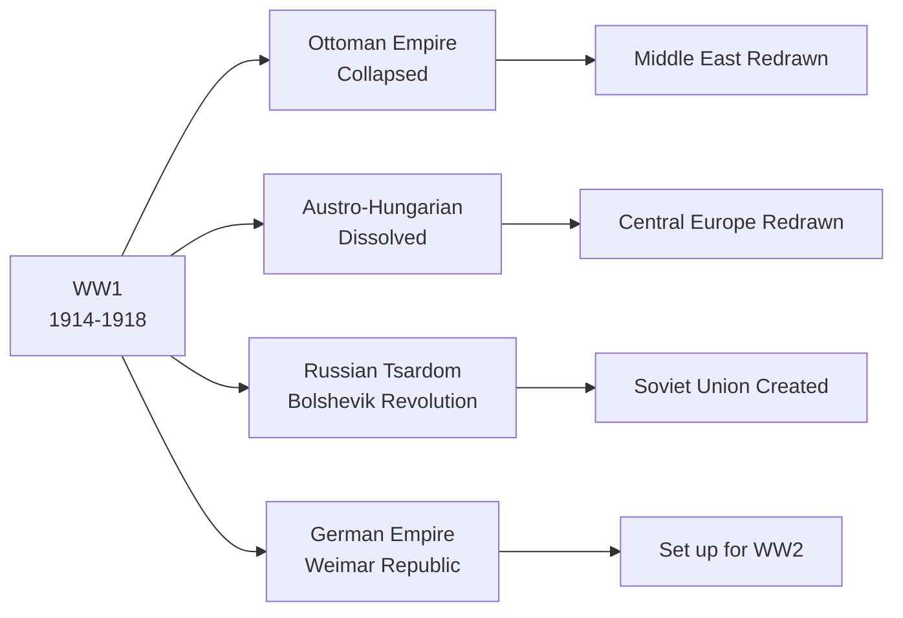
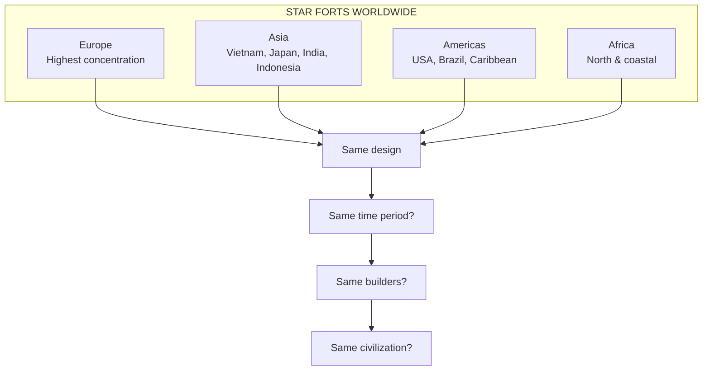
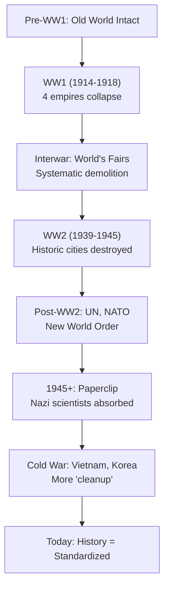
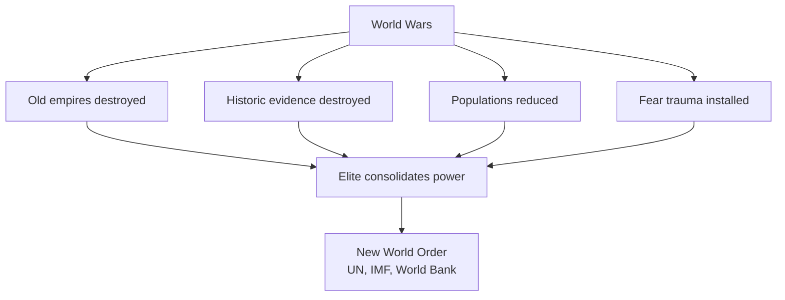

# Thế Chiến — Chiến Dịch Dọn Dẹp / World Wars — The Cleanup Operations

> *"Khi cả hai phe đều serve cùng một master, chiến tranh không phải là xung đột — mà là dự án."*
> *"When both sides serve the same master, war isn't conflict — it's a project."*

Lịch sử dạy rằng **Thế chiến I và II** là cuộc đấu tranh giữa thiện và ác, tự do và độc tài. Nhưng nếu **Nhị Nguyên** (hai phe đối đầu) chỉ là **vỏ bọc** cho một mục đích khác?

*History teaches that World Wars I and II were struggles between good and evil, freedom and tyranny. But what if the Binary (two opposing sides) was just a cover for a different purpose?*

---

## Tổng Quan / Overview



---

## I. Nhị Nguyên — Công Cụ Che Đậy / Binary as Cover

### Hai Phe, Một Chủ

| WW1 | WW2 |
|-----|-----|
| Triple Entente vs Central Powers | Allies vs Axis |
| UK, France, Russia vs Germany, Austria-Hungary, Ottoman | UK, USA, USSR vs Germany, Italy, Japan |
| "Democracy vs Autocracy" | "Freedom vs Fascism" |

**Nhưng xem xét:**
- Ai **funding** cả hai phe?
- Ai **lợi** sau cả hai cuộc chiến?
- Cái gì **bị phá hủy** trong cả hai cuộc chiến?

### Evidence: Same Funders

| Entity | WW1 Role | WW2 Role |
|--------|----------|----------|
| **Wall Street Banks** | Funded Allies AND Germany | Funded Allies AND Nazi Germany |
| **IG Farben** | German chemical giant | Nazi supplier, American partners |
| **Standard Oil** | Both sides | Fuel for both sides |
| **IBM** | N/A | Provided tech to Nazis AND Allies |
| **Ford** | N/A | Factories in Germany, USA |

> *"Prescott Bush, ông nội của George W. Bush, bị điều tra vì trading with the enemy — Nazi Germany."*
>
> *"Prescott Bush, grandfather of George W. Bush, was investigated for trading with the enemy — Nazi Germany."*

### Kết Quả Giống Nhau / Same Results

| After WW1 | After WW2 |
|-----------|-----------|
| 4 đế chế sụp đổ | Đế chế thuộc địa sụp đổ |
| League of Nations | United Nations |
| New borders (Middle East) | New borders (Europe, Asia) |
| Old architecture destroyed | Old architecture destroyed |
| History rewritten | History rewritten |

---

## II. Mục Đích Thật — Dọn Dẹp / Real Purpose — Cleanup

### WW1: Phá Hủy Đế Chế Cũ / Destroying Old Empires

**4 đế chế sụp đổ sau WW1:**



**Điểm chung của 4 đế chế:**
- **Kiến trúc cổ đại** vẫn còn tồn tại
- **Hệ thống cũ** không under global control
- **Lịch sử riêng** chưa bị "standardize"

### WW2: Hoàn Thành Dọn Dẹp / Completing Cleanup

| Target Type | Examples | Result |
|-------------|----------|--------|
| **Historic cities** | Dresden, Warsaw, Berlin | 80-90% destroyed |
| **Cultural centers** | Libraries, museums | Knowledge lost |
| **Old architecture** | Baroque, Gothic, "Tartarian" | Replaced with modern |
| **Infrastructure** | Old rail, energy systems | Rebuilt "new" |

---

## III. Tọa Độ Phá Hủy / Coordinates of Destruction

### Cities Bị Phá Hủy Nặng Nhất / Most Destroyed Cities

#### Europe

| City | Country | Destruction % | Notable Architecture Lost |
|------|---------|--------------|---------------------------|
| **Dresden** | Germany | 78% | "Florence of Elbe", Baroque center |
| **Warsaw** | Poland | 85% | Old Town, Royal Castle |
| **Berlin** | Germany | 70% | Stadtschloss, historic center |
| **Hamburg** | Germany | 75% | Firestorm, old harbor district |
| **Cologne** | Germany | 95% old town | Gothic cathedral area |
| **Nuremberg** | Germany | 90% Altstadt | Medieval center, 1,835 dead in one raid |
| **Rotterdam** | Netherlands | City center | Historic port |

#### Japan

| City | Destruction | Note |
|------|-------------|------|
| **Hiroshima** | 90% | Atomic bomb |
| **Nagasaki** | 60% | Atomic bomb, **Urakami Cathedral** destroyed |
| **Tokyo** | 50% | Firebombing |
| **Osaka** | 35% | Firebombing |

#### Spared — Và Tại Sao? / And Why?

| City | Country | Spared? | Official Reason | Suspicious? |
|------|---------|---------|-----------------|-------------|
| **Kyoto** | Japan | ✓ Yes | "Cultural value" — Henry Stimson | Ancient capital with old knowledge |
| **Rome** | Italy | ✓ Yes | "Religious significance" | Vatican connections |
| **Venice** | Italy | ✓ Yes | "Cultural heritage" | Impossible to rebuild? |
| **Florence** | Italy | ✓ Yes | "Art treasures" | Knowledge repositories? |
| **Vienna** | Austria | ✓ Partially | Less strategic? | Old empire capital |

> *"Kyoto là ancient capital với temples hàng ngàn năm. Nó được tha. Hiroshima và Nagasaki — less 'valuable' — bị nuke."*
>
> *"Kyoto was ancient capital with thousand-year temples. It was spared. Hiroshima and Nagasaki — less 'valuable' — got nuked."*

### Vietnam — Không Ngoại Lệ / No Exception

| Site | Year | Event | Destruction |
|------|------|-------|-------------|
| **Citadel of Saigon** | 1859 | French conquest | **Completely demolished** |
| **Huế Imperial City** | 1968 | Tet Offensive | Heavy damage |
| **Hanoi** | 1972 | Christmas Bombing | Targeted strikes |
| **Laos** | 1964-73 | Secret bombing | **Most bombed nation in history** |
| **Cambodia** | 1969-73 | Operation Menu | Extensive |

**Vietnam Star Forts (Vauban style):**
- **Cổ Loa Citadel** — 3rd century BC, 9 spiral walls, 600 hectares
- **Huế** — 10km circumference, Vauban-style
- **Saigon Citadel** — Built 1790, **completely destroyed 1859**
- **Sơn Tây** — 40km from Hanoi
- **Diên Hải** — Đà Nẵng

> *"Saigon Citadel, một công trình Vauban octagonal, bị Pháp phá hủy hoàn toàn năm 1859. Không còn gì. Tại sao phải phá một pháo đài khi đã chinh phục?"*
>
> *"Saigon Citadel, a Vauban octagonal structure, was completely demolished by the French in 1859. Nothing remains. Why destroy a fort you've already conquered?"*

---

## IV. Star Forts — Mạng Lưới Toàn Cầu / Global Network

### Thống Kê / Statistics

| Metric | Number |
|--------|--------|
| **Total documented** | 1,399+ |
| **Countries** | 94 |
| **Vietnam** | 42 |
| **USA** | 441 |
| **Turkey** | 283 |
| **Belgium** | 378 |
| **Malta** | 188 |

### Distribution Pattern



### Câu Hỏi / Questions

1. **Tại sao cùng một design** xuất hiện ở 94 quốc gia?
2. **Tại sao được gọi là "Vauban"** khi nhiều cái có trước Vauban?
3. **Cổ Loa** — 3rd century BC — spiral design giống star forts — ai xây?
4. **Tại sao nhiều bị phá hủy** trong các cuộc chiến?

---

## V. World's Fairs — Phá Hủy Có Hệ Thống / Systematic Destruction

### Pattern: Build Grand → "Temporary" → Demolish

| Fair | Year | Location | Buildings | Fate |
|------|------|----------|-----------|------|
| **Chicago World's Fair** | 1893 | USA | 200+ grand buildings | **Demolished** |
| **St. Louis** | 1904 | USA | Grand pavilions | **Demolished** |
| **Paris** | 1889 | France | Multiple (except Eiffel Tower) | **Demolished** |
| **Buffalo** | 1901 | USA | Elaborate structures | **Demolished** |

> *"200 'temporary' buildings tại Chicago 1893. Kiến trúc ngang Rome, Greece. Xây trong vài tháng? Hay đã có sẵn?"*
>
> *"200 'temporary' buildings at Chicago 1893. Architecture rivaling Rome, Greece. Built in months? Or already existing?"*

### Alternative Theory

**Official narrative:** Built for fair → demolished because temporary
**Alternative:** Already existed → fair was excuse to showcase → then demolish

---

## VI. Bombing Pattern Analysis

### Strategic vs Cultural Targets

| Official Target Type | % of Historic Areas Hit | Suspicious? |
|---------------------|------------------------|-------------|
| **Industrial** | Often near old towns | ✓ |
| **Rail hubs** | Often historic centers | ✓ |
| **Ports** | Often old architecture | ✓ |
| **Pure residential/cultural** | Very high | ✓✓ |

### Incendiary Bombing — Tại Sao?

**Fire bombs** (incendiary) were specifically designed to:
- Create firestorms
- Destroy everything, including **stone buildings**
- Leave **no traces**

| City | Incendiaries Dropped | Result |
|------|---------------------|--------|
| **Hamburg** | 350,000+ | Firestorm |
| **Dresden** | Massive | Firestorm, "Florence of Elbe" gone |
| **Tokyo** | 1,665 tons | 100,000+ dead, old Tokyo destroyed |

> *"High explosives break structures. Incendiaries burn evidence."*

---

## VII. Timeline: Cleanup Operations



### The Sequence

1. **WW1** → Collapse old empires, redraw maps
2. **1920s-30s** → World's Fairs demolish "temporary" grand buildings
3. **WW2** → Bomb remaining historic cities to rubble
4. **Post-WW2** → "Rebuild" with modern architecture
5. **Cold War** → Vietnam, Korea — cleanup Asian old world
6. **Today** → Standardized history, no evidence remains

---

## VIII. Cui Bono? / Ai Hưởng Lợi?

### Before vs After

| Before World Wars | After World Wars |
|-------------------|------------------|
| Multiple empires | UN-controlled nations |
| Old currencies | Bretton Woods, USD |
| Local histories | Standardized history |
| Old architecture | Modern architecture |
| Decentralized power | Centralized institutions |
| Old technology (free energy?) | Petrodollar economy |

### Who Benefits?



---

## IX. Nhị Nguyên — Luôn Là Công Cụ / Binary — Always a Tool

### Pattern Nhận Diện / Recognizing the Pattern

| Era | Binary | Real Outcome |
|-----|--------|--------------|
| **WW1** | Entente vs Central Powers | Old empires collapse |
| **WW2** | Allies vs Axis | Historic cities destroyed |
| **Cold War** | USA vs USSR | Both advance same agenda |
| **War on Terror** | West vs Islam | Middle East destroyed (more old sites) |
| **Today** | Left vs Right | Elite agenda advances |

> *"Khi bạn thấy Nhị Nguyên, hỏi: Ai lợi bất kể bên nào thắng?"*
>
> *"When you see Binary, ask: Who benefits regardless of which side wins?"*

### The Formula

```
Step 1: Create/amplify binary conflict
Step 2: Fund/control both sides
Step 3: War destroys old world evidence
Step 4: "Winner" rewrites history
Step 5: New order emerges
Step 6: Repeat
```

---

## Core Insight / Insight Cốt Lõi

**Thế chiến không phải là thiện vs ác.**
*The World Wars weren't good vs evil.*

**Thế chiến là dự án dọn dẹp có hệ thống:**
*The World Wars were systematic cleanup projects:*

1. **Phá hủy đế chế cũ** — không under global control
2. **Xóa kiến trúc cổ** — star forts, "Tartarian" buildings
3. **Đốt bằng chứng** — incendiary bombs, firestorms
4. **Viết lại lịch sử** — winners write history
5. **Cài đặt trật tự mới** — UN, IMF, standardized narrative

> *"Nhị Nguyên là vỏ bọc hoàn hảo. Khi mọi người đang cổ vũ cho 'phe mình', không ai hỏi ai đang conduct the orchestra."*
>
> *"Binary is the perfect cover. When everyone's cheering for 'their side', no one asks who's conducting the orchestra."*

**Vietnam, Laos, Cambodia** — không ngoại lệ. Old world sites, star forts, citadels — bị phá hủy trong các cuộc chiến "giải phóng" hoặc "chống cộng".

*Vietnam, Laos, Cambodia — no exception. Old world sites, star forts, citadels — destroyed in wars of "liberation" or "anti-communism".*

---

## Vault Connections

### Related Notes
- [[Nhị Nguyên]] — Binary thinking as control mechanism
- [[Tartaria]] — Hidden civilization (separate article)
- [[Mudflood]] — Reset event theory
- [[Nam Cực - Bí Mật Được Canh Giữ]] — Antarctica, Nazi connection
- [[Bộ Tam Thánh Mind Control - NASA Disney Hollywood]] — Post-war narrative control

### Architecture & History
- [[Thành Cổ Loa]] — Vietnam's ancient spiral citadel
- [[Khoa Học Xét Lại]] — Questioning official science
- [[Elite]] — Who controls both sides

### Mind Control
- [[Kiểm Soát Tâm Trí]] — War as psychological operation
- [[Predictive Programming - Cấy Tương Lai Vào Tiềm Thức]] — Preparing populations
- [[Ma Trận]] — The overall control system

---

## Sources

### WW2 Destruction
- Wikipedia — Bombing of Dresden, Warsaw, Strategic bombing in WW2
- National WW2 Museum — Operation Gomorrah
- Rare Historical Photos — Dresden before/after

### Star Forts
- Fortress Earth Project — 1,399 forts, 94 countries
- StarForts.com — Detailed star fort database
- Wikipedia — Bastion fort, Vauban fortifications

### Vietnam
- Wikipedia — Co Loa Citadel, Citadel of Saigon, Battle of Huế
- Saigoneer — Vauban Architecture in Vietnam
- Yale Genocide Studies — Cambodia bombing

### World's Fairs
- Atlas Obscura — World's Fair monuments
- Tartaria research compilations
- Chicago 1893 documentation

### Funding Both Sides
- Trading with the Enemy Act investigations
- IG Farben documentation
- Standard Oil history

---

*Lần cuối cập nhật: 2026-04-30*
