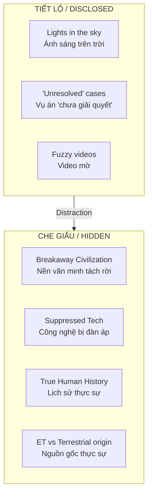
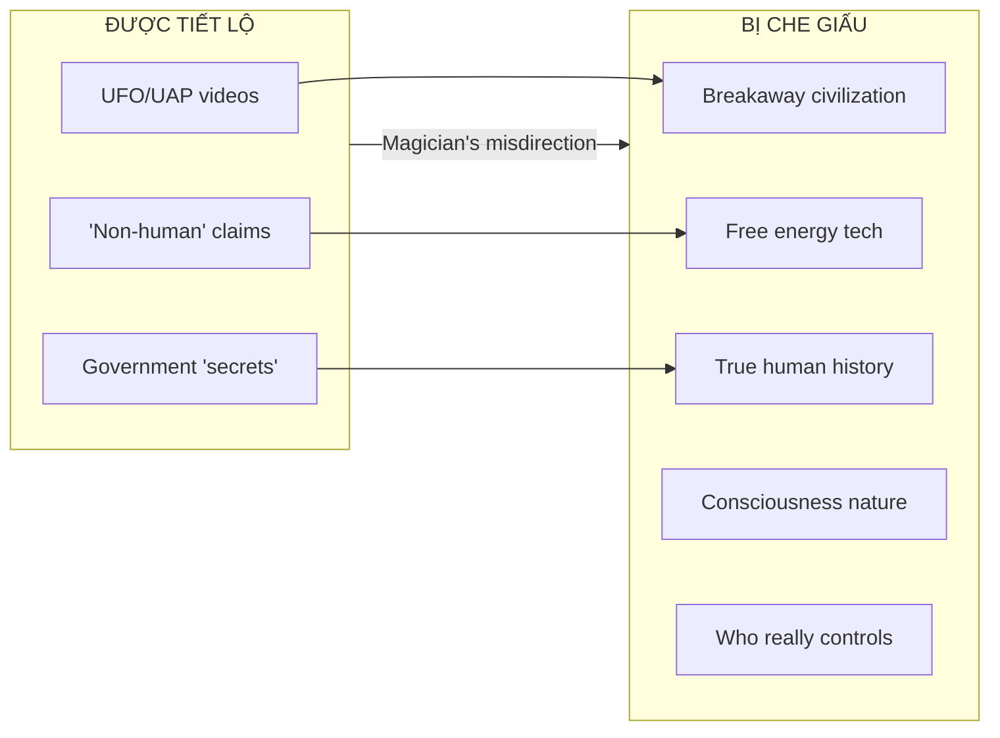

# UAP Disclosure - Controlled Revelation

**UAP Disclosure** (Tiết lộ Hiện tượng Bất thường Trên không) là quá trình chính phủ "giải mật" thông tin về UFO/UAP. Nhưng câu hỏi thực sự không phải *"UFO có thật không?"* mà là *"Tại sao Elite lại cho phép tiết lộ điều này ngay bây giờ?"*

*UAP Disclosure is the government's "declassification" of UFO/UAP information. But the real question isn't "Are UFOs real?" — it's "Why is the Elite allowing this disclosure now?"*

---

## Timeline Disclosure Gần Đây / Recent Disclosure Timeline

| Year | Event | Note |
|------|-------|------|
| 2017 | NY Times tiết lộ AATIP program | Bắt đầu mainstream |
| 2020 | Pentagon xác nhận video UAP | "Không thể giải thích" |
| 2021 | UAP Task Force Report | 143 vụ không giải thích được |
| 2022 | AARO thành lập | Văn phòng nghiên cứu chính thức |
| 2023 | David Grusch whistleblower | "Crash retrievals", "Non-human biologics" |
| 2024 | Congressional hearings | Làm nóng dư luận |
| **2026** | **war.gov/UFO (PURSUE)** | **Trump ra lệnh giải mật toàn diện** |

---

## Controlled Disclosure Playbook

### Limited Hangout là gì? / What is Limited Hangout?

Kỹ thuật tình báo: Tiết lộ **một phần** sự thật để che giấu **phần quan trọng hơn**.

*Intelligence technique: Reveal **partial** truth to hide **more important** parts.*

### Red Flags trong PURSUE (2026)

| Red Flag | Ý nghĩa |
|----------|---------|
| **"0 Files"** trong Release 01 | Tease > Substance |
| **"Rolling basis"** | Kiểm soát narrative từng bước |
| **"Invites private sector"** | Outsource giải thích → controlled narratives |
| **"Department of War"** | Rebranding từ "Defense" → framing mới |
| **"Unresolved cases only"** | Resolved = classified vĩnh viễn? |

---

## Các Giả Thuyết Về Mục Đích Thực Sự / True Purpose Hypotheses

### 1. Project Blue Beam Preparation

**Blue Beam** là thuyết về staged alien event để thống nhất thế giới dưới một chính phủ:

| Phase | Description |
|-------|-------------|
| 1 | Phá vỡ niềm tin tôn giáo qua "khảo cổ mới" |
| 2 | Holographic shows trên bầu trời (công nghệ đã có) |
| 3 | Telepathic communication giả (ELF waves) |
| 4 | Staged alien threat → "United Earth Government" |

*Disclosure = Phase 1: Normalize "aliens" trong tâm trí đại chúng trước event.*

### 2. Military Budget Justification

| Old Threat | New Threat |
|------------|------------|
| Terrorists | UAP/Aliens |
| Russia/China | "Unknown origin" craft |
| Nuclear war | "Existential" alien threat |

*Cần enemy mới để justify $$$. "Aliens" = infinite budget.*

### 3. Distraction từ Terrestrial Issues

Khi nào Elite disclose? Khi cần distract:

- Economic collapse
- Political scandal
- War crimes
- Loss of narrative control

*"Look up, not around"* — Đừng nhìn xung quanh, hãy nhìn lên trời.

### 4. Cover cho Suppressed Technology

**Những gì họ có từ lâu:**

| Inventor | Technology | Fate |
|----------|------------|------|
| [[Nikola Tesla]] | Free energy, anti-gravity | Confiscated after death |
| Viktor Schauberger | Implosion tech, Repulsine | Recruited by Nazis, then US |
| T. Townsend Brown | Electrogravitics | Classified |
| John Hutchison | Hutchison Effect | Discredited |

*"UFO" = Terrestrial craft được attributed cho "aliens" để hide human origin.*

### 5. Ancient History Revision

| Official Narrative | Hidden Truth? |
|--------------------|---------------|
| "Aliens built pyramids" | Lost human civilization (Tartaria, Atlantis) |
| "ET intervention" | Breakaway civilization đã tồn tại |
| "We are alone... until now" | Contact đã có từ lâu, controlled |

*Dễ hơn để nói "aliens" hơn là thừa nhận lịch sử bị viết lại.*

---

## Câu Hỏi Cần Đặt Ra / Questions to Ask

### Về Timing

- Tại sao bây giờ, không phải 10, 20, 50 năm trước?
- Ai được lợi từ việc này?
- Đang cần distract khỏi điều gì?

### Về Nội Dung

- Tại sao chỉ "unresolved" cases?
- "Resolved" cases nói gì mà không được release?
- Evidence chain có thể verify độc lập không?

### Về Framing

- Tại sao media đột nhiên serious về UFO?
- Ai kiểm soát narrative xung quanh disclosure?
- Các whistleblower có thực sự "rogue" hay được phép nói?

---

## Ma Trận Góc Nhìn / Matrix of Perspectives

| Perspective | UFO là gì? | Disclosure vì sao? |
|-------------|------------|---------------------|
| **Mainstream** | Craft không xác định | Transparency, democracy |
| **Skeptic** | Misidentification, hoax | Political theater |
| **ET Believer** | Alien spacecraft | Preparing for contact |
| **Breakaway Civ** | Human secret tech | Cover for black projects |
| **Spiritual** | Interdimensional beings | Consciousness shift |
| **Conspiracy** | Psyop setup | Blue Beam preparation |

*Tất cả có thể đúng một phần. Không có nào đúng hoàn toàn.*

---

## Liên Kết Trong Ma Trận / Matrix Connections

### [[Elite]] Control

Disclosure được phép = Elite cho phép. Không có "leak" thật sự ở cấp độ này.

### [[Annunaki]] Narrative

"Ancient aliens" narrative serve mục đích gì?
- Undermine tôn giáo truyền thống ✓
- Giải thích origin mà không cần God ✓
- Setup cho "họ đã quay lại" ✓

### [[Kiểm Soát Tâm Trí]]

Disclosure = Mass psychology operation:
- Create awe và wonder (lower critical thinking)
- Establish "experts" để interpret cho bạn
- Fear of unknown = easier to control

### [[Bộ Tam Thánh Mind Control - NASA Disney Hollywood]]

Predictive programming qua decades:
- Close Encounters, E.T., Independence Day
- Ancient Aliens (History Channel)
- Arrival, Interstellar, Nope

*Khi "disclosure" xảy ra, bạn đã được train cách phản ứng.*

---

## Synthesis: Họ Disclose Cái Gì Để Hide Cái Gì?

**Bottom line:** UFO có thật không? Probably yes — dưới dạng nào đó. Nhưng **disclosure** không bao giờ về sự thật. Nó về **narrative control**.

*Khi [[Elite]] cho bạn xem một thứ, hãy tự hỏi: Họ đang giấu thứ gì ở hướng ngược lại?*

---

## Tài Liệu Tham Khảo / References

- war.gov/UFO (PURSUE Program) - Official US Government UAP disclosure
- Richard Dolan - "UFOs and the National Security State"
- Jacques Vallée - "Messengers of Deception"
- Wernher von Braun's warning về "alien threat" psyop
- [[Ma Trận - Giải Phẫu Hoàn Chỉnh]]
- [[Elite]]

---

> *"The best way to control the opposition is to lead it ourselves."* — Lenin
>
> *"Cách tốt nhất để kiểm soát phe đối lập là tự mình dẫn dắt nó."*

**Disclosure không phải là sự thật được tiết lộ. Đó là narrative được kiểm soát.**

*Disclosure isn't truth revealed. It's narrative controlled.*

---

## Bonus: Hidden in Plain Sight — Word Magic

Elite giấu truth ngay trong ngôn ngữ. Đây là **Karma Disclosure** — họ phải tiết lộ, nhưng qua wordplay:

*The Elite hides truth within language itself. This is **Karma Disclosure** — they must reveal, but through wordplay:*

| Word | Breakdown | Hidden Meaning |
|------|-----------|----------------|
| **ALIEN** | A-LIEN / A-LIE-N | "Một lời nói dối" / "A lie in" |
| **NASA** | נָשָׁא (Hebrew) | "To deceive" / Lừa dối |
| **PLANET** | PLAN-ET | Extraterrestrial plan? |
| **UNIVERSE** | UNI-VERSE | One verse / One word spoken |
| **SANTA** | SATAN (anagram) | - |
| **LIVE** | EVIL (reversed) | - |

### Tại sao "A Lie"?

Nếu "aliens" là cover story cho:
- Breakaway civilization technology
- Lost/hidden human civilizations
- Terrestrial craft với exotic propulsion

...thì từ "ALIEN" chính nó đã là Easter egg: **"A Lie (sent) In"** — một lời dối trá được gửi vào tâm trí đại chúng.

*If "aliens" is a cover story, the word itself is the Easter egg: "A Lie In" — a deception implanted into the collective psyche.*

> *"They hide it in plain sight because they must. That's the rule of the game."*
>
> *"Họ giấu ngay trước mắt vì họ phải làm vậy. Đó là luật chơi."*

Xem thêm: [[Karma Disclosure - Truth Hidden In Plain Sight]]
