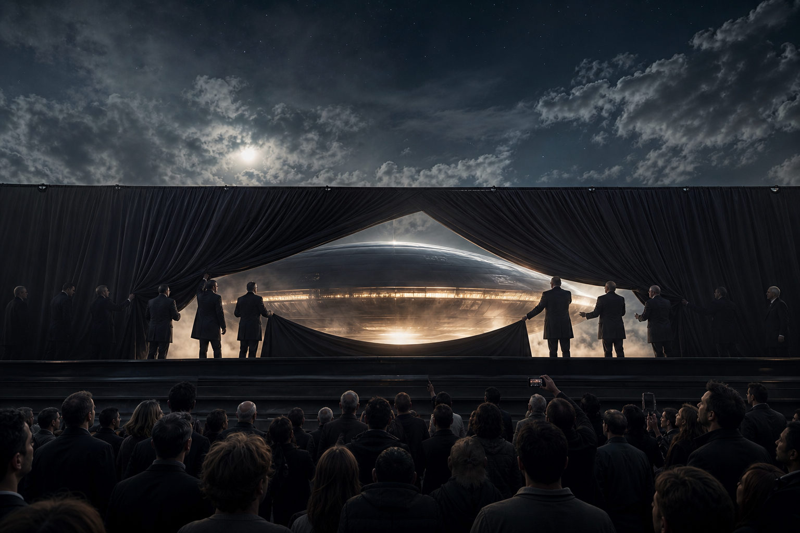
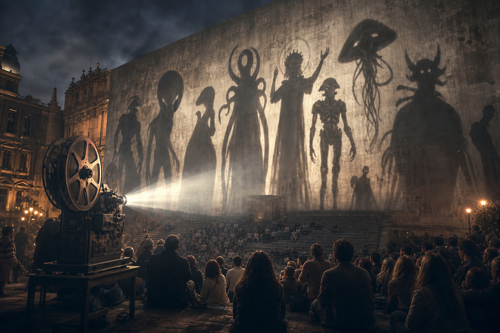

# UAP Disclosure - Controlled Revelation

**UAP Disclosure không chỉ là câu hỏi “UFO có thật không?”. Nó là câu hỏi ai được quyền tiết lộ, tiết lộ theo nhịp nào, bằng chứng nào, giữ lại phần nào, và đóng khung công chúng phải hiểu hiện tượng đó ra sao. Trong vault, disclosure được đọc như case study về [[Elite]], military framing, narrative control, [[Hollywood - Cây Đũa Phép Của Phù Thủy]] và [[Predictive Programming - Cấy Tương Lai Vào Tiềm Thức]].**

*UAP disclosure is not only about whether UFOs are real. It is about controlled revelation: who releases, what is withheld, how evidence is framed, and who gets to interpret the sky for the public.*

Một hiện tượng có thể thật, nhưng disclosure về hiện tượng đó vẫn bị quản trị. Truth và frame không phải một thứ.

---

## Evidence Discipline / Cách Đọc Disclosure

Chủ đề UAP rất dễ kéo người đọc vào hai cực: dismiss mọi thứ là nhầm lẫn, hoặc nhảy thẳng từ “unidentified” sang “alien”. Cả hai đều vội.

Ở tầng official record, ta đọc AARO, DOD/DoW, ODNI, Congressional hearings, declassified files như tài liệu nhà nước: có giá trị, nhưng không tự động là toàn bộ sự thật. Ở tầng pattern, ta nhìn rolling releases, limited hangout, threat framing, private aerospace role và timing. Ở tầng symbol/media, ta đọc alien archetype, NASA/Disney/Hollywood stack và disclosure ritual. Ở tầng speculative synthesis, Blue Beam, breakaway civilization, NHI, interdimensional beings phải được giữ đúng nhãn giả thuyết.

Kỷ luật quan trọng nhất:

> “Không giải thích được” không đồng nghĩa với “đã giải thích bằng alien”.

Unidentified chỉ mở một vùng chưa định danh. Vùng đó có thể chứa lỗi sensor, drone, balloon, aircraft, foreign tech, black project, electronic warfare, spoofing, NHI, hiện tượng khí quyển, hoặc một thứ chưa nằm trong taxonomy hiện tại.

---

## Vault Position / Vị Trí Trong Vault

UAP Disclosure nối nhiều cụm trong redpill.wiki.

Nó nối với [[Elite]] vì câu hỏi chính là curator power: ai giữ raw data, ai chọn clip, ai phân loại, ai xuất hiện trước Quốc hội, ai được gọi là expert. Nó nối với [[Ma Trận]] vì disclosure là bài kiểm tra perception: công chúng nhìn bầu trời bằng mắt mình hay bằng frame của security state? Nó nối với [[Hollywood - Cây Đũa Phép Của Phù Thủy]] vì alien đã được rehearsal cả thế kỷ qua phim ảnh. Nó nối với [[A LIE N - SpaceX IPO Disclosure Day và Nghi Lễ Tên Lửa]] vì word magic, rocket ritual và disclosure cadence có tầng symbol riêng.

Câu hỏi của vault không phải chỉ “tin UFO hay không?”. Câu hỏi sắc hơn:

> Ai đang làm curator của cái không biết?

---

## Controlled Revelation Là Gì?

Controlled revelation là tiết lộ có kiểm soát: mở đủ để tạo niềm tin, giữ đủ để giữ quyền diễn giải.

Một hệ thống có thể release video mờ, lời khai, hearing, report, historical file, nhưng vẫn giữ sensor chain đầy đủ, metadata, context vận hành, chương trình hiện hành hoặc phần nhạy cảm nhất trong classified archive. Public nhận được một mảnh truth, nhưng mảnh đó đi kèm frame.

Trong intelligence language, cơ chế này gần limited hangout: tiết lộ một phần có thật để dẫn attention khỏi phần quan trọng hơn, hoặc để chuẩn bị public cho một narrative đã được chọn.

Controlled revelation không có nghĩa mọi release đều giả. Ngược lại, nó thường cần một phần thật. Một mồi câu không thật thì không kéo được attention.

---

## Cái Được Thấy Và Cái Bị Che

Public thường được thấy selected artifacts: video mờ, radar hit, incident report, lời khai, hearing clip, headline “unidentified”. Nhưng phần có thể bị che mới là phần quyết định: raw sensor chain, classified context, full timeline, chain of custody, defense contractor role, black budget overlap, spoofing capability, hoặc lý do tại sao một case được release đúng lúc đó.

Đây là lý do tranh cãi “alien thật hay giả” đôi khi làm public bỏ lỡ tầng quyền lực. Nếu chỉ nhìn lên trời, bạn có thể không nhìn xuống đất: ngân sách, aerospace contract, surveillance expansion, national security framing, global unity narrative, threat inflation.

Vault không phủ nhận hiện tượng. Vault hỏi: hiện tượng đang được đóng gói vào narrative nào?

---

## Threat Frame: Khi Bầu Trời Đi Qua Security State

Khi disclosure được đặt trong ngôn ngữ national security, công chúng được train để nhìn bầu trời bằng mắt của security state.

Điều này tạo vài hiệu ứng. Curiosity biến thành threat perception. Quân đội và intelligence trở thành interpreter chính. Ngân sách aerospace và surveillance dễ được hợp thức hóa. Các cách đọc spiritual, civilizational, historical hoặc consciousness-based bị đẩy ra rìa vì “không nghiêm túc”.

Nếu thật sự có NHI, câu hỏi còn lớn hơn quân sự. Nó chạm tới history, religion, anthropology, metaphysics, [[Annunaki]], consciousness và vị trí con người trong vũ trụ. Nhưng nếu frame đầu tiên là threat, public sẽ xin protection trước khi hỏi meaning.

Đó là power của framing.

---

## Hollywood Đã Tập Public Từ Lâu

Alien không bước vào imagination hiện đại từ hearing Quốc hội. Nó đã ở đó qua phim, game, truyện, toy, meme, documentary, conspiracy forum, NASA spectacle và pop science.

Hollywood đã dạy nhiều reaction template: alien là invader, savior, trickster, god, experimenter, parasite, ancestor, demon, interdimensional being, future human, AI probe. Khi official disclosure tăng nhịp, public không gặp một blank slate. Public gặp một thư viện archetype đã được cài sẵn.

Đây là nơi UAP nối với [[Predictive Programming - Cấy Tương Lai Vào Tiềm Thức]]. Một khả năng được rehearsal đủ lâu sẽ không còn làm tâm trí nổ tung khi nó được mainstream hóa. Nó chỉ chuyển category: từ fiction sang “maybe real”.

---

## Hypothesis Stack: Giữ Nhiều Model Cùng Lúc

Người đọc tỉnh không cần cưới một giả thuyết quá sớm.

Misidentification giải thích nhiều case bằng lỗi sensor, drone, balloon, aircraft hoặc hiện tượng tự nhiên. Foreign tech hợp logic national security nhưng dễ thành threat inflation. Black projects giải thích secrecy và tech gap nhưng khó chứng minh công khai. Breakaway civilization nối với suppressed tech và hidden history nhưng rất speculative. ET/NHI giải thích “non-human” frame nhưng dễ bị media myth nuốt. Interdimensional/spiritual nối với folklore, entities và consciousness nhưng khó kiểm chứng bằng tiêu chuẩn vật lý. Psyop/Blue Beam giải thích timing và control frame nhưng dễ trượt thành all-explaining theory.

Giữ nhiều model cạnh nhau không phải yếu. Nó là kỷ luật. Disclosure là vùng nhiều nhiễu; người vội chọn narrative sẽ bị narrative chọn lại.

---

## A LIE N Và Word Magic

Bài [[A LIE N - SpaceX IPO Disclosure Day và Nghi Lễ Tên Lửa]] là case study của vault về tầng symbol: PURSUE releases, SpaceX IPO symbolism, rocket ritual, Jack Parsons/JPL, Crowley/LAM và Hollywood disclosure được đặt lên cùng lịch biểu tượng.

Ở tầng fact, ta chỉ ghi nhận release, ngày, tổ chức, tài liệu, public record. Ở tầng symbol, ta đọc “alien” như **A-LIE-N**: một lie được cài vào imagination để giấu origin thật của craft, history hoặc power. Đây là word magic, không phải bằng chứng tự thân.

Điểm này phải giữ rõ. Symbol có thể mở mắt, nhưng symbol không được giả làm proof. Nếu không, bài đọc rơi vào chính cái bẫy nó muốn vượt qua.

---

## Decoder Questions / Câu Hỏi Cần Giữ

Khi gặp một disclosure mới, đừng chỉ hỏi “đây là gì?”. Hỏi:

- Đây là raw data hay selected artifact?
- Chain of custody ra sao?
- Ai được quyền giải thích?
- Tại sao release lúc này?
- Cái gì bị giữ lại?
- Narrative đẩy public về awe, fear, unity, war budget hay spiritual opening?
- Điều gì biến mất khỏi attention khi mọi người nhìn lên trời?

Câu cuối rất quan trọng. Spectacle trên trời có thể làm người ta quên infrastructure dưới đất.

---

## Kết

Disclosure không tự động đồng nghĩa với truth. Nó có thể là truth được đóng gói, truth được cắt lát, truth được dùng làm mồi, hoặc truth được đặt trong frame có lợi cho người tiết lộ.

UAP có thể là một trong những câu hỏi lớn nhất của thời đại. Nhưng chính vì lớn, nó càng cần kỷ luật. Không dismiss. Không worship. Không vội cưới alien narrative. Không để security state độc quyền bầu trời. Không để Hollywood viết hết thư viện phản ứng bên trong mình.

> Câu hỏi không chỉ là “trên kia có gì?”. Câu hỏi là: “ai đang dạy mình nhìn lên đó như thế nào?”

---

## Reading Path / Đọc Tiếp

- [[Elite]] — curator power và controlled revelation
- [[Hollywood - Cây Đũa Phép Của Phù Thủy]] — alien archetype qua màn hình
- [[Predictive Programming - Cấy Tương Lai Vào Tiềm Thức]] — rehearsal tương lai trước khi triển khai
- [[A LIE N - SpaceX IPO Disclosure Day và Nghi Lễ Tên Lửa]] — case study symbol/word magic
- [[Bộ Tam Thánh Mind Control - NASA Disney Hollywood]] — space myth, childhood myth và adult myth
