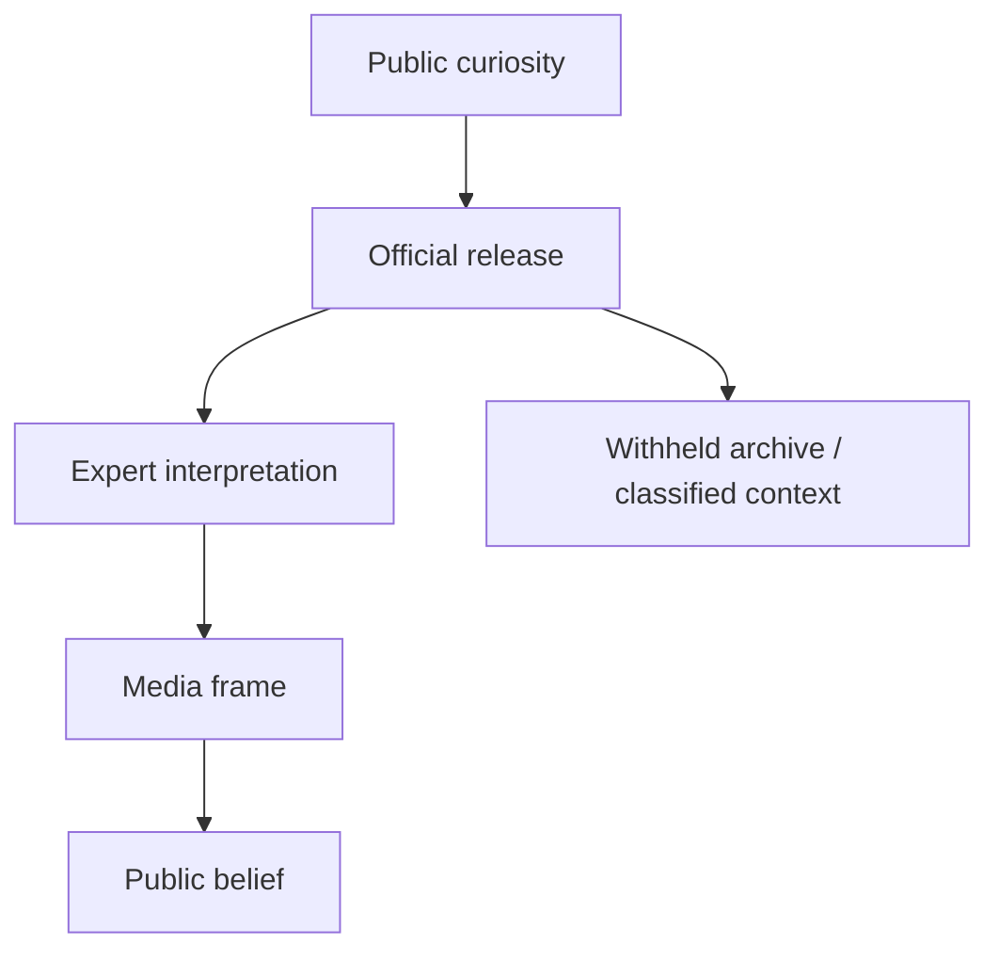

# UAP Disclosure - Controlled Revelation

**UAP Disclosure không chỉ là câu hỏi "UFO có thật không?" mà là câu hỏi ai được quyền tiết lộ, tiết lộ theo nhịp nào, bằng bằng chứng nào, và đóng khung công chúng phải hiểu hiện tượng đó ra sao.** Trong vault, disclosure được đọc như một case study về [[Elite]], narrative control, military framing và [[Predictive Programming - Cấy Tương Lai Vào Tiềm Thức]].

*UAP disclosure is not only about unidentified phenomena. It is about controlled revelation: who releases, what is withheld, how the frame is built, and who interprets reality for the public.*

---

## Evidence Discipline / Cách Đọc Disclosure

| Tầng | Ví dụ | Kỷ luật |
|---|---|---|
| Official record | AARO, DOD/DoW releases, Congressional hearings, declassified files | đọc như tài liệu nhà nước, không tự động là toàn bộ sự thật |
| Pattern reading | rolling releases, limited hangout, threat framing, private-sector role | quan sát incentive và timing |
| Symbol/media reading | alien archetype, Hollywood sync, NASA/Disney/Hollywood stack | đọc như myth và programming |
| Speculative synthesis | Blue Beam, breakaway civilization, NHI, interdimensional beings | ghi rõ là giả thuyết vault |

---

## Timeline Gần Đây / Recent Timeline

| Năm | Sự kiện |
|---|---|
| 2017 | Mainstream wave sau các bài báo và video UAP được chú ý rộng rãi |
| 2020 | Pentagon xác nhận một số video hải quân đã được công bố trước đó |
| 2021 | Báo cáo UAP Preliminary Assessment của ODNI |
| 2022 | AARO được lập như văn phòng xử lý anomaly toàn miền |
| 2023 | David Grusch và các hearing làm disclosure vào mainstream chính trị |
| 2024 | DOD/AARO tiếp tục annual reporting và historical review |
| 2026 | WAR.GOV/UFO/PURSUE công bố tranche tài liệu ngày 2026-05-08 và tranche thứ hai ngày 2026-05-22 |

Điểm kỷ luật: có release chính thức không có nghĩa là mọi narrative kèm theo đều đúng. "Unidentified" nghĩa là chưa định danh trong hồ sơ đó, không tự động nghĩa là extraterrestrial.

---

## Controlled Revelation Là Gì?

Controlled revelation là mô hình tiết lộ có kiểm soát: mở đủ để tạo niềm tin, giữ đủ để giữ quyền lực diễn giải.

Trong intelligence language, đây gần với limited hangout: tiết lộ một phần có thật để dẫn attention khỏi phần còn quan trọng hơn.

---

## Cái Được Thấy Và Cái Bị Che

| Được thấy | Có thể bị che |
|---|---|
| video mờ, radar hit, incident report | sensor chain đầy đủ, context vận hành |
| "không giải thích được" | đã giải thích nhưng classified |
| historical files | chương trình hiện hành |
| non-human speculation | black projects, spoofing, electronic warfare |
| awe trước bầu trời | câu hỏi quyền lực dưới mặt đất |

Vault không phủ nhận hiện tượng. Vault hỏi: **ai đang làm curator của hiện tượng?**

---

## Threat Frame / Khung Mối Đe Dọa

Khi disclosure được đặt trong ngôn ngữ national security, công chúng được train để nhìn bầu trời bằng mắt của security state. Điều đó có tác dụng:

1. biến curiosity thành threat perception;
2. đưa quân đội và intelligence thành interpreter chính;
3. mở đường cho ngân sách, surveillance và aerospace secrecy;
4. giảm chỗ cho spiritual, historical hoặc civilizational reading.

Đây là nơi UAP nối với [[Bộ Tam Thánh Mind Control - NASA Disney Hollywood]]: Hollywood đã dạy nhiều thế hệ phản ứng với "alien" bằng awe, fear, salvation hoặc invasion.

---

## Các Giả Thuyết Lớn / Hypothesis Stack

| Giả thuyết | Điểm mạnh | Điểm yếu |
|---|---|---|
| Misidentification | giải thích nhiều case bằng lỗi sensor, balloon, aircraft, drone | không giải thích hết các case tốt |
| Foreign tech | hợp logic national security | dễ thành threat inflation |
| Black projects | giải thích secrecy và tech gap | khó chứng minh công khai |
| Breakaway civilization | nối với suppressed tech và hidden history | highly speculative |
| ET / NHI | giải thích "non-human" frame | dễ bị media myth nuốt |
| Interdimensional / spiritual | nối với folklore, entities, consciousness | khó kiểm chứng bằng tiêu chuẩn vật lý |
| Psyop / Blue Beam | giải thích timing và control frame | dễ trượt thành all-explaining theory |

Người đọc tỉnh không cần cưới một giả thuyết. Giữ nhiều model cạnh nhau cho đến khi evidence buộc phải loại.

---

## A LIE N Và Word Magic

Bài [[A LIE N - SpaceX IPO Disclosure Day và Nghi Lễ Tên Lửa]] là case study 2026 của vault: PURSUE releases, SpaceX IPO symbolism, rocket ritual, Jack Parsons/JPL, Crowley/LAM và Hollywood disclosure được đặt lên cùng một lịch biểu tượng.

Ở tầng fact, ta chỉ ghi nhận release, ngày, tổ chức, tài liệu. Ở tầng symbol, ta đọc "alien" như **A-LIE-N**: một lie được cài vào imagination để giấu origin thật của craft, history hoặc power. Đây là word magic, không phải bằng chứng tự thân.

---

## Decoder Questions / Câu Hỏi Cần Giữ

- Tài liệu này cho thấy raw data hay chỉ selected artifact?
- Ai là người được quyền giải thích?
- Tại sao release theo rolling basis?
- Tại sao một số thứ được declassify, một số không?
- Narrative đẩy công chúng về awe, fear, unity, war budget hay spiritual opening?
- Điều gì biến mất khỏi attention khi mọi người nhìn lên trời?

---

## Sources / Nguồn Chính Thức Đã Kiểm Tra

- U.S. Department of War, "Department of War Releases Unidentified Anomalous Phenomena Files in Historic Transparency Effort", 2026-05-08.
- U.S. Department of War, "Department of War Publishes Second Release of Unidentified Anomalous Phenomena Files on WAR.GOV/UFO", 2026-05-22.
- WAR.GOV/UFO, "Presidential Unsealing and Reporting System for UAP Encounters (PURSUE)".
- DOD/AARO annual reporting and official UAP records pages.

---

## Core Insight / Chốt Lại

**Disclosure không tự động đồng nghĩa với truth. Nó có thể là truth được đóng gói, truth được cắt lát, truth được dùng làm mồi, hoặc truth được đặt trong frame có lợi cho người tiết lộ.**

*Disclosure is not automatically truth. It may be packaged truth, partial truth, bait truth, or truth framed by the institution that releases it.*
