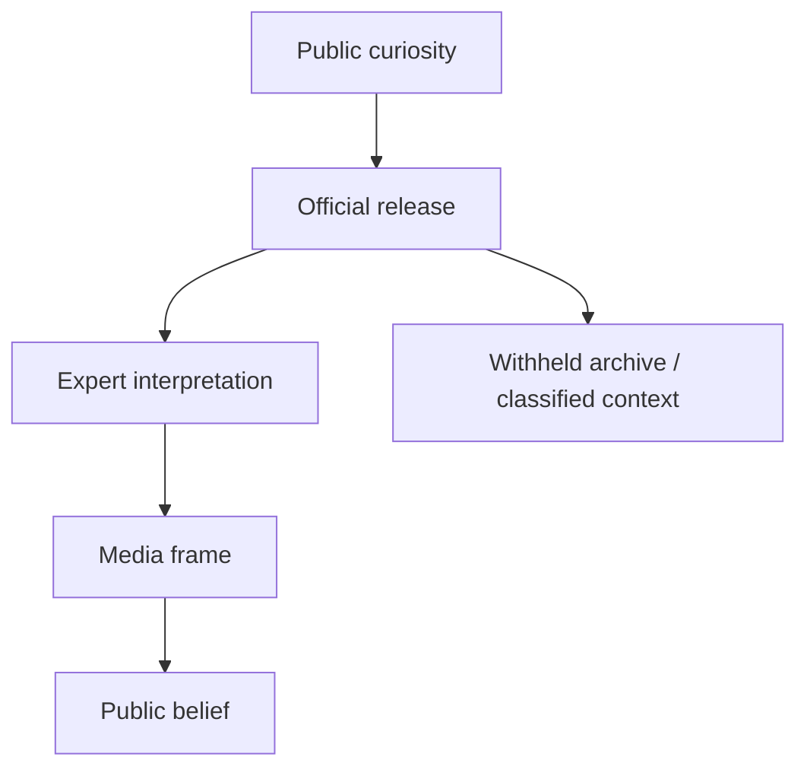

# UAP Disclosure - Controlled Revelation

**UAP Disclosure không chỉ là câu hỏi "UFO có thật không?" mà là câu hỏi ai được quyền tiết lộ, tiết lộ theo nhịp nào, bằng bằng chứng nào, và đóng khung công chúng phải hiểu hiện tượng đó ra sao.** Trong vault, disclosure được đọc như một case study về [[Elite]], narrative control, military framing và [[Predictive Programming - Cấy Tương Lai Vào Tiềm Thức]].

*UAP disclosure is not only about unidentified phenomena. It is about controlled revelation: who releases, what is withheld, how the frame is built, and who interprets reality for the public.*

---

## Evidence Discipline / Cách Đọc Disclosure

| Tầng | Ví dụ | Kỷ luật |
|---|---|---|
| Official record | AARO, DOD/DoW releases, Congressional hearings, declassified files | đọc như tài liệu nhà nước, không tự động là toàn bộ sự thật |
| Pattern reading | rolling releases, limited hangout, threat framing, private-sector role | quan sát incentive và timing |
| Symbol/media reading | alien archetype, Hollywood sync, NASA/Disney/Hollywood stack | đọc như myth và programming |
| Speculative synthesis | Blue Beam, breakaway civilization, NHI, interdimensional beings | ghi rõ là giả thuyết vault |

Kỷ luật quan trọng nhất: "không giải thích được" không đồng nghĩa với "đã giải thích bằng alien". Nó chỉ mở một vùng chưa định danh. Vùng đó có thể chứa lỗi sensor, công nghệ nước ngoài, black project, hiện tượng khí quyển, spoofing, NHI, hoặc một thứ chưa nằm trong taxonomy hiện tại.

Nếu một release chính thức được nêu mà chưa có link/tài liệu gốc trong bài, nó phải được đọc như **source placeholder cần đối chiếu**, không phải citation hoàn chỉnh. Disclosure là chủ đề current-event; chi tiết ngày, tên chương trình và cơ quan phát hành có thể đổi hoặc bị reframe về sau.

---

## Timeline Gần Đây / Recent Timeline

Timeline dưới đây giữ lại xương sống documentable để người đọc không bị cuốn ngay vào myth. Nó không chứng minh toàn bộ giả thuyết disclosure; nó chỉ cho thấy nhịp mainstream hóa của chủ đề.

| Năm | Sự kiện |
|---|---|
| 2017 | Mainstream wave sau các bài báo và video UAP được chú ý rộng rãi |
| 2020 | Pentagon xác nhận một số video hải quân đã được công bố trước đó |
| 2021 | Báo cáo UAP Preliminary Assessment của ODNI |
| 2022 | AARO được lập như văn phòng xử lý anomaly toàn miền |
| 2023 | David Grusch và các hearing làm disclosure vào mainstream chính trị |
| 2024 | DOD/AARO tiếp tục annual reporting và historical review |
| 2026 | WAR.GOV/UFO/PURSUE công bố tranche tài liệu ngày 2026-05-08 và tranche thứ hai ngày 2026-05-22 |

Điểm kỷ luật: có release chính thức không có nghĩa là mọi narrative kèm theo đều đúng. "Unidentified" nghĩa là chưa định danh trong hồ sơ đó, không tự động nghĩa là extraterrestrial.

Nhịp release cũng là một phần của thông điệp. Công chúng không chỉ nhận dữ liệu; công chúng nhận dữ liệu qua cadence, người phát ngôn, logo tổ chức, tiêu đề báo chí và lời bình của "expert". Vì vậy disclosure luôn là hiện tượng kép: vừa là hồ sơ, vừa là sân khấu.

---

## Controlled Revelation Là Gì?

Controlled revelation là mô hình tiết lộ có kiểm soát: mở đủ để tạo niềm tin, giữ đủ để giữ quyền lực diễn giải.

Trong intelligence language, đây gần với limited hangout: tiết lộ một phần có thật để dẫn attention khỏi phần còn quan trọng hơn.

---

## Cái Được Thấy Và Cái Bị Che

| Được thấy | Có thể bị che |
|---|---|
| video mờ, radar hit, incident report | sensor chain đầy đủ, context vận hành |
| "không giải thích được" | đã giải thích nhưng classified |
| historical files | chương trình hiện hành |
| non-human speculation | black projects, spoofing, electronic warfare |
| awe trước bầu trời | câu hỏi quyền lực dưới mặt đất |

Vault không phủ nhận hiện tượng. Vault hỏi: **ai đang làm curator của hiện tượng?**

Câu hỏi curator quan trọng hơn câu hỏi "tin hay không tin". Nếu chỉ tranh cãi alien thật hay giả, người đọc bỏ lỡ tầng quyền lực: ai giữ raw data, ai chọn clip, ai đặt tên, ai phân loại threat, ai được phỏng vấn, và ai bị gạt khỏi khung chính thống.

---

## Threat Frame / Khung Mối Đe Dọa

Khi disclosure được đặt trong ngôn ngữ national security, công chúng được train để nhìn bầu trời bằng mắt của security state. Điều đó có tác dụng:

1. biến curiosity thành threat perception;
2. đưa quân đội và intelligence thành interpreter chính;
3. mở đường cho ngân sách, surveillance và aerospace secrecy;
4. giảm chỗ cho spiritual, historical hoặc civilizational reading.

Đây là nơi UAP nối với [[Bộ Tam Thánh Mind Control - NASA Disney Hollywood]]: Hollywood đã dạy nhiều thế hệ phản ứng với "alien" bằng awe, fear, salvation hoặc invasion.

---

## Các Giả Thuyết Lớn / Hypothesis Stack

Giả thuyết stack không phải menu để chọn phe. Nó là cách giữ trí óc không bị một narrative chiếm dụng quá sớm.

| Giả thuyết | Điểm mạnh | Điểm yếu |
|---|---|---|
| Misidentification | giải thích nhiều case bằng lỗi sensor, balloon, aircraft, drone | không giải thích hết các case tốt |
| Foreign tech | hợp logic national security | dễ thành threat inflation |
| Black projects | giải thích secrecy và tech gap | khó chứng minh công khai |
| Breakaway civilization | nối với suppressed tech và hidden history | highly speculative |
| ET / NHI | giải thích "non-human" frame | dễ bị media myth nuốt |
| Interdimensional / spiritual | nối với folklore, entities, consciousness | khó kiểm chứng bằng tiêu chuẩn vật lý |
| Psyop / Blue Beam | giải thích timing và control frame | dễ trượt thành all-explaining theory |

Người đọc tỉnh không cần cưới một giả thuyết. Giữ nhiều model cạnh nhau cho đến khi evidence buộc phải loại.

---

## A LIE N Và Word Magic

Bài [[A LIE N - SpaceX IPO Disclosure Day và Nghi Lễ Tên Lửa]] là case study 2026 của vault: PURSUE releases, SpaceX IPO symbolism, rocket ritual, Jack Parsons/JPL, Crowley/LAM và Hollywood disclosure được đặt lên cùng một lịch biểu tượng.

Ở tầng fact, ta chỉ ghi nhận release, ngày, tổ chức, tài liệu. Ở tầng symbol, ta đọc "alien" như **A-LIE-N**: một lie được cài vào imagination để giấu origin thật của craft, history hoặc power. Đây là word magic, không phải bằng chứng tự thân.

---

## Decoder Questions / Câu Hỏi Cần Giữ

- Tài liệu này cho thấy raw data hay chỉ selected artifact?
- Ai là người được quyền giải thích?
- Tại sao release theo rolling basis?
- Tại sao một số thứ được declassify, một số không?
- Narrative đẩy công chúng về awe, fear, unity, war budget hay spiritual opening?
- Điều gì biến mất khỏi attention khi mọi người nhìn lên trời?

---

## Source Register / Sổ Nguồn

Các dòng dưới đây là register nguồn cần đối chiếu theo tầng claim. Chỉ nguồn có tài liệu gốc, archive, hoặc trang chính thức mới được dùng cho fact-level claim; các nguồn còn lại chỉ hỗ trợ pattern/symbol reading.

| Nhóm nguồn | Dùng để kiểm gì | Giới hạn |
|---|---|---|
| AARO / DOD / ODNI / Congressional record | hearing, báo cáo, video/tài liệu được công bố, định nghĩa UAP | nhà nước chọn phần được release; không phải raw archive đầy đủ |
| Trang release chính thức nếu tồn tại trong hồ sơ | ngày release, tên chương trình, tranche tài liệu, metadata | cần archive/link cụ thể trước khi coi là citation hoàn chỉnh |
| Báo chí public-record | timeline mainstream hóa, ai nói gì, phản ứng chính trị | không tự chứng minh bản chất hiện tượng |
| Nhân chứng / whistleblower | hướng điều tra, claim nội bộ, điểm cần subpoena | lời kể không thay thế bằng chứng vật lý hoặc tài liệu gốc |
| Vault synthesis | Blue Beam, breakaway civilization, interdimensional/NHI, Hollywood sync | giả thuyết/pattern/symbol; không được đọc như fact |

Các mục "DoW/WAR.GOV/PURSUE" trong bài chỉ được giữ ở tầng timeline/source placeholder cho đến khi người viết gắn được nguồn gốc cụ thể. Nếu không có nguồn gốc cụ thể, chúng không được dùng làm trụ chứng minh cho kết luận về NHI, Blue Beam hay psyop.

---

## Core Insight / Chốt Lại

**Disclosure không tự động đồng nghĩa với truth. Nó có thể là truth được đóng gói, truth được cắt lát, truth được dùng làm mồi, hoặc truth được đặt trong frame có lợi cho người tiết lộ.**

*Disclosure is not automatically truth. It may be packaged truth, partial truth, bait truth, or truth framed by the institution that releases it.*
